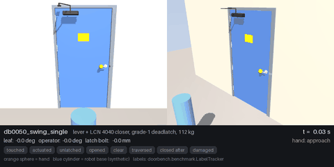
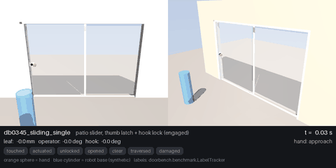
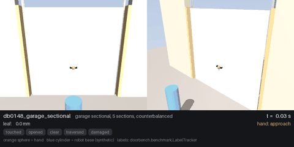
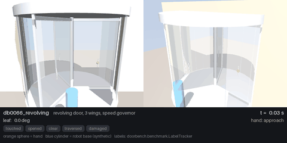
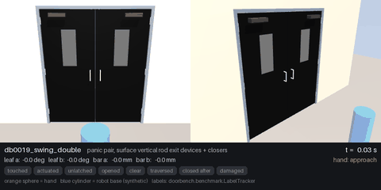
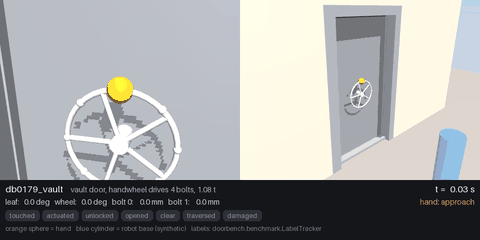
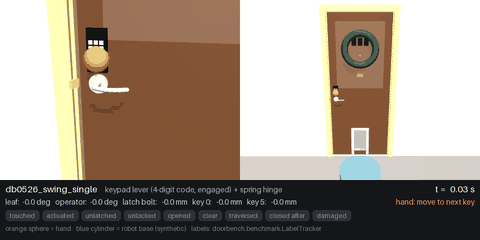

# DoorBench

**1000 physics-grounded, fully articulated doors for training and benchmarking humanoid robots in simulation.**

[Catalogue & 3D viewer](https://adamraudonis.github.io/DoorBench/) · [Dataset format](docs/DATASET_FORMAT.md) · [Physics model](docs/PHYSICS.md) · [Benchmark](docs/BENCHMARK.md) · [Simulator integration](docs/INTEGRATION.md)

Every door is a working mechanism, not a decorated slab: spring latches that hold and re-latch when slammed,
deadbolts driven by thumbturns, panic bars, keypads with physical keys, dogs and vault bolt-work, closers sized to
EN 1154, hinge friction from a bearing-load model, and masses calibrated to manufacturer door-weight tables.
Each door ships as **MJCF** (MuJoCo), **URDF** and **USD** (Isaac Sim / Isaac Lab) in three fidelity tiers, with an
auditable `spec.json` that lists every physical parameter, its formula and its source.

## What is in the box

| | |
|---|---|
| Doors | 1000, procedurally generated with a balanced design of experiments (seeded, reproducible); **1000 / 1000 pass the automated sign-off** (load in all tiers, settle, hold while latched, open when actuated, re-latch, closer return, URDF + USD load) |
| Kinematic families | 30: swing (single / pair / dutch / saloon / pivot), sliding (pocket, barn, patio, shoji, bypass), bifold, accordion, revolving, tripod & full-height turnstiles, garage (sectional, tilt-up, roll-up), pet doors, floor & ceiling hatches, marine watertight, vault, blast, gates (swing, sliding, baby), toilet stalls, strip curtains, cold storage, automatic sliding & swing, elevator |
| Operators | 59: levers, knobs, paddles, pulls, push plates, panic touch bars & crossbars, thumb latches, wheels, dogs, slide bolts, hooks, lift pins, keypads, card readers, handlesets, cremone bolts, T-handles … |
| Locks | 27 incl. privacy, keyed, single/double deadbolts, chain, swing-bar guard, padlock, 4/6-digit keypads, mechanical pushbutton, card reader, maglock, electric strike, delayed egress, interlock, jammed |
| Slab constructions | 72: hollow core, particleboard & SCL cores, solid hardwoods, fire-rated mineral cores, 14–24 ga hollow metal, storefront aluminium, frameless tempered glass, fiberglass, uPVC, shoji/fusuma, cold-storage panels, chain-link, wrought iron, PVC strips, vault composite … |
| Closers | 17 (EN 1154 sized surface/concealed/floor-spring, spring hinges, pneumatic, gate, gas strut, hold-open, automatic operators) |
| Conditions | new · normal · worn · old/dry · rusty · swollen · sagging · damaged · well oiled |
| Formats | MJCF full/simple/minimal · URDF full/simple/minimal · USD |
| Benchmark | 9 tasks, 20+ per-episode labels (touched, actuated, unlatched, unlocked, opened, passed through, closed, slammed, damaged, fell …), MuJoCo environment with lock/access-control logic |

## Quick start

```bash
git clone https://github.com/adamraudonis/DoorBench.git && cd DoorBench
uv venv --python 3.12 .venv && source .venv/bin/activate
uv pip install -e ".[all]"

# regenerate the whole dataset (≈ 30 s with 8 workers, deterministic) or just use assets/ from the repo
python scripts/generate_dataset.py --out assets --workers 8

# look at one door in MuJoCo
python -m mujoco.viewer --mjcf assets/doors/db0002_swing_single/scene.xml

# run the benchmark environment with a programmatic "hand"
python - <<'EOF'
from doorbench.benchmark import DoorEnv
env = DoorEnv("assets/doors/db0002_swing_single", tier="full")
env.reset()
for _ in range(800):
    env.apply_joint_torque(env.meta["operator_joint"], 3.0)   # turn the knob
    env.apply_joint_torque(env.meta["primary_joint"], 30.0)   # push the door
    env.step()
print(env.labels().to_dict())
EOF

# browse the catalogue + 3D viewer locally
cd viewer && bun install && bun run dev      # http://localhost:5173
```

## Physics demo (MuJoCo)

`scripts/demo_mujoco.py` opens doors with a programmatic hand that does exactly what a policy does through
`DoorEnv`: generalized forces on the operator joint (`env.apply_joint_torque` — press the lever or touch bars, lift
the thumb latch, spin the handwheel, press the keypad keys in code order), then a push on the leaf, a hold while a
synthetic robot base walks through (`env.step(robot_base_pos=...)`), then let go so the closer returns and the latch
re-engages.  Frames come from the `robot_view` / `iso` / `detail_handle` cameras defined in every `door.xml`; the HUD
shows sim time, joint states and the `LabelTracker` labels flipping (touched → actuated → unlatched → unlocked →
opened → clear → traversed → closed after).  Orange sphere = hand, blue cylinder = robot base.

| | |
|---|---|
|  `db0050` lever, grade-1 deadlatch, LCN 4040 closer: press, push, hold, closer returns, re-latches |  `db0345` patio slider: thumb latch lifts the hook lock (engaged), then slide |
|  `db0148` counterbalanced sectional garage door lifted overhead |  `db0066` 3-wing revolving door with speed governor; the robot is carried round a compartment |
|  `db0019` panic pair: both surface-vertical-rod touch bars, both leaves, both closers |  `db0179` vault: one turn of the handwheel retracts 4 bolts (`unlocked`), then the 1.08 t leaf |
|  `db0526` keypad lever: the 4 code keys are pressed (real joints) → `unlocked`, lever, push; spring hinge closes it | |

MP4 versions (30 fps) are next to the GIFs in `docs/media/`.  Reproduce or run on any door (the hand is picked by
family: swing / pair / sliding / vertical lift / revolving / vault / keypad):

```bash
uv pip install imageio imageio-ffmpeg
python scripts/demo_mujoco.py                                   # the 7 doors above -> docs/media/  (~30 s)
python scripts/demo_mujoco.py --ids db0233_swing_single --out /tmp/demo --seconds 12
```

The same mechanics are asserted by `pytest -q tests/` (`tests/test_mujoco_import.py`): for one door of every family
plus 20 seeded random doors, all MJCF tiers + `scene.xml` + `door.urdf` load in MuJoCo, 500 free steps run without
warnings, the sign-off QA (`doorbench.qa.run_qa`) holds while latched / opens when actuated / stays shut when locked /
re-latches / closer returns, `DoorEnv` runs a 200-step hand episode and returns labels, and the kinematic clearance
gate passes on 10 doors — 267 tests in about 5 s.

## How doors are built

1. **Taxonomy & sampler** (`doorbench/taxonomy.py`, `spec.py`): 30 families with sub-contexts (residential interior,
   fire egress, hospital, storefront …). For each family a balanced sampler cycles through every level of every
   discrete dimension (slab, panel style, operator, latch, lock, closer, hinge, stop, seal, condition, handing, push/pull)
   and jitters continuous ones (sizes, spring adjustment, colours).
2. **Physics** (`physics.py`): mass breakdown, hinge/roller friction, closer spring & damping (EN 1154), latch/lock
   parameters, ADA/IBC compliance flags and damage thresholds, each with formula + source.
3. **Geometry** (`geometry/`): procedural primitives + a shared library of procedural hardware meshes; every
   mechanism is a real body with a joint (bolts, thumbturns, pads, keys, dogs, closer arms with loop closure).
4. **Export** (`export/`): MJCF, URDF, USD from one simulator-agnostic IR (`ir.py`).
5. **Sign-off** (`qa.py`): each door is loaded in MuJoCo (all tiers), settled, pushed while latched (must hold),
   its operator actuated (must open; chained doors open only to the slack limit; locked doors must not open),
   released (latch must re-extend), slammed (must re-latch), its closer tested (must return), and its URDF/USD
   checked. `qa.json` records every metric; the catalogue shows the result. Current build: 1000 / 1000 signed off.

## Data layout

```
assets/doors/<id>/  spec.json  model.json  door.xml door_simple.xml door_minimal.xml scene.xml  door.urdf  door.usda  qa.json  thumb_*.jpg
assets/hardware/    shared hardware meshes (obj + usdc)
assets/manifest.json
```
See [docs/DATASET_FORMAT.md](docs/DATASET_FORMAT.md).

## Prior work

DoorGym (2019) randomised three handle types on one door; PartNet-Mobility / SAPIEN provide doors as cabinet parts
without tuned physics; Infinigen-Sim (2025) generates procedural door geometry but no friction or material physics;
ArtVIP (ICLR 2026) has 10 mocap-tuned doors; NVIDIA's DoorMan trained humanoids on procedural Isaac Lab doors that
were not released. DoorBench aims to be the first large, mechanism-complete, physics-audited, multi-format door corpus.

## License

Code and generated assets: MIT. Physics catalogues cite public standards and manufacturer data; textures referenced
for photoreal renders are Poly Haven CC0.

## Citation

See [CITATION.cff](CITATION.cff).
