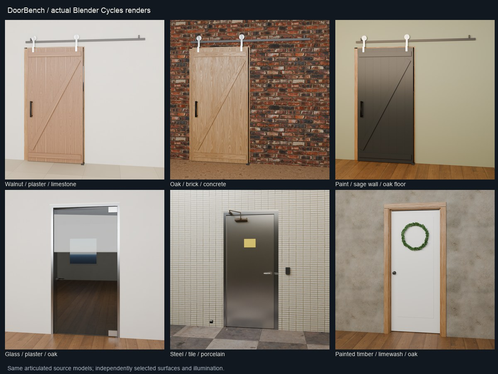
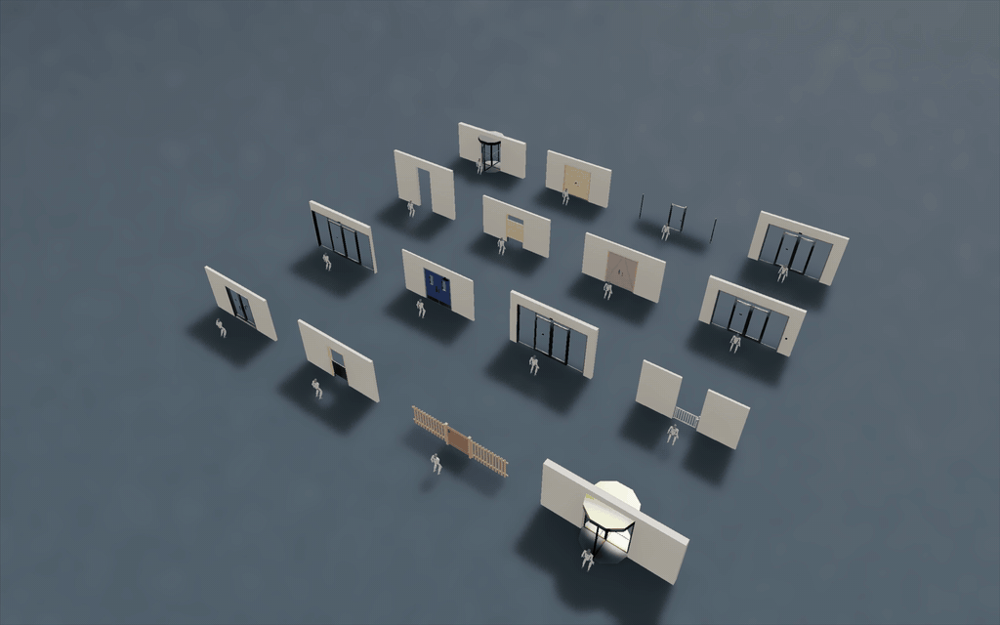
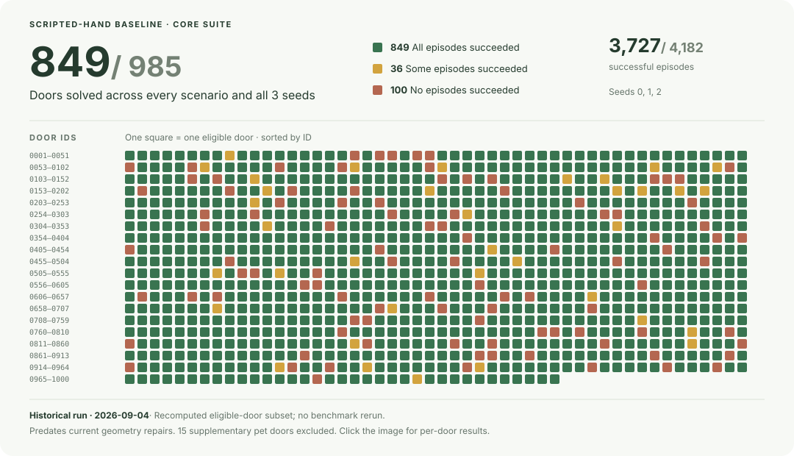

# DoorBench

**1,000 articulated door models for robotics simulation.**

[Browse](https://adamraudonis.github.io/DoorBench/) · [Review doors](https://adamraudonis.github.io/DoorBench/#/review) · [Download the dataset](https://huggingface.co/datasets/adamraudonis/DoorBench) · [Release guide](docs/DATASET_RELEASE.md)

DoorBench combines 30 door families with operators, locks, closers and configurable materials. It includes detailed model specifications, simulation exports, benchmark scenarios, Blender appearances, and reference motion for studying door interactions.

The robotics collection contains **985 doors**. The **15 [pet doors](https://adamraudonis.github.io/DoorBench/#/pets)** are a separate, downloadable supplement, excluded from evaluations and benchmark scores.

- **Simulation:** full, simple and minimal MJCF/URDF; full and canonical USD; shared OBJ/USDC hardware meshes.
- **Appearance:** 1,014 saved Blender renders, interchangeable finishes and lighting, CC0 textures, and available packed scenes.
- **Door trajectories:** native scripted-hand recordings with explicit outcomes and tracking errors. Experimental figure overlays are retained for diagnosis; [natural human references](docs/HUMAN_REFERENCE.md) are in development.
- **Reproducibility:** versioned public downloads, per-file checksums, source provenance and deterministic generation.



## Isaac Sim · Unitree G1

[](https://github.com/adamraudonis/DoorBench/releases/download/g1-isaac-2026-09-06/isaac-g1-4x4.mp4)

Actual L40S recording on September 6, 2026: **16 / 16 selected demonstration cases crossed their openings**. These are selected successes, not a random sample or the catalogue score. [Full-resolution still](docs/media/isaac-g1-4x4.png) · [Recording and evaluation details](docs/ISAAC_G1_CATALOGUE.md).

**Actual GPU run:** September 6, 2026, **20:17:17–22:37:41 UTC**, L40S, Isaac Sim 5.1.

| Coverage | Attempted | Audited traversals | Native errors |
|---|---:|---:|---:|
| Complete non-pet collection | 985 / 985 | **44 / 985 (4.5%)** | 10 |
| Upright doorway subset | 967 / 967 | **44 / 967 (4.6%)** | 10 |

The unchanged Unitree checkpoint controls leg locomotion, with no handle or lock manipulation. This closed-start diagnostic is separate from the core benchmark. All 18 horizontal hatches were attempted but are not upright doorway tasks; errors remain in the denominator. [Per-door results and limitations](docs/review/isaac-g1-catalogue/README.md) · [Reproduce the run](docs/ISAAC_G1_CATALOGUE.md) · [Test your policy](docs/ISAAC_G1_DEMO.md).

## Scripted baseline

The scripted-hand baseline was evaluated across **all 985 benchmark doors**, using three seeds for every assigned core scenario. It solved **849 / 985 doors (86.2%)**, with **3,727 / 4,182 successful episodes (89.1%)**. A solved door passed every scenario on every seed.

<!-- Regenerate the overview with scripts/build_scripted_baseline_overview.py; update the adjacent historical score text if its source run changes. -->
[](https://adamraudonis.github.io/DoorBench/#/results)

[Why scripted attempts fail and when a test may be quarantined](docs/SCRIPTED_FAILURE_REVIEW.md).

**[Explore every door’s result](https://adamraudonis.github.io/DoorBench/#/results)** · [Per-family and per-scenario tables](results/README.md) · [Open a recorded scripted attempt](https://adamraudonis.github.io/DoorBench/#/door/db0079_sliding_single?reference=1)

These historical September 4, 2026 results describe the earlier geometry revision, with the 15 pet doors excluded. The scripted policy applies joint forces with a synthetic robot base. Recorded replays are separate, one-seed attempts; see their [coverage and limitations](docs/REFERENCE_MOTIONS.md#scope-and-results).

This is a research dataset with known construction and physics approximations. Automated QA is not physical or artistic certification. Read the [construction audit](docs/review/takeover/REVIEW.md) and [appearance review](docs/review/blender/REVIEW.md) before using it for training or evaluation.

The [one-door anatomical hand prototype](docs/PHYSICAL_HUMAN_PROTOTYPE.md) demonstrates opening and holding with MyoHand-derived joints, native touch and kinematic checks. Release and human-motion quality remain unvalidated.

The [human reference project](docs/HUMAN_REFERENCE.md) aims to create natural simulated human demonstrations before retargeting them to robots. The earlier [kinematic experiments](docs/PLANNED_REFERENCE_MOTIONS.md) do not meet the human-motion quality target and are not ground-truth human demonstrations.

## Try a door

```sh
git clone https://github.com/adamraudonis/DoorBench.git
cd DoorBench
python3 -m venv .venv
.venv/bin/python -m pip install -e ".[all]" huggingface_hub
.venv/bin/python scripts/huggingface_release.py download \
  --revision v2026.09.05 --components assets --out data/doorbench
.venv/bin/python -m mujoco.viewer \
  --mjcf data/doorbench/assets/doors/db0002_swing_single/scene.xml
```

Use `DoorEnv` for benchmark scenarios and access-control behavior; loading MJCF directly does not reproduce every environment callback. The [release guide](docs/DATASET_RELEASE.md) explains downloads, motion arrays, licensing and local catalogue setup. To regenerate data, see [the dataset format](docs/DATASET_FORMAT.md) and `scripts/generate_dataset.py`.

## Documentation

| Topic | Guide |
|---|---|
| Data layout and simulator use | [Dataset format](docs/DATASET_FORMAT.md), [integration](docs/INTEGRATION.md), [physics](docs/PHYSICS.md) |
| Scenarios and historical baselines | [Benchmark](docs/BENCHMARK.md), [results](results/README.md) |
| Blender and vision data | [Appearance](docs/BLENDER_APPEARANCE.md), [state bridge](docs/BLENDER_VISION_STATE.md) |
| Reference motion and review records | [Motion schema and replay](docs/REFERENCE_MOTIONS.md), [human review](docs/HUMAN_REVIEW.md) |
| Humanoid experiments | [Run your policy in Isaac Sim](docs/ISAAC_G1_DEMO.md), [MuJoCo G1 demo](robot_demo/README.md), [Isaac Lab](docs/ISAAC_LAB.md), [current status](isaaclab/STATUS.md) |

Code, generated doors and original reference motion are [MIT](LICENSE). Poly Haven textures retain CC0, including maps packed in Blender scenes. See [release licensing](docs/DATASET_RELEASE.md#provenance-and-licenses) and [CITATION.cff](CITATION.cff); record the release tag and checksum inventory when citing experimental data.
