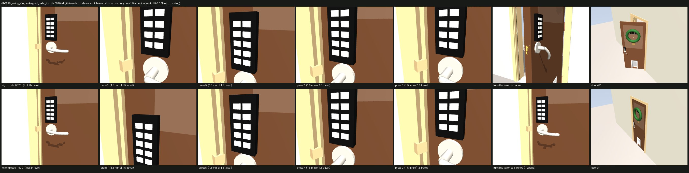
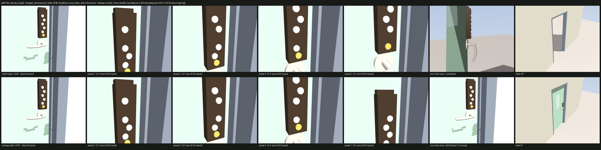
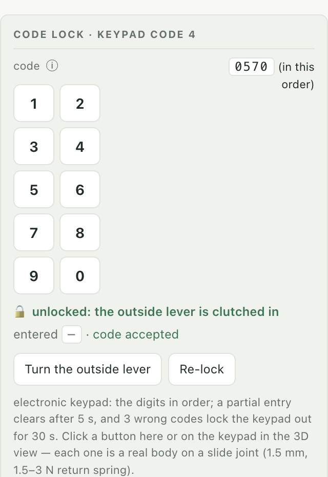

# Dataset format

```
assets/
  manifest.json                 index of all doors (see below)
  hardware/<key>.obj|.usdc      shared procedural hardware meshes (levers, knobs, bars, wheels, hinges ...)
  doors/<door_id>/
    spec.json                   full parametric specification + derived physics (auditable, with sources)
    model.json                  simulator-agnostic articulated model (bodies, joints, geoms, couplings, materials)
    door.xml                    MJCF, full fidelity (every mechanism body, mesh visuals, tendons, loop closures)
    door_simple.xml             MJCF, leaf + primary operator + latch bolt, primitive collision only
    door_minimal.xml            MJCF, leaf only (hinge friction/damping/closer spring)
    scene.xml                   MJCF wrapper for `python -m mujoco.viewer --mjcf scene.xml`
    door.urdf / door_simple.urdf / door_minimal.urdf
    door.usda                   UsdPhysics articulation, full fidelity (references ../../hardware/*.usdc)
    door_rl.usda                canonical 8-link / 7-joint articulation for Isaac Lab multi-door RL (docs/ISAAC_LAB.md)
    qa.json                     automated sign-off record
    thumb_*.jpg                 catalogue thumbnails (robot view, far side, isometric, handle detail, open)
```

## Coordinate conventions

* Z up, metres, kilograms, seconds, radians.
* The wall plane is `y = 0`; the opening is centred at `x = 0`; the floor is `z = 0`.
* The robot approaches from `-y` (site `approach_point` at `(0, -1.5, 0)`) and must reach `goal_point` at `(0, +1.5, 0)`.
  Site `door_plane_center` marks the opening.
* For hinged leaves `meta.u` is the sign of the leaf's local x direction (hinge → latch edge) and `meta.v` the swing
  direction sign (`+1`: opens toward `+y`, i.e. the robot pushes; `-1`: the robot pulls).
* **Positive joint values always mean "opening" or "actuating"** (door opens, lever pressed, bolt retracts, bar pushed).
* `meta.primary_joint` is the leaf joint to observe; `meta.operator_joint` is what the robot must actuate (may be null).

## Joint semantics

| role | examples | notes |
|---|---|---|
| `primary` | `leaf_hinge`, `leaf_slide`, `rotor_hinge`, `flap_hinge` | carries hinge friction (`frictionloss`), damping, closer spring (`stiffness` + `springref`), closer asymmetry in `damping_closing/opening` |
| `operator` | `leaf_handle_hinge`, `leaf_exit_device_slide`, `wheel_hinge` | return spring, backlash range when locked |
| `latch` | `leaf_latch_bolt_slide` | spring bolt; `0` = extended, `+` = retracted; one-sided tendon to the operator (MJCF) |
| `lock` | `leaf_deadbolt_slide`, `leaf_deadbolt_thumbturn_hinge`, `dog_k_hinge`, keypad keys, `rex_button_slide` | polynomial equality couplings |
| `mechanism` | closer arms, riser slides for helical hinges | driven, not robot-interactive |
| `secondary` | second leaf of a pair, fold panels, pet flap in a door | |

`spec.json → physics` holds every derived number with the formula and source used
(mass breakdown, hinge friction model, EN 1154 closer parameters, latch/lock parameters, compliance flags,
damage thresholds).

`physics.mass` names the level of every mass, because `spec.leaf` describes ONE leaf and a door has `leaf.count`
of them: `per_leaf_kg` is one leaf and the hardware on it, `total_kg` is the whole door
(`leaf_count × (slab + glazing) + hardware`, and what the model's moving bodies weigh), and
`primary_assembly_kg` is what the primary joint carries — one leaf of a pair, the whole rotor of a revolving
door, the whole stack of a fold — measured on the built model, with `primary_com_arm_m` the lever that subtree's
weight works through.  `leaf_slab_kg` / `leaf_glass_kg` / `leaf_hardware_kg` are the one-leaf breakdown and
`slab_kg` / `glass_kg` / `hardware_kg` the door's.  See [PHYSICS.md](PHYSICS.md#mass-and-inertia).

Every geom in `model.json` carries `volume_m3` alongside its `density`, so a consumer can check a body's mass
against the material it is drawn in (this is what the `leaf_mass_share` gate does).

`spec.json → benchmark` holds the door's evaluation scenarios (start zone with a seeded `randomize` rule, approach
point, handle targets = grip / push site names, pass plane, goal zone, optional simulated-human path, reward table,
success criteria, time budget, expected transit time with its terms).  Schema and formulas: [BENCHMARK.md](BENCHMARK.md).

## Lock state

`spec.lock.engaged` and `spec.lock.robot_side_release` define the initial state.  When engaged without a robot-side
release, the operator joint range is limited to the lock backlash ("jiggle") and deadbolts are fixed.  The benchmark
environment (`doorbench.benchmark.DoorEnv`) implements release logic for REX buttons, card readers (`env.badge()`),
delayed egress timers, maglock breakaway, elevator call buttons and turnstile credentials.

### Code locks (`meta.keypad`)

A door with a keypad carries a `keypad` block in `model.json → meta`: the code (`spec.lock.code`; the dataset is
open), the layout, and one entry per button with its body, joint, `press` site and position.  Every button is a
real body on a slide joint with a return spring (`travel_m`, `press_force_N`, `preload_force_N` from
`hardware.KEYPADS` — a Schlage dome is 1.5 mm at 3 N, a Kaba Simplex button 4 mm at 12 N), so the lock is released
by *pressing the code*, not by an API call.  What the code releases is in `meta.keypad.release`:

* `clutch` — a keypad lever set with no deadbolt (Schlage FE595, Kaba Simplex 1000).  The outside lever is its own
  body on its own joint (`clutch_joint`, in the latch tendon like the inside lever); while the lock is thrown its
  range is the lock's free play, so it jiggles and retracts nothing.  The code frees it to full travel.  The inside
  lever always works (egress).
* `motor_bolt` — a keypad deadbolt (Schlage BE365).  The bolt holds the door; the code runs the motor that retracts
  it (the interior thumbturn turns with it, as on the real lock).
* `none` — the lock is not thrown; the code is still read (`code_entered`) but there is nothing to release.

The state machine (order / timeout / lockout for electronic keypads, button *set* + lever for mechanical ones) is
`doorbench/keypad.py`, shared by the QA gate, `DoorEnv` and the viewer; see
[BENCHMARK.md](BENCHMARK.md#code-locks-scenariolock).  The `keypad_code_works` QA gate presses every door's code
with a programmatic finger and is part of sign-off.

`python scripts/keypad_review.py` renders the entry frame by frame (right code vs wrong code):




The viewer's door page runs the same state machine, so the keypad can be worked by hand (click the buttons in the
panel or on the keypad in the 3D view):



## Format-specific notes

* **MJCF** is the reference. Joint `ref` equals the authored geometry configuration; `qpos0` therefore is the spec's
  initial state. The spring latch uses a *one-sided* fixed tendon `bolt_q ≥ scale · operator_q`, so a bolt can also be
  pushed in by the strike lip when the door slams (re-latching works).
* **URDF** joints have `q = 0` at the spec's initial state (`doorbench:zero_offset` gives the MJCF offset).
  Springs, closers, ratchets, welds and loop closures are exported as `doorbench:*` extension elements; couplings use
  `<mimic>` (bilateral).
* **USD** (`door.usda`): default prim `/<door_id>`, static `Env`, `Articulation` with a fixed `base` link; `UsdPhysics`
  revolute/prismatic joints (q = 0 at the spec's initial state, `doorbench:zero_offset` = MJCF `ref`) with force drives
  carrying closer / latch / return springs (`stiffness`/`damping`/`targetPosition`), Coulomb friction efforts
  (`physxJointAxis:*:staticFrictionEffort`), `physxJoint:armature`, `PhysxMimicJointAPI` couplings where PhysX honours
  them (rotational -> rotational; the rest carry `doorbench:coupling_*` emulation data) and JSON strings
  `doorbench:couplings` / `doorbench:env_release` / `doorbench:filtered_pairs` on the root prim.  Environment-released
  locks (mag lock, delayed egress, electric bolt, interlock) are breakable `FixedJoint`s with
  `physics:excludeFromArticulation` and `breakForce` = the holding force; self-collision is enabled with
  `PhysxFilteredPairsAPI` reproducing MuJoCo's contact filter.  Mass properties are explicit (`MassAPI`).  `door_rl.usda` maps every door onto
  the same canonical articulation (see [ISAAC_LAB.md](ISAAC_LAB.md)); `assets/usd_validation.json` is the static
  validation report of both files for all doors.

## manifest.json

`doors[]` entries carry the catalogue fields: id, family, context, use case, task, difficulty (1–5), mass, leaf dims,
operator / latch / lock / closer / hinge ids, condition, swing/side, extras, tags, body/joint counts, QA sign-off,
thumbnail paths, file paths, a physics summary and a `benchmark` summary
(`{scenarios: [...], primary, time_budget_s, expected_transit_s, has_human}`).
