# Isaac parity gate

_Report generated 2026-09-05T09:07:03 by `scripts/isaaclab/parity_report.py` from `results/parity/`, repository commit `8a448597b`. Dataset: 1000 doors, manifest version `0.1.0` generated 2026-09-05T08:43:59, reference run commit `a6061be27`._

### Which runs this page compares

| run | file | doors | engine | dt | protocol / metrics | generated |
|---|---|---|---|---|---|---|
| MuJoCo reference | `results/parity/mujoco.json` | 1000 | mujoco `3.12.0` | 0.002 | 1.0 / 1.1 | 2026-09-05T08:59:11 |
| PhysX `full` | `results/parity/isaac_full.json` | 1000 | isaac_sim **not recorded**, isaac_lab **not recorded**, physx_dt `0.008333333333333333` | 0.008333333... | 1.0 / 1.0 (not recorded) | 2026-09-05T09:42:07 |
| PhysX `rl` | `results/parity/isaac_rl.json` | 1000 | isaac_sim **not recorded**, isaac_lab **not recorded**, physx_dt `0.008333333333333333` | 0.008333333... | 1.0 / 1.0 (not recorded) | 2026-09-05T09:06:30 |

> **Not comparable, and not counted as agreement.**
> * `full`: **211 doors stale** - the PhysX record and the MuJoCo reference were produced from different protocol inputs (`inputs_hash`), so nothing in them is comparable. They are grade **X** and published as *untested*, never as ok or fail. Example: `db0002_swing_single`; reason: inputs_hash mujoco ef6f8d01145e != physx c1386aeb5617.
> * `rl`: **211 doors stale** - the PhysX record and the MuJoCo reference were produced from different protocol inputs (`inputs_hash`), so nothing in them is comparable. They are grade **X** and published as *untested*, never as ok or fail. Example: `db0002_swing_single`; reason: inputs_hash mujoco ef6f8d01145e != physx c1386aeb5617.
> * `full`: **789 doors** carry metrics whose *definition* changed between the two runs (`arrival_speed`, `speed_at_latch`). Those metrics are reported and **not graded** until the older side is re-run; every other metric of the door is compared as usual.
> * `rl`: **789 doors** carry metrics whose *definition* changed between the two runs (`arrival_speed`, `speed_at_latch`). Those metrics are reported and **not graded** until the older side is re-run; every other metric of the door is compared as usual.
> * `full`: **75 doors** entered the relatch phase at different angles in the two runs (it continues from operate, where a leaf that coasts into its stop rebounds in MuJoCo and not in PhysX), so its *timing* metrics (`t_close`) measure two different experiments and are not graded. The phase's verdict metrics - `relatch_closed_angle` and `relatch_repush_angle`, both end states - are graded as usual.
> * `rl`: **77 doors** entered the relatch phase at different angles in the two runs (it continues from operate, where a leaf that coasts into its stop rebounds in MuJoCo and not in PhysX), so its *timing* metrics (`t_close`) measure two different experiments and are not graded. The phase's verdict metrics - `relatch_closed_angle` and `relatch_repush_angle`, both end states - are graded as usual.


Every door runs **one behavioural protocol** in MuJoCo (the reference physics, CPU) and in Isaac Sim / PhysX on the GPU pod, on both USD kinds (`door.usda` full fidelity, `door_rl.usda` canonical 8-link). The two runs are compared phase by phase: both simulators must reach the same pass / fail verdict (else grade **C**), and when they agree the metrics must be within tolerance (else grade **B**); **A** is parity, **X** means the door could not be compared (spawn / structure error). A disagreement is tagged with a discrepancy class whose likely root cause comes from the analysis of the first 40-door probe. The per-door verdict is published in `qa.json` (`isaac_parity`) and as a badge in the viewer.

## Headline

| USD kind | compared | parity (A) | same verdicts (A + B) | disagree (C) | not comparable (X) | of which stale | untested |
|---|---|---|---|---|---|---|---|
| `full` | 789 / 1000 | **572 / 1000** (72 % of compared) | 717 / 1000 (91 %) | 72 | 211 | 211 | 0 |
| `rl` | 789 / 1000 | **567 / 1000** (72 % of compared) | 745 / 1000 (94 %) | 44 | 211 | 211 | 0 |

Door badge (`qa.json.isaac_parity.ok`; viewer chip *Isaac parity*): **703 ok** (grade A or B in every tested kind), **86 fail** (a status disagreement or not comparable), 211 untested.

## What the gate runs

| phase | what is compared | pass criterion (per simulator) |
|---|---|---|
| `structure` | P0 structure (joints / limits / gains / mass match model.json) | joint set, ranges (2e-3), stiffness / friction (1 %), spring target (1e-3), moving mass (20 % / 0.5 kg) |
| `pose0` | P1 pose0 (body, COM and joint-anchor frames at q0) | body origins, COMs, joint anchors within 5 mm; axes dot >= 0.999 |
| `settle` | P2 settle (1 s free, spring targets kept) | primary drift < 0.05 rad / 0.01 m, every other joint < 0.02 rad / 2 mm, no MuJoCo warnings, penetration > -12 mm |
| `hold` | P3 hold / free_opens (adaptive QA push on the door joint only) | has_holding: q < 2 deg / 15 mm under the adaptive push; else opens > 10 deg / 5 cm within 6 s |
| `operate_open` | P4 operate + open (operator, thumbturn / aux / dogs, then push) | q > min(20 deg, 0.5 max_open) / 5 cm after operator + push (chain: inside the slack window) |
| `release` | P5 release (latch bolt re-extends) | bolt < 6 mm after the operator is released |
| `relatch` | P6 relatch (close and re-push) | closed < 2 deg after 6 s closing drive, re-push < 2.5 deg |
| `closer_return` | P7 closer return from 60 deg | abs(q) < 6 deg after 12 s from 60 deg |
| `locked_holds` | P8 locked holds (operator worked + push) | q < 2 deg / 15 mm (+ chain slack) with operator worked + push |
| `limits` | P9 limits (every joint inside its range) | every limited joint inside lo - tol .. hi + tol (2 deg / 5 mm) |
| `sanity` | P10 sanity (finite, no explosion) | finite state, no velocity cap hit, no body displaced > 5 m, no MuJoCo warnings |

<details><summary>Metric tolerances (a delta passes when within either bound)</summary>

| metric | hinge (rad, s) | slide (m, s) | relative | where the bound comes from |
|---|---|---|---|---|
| `settle_drift` | 0.02 | 0.005 | - | the QA settle gate itself allows 0.05 rad / 0.01 m of drift in 1 s; the comparison bound is under half of that, so a door that would still sign off cannot disagree here |
| `settle_drift_primary` | 0.02 | 0.005 | - | as settle_drift |
| `settle_drift_operator` | 0.02 | 0.005 | - | as settle_drift |
| `settle_drift_latch` | 0.002 | 0.002 | - | 2 mm: a third of the 6 mm 'bolt has returned' threshold, so latch slop cannot be confused with a bolt that did not re-extend |
| `pen0_m` | 0.003 | 0.003 | - | 3 mm: PhysX's 5 mm contactOffset vs MuJoCo's margin-free contacts; the sign-off gate rejects anything past -12 mm |
| `hold_displacement` | 0.01 | 0.003 | - | 0.01 rad / 3 mm on a door that must stay shut: half the 2 deg / 15 mm 'held' threshold, plus the leaf's authored locked play where it has any. On a door that must swing open the quantity is q at the free-swing crossing and the q_at_1s bound applies instead |
| `t_free` | 0.25 | 0.25 | 30 % | 0.25 s / 30 %: two 30 Hz samples plus the 1 s minimum push; the crossing time of a leaf accelerating from rest is dominated by the first tenth of a rad |
| `q_at_1s` | 0.1 | 0.05 | 20 % | 0.1 rad / 5 cm, 20 %: a free leaf covers ~0.1 rad in one 30 Hz sample at its typical 3 rad/s, so this is sampling noise, not travel; the door's own locked play is added |
| `opened` | 0.1 | 0.05 | 20 % | 0.1 rad / 5 cm, 20 %: as q_at_1s. Waived when both runs coasted into the same joint stop - MuJoCo's soft limit (solreflimit 0.005) returns ~17 % of the impact velocity and PhysX's articulation limit is inelastic, so the end-of-phase angle is a rebound; q_primary_max is graded instead |
| `actuate_displacement` | 0.1 | 0.05 | 20 % | as opened |
| `t_open` | 0.3 | 0.3 | 30 % | 0.3 s / 30 %: the operator is worked from 0.6 s and the push starts at 1.2 s, so a 0.3 s spread is the width of the drive ramp, not a difference in whether the door opens |
| `t_open_bench` | 0.3 | 0.3 | 30 % | as t_open |
| `q_primary_max` | 0.1 | 0.05 | 20 % | 0.1 rad / 5 cm, 20 %: the peak the leaf reaches, which both engines must agree on even when they bounce off the stop differently |
| `t_unlatch` | 0.2 | 0.2 | - | 0.2 s: six 30 Hz samples of bolt travel |
| `operator_travel_reached` | 0.05 | 0.005 | 10 % | 10 % of the operator's own travel (the hardware table's travel, or the joint range when the MJCF authors a larger one) |
| `bolt_retract_max_frac` | 0.15 | 0.15 | - | 15 % of the throw: the latch is judged unlatched at 80 % of throw, so this cannot flip that verdict |
| `curve_rmse_primary` | 0.15 | 0.05 | - | 0.15 rad / 5 cm RMS over the operate phase: about the 0.1 rad per-sample bound sustained over the whole curve |
| `bolt_after_release_m` | 0.002 | 0.002 | - | 2 mm: a third of the 6 mm 'bolt returned' threshold |
| `t_bolt_return` | 0.2 | 0.2 | - | 0.2 s: six 30 Hz samples |
| `operator_after_release_frac` | 0.1 | 0.1 | - | 10 % of the operator travel, as operator_travel_reached |
| `relatch_closed_angle` | 0.0175 | 0.005 | - | 1 deg / 5 mm: half the 2 deg 'closed' threshold of the relatch check |
| `relatch_repush_angle` | 0.0175 | 0.005 | - | 1 deg / 5 mm: as relatch_closed_angle against the 2.5 deg re-push threshold |
| `t_close` | 0.5 | 0.5 | 30 % | 0.5 s / 30 %: the closing drive is a constant effort from rest. Not compared when the two runs entered the phase at different angles - relatch continues from operate, and a leaf that starts 0.4 rad further open must take longer |
| `arrival_speed` | 0.2 | 0.1 | 30 % | 0.2 rad/s / 0.1 m/s, 30 %: peak |v| over the 100 ms before the latch crossing (metrics 1.1). The 1.0 definition - |v| at the single sample nearest the crossing - was a sampling artefact and is never compared against 1.1 |
| `closer_final_angle` | 0.0349 | 0.01 | - | 2 deg / 1 cm: a third of the 6 deg 'closed by the closer' threshold |
| `closer_t_close` | 0.5 | 0.5 | 30 % | 0.5 s / 30 %: a 12 s phase; the closer's own sweep takes 2-6 s |
| `peak_closing_speed` | 0.2 | 0.1 | 30 % | 0.2 rad/s / 0.1 m/s, 30 %: the slam threshold of the damage model is 2-4 rad/s, so this cannot hide a slam |
| `speed_at_latch` | 0.2 | 0.1 | 30 % | as arrival_speed (same definition, same 100 ms window) |
| `curve_rmse_closer` | 0.1 | 0.05 | - | 0.1 rad / 5 cm RMS over the 12 s closer sweep |
| `locked_displacement` | 0.01 | 0.003 | - | 0.01 rad / 3 mm: half the 2 deg / 15 mm 'locked holds' threshold, plus the chain / guard slack where the lock has any |
| *(any other metric)* | 0.05 | 0.02 | 20 % | fallback for a metric with no bound of its own; every metric that decides a grade should have an entry above |
| `velocity_cap_hit_primary` | - | - | - | boolean: did the door joint leave the physical velocity range (15 rad/s / 6 m/s) in one run and not the other |
| `settle_drift_joint` | - | - | - | per joint, over the joints the USD actually has: 0.02 rad / 5 mm, the same bound as settle_drift |

</details>

**When a delta is *not* graded.** Four cases, each of which would otherwise report the comparison rather than the door. None of them loosens a bound: each one says the two numbers do not measure the same thing.

1. **The two records are not the same door** (`inputs_hash` differs): grade **X**, published as untested. The hash covers the joints, the adaptive push, the thresholds, the couplings, the schedule and the flags each runner was handed.
2. **The metric's definition changed** between the two runs (`metrics_version`, `protocol.METRIC_DEF_CHANGED_IN`): reported, not graded, until the older side is re-run. Metrics 1.1 redefined `arrival_speed` / `speed_at_latch` from *|v| at the 30 Hz sample nearest the crossing* - which reads the post-impact velocity and lands either side of a millisecond-long impact at random - to the peak |v| over the 100 ms of approach.
3. **Both runs coasted into the same joint stop**: the value at the end of the operate phase is then a rebound (MuJoCo's soft limit, `solreflimit` 5 ms, returns about 17 % of the impact velocity; PhysX's articulation limit is inelastic), so `opened` is waived and `q_primary_max` - the peak both leaves reach, and the quantity that says how far the door actually swung - is graded in its place.
4. **The phase was entered from a different state**: `relatch` continues from `operate`, so when that rebound leaves the two leaves at different angles its *timing* metrics compare two different experiments. Its verdict metrics (`relatch_closed_angle`, `relatch_repush_angle`) are end states and stay graded.

**The push the gate applies.** Both simulators drive the door joint with the sign-off QA's adaptive push: twice the static resistance at rest (gravity bias + Coulomb friction + spring preload) plus a base sized by the leaf itself - `0.5 m g W`, half the moment gravity would exert on the leaf if it lay horizontal, clamped to [2, 60] N*m for a hinge and [2, 80] N for a slide (`doorbench.qa.push_base`). A flat 60 N*m is what a person applies to a 20-100 kg door; on a 0.14-1.4 kg pet flap it is about 100x the mechanism's own scale, accelerates it at ~2000 rad/s^2 and drives it to 30-85 rad/s in MuJoCo and to a non-finite state in PhysX.

## Discrepancy classes

| class | full | rl | doors | what it means | likely root cause | fix direction | examples |
|---|---|---|---|---|---|---|---|
| `METRICS_VERSION_SKEW` | 789 | 789 | 789 | the two records agree on the door but were reduced by different metric formulas; the affected metrics are reported and not graded | doorbench.parity.protocol.METRICS_VERSION was raised after one of the runs (see METRIC_DEF_CHANGED_IN) | re-run the older side; the other metrics of the door are still compared | `db0001_rollup`, `db0003_cold_storage`, `db0005_garage_tiltup`, `db0006_gate_swing` |
| `STALE_INPUTS` | 211 | 211 | 211 | the two records were produced from different protocol inputs (inputs_hash differs), so nothing in them is comparable | the dataset, the adaptive push, a threshold or a coupling changed between the MuJoCo reference run and the PhysX run | re-run the older side against the current dataset; the verdict is withheld (untested), never published | `db0002_swing_single`, `db0004_bifold`, `db0009_bifold`, `db0013_swing_single` |
| `QUANT` | 167 | 196 | 196 | both simulators reach the same pass / fail verdicts but at least one metric is outside tolerance | soft MuJoCo contacts / limits (solref 0.005) vs rigid PhysX limits, constraint-based vs effort-based Coulomb friction, implicitfast vs implicit drives at high damping; solver dt | rerun at Isaac dt 1/240 (32/8 iterations) and MuJoCo dt 0.001; if the delta shrinks below tolerance tag SOLVER_SENSITIVITY, else triage by phase | `db0003_cold_storage`, `db0010_swing_double`, `db0015_swing_double`, `db0017_hatch_ceiling` |
| `CONTACT_GEOMETRY` | 44 | 11 | 44 | the bolt retracted (or there is no bolt) yet the leaf did not move, or a latch that holds in MuJoCo does not engage in PhysX (convex hulls, strike lip, panel clearance) | H7: PhysX contacts with Env prims at 0-5 mm clearance (contactOffset 5 mm), convex decomposition of hooks / strikes, self-collision disabled globally vs MuJoCo's selective exclusion | enable contact reporting; rerun with Env collision disabled, then without the hardware part, to bisect frame contact vs articulation; author PhysxFilteredPairsAPI for model.contact_excludes | `db0039_swing_single`, `db0062_swing_single`, `db0075_gate_swing`, `db0086_swing_single` |
| `EXPORT_WELD` | 19 | 17 | 14 | MuJoCo holds the leaf (weld / lock equality) but PhysX has nothing holding it, so the door opens under the push | H5: weld-type lock equalities (mag_lock / delayed_egress leaf -> world) are exported only as doorbench:couplings JSON; write_usd_rl keeps door_hinge active with its full range | author a FixedJoint / locked drive (or a D6 joint with breakForce = holding_force_N) tagged doorbench:env_release that DoorMechanismAction disables on REX / badge / timer; classify env_release_only and test 'holds' in both sims | `db0026_swing_single`, `db0158_swing_double`, `db0216_swing_single`, `db0316_swing_double` |
| `EXPORT_COUPLING` | 14 | 20 | 27 | the operator turns but the bolt does not retract (or does not return) in PhysX, so the door stays latched | H1: the MJCF one-sided tendon (bolt_q >= scale * operator_q) is exported only as doorbench:couplings JSON / doorbench:latch_coupling; the runner must emulate it as a kinematic clamp each step (the soft target offset under-retracts by 40-60 %) | shared clamp function (write_joint_state_to_sim(max(latch_q, scale * op_q))) in the parity runner and DoorMechanismAction; read scale from doorbench:rl.latch_coupling / doorbench:latch_coupling_scale | `db0124_vault`, `db0179_vault`, `db0288_blast`, `db0296_sliding_single` |
| `RL_CANON` | 0 | 15 | 15 | door.usda agrees with MuJoCo but door_rl.usda does not: a welded lock / operator / panel or an empty operator slot changes the behaviour | H4: panic doors with robot outside and no far-side trim get operator_joint None (exit device welded, latch never retracts); engaged locks welded; world-mounted latches welded released; extra leaves omitted | derive the RL expectation from doorbench:rl (lock.engaged, operator_slot_joint) and document 'holds by construction'; or map the release to a canonical slot | `db0296_sliding_single`, `db0331_sliding_single`, `db0345_sliding_single`, `db0373_sliding_single` |
| `VELOCITY_EXPLOSION` | 0 | 2 | 2 | a joint left the physical velocity range in one simulator (velocity cap hit, non-finite state) - the drift or displacement it reports is the debris, not the behaviour | rigid PhysX limits plus a heavy / stiff mechanism at 120 Hz, initial penetration, or an effort far above the mechanism's own scale | dt <= 1/240; check the initial penetration and the applied effort against the leaf's inertia (doorbench.qa.push_base) | `db0213_garage_sectional`, `db0873_rollup` |
| `PHYSICS_PARAM_FRICTION` | 0 | 2 | 2 | a free-swinging door opens in one simulator but not the other (timing or threshold), pointing at Coulomb friction or gravity bias mapping | H3: physxJointAxis friction efforts vs MuJoCo frictionloss (stick / slip differs), legacy jointFriction coefficient adding load-dependent friction, or an effort below the adaptive QA push | measure breakaway effort on one door in both sims; use the per-door qa_push; zero the legacy coefficient | `db0707_swing_double`, `db0846_swing_double` |

<details><summary><code>METRICS_VERSION_SKEW</code> - all 789 doors</summary>

`db0001_rollup` `db0003_cold_storage` `db0005_garage_tiltup` `db0006_gate_swing` `db0007_sliding_single` `db0008_sliding_bypass` `db0010_swing_double` `db0011_automatic_swing` `db0012_swing_single` `db0015_swing_double` `db0016_swing_single` `db0017_hatch_ceiling` `db0018_sliding_single` `db0019_swing_double` `db0021_swing_single` `db0022_swing_single` `db0023_sliding_single` `db0024_swing_single` `db0025_swing_double` `db0026_swing_single` `db0027_swing_single` `db0028_swing_single` `db0029_sliding_single` `db0032_sliding_single` `db0033_gate_sliding` `db0035_swing_single` `db0036_swing_single` `db0038_sliding_single` `db0039_swing_single` `db0040_swing_single` `db0044_pivot` `db0047_swing_double` `db0048_swing_single` `db0049_swing_double` `db0050_swing_single` `db0053_elevator` `db0054_stall` `db0055_swing_single` `db0056_swing_single` `db0057_sliding_bypass` `db0058_swing_single` `db0060_swing_single` `db0061_swing_single` `db0062_swing_single` `db0063_swing_single` `db0064_gate_sliding` `db0066_revolving` `db0067_sliding_single` `db0068_swing_single` `db0070_swing_single` `db0072_swing_single` `db0073_swing_single` `db0074_swing_single` `db0075_gate_swing` `db0076_swing_single` `db0079_sliding_single` `db0080_cold_storage` `db0081_swing_single` `db0082_swing_single` `db0083_swing_single` `db0085_revolving` `db0086_swing_single` `db0087_sliding_single` `db0088_pivot` `db0089_automatic_swing` `db0091_swing_single` `db0094_swing_single` `db0095_dutch` `db0096_swing_single` `db0097_swing_double` `db0098_gate_swing` `db0099_sliding_single` `db0101_swing_single` `db0102_automatic_swing` `db0103_stall` `db0104_garage_tiltup` `db0107_sliding_single` `db0108_revolving` `db0110_swing_double` `db0112_swing_double` `db0114_swing_single` `db0115_swing_single` `db0116_swing_single` `db0117_swing_single` `db0118_dutch` `db0119_swing_single` `db0120_swing_single` `db0122_swing_single` `db0124_vault` `db0125_sliding_single` `db0126_gate_swing` `db0127_swing_double` `db0128_swing_double` `db0129_sliding_single` `db0130_automatic_sliding` `db0131_sliding_single` `db0132_swing_double` `db0133_swing_single` `db0134_sliding_single` `db0135_swing_single` `db0136_automatic_swing` `db0137_bifold` `db0138_automatic_swing` `db0139_swing_single` `db0140_swing_single` `db0142_swing_single` `db0143_swing_single` `db0144_swing_double` `db0145_swing_single` `db0147_swing_single` `db0148_garage_sectional` `db0149_swing_double` `db0151_sliding_single` `db0152_swing_single` `db0153_automatic_sliding` `db0154_swing_single` `db0155_swing_single` `db0156_swing_single` `db0157_sliding_single` `db0158_swing_double` `db0159_automatic_swing` `db0160_swing_single` `db0161_pivot` `db0165_swing_single` `db0166_swing_single` `db0167_sliding_single` `db0168_ship_watertight` `db0169_swing_single` `db0171_swing_single` `db0172_swing_single` `db0173_garage_tiltup` `db0174_stall` `db0175_garage_sectional` `db0178_swing_single` `db0179_vault` `db0180_swing_double` `db0181_swing_single` `db0182_swing_single` `db0183_swing_double` `db0184_rollup` `db0185_swing_single` `db0188_cold_storage` `db0189_swing_single` `db0193_sliding_single` `db0195_swing_single` `db0196_rollup` `db0197_swing_double` `db0198_garage_sectional` `db0199_swing_single` `db0201_swing_single` `db0203_automatic_sliding` `db0204_dutch` `db0205_swing_single` `db0206_swing_single` `db0207_swing_single` `db0209_swing_single` `db0210_swing_single` `db0211_swing_double` `db0212_swing_single` `db0213_garage_sectional` `db0214_swing_single` `db0216_swing_single` `db0217_sliding_bypass` `db0218_sliding_bypass` `db0219_swing_single` `db0220_swing_single` `db0221_pivot` `db0222_swing_double` `db0224_swing_single` `db0225_automatic_swing` `db0227_swing_single` `db0228_swing_single` `db0229_swing_single` `db0230_swing_single` `db0232_swing_single` `db0233_swing_single` `db0234_swing_single` `db0235_sliding_single` `db0237_swing_single` `db0239_gate_swing` `db0240_swing_single` `db0241_hatch_floor` `db0242_sliding_single` `db0243_swing_single` `db0244_swing_single` `db0245_swing_single` `db0247_swing_single` `db0250_revolving` `db0252_swing_single` `db0254_swing_single` `db0255_swing_single` `db0256_swing_single` `db0257_swing_single` `db0258_rollup` `db0259_swing_single` `db0260_revolving` `db0261_swing_double` `db0262_sliding_single` `db0263_swing_single` `db0264_swing_single` ... and 589 more

</details>

<details><summary><code>STALE_INPUTS</code> - all 211 doors</summary>

`db0002_swing_single` `db0004_bifold` `db0009_bifold` `db0013_swing_single` `db0014_gate_swing` `db0020_sliding_bypass` `db0030_bifold` `db0031_saloon` `db0034_gate_swing` `db0037_strip_curtain` `db0041_sliding_single` `db0042_sliding_bypass` `db0043_bifold` `db0045_pet_door` `db0046_sliding_bypass` `db0051_swing_single` `db0052_pet_door` `db0059_bifold` `db0065_accordion` `db0069_bifold` `db0071_bifold` `db0077_bifold` `db0078_bifold` `db0084_sliding_single` `db0090_bifold` `db0092_sliding_bypass` `db0093_sliding_single` `db0100_bifold` `db0105_swing_single` `db0106_gate_swing` `db0109_swing_single` `db0111_swing_single` `db0113_bifold` `db0121_hatch_ceiling` `db0123_saloon` `db0141_bifold` `db0146_gate_sliding` `db0150_sliding_single` `db0162_gate_swing` `db0163_strip_curtain` `db0164_bifold` `db0170_saloon` `db0176_baby_gate` `db0177_accordion` `db0186_swing_single` `db0187_turnstile_fullheight` `db0190_turnstile_fullheight` `db0191_gate_swing` `db0192_gate_swing` `db0194_bifold` `db0200_gate_swing` `db0202_turnstile_tripod` `db0208_hatch_ceiling` `db0215_accordion` `db0223_swing_single` `db0226_sliding_single` `db0231_bifold` `db0236_swing_single` `db0238_pet_door` `db0246_sliding_single` `db0248_swing_single` `db0249_accordion` `db0251_sliding_single` `db0253_gate_swing` `db0271_sliding_single` `db0272_turnstile_tripod` `db0273_turnstile_fullheight` `db0292_accordion` `db0301_gate_swing` `db0303_swing_single` `db0317_swing_single` `db0319_swing_single` `db0336_baby_gate` `db0337_sliding_bypass` `db0338_turnstile_fullheight` `db0340_sliding_single` `db0343_bifold` `db0344_turnstile_tripod` `db0350_strip_curtain` `db0357_hatch_ceiling` `db0368_gate_swing` `db0370_sliding_single` `db0372_bifold` `db0375_swing_single` `db0377_sliding_bypass` `db0379_swing_single` `db0380_hatch_floor` `db0381_accordion` `db0387_sliding_bypass` `db0389_hatch_ceiling` `db0393_turnstile_tripod` `db0394_swing_single` `db0399_pet_door` `db0401_sliding_bypass` `db0402_swing_single` `db0406_strip_curtain` `db0422_swing_single` `db0430_bifold` `db0431_sliding_single` `db0441_swing_single` `db0457_swing_single` `db0473_accordion` `db0483_baby_gate` `db0486_bifold` `db0491_sliding_bypass` `db0497_turnstile_fullheight` `db0505_baby_gate` `db0516_turnstile_tripod` `db0521_swing_single` `db0524_bifold` `db0528_turnstile_fullheight` `db0533_accordion` `db0535_strip_curtain` `db0537_pet_door` `db0541_bifold` `db0542_sliding_bypass` `db0547_swing_single` `db0558_stall` `db0559_hatch_floor` `db0566_gate_swing` `db0567_swing_single` `db0573_stall` `db0578_swing_single` `db0579_swing_single` `db0589_turnstile_fullheight` `db0606_swing_single` `db0609_pet_door` `db0621_sliding_bypass` `db0624_saloon` `db0627_pet_door` `db0628_strip_curtain` `db0630_sliding_single` `db0632_swing_single` `db0641_strip_curtain` `db0642_swing_single` `db0647_sliding_single` `db0649_sliding_bypass` `db0661_baby_gate` `db0665_bifold` `db0679_bifold` `db0683_bifold` `db0687_strip_curtain` `db0691_sliding_single` `db0694_stall` `db0698_baby_gate` `db0703_swing_single` `db0716_saloon` `db0722_swing_single` `db0728_swing_single` `db0731_sliding_bypass` `db0736_swing_single` `db0738_saloon` `db0740_swing_single` `db0743_pet_door` `db0745_swing_single` `db0750_bifold` `db0751_gate_swing` `db0753_pet_door` `db0757_sliding_single` `db0760_swing_single` `db0765_gate_sliding` `db0774_bifold` `db0786_sliding_single` `db0790_swing_single` `db0797_swing_single` `db0798_swing_single` `db0805_pet_door` `db0810_sliding_single` `db0818_saloon` `db0830_accordion` `db0831_swing_single` `db0834_hatch_ceiling` `db0842_swing_single` `db0844_baby_gate` `db0849_swing_single` `db0851_gate_swing` `db0853_baby_gate` `db0864_pet_door` `db0868_swing_single` `db0870_turnstile_tripod` `db0876_swing_single` `db0877_gate_swing` `db0880_turnstile_fullheight` `db0882_swing_single` `db0883_swing_single` `db0892_pet_door` `db0896_turnstile_tripod` `db0901_pet_door` `db0910_sliding_single` `db0917_swing_single` `db0926_gate_swing` `db0927_accordion` `db0928_sliding_bypass` `db0933_bifold` `db0938_swing_single` `db0942_gate_swing` `db0943_stall` `db0945_sliding_single` `db0946_turnstile_tripod` `db0951_pet_door` ... and 11 more

</details>

<details><summary><code>QUANT</code> - all 196 doors</summary>

`db0003_cold_storage` `db0010_swing_double` `db0015_swing_double` `db0017_hatch_ceiling` `db0029_sliding_single` `db0036_swing_single` `db0050_swing_single` `db0054_stall` `db0060_swing_single` `db0062_swing_single` `db0068_swing_single` `db0080_cold_storage` `db0082_swing_single` `db0083_swing_single` `db0086_swing_single` `db0088_pivot` `db0095_dutch` `db0097_swing_double` `db0112_swing_double` `db0114_swing_single` `db0117_swing_single` `db0124_vault` `db0125_sliding_single` `db0129_sliding_single` `db0130_automatic_sliding` `db0132_swing_double` `db0135_swing_single` `db0143_swing_single` `db0165_swing_single` `db0168_ship_watertight` `db0182_swing_single` `db0188_cold_storage` `db0193_sliding_single` `db0203_automatic_sliding` `db0204_dutch` `db0211_swing_double` `db0212_swing_single` `db0214_swing_single` `db0224_swing_single` `db0227_swing_single` `db0234_swing_single` `db0237_swing_single` `db0241_hatch_floor` `db0242_sliding_single` `db0252_swing_single` `db0262_sliding_single` `db0263_swing_single` `db0270_swing_single` `db0276_cold_storage` `db0283_automatic_sliding` `db0285_ship_watertight` `db0288_blast` `db0291_stall` `db0294_swing_single` `db0302_swing_double` `db0304_swing_single` `db0306_sliding_single` `db0309_gate_sliding` `db0311_swing_single` `db0314_ship_watertight` `db0323_automatic_sliding` `db0330_swing_single` `db0341_swing_double` `db0354_pivot` `db0366_gate_swing` `db0384_ship_watertight` `db0385_swing_single` `db0386_swing_single` `db0407_swing_double` `db0408_swing_single` `db0409_cold_storage` `db0412_hatch_floor` `db0414_automatic_sliding` `db0415_gate_sliding` `db0418_swing_single` `db0420_stall` `db0424_swing_single` `db0425_swing_single` `db0429_swing_double` `db0432_cold_storage` `db0440_turnstile_fullheight` `db0442_hatch_floor` `db0443_swing_single` `db0444_swing_single` `db0446_swing_single` `db0449_hatch_floor` `db0451_swing_single` `db0452_hatch_floor` `db0453_sliding_single` `db0462_swing_single` `db0469_cold_storage` `db0471_sliding_single` `db0474_automatic_sliding` `db0484_swing_single` `db0493_swing_single` `db0499_sliding_bypass` `db0507_cold_storage` `db0508_swing_single` `db0509_swing_double` `db0514_automatic_sliding` `db0518_swing_single` `db0519_swing_single` `db0520_swing_double` `db0523_swing_single` `db0529_hatch_floor` `db0530_vault` `db0536_swing_double` `db0544_swing_single` `db0545_sliding_single` `db0549_cold_storage` `db0555_sliding_single` `db0557_stall` `db0561_swing_single` `db0562_swing_double` `db0565_swing_single` `db0571_swing_single` `db0582_swing_single` `db0585_cold_storage` `db0587_swing_double` `db0599_swing_single` `db0600_ship_watertight` `db0610_swing_single` `db0611_automatic_sliding` `db0613_gate_sliding` `db0623_blast` `db0625_swing_single` `db0631_sliding_single` `db0634_swing_double` `db0637_pivot` `db0638_swing_single` `db0645_swing_single` `db0656_sliding_single` `db0663_stall` `db0664_swing_single` `db0671_pivot` `db0672_blast` `db0673_cold_storage` `db0674_ship_watertight` `db0680_swing_single` `db0689_swing_single` `db0699_swing_single` `db0700_dutch` `db0706_swing_double` `db0707_swing_double` `db0717_swing_single` `db0729_ship_watertight` `db0744_ship_watertight` `db0764_automatic_sliding` `db0767_swing_single` `db0769_sliding_single` `db0770_automatic_sliding` `db0771_swing_single` `db0772_blast` `db0773_swing_single` `db0787_swing_double` `db0789_swing_single` `db0791_swing_single` `db0799_swing_single` `db0801_automatic_sliding` `db0803_swing_single` `db0807_swing_double` `db0812_swing_single` `db0814_swing_single` `db0819_swing_single` `db0833_swing_double` `db0836_swing_single` `db0846_swing_double` `db0850_swing_single` `db0852_cold_storage` `db0858_stall` `db0863_automatic_sliding` `db0865_cold_storage` `db0871_swing_double` `db0889_swing_single` `db0894_cold_storage` `db0898_ship_watertight` `db0902_pivot` `db0903_sliding_single` `db0904_swing_single` `db0905_swing_single` `db0906_dutch` `db0909_swing_single` `db0911_ship_watertight` `db0934_swing_single` `db0935_gate_sliding` `db0937_cold_storage` `db0948_swing_single` `db0955_swing_single` `db0960_blast` `db0961_sliding_single` `db0966_sliding_single` `db0970_sliding_single` `db0973_swing_single` `db0984_swing_single` `db0990_automatic_sliding` `db0993_swing_single`

</details>

<details><summary><code>CONTACT_GEOMETRY</code> - all 44 doors</summary>

`db0039_swing_single` `db0062_swing_single` `db0075_gate_swing` `db0086_swing_single` `db0122_swing_single` `db0149_swing_double` `db0182_swing_single` `db0222_swing_double` `db0255_swing_single` `db0263_swing_single` `db0287_gate_swing` `db0304_swing_single` `db0332_baby_gate` `db0454_swing_double` `db0464_swing_single` `db0531_swing_single` `db0540_gate_swing` `db0561_swing_single` `db0577_swing_double` `db0601_swing_single` `db0604_swing_double` `db0610_swing_single` `db0633_swing_single` `db0664_swing_single` `db0675_baby_gate` `db0682_swing_double` `db0714_swing_double` `db0725_swing_single` `db0761_swing_single` `db0763_swing_single` `db0808_swing_single` `db0812_swing_single` `db0832_swing_double` `db0854_gate_swing` `db0889_swing_single` `db0925_swing_single` `db0929_swing_double` `db0930_sliding_single` `db0944_swing_double` `db0948_swing_single` `db0949_swing_single` `db0955_swing_single` `db0963_swing_double` `db0984_swing_single`

</details>

<details><summary><code>EXPORT_WELD</code> - all 14 doors</summary>

`db0026_swing_single` `db0158_swing_double` `db0216_swing_single` `db0316_swing_double` `db0334_swing_double` `db0413_swing_double` `db0448_sliding_single` `db0534_swing_double` `db0591_pivot` `db0597_sliding_single` `db0702_swing_double` `db0733_swing_double` `db0792_swing_double` `db0897_swing_single`

</details>

<details><summary><code>EXPORT_COUPLING</code> - all 27 doors</summary>

`db0124_vault` `db0179_vault` `db0288_blast` `db0296_sliding_single` `db0331_sliding_single` `db0345_sliding_single` `db0352_blast` `db0373_sliding_single` `db0426_vault` `db0458_vault` `db0530_vault` `db0548_swing_single` `db0593_sliding_single` `db0594_sliding_single` `db0620_sliding_single` `db0623_blast` `db0639_sliding_single` `db0672_blast` `db0690_sliding_single` `db0724_sliding_single` `db0748_vault` `db0772_blast` `db0792_swing_double` `db0804_sliding_single` `db0913_vault` `db0921_vault` `db0960_blast`

</details>

<details><summary><code>RL_CANON</code> - all 15 doors</summary>

`db0296_sliding_single` `db0331_sliding_single` `db0345_sliding_single` `db0373_sliding_single` `db0548_swing_single` `db0593_sliding_single` `db0594_sliding_single` `db0620_sliding_single` `db0639_sliding_single` `db0690_sliding_single` `db0707_swing_double` `db0724_sliding_single` `db0792_swing_double` `db0804_sliding_single` `db0846_swing_double`

</details>

<details><summary><code>VELOCITY_EXPLOSION</code> - all 2 doors</summary>

`db0213_garage_sectional` `db0873_rollup`

</details>

<details><summary><code>PHYSICS_PARAM_FRICTION</code> - all 2 doors</summary>

`db0707_swing_double` `db0846_swing_double`

</details>

## By family

| family | doors | tested | ok | fail | full A / A+B | rl A / A+B | most frequent classes |
|---|---|---|---|---|---|---|---|
| accordion | 12 | 0 | 0 | 0 | 0 / 0 | 0 / 0 | STALE_INPUTS x12 |
| automatic_sliding | 15 | 15 | 15 | 0 | 5 / 15 | 3 / 15 | METRICS_VERSION_SKEW x15 |
| automatic_swing | 10 | 10 | 10 | 0 | 10 / 10 | 10 / 10 | METRICS_VERSION_SKEW x10 |
| baby_gate | 10 | 2 | 0 | 2 | 0 / 0 | 2 / 2 | STALE_INPUTS x8, CONTACT_GEOMETRY x2, METRICS_VERSION_SKEW x2 |
| bifold | 30 | 2 | 2 | 0 | 2 / 2 | 2 / 2 | STALE_INPUTS x28, METRICS_VERSION_SKEW x2 |
| blast | 6 | 6 | 0 | 6 | 0 / 0 | 0 / 5 | EXPORT_COUPLING x6, METRICS_VERSION_SKEW x6 |
| cold_storage | 15 | 15 | 15 | 0 | 0 / 15 | 4 / 15 | METRICS_VERSION_SKEW x15 |
| dutch | 12 | 12 | 12 | 0 | 8 / 12 | 8 / 12 | METRICS_VERSION_SKEW x12 |
| elevator | 8 | 8 | 8 | 0 | 8 / 8 | 8 / 8 | METRICS_VERSION_SKEW x8 |
| garage_sectional | 18 | 18 | 18 | 0 | 18 / 18 | 17 / 18 | METRICS_VERSION_SKEW x18, VELOCITY_EXPLOSION x1 |
| garage_tiltup | 7 | 7 | 7 | 0 | 7 / 7 | 7 / 7 | METRICS_VERSION_SKEW x7 |
| gate_sliding | 10 | 8 | 8 | 0 | 5 / 8 | 4 / 8 | METRICS_VERSION_SKEW x8, STALE_INPUTS x2 |
| gate_swing | 40 | 23 | 19 | 4 | 19 / 19 | 22 / 23 | METRICS_VERSION_SKEW x23, STALE_INPUTS x17, CONTACT_GEOMETRY x4 |
| hatch_ceiling | 8 | 2 | 2 | 0 | 1 / 2 | 1 / 2 | STALE_INPUTS x6, METRICS_VERSION_SKEW x2 |
| hatch_floor | 10 | 8 | 8 | 0 | 2 / 8 | 2 / 8 | METRICS_VERSION_SKEW x8, STALE_INPUTS x2 |
| pet_door | 15 | 0 | 0 | 0 | 0 / 0 | 0 / 0 | STALE_INPUTS x15 |
| pivot | 20 | 20 | 19 | 1 | 14 / 19 | 14 / 19 | METRICS_VERSION_SKEW x20, EXPORT_WELD x1 |
| revolving | 15 | 15 | 15 | 0 | 15 / 15 | 15 / 15 | METRICS_VERSION_SKEW x15 |
| rollup | 15 | 15 | 15 | 0 | 15 / 15 | 14 / 15 | METRICS_VERSION_SKEW x15, VELOCITY_EXPLOSION x1 |
| saloon | 12 | 4 | 4 | 0 | 4 / 4 | 4 / 4 | STALE_INPUTS x8, METRICS_VERSION_SKEW x4 |
| ship_watertight | 10 | 10 | 10 | 0 | 2 / 10 | 0 / 10 | METRICS_VERSION_SKEW x10 |
| sliding_bypass | 35 | 20 | 20 | 0 | 20 / 20 | 19 / 20 | METRICS_VERSION_SKEW x20, STALE_INPUTS x15 |
| sliding_single | 100 | 81 | 67 | 14 | 76 / 78 | 52 / 70 | METRICS_VERSION_SKEW x81, STALE_INPUTS x19, EXPORT_COUPLING x11 |
| stall | 15 | 11 | 11 | 0 | 5 / 11 | 5 / 11 | METRICS_VERSION_SKEW x11, STALE_INPUTS x4 |
| strip_curtain | 8 | 0 | 0 | 0 | 0 / 0 | 0 / 0 | STALE_INPUTS x8 |
| swing_double | 76 | 76 | 55 | 21 | 34 / 57 | 36 / 55 | METRICS_VERSION_SKEW x76, CONTACT_GEOMETRY x11, EXPORT_WELD x8 |
| swing_single | 440 | 392 | 362 | 30 | 301 / 363 | 318 / 388 | METRICS_VERSION_SKEW x392, STALE_INPUTS x48, CONTACT_GEOMETRY x26 |
| turnstile_fullheight | 10 | 1 | 1 | 0 | 1 / 1 | 0 / 1 | STALE_INPUTS x9, METRICS_VERSION_SKEW x1 |
| turnstile_tripod | 10 | 0 | 0 | 0 | 0 / 0 | 0 / 0 | STALE_INPUTS x10 |
| vault | 8 | 8 | 0 | 8 | 0 / 0 | 0 / 2 | EXPORT_COUPLING x8, METRICS_VERSION_SKEW x8 |

## By hardware

### latch kind

| kind | tested | ok | fail | full A / A+B | rl A / A+B | most frequent classes |
|---|---|---|---|---|---|---|
| deadlatch | 88 | 84 | 4 | 65 / 84 | 66 / 88 | METRICS_VERSION_SKEW x88, CONTACT_GEOMETRY x4 |
| dogs | 17 | 10 | 7 | 2 / 10 | 0 / 17 | METRICS_VERSION_SKEW x17, EXPORT_COUPLING x7 |
| electric_bolt | 11 | 8 | 3 | 8 / 8 | 11 / 11 | METRICS_VERSION_SKEW x11, EXPORT_WELD x2, CONTACT_GEOMETRY x1 |
| gravity_bar | 19 | 19 | 0 | 19 / 19 | 18 / 19 | METRICS_VERSION_SKEW x19, STALE_INPUTS x11 |
| hook | 21 | 4 | 17 | 15 / 15 | 10 / 10 | METRICS_VERSION_SKEW x21, EXPORT_COUPLING x11, RL_CANON x11 |
| magnetic | 16 | 16 | 0 | 4 / 16 | 8 / 16 | STALE_INPUTS x25, METRICS_VERSION_SKEW x16 |
| mortise_latch | 74 | 68 | 6 | 55 / 68 | 57 / 74 | METRICS_VERSION_SKEW x74, CONTACT_GEOMETRY x6 |
| multi_bolt | 7 | 0 | 7 | 0 / 0 | 0 / 0 | EXPORT_COUPLING x7, METRICS_VERSION_SKEW x7 |
| none | 268 | 260 | 8 | 220 / 262 | 207 / 260 | METRICS_VERSION_SKEW x268, STALE_INPUTS x109, EXPORT_WELD x6 |
| rim_latch | 42 | 41 | 1 | 39 / 42 | 37 / 41 | METRICS_VERSION_SKEW x42, EXPORT_COUPLING x1, RL_CANON x1 |
| roller | 8 | 8 | 0 | 3 / 8 | 3 / 8 | METRICS_VERSION_SKEW x8 |
| slide_bolt | 22 | 22 | 0 | 15 / 22 | 13 / 22 | METRICS_VERSION_SKEW x22, STALE_INPUTS x8 |
| tubular_latch | 165 | 132 | 33 | 111 / 132 | 120 / 148 | METRICS_VERSION_SKEW x165, STALE_INPUTS x48, CONTACT_GEOMETRY x27 |
| vertical_rods | 31 | 31 | 0 | 16 / 31 | 17 / 31 | METRICS_VERSION_SKEW x31 |

### lock kind

| kind | tested | ok | fail | full A / A+B | rl A / A+B | most frequent classes |
|---|---|---|---|---|---|---|
| card_reader | 20 | 20 | 0 | 17 / 20 | 17 / 20 | METRICS_VERSION_SKEW x20 |
| chain | 4 | 4 | 0 | 3 / 4 | 3 / 4 | METRICS_VERSION_SKEW x4 |
| child_lock_cover | 5 | 5 | 0 | 4 / 5 | 4 / 5 | METRICS_VERSION_SKEW x5, STALE_INPUTS x3 |
| deadbolt_double | 6 | 6 | 0 | 4 / 6 | 4 / 6 | METRICS_VERSION_SKEW x6 |
| deadbolt_single | 32 | 22 | 10 | 15 / 22 | 22 / 26 | METRICS_VERSION_SKEW x32, CONTACT_GEOMETRY x6, EXPORT_WELD x4 |
| delayed_egress | 16 | 16 | 0 | 16 / 16 | 16 / 16 | METRICS_VERSION_SKEW x16 |
| dogs | 17 | 10 | 7 | 2 / 10 | 0 / 17 | METRICS_VERSION_SKEW x17, EXPORT_COUPLING x7 |
| electric_strike | 22 | 22 | 0 | 14 / 22 | 14 / 22 | METRICS_VERSION_SKEW x22, STALE_INPUTS x1 |
| hook_lock | 22 | 18 | 4 | 21 / 22 | 16 / 18 | METRICS_VERSION_SKEW x22, STALE_INPUTS x6, EXPORT_COUPLING x4 |
| interlock | 8 | 8 | 0 | 8 / 8 | 8 / 8 | METRICS_VERSION_SKEW x8 |
| jam_stuck | 6 | 6 | 0 | 5 / 6 | 5 / 6 | METRICS_VERSION_SKEW x6, STALE_INPUTS x6 |
| keyed_cylinder | 26 | 24 | 2 | 20 / 24 | 21 / 26 | METRICS_VERSION_SKEW x26, EXPORT_WELD x2 |
| keypad_code | 28 | 18 | 10 | 15 / 18 | 20 / 28 | METRICS_VERSION_SKEW x28, CONTACT_GEOMETRY x10 |
| mag_lock | 35 | 29 | 6 | 24 / 29 | 21 / 29 | METRICS_VERSION_SKEW x35, STALE_INPUTS x12, EXPORT_WELD x6 |
| multipoint | 7 | 1 | 6 | 0 / 2 | 2 / 5 | METRICS_VERSION_SKEW x7, CONTACT_GEOMETRY x4, EXPORT_WELD x1 |
| night_latch | 4 | 0 | 4 | 0 / 0 | 1 / 4 | CONTACT_GEOMETRY x4, METRICS_VERSION_SKEW x4 |
| none | 398 | 378 | 20 | 301 / 384 | 291 / 385 | METRICS_VERSION_SKEW x398, STALE_INPUTS x146, CONTACT_GEOMETRY x14 |
| padlock | 32 | 32 | 0 | 24 / 32 | 25 / 32 | METRICS_VERSION_SKEW x32, STALE_INPUTS x8, VELOCITY_EXPLOSION x1 |
| privacy_button | 29 | 29 | 0 | 28 / 29 | 28 / 29 | METRICS_VERSION_SKEW x29, STALE_INPUTS x14 |
| slide_bolt | 43 | 40 | 3 | 40 / 43 | 32 / 40 | METRICS_VERSION_SKEW x43, STALE_INPUTS x11, EXPORT_COUPLING x3 |
| swing_bar_guard | 2 | 2 | 0 | 2 / 2 | 2 / 2 | METRICS_VERSION_SKEW x2 |
| thumbturn_only | 20 | 13 | 7 | 9 / 13 | 15 / 17 | METRICS_VERSION_SKEW x20, CONTACT_GEOMETRY x6, STALE_INPUTS x4 |
| vault_wheel | 7 | 0 | 7 | 0 / 0 | 0 / 0 | EXPORT_COUPLING x7, METRICS_VERSION_SKEW x7 |

### closer kind

| kind | tested | ok | fail | full A / A+B | rl A / A+B | most frequent classes |
|---|---|---|---|---|---|---|
| auto_operator_full | 4 | 4 | 0 | 4 / 4 | 4 / 4 | METRICS_VERSION_SKEW x4 |
| auto_operator_low_energy | 11 | 10 | 1 | 8 / 10 | 9 / 10 | METRICS_VERSION_SKEW x11, EXPORT_WELD x1 |
| concealed_overhead | 21 | 19 | 2 | 15 / 19 | 15 / 19 | METRICS_VERSION_SKEW x21, EXPORT_WELD x2 |
| electromagnetic_hold | 13 | 13 | 0 | 9 / 13 | 9 / 13 | METRICS_VERSION_SKEW x13 |
| floor_spring | 28 | 26 | 2 | 15 / 26 | 17 / 27 | METRICS_VERSION_SKEW x28, CONTACT_GEOMETRY x1, EXPORT_WELD x1 |
| gas_strut | 3 | 3 | 0 | 1 / 3 | 1 / 3 | STALE_INPUTS x5, METRICS_VERSION_SKEW x3 |
| gate | 10 | 5 | 5 | 5 / 5 | 9 / 10 | STALE_INPUTS x12, METRICS_VERSION_SKEW x10, CONTACT_GEOMETRY x5 |
| none | 488 | 418 | 70 | 364 / 431 | 343 / 450 | METRICS_VERSION_SKEW x488, STALE_INPUTS x179, CONTACT_GEOMETRY x34 |
| pneumatic | 6 | 6 | 0 | 6 / 6 | 6 / 6 | METRICS_VERSION_SKEW x6 |
| spring_hinge | 22 | 19 | 3 | 15 / 19 | 15 / 22 | METRICS_VERSION_SKEW x22, STALE_INPUTS x15, CONTACT_GEOMETRY x3 |
| surface_overhead | 183 | 180 | 3 | 130 / 181 | 139 / 181 | METRICS_VERSION_SKEW x183, CONTACT_GEOMETRY x1, EXPORT_WELD x1 |

### operator kind

| kind | tested | ok | fail | full A / A+B | rl A / A+B | most frequent classes |
|---|---|---|---|---|---|---|
| card_lever | 20 | 20 | 0 | 15 / 20 | 15 / 20 | METRICS_VERSION_SKEW x20 |
| cremone | 3 | 1 | 2 | 0 / 3 | 1 / 1 | METRICS_VERSION_SKEW x3, PHYSICS_PARAM_FRICTION x2, RL_CANON x2 |
| flush_pull | 37 | 37 | 0 | 36 / 37 | 31 / 37 | METRICS_VERSION_SKEW x37, STALE_INPUTS x35 |
| gate_latch_fork | 4 | 4 | 0 | 4 / 4 | 4 / 4 | STALE_INPUTS x8, METRICS_VERSION_SKEW x4 |
| handleset | 13 | 8 | 5 | 0 / 8 | 0 / 10 | METRICS_VERSION_SKEW x13, CONTACT_GEOMETRY x4, EXPORT_WELD x1 |
| hasp | 6 | 6 | 0 | 5 / 6 | 6 / 6 | METRICS_VERSION_SKEW x6, STALE_INPUTS x3 |
| hook_lock_slider | 15 | 4 | 11 | 15 / 15 | 4 / 4 | METRICS_VERSION_SKEW x15, EXPORT_COUPLING x11, RL_CANON x11 |
| keypad_deadbolt | 9 | 1 | 8 | 0 / 1 | 3 / 9 | METRICS_VERSION_SKEW x9, CONTACT_GEOMETRY x8 |
| keypad_lever | 19 | 17 | 2 | 15 / 17 | 17 / 19 | METRICS_VERSION_SKEW x19, CONTACT_GEOMETRY x2 |
| knob | 76 | 69 | 7 | 65 / 69 | 69 / 73 | METRICS_VERSION_SKEW x76, STALE_INPUTS x59, CONTACT_GEOMETRY x7 |
| lever | 200 | 173 | 27 | 121 / 173 | 124 / 189 | METRICS_VERSION_SKEW x200, STALE_INPUTS x17, CONTACT_GEOMETRY x15 |
| lift_latch | 6 | 0 | 6 | 0 / 0 | 6 / 6 | STALE_INPUTS x10, CONTACT_GEOMETRY x6, METRICS_VERSION_SKEW x6 |
| none | 49 | 48 | 1 | 38 / 48 | 35 / 49 | STALE_INPUTS x53, METRICS_VERSION_SKEW x49, VELOCITY_EXPLOSION x1 |
| paddle | 11 | 9 | 2 | 8 / 9 | 8 / 10 | METRICS_VERSION_SKEW x11, CONTACT_GEOMETRY x1, EXPORT_WELD x1 |
| panic_crossbar | 6 | 6 | 0 | 6 / 6 | 6 / 6 | METRICS_VERSION_SKEW x6 |
| panic_touchbar | 73 | 72 | 1 | 54 / 73 | 53 / 72 | METRICS_VERSION_SKEW x73, EXPORT_COUPLING x1, RL_CANON x1 |
| pull | 142 | 136 | 6 | 113 / 136 | 110 / 138 | METRICS_VERSION_SKEW x142, STALE_INPUTS x14, EXPORT_WELD x6 |
| push_button_screen | 7 | 7 | 0 | 6 / 7 | 7 / 7 | METRICS_VERSION_SKEW x7 |
| push_plate | 24 | 23 | 1 | 22 / 23 | 23 / 23 | METRICS_VERSION_SKEW x24, EXPORT_WELD x1 |
| ring_pull | 26 | 26 | 0 | 19 / 26 | 17 / 26 | METRICS_VERSION_SKEW x26, STALE_INPUTS x3 |
| slide_bolt_handle | 13 | 13 | 0 | 11 / 13 | 11 / 13 | METRICS_VERSION_SKEW x13, STALE_INPUTS x6 |
| t_handle | 10 | 10 | 0 | 10 / 10 | 9 / 10 | METRICS_VERSION_SKEW x10, VELOCITY_EXPLOSION x1 |
| thumb_latch | 9 | 9 | 0 | 9 / 9 | 8 / 9 | METRICS_VERSION_SKEW x9, STALE_INPUTS x3 |
| wheel | 11 | 4 | 7 | 0 / 4 | 0 / 4 | METRICS_VERSION_SKEW x11, EXPORT_COUPLING x7 |

## By kinematics

| kinematics | tested | ok | fail | full A / A+B | rl A / A+B | most frequent classes |
|---|---|---|---|---|---|---|
| hinge_horizontal | 17 | 17 | 0 | 10 / 17 | 10 / 17 | STALE_INPUTS x31, METRICS_VERSION_SKEW x17 |
| hinge_vertical | 591 | 519 | 72 | 399 / 522 | 425 / 558 | METRICS_VERSION_SKEW x591, STALE_INPUTS x125, CONTACT_GEOMETRY x43 |
| rotor | 16 | 16 | 0 | 16 / 16 | 15 / 16 | STALE_INPUTS x19, METRICS_VERSION_SKEW x16 |
| slide_horizontal | 132 | 118 | 14 | 114 / 129 | 86 / 121 | METRICS_VERSION_SKEW x132, STALE_INPUTS x36, EXPORT_COUPLING x11 |
| slide_vertical | 33 | 33 | 0 | 33 / 33 | 31 / 33 | METRICS_VERSION_SKEW x33, VELOCITY_EXPLOSION x2 |

## Metric deltas

Every graded metric, per USD kind and phase: how far apart the two simulators are, against the bound. `median |delta|` and `p95 |delta|` are over the doors where the metric exists in both runs; `outside tol` is how many of them decide a grade **B**. A metric whose deltas pile up inside the band is solver noise; one whose deltas are spread far wider is a behavioural difference the class table should already name.

| kind | phase | metric | unit | n | median \|delta\| | p95 \|delta\| | tol | outside tol | worst door |
|---|---|---|---|---|---|---|---|---|---|
| `rl` | `operate_open` | `q_primary_max` | hinge | 378 | 0.02277 | 1.747 | 0.1 | 97 | `db0729_ship_watertight` (-2.371) |
| `full` | `operate_open` | `q_primary_max` | hinge | 384 | 0.02019 | 1.743 | 0.1 | 83 | `db0664_swing_single` (-2.353) |
| `rl` | `operate_open` | `opened` | hinge | 378 | 0.1731 | 1.726 | 0.1 | 53 | `db0674_ship_watertight` (-2.322) |
| `full` | `settle` | `settle_drift_joint` | hinge | 43 | 0.08324 | 0.8234 | 0.02 | 43 | `db0124_vault` (0.8482) |
| `full` | `hold` | `hold_displacement` | hinge | 624 | 0.0001758 | 0.6834 | 0.1 | 43 | `db0413_swing_double` (1.917) |
| `full` | `hold` | `q_at_1s` | hinge | 624 | 0.0001758 | 0.6834 | 0.1 | 43 | `db0413_swing_double` (1.917) |
| `rl` | `hold` | `hold_displacement` | hinge | 606 | 0.0001776 | 0.4844 | 0.1 | 38 | `db0413_swing_double` (1.917) |
| `rl` | `hold` | `q_at_1s` | hinge | 606 | 0.0001776 | 0.4844 | 0.1 | 37 | `db0413_swing_double` (1.917) |
| `full` | `operate_open` | `opened` | hinge | 384 | 0.1491 | 1.271 | 0.1 | 36 | `db0304_swing_single` (-1.956) |
| `rl` | `hold` | `hold_displacement` | slide | 149 | 2.699e-05 | 0.624 | 0.05 | 35 | `db0125_sliding_single` (-1.257) |
| `rl` | `hold` | `q_at_1s` | slide | 149 | 2.699e-05 | 0.624 | 0.05 | 35 | `db0125_sliding_single` (-1.257) |
| `rl` | `settle` | `settle_drift_joint` | hinge | 29 | 0.1173 | 1.015 | 0.02 | 29 | `db0124_vault` (1.029) |
| `full` | `relatch` | `relatch_repush_angle` | hinge | 257 | 0.0001715 | 1.512 | 0.01745 | 19 | `db0763_swing_single` (1.743) |
| `full` | `hold` | `hold_displacement` | slide | 165 | 2.144e-05 | 0.1842 | 0.05 | 16 | `db0597_sliding_single` (0.9099) |
| `full` | `hold` | `q_at_1s` | slide | 165 | 2.144e-05 | 0.1842 | 0.05 | 16 | `db0597_sliding_single` (0.9099) |
| `full` | `relatch` | `relatch_closed_angle` | hinge | 257 | 4.224e-05 | 0.04676 | 0.01745 | 15 | `db0633_swing_single` (0.07426) |
| `rl` | `operate_open` | `opened` | slide | 24 | 0.697 | 1.376 | 0.05 | 12 | `db0213_garage_sectional` (-2.077) |
| `rl` | `operate_open` | `q_primary_max` | slide | 24 | 0.697 | 1.377 | 0.05 | 12 | `db0213_garage_sectional` (-2.079) |
| `full` | `closer_return` | `closer_final_angle` | hinge | 252 | 3.365e-05 | 0.0002056 | 0.03491 | 10 | `db0799_swing_single` (0.06114) |
| `full` | `operate_open` | `operator_travel_reached` | hinge | 384 | 0.0002218 | 0.01415 | 0.05 | 9 | `db0836_swing_single` (0.5349) |
| `rl` | `operate_open` | `operator_travel_reached` | hinge | 378 | 0.0002216 | 0.03414 | 0.05 | 9 | `db0836_swing_single` (0.5349) |
| `full` | `hold` | `secondary_drift` | slide | 34 | 2.195e-11 | 0.1431 | 0.02 | 9 | `db0474_automatic_sliding` (-0.1433) |
| `rl` | `hold` | `secondary_drift` | slide | 34 | 1.821e-15 | 0.1431 | 0.02 | 9 | `db0474_automatic_sliding` (-0.1433) |
| `full` | `settle` | `settle_drift` | hinge | 624 | 2.685e-07 | 6.356e-05 | 0.02 | 6 | `db0291_stall` (-0.2686) |
| `rl` | `settle` | `settle_drift` | hinge | 624 | 3.211e-07 | 6.356e-05 | 0.02 | 6 | `db0291_stall` (-0.2686) |
| `full` | `closer_return` | `peak_closing_speed` | hinge | 252 | 0.01259 | 0.5079 | 0.2 | 6 | `db0010_swing_double` (-0.9712) |
| `rl` | `closer_return` | `peak_closing_speed` | hinge | 252 | 0.0204 | 0.5079 | 0.2 | 6 | `db0010_swing_double` (-0.9658) |
| `full` | `release` | `operator_after_release_frac` | hinge | 258 | 4.134e-05 | 0.003422 | 0.1 | 5 | `db0432_cold_storage` (0.1297) |
| `rl` | `relatch` | `relatch_repush_angle` | hinge | 253 | 0.0001658 | 0.0002677 | 0.01745 | 5 | `db0507_cold_storage` (-0.6015) |
| `full` | `locked_holds` | `locked_displacement` | hinge | 29 | 0.0001949 | 1.655 | 0.01 | 5 | `db0413_swing_double` (1.917) |
| `rl` | `locked_holds` | `locked_displacement` | hinge | 29 | 0.0001949 | 1.655 | 0.01 | 5 | `db0413_swing_double` (1.917) |
| `full` | `operate_open` | `t_open` | hinge | 356 | 0.000667 | 0.034 | 0.3 | 4 | `db0744_ship_watertight` (1.7) |
| `full` | `operate_open` | `t_open_bench` | hinge | 356 | 0.032 | 0.06667 | 0.3 | 4 | `db0744_ship_watertight` (1.732) |
| `rl` | `hold` | `t_free` | slide | 117 | 0.032 | 0.232 | 0.25 | 3 | `db0631_sliding_single` (1.166) |
| `rl` | `relatch` | `t_close` | hinge | 176 | 0.068 | 0.3987 | 0.5 | 3 | `db0212_swing_single` (0.5667) |
| `full` | `locked_holds` | `operator_travel_reached` | hinge | 29 | 0.0003571 | 0.5076 | 0.05 | 3 | `db0114_swing_single` (0.5298) |
| `rl` | `locked_holds` | `operator_travel_reached` | hinge | 29 | 0.0003569 | 0.5076 | 0.05 | 3 | `db0114_swing_single` (0.5298) |
| `full` | `settle` | `settle_drift_joint` | slide | 3 | 0.04 | 0.04 | 0.005 | 3 | `db0415_gate_sliding` (-0.04) |
| `rl` | `closer_return` | `closer_final_angle` | hinge | 252 | 3.365e-05 | 8.894e-05 | 0.03491 | 2 | `db0366_gate_swing` (-0.05388) |
| `full` | `relatch` | `t_close` | hinge | 171 | 0.068 | 0.3667 | 0.5 | 2 | `db0212_swing_single` (0.5333) |
| `rl` | `operate_open` | `bolt_retract_max_frac` | hinge | 270 | 0.02689 | 0.05317 | 0.15 | 1 | `db0548_swing_single` (-1.036) |
| `rl` | `relatch` | `relatch_closed_angle` | hinge | 253 | 2.785e-05 | 0.0001756 | 0.01745 | 1 | `db0068_swing_single` (0.02298) |
| `full` | `settle` | `settle_drift` | slide | 165 | 6.276e-14 | 4.635e-06 | 0.005 | 0 | - |
| `full` | `hold` | `t_free` | slide | 117 | 0.000667 | 0.1347 | 0.25 | 0 | - |
| `rl` | `settle` | `settle_drift` | slide | 165 | 4.731e-14 | 5.16e-06 | 0.005 | 0 | - |
| `full` | `hold` | `t_free` | hinge | 147 | 0.000667 | 0.034 | 0.25 | 0 | - |
| `full` | `operate_open` | `bolt_retract_max_frac` | hinge | 270 | 0.02689 | 0.05273 | 0.15 | 0 | - |
| `full` | `operate_open` | `t_unlatch` | hinge | 270 | 0.032 | 0.032 | 0.2 | 0 | - |
| `full` | `release` | `bolt_after_release_m` | hinge | 258 | 3.18e-05 | 4.19e-05 | 0.002 | 0 | - |
| `full` | `release` | `t_bolt_return` | hinge | 258 | 0.066 | 0.1327 | 0.2 | 0 | - |
| `full` | `relatch` | `bolt_max_during_close` | hinge | 257 | 0.003133 | 0.009587 | 0.05 | 0 | - |
| `full` | `relatch` | `bolt_min_during_close` | hinge | 257 | 0.0002603 | 0.001693 | 0.05 | 0 | - |
| `rl` | `hold` | `t_free` | hinge | 147 | 0.000667 | 0.034 | 0.25 | 0 | - |
| `rl` | `operate_open` | `t_open` | hinge | 333 | 0.000667 | 0.03333 | 0.3 | 0 | - |
| `rl` | `operate_open` | `t_open_bench` | hinge | 333 | 0.032 | 0.06667 | 0.3 | 0 | - |
| `rl` | `operate_open` | `t_unlatch` | hinge | 269 | 0.032 | 0.032 | 0.2 | 0 | - |
| `rl` | `release` | `bolt_after_release_m` | hinge | 254 | 3.18e-05 | 4.19e-05 | 0.002 | 0 | - |
| `rl` | `release` | `operator_after_release_frac` | hinge | 254 | 6.256e-05 | 0.003422 | 0.1 | 0 | - |
| `rl` | `release` | `t_bolt_return` | hinge | 254 | 0.066 | 0.1333 | 0.2 | 0 | - |
| `rl` | `relatch` | `bolt_max_during_close` | hinge | 253 | 0.003344 | 0.009761 | 0.05 | 0 | - |
| `rl` | `relatch` | `bolt_min_during_close` | hinge | 253 | 0.0002913 | 0.001637 | 0.05 | 0 | - |
| `full` | `hold` | `secondary_drift` | hinge | 89 | 4.916e-05 | 0.00142 | 0.05 | 0 | - |
| `full` | `closer_return` | `closer_t_close` | hinge | 213 | 0.001333 | 0.1013 | 0.5 | 0 | - |
| `rl` | `hold` | `secondary_drift` | hinge | 89 | 4.916e-05 | 0.00142 | 0.05 | 0 | - |
| `rl` | `closer_return` | `closer_t_close` | hinge | 220 | 0.001333 | 0.1333 | 0.5 | 0 | - |
| `full` | `locked_holds` | `locked_displacement` | slide | 5 | 1.001e-05 | 6.381e-05 | 0.003 | 0 | - |
| `full` | `locked_holds` | `operator_travel_reached` | slide | 5 | 0.0004613 | 0.001265 | 0.005 | 0 | - |
| `rl` | `locked_holds` | `locked_displacement` | slide | 5 | 0.0002499 | 0.0002614 | 0.003 | 0 | - |
| `rl` | `locked_holds` | `operator_travel_reached` | slide | 5 | 0.0004613 | 0.0005502 | 0.005 | 0 | - |
| `full` | `operate_open` | `opened` | slide | 24 | 7.602e-06 | 2.18e-05 | 0.05 | 0 | - |
| `full` | `operate_open` | `operator_travel_reached` | slide | 24 | 0.000314 | 0.0003896 | 0.005 | 0 | - |
| `full` | `operate_open` | `q_primary_max` | slide | 24 | 0.000505 | 0.004124 | 0.05 | 0 | - |
| `full` | `operate_open` | `t_open` | slide | 24 | 0.001333 | 0.03333 | 0.3 | 0 | - |
| `full` | `operate_open` | `t_open_bench` | slide | 24 | 0.032 | 0.1 | 0.3 | 0 | - |
| `rl` | `operate_open` | `operator_travel_reached` | slide | 24 | 0.000314 | 0.0003924 | 0.005 | 0 | - |
| `rl` | `operate_open` | `t_open` | slide | 12 | 0.032 | 0.06667 | 0.3 | 0 | - |
| `rl` | `operate_open` | `t_open_bench` | slide | 12 | 0.03333 | 0.2333 | 0.3 | 0 | - |

<details><summary>Delta histograms (green = inside the tolerance band)</summary>

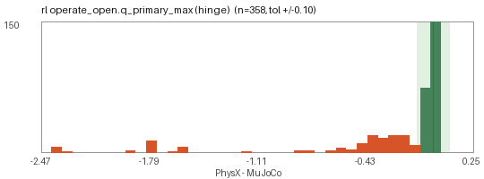

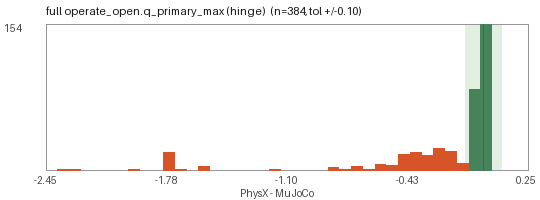

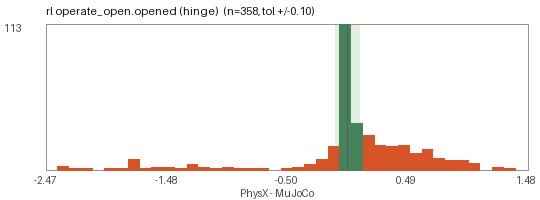

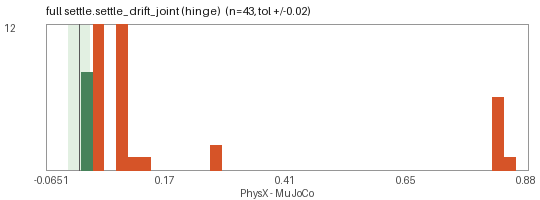

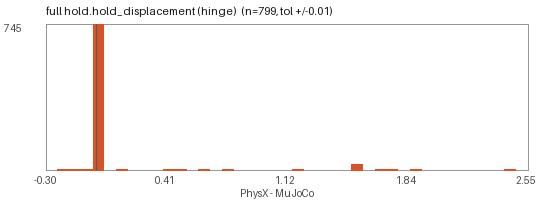

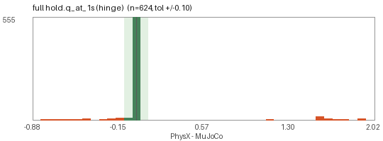

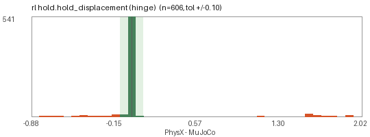

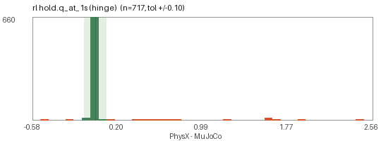

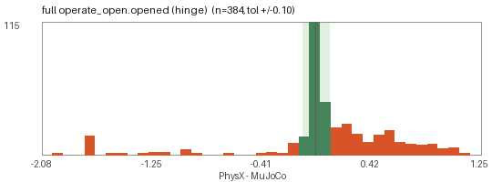

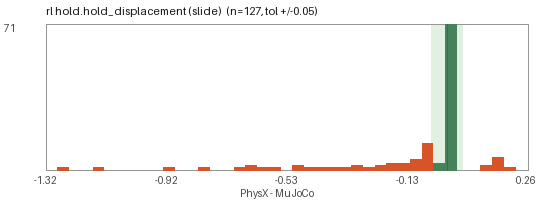

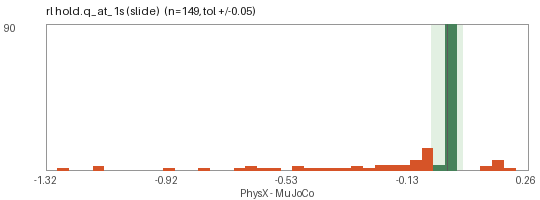

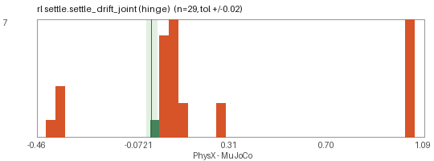

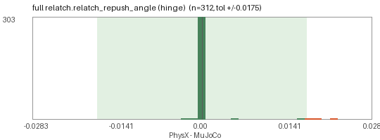

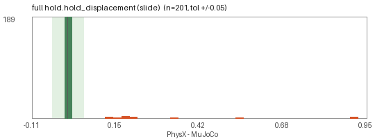

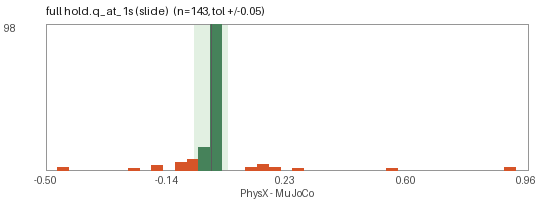


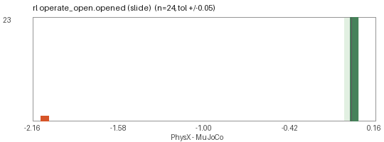

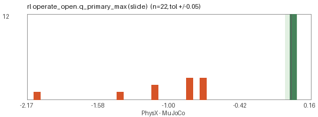

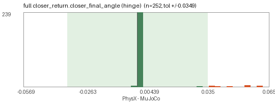

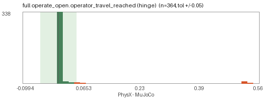

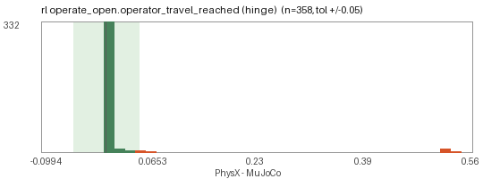

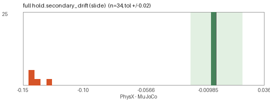

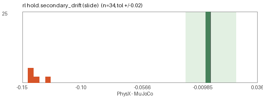

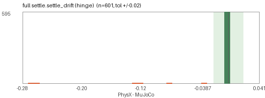

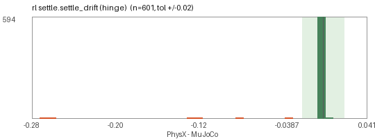

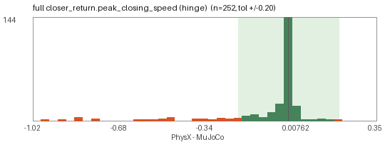

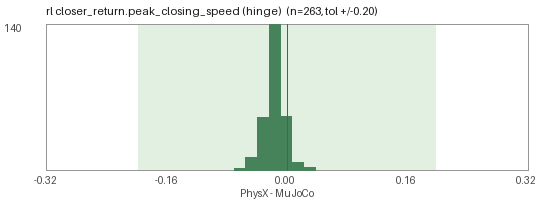

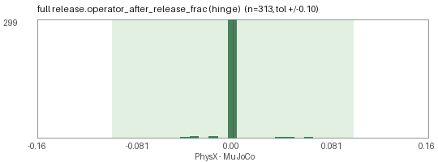

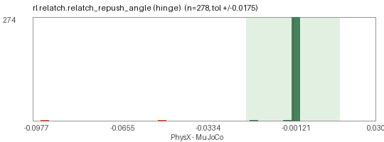

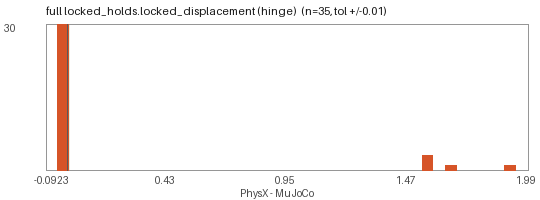

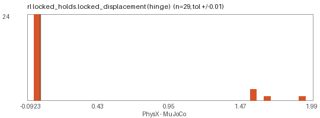

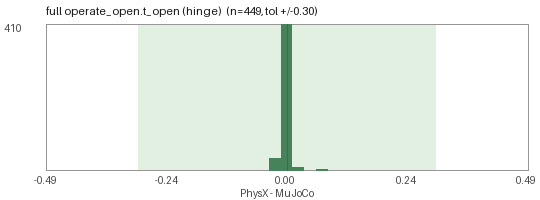

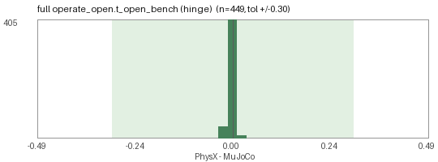

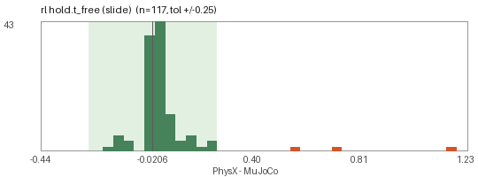

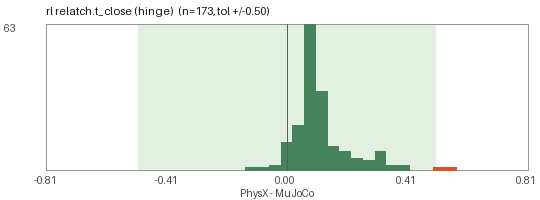

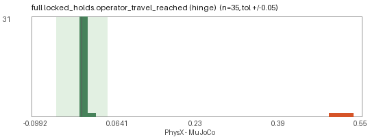

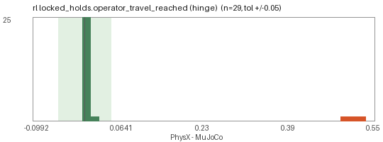

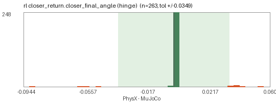

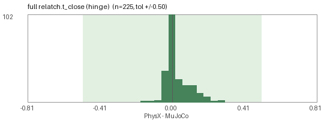

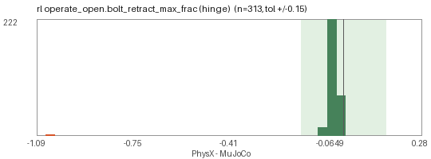

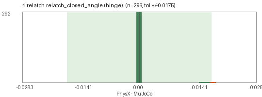

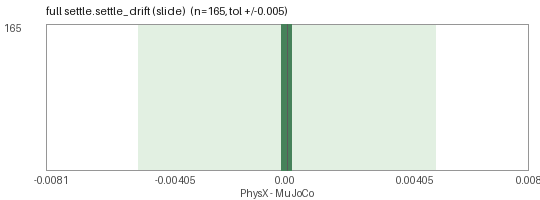

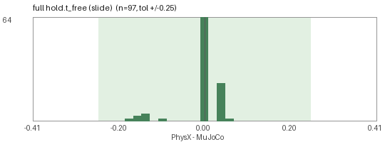

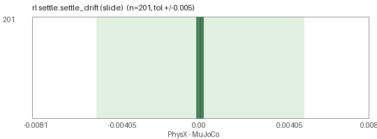

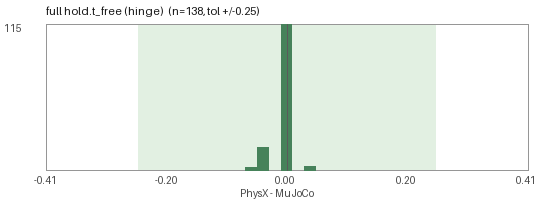

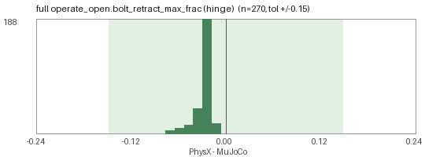

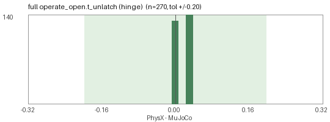

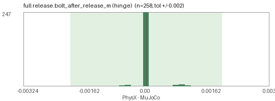

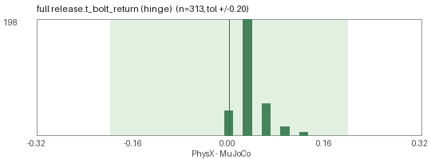

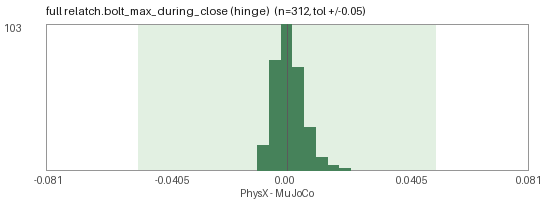


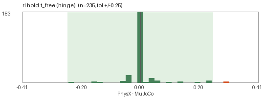


</details>

## Top offenders (20)

| door | family | grade full / rl | phase | MuJoCo | PhysX full | PhysX rl | classes | likely root cause |
|---|---|---|---|---|---|---|---|---|
| `db0334_swing_double` | swing_double | C / C | `hold` | hold_displacement=0.002866 | 1.658 (disagree) | 1.658 (disagree) | `EXPORT_WELD`, `METRICS_VERSION_SKEW` | H5: weld-type lock equalities (mag_lock / delayed_egress leaf -> world) are exported only as doorbench:couplings JSON; write_usd_rl keeps door_hinge active wit... |
| `db0413_swing_double` | swing_double | C / C | `hold` | hold_displacement=0.002976 | 1.92 (disagree) | 1.92 (disagree) | `EXPORT_WELD`, `METRICS_VERSION_SKEW` | H5: weld-type lock equalities (mag_lock / delayed_egress leaf -> world) are exported only as doorbench:couplings JSON; write_usd_rl keeps door_hinge active wit... |
| `db0534_swing_double` | swing_double | C / C | `hold` | hold_displacement=0.003278 | 1.571 (disagree) | 1.571 (disagree) | `EXPORT_WELD`, `METRICS_VERSION_SKEW` | H5: weld-type lock equalities (mag_lock / delayed_egress leaf -> world) are exported only as doorbench:couplings JSON; write_usd_rl keeps door_hinge active wit... |
| `db0702_swing_double` | swing_double | C / C | `hold` | hold_displacement=0.003719 | 1.571 (disagree) | 1.571 (disagree) | `EXPORT_WELD`, `METRICS_VERSION_SKEW` | H5: weld-type lock equalities (mag_lock / delayed_egress leaf -> world) are exported only as doorbench:couplings JSON; write_usd_rl keeps door_hinge active wit... |
| `db0733_swing_double` | swing_double | C / C | `hold` | hold_displacement=0.003324 | 1.571 (disagree) | 1.571 (disagree) | `EXPORT_WELD`, `METRICS_VERSION_SKEW` | H5: weld-type lock equalities (mag_lock / delayed_egress leaf -> world) are exported only as doorbench:couplings JSON; write_usd_rl keeps door_hinge active wit... |
| `db0792_swing_double` | swing_double | C / C | `hold` | hold_displacement=0.003315 | 1.658 (disagree) | 1.658 (disagree) | `EXPORT_WELD`, `METRICS_VERSION_SKEW`, `EXPORT_COUPLING`, `RL_CANON` | H5: weld-type lock equalities (mag_lock / delayed_egress leaf -> world) are exported only as doorbench:couplings JSON; write_usd_rl keeps door_hinge active wit... |
| `db0026_swing_single` | swing_single | C / C | `hold` | hold_displacement=1.194e-06 | 1.138 (disagree) | 1.137 (disagree) | `EXPORT_WELD`, `METRICS_VERSION_SKEW` | H5: weld-type lock equalities (mag_lock / delayed_egress leaf -> world) are exported only as doorbench:couplings JSON; write_usd_rl keeps door_hinge active wit... |
| `db0149_swing_double` | swing_double | C / C | `hold` | hold_displacement=0.004243 | 1.92 (disagree) | 1.92 (disagree) | `CONTACT_GEOMETRY`, `METRICS_VERSION_SKEW` | H7: PhysX contacts with Env prims at 0-5 mm clearance (contactOffset 5 mm), convex decomposition of hooks / strikes, self-collision disabled globally vs MuJoCo... |
| `db0158_swing_double` | swing_double | C / C | `hold` | hold_displacement=1.727e-06 | 1.571 (disagree) | 1.571 (disagree) | `EXPORT_WELD`, `METRICS_VERSION_SKEW` | H5: weld-type lock equalities (mag_lock / delayed_egress leaf -> world) are exported only as doorbench:couplings JSON; write_usd_rl keeps door_hinge active wit... |
| `db0179_vault` | vault | C / C | `operate_open` | opened=1.725 | 0.001912 (disagree) | 0.001912 (disagree) | `EXPORT_COUPLING`, `METRICS_VERSION_SKEW` | H1: the MJCF one-sided tendon (bolt_q >= scale * operator_q) is exported only as doorbench:couplings JSON / doorbench:latch_coupling; the runner must emulate i... |
| `db0216_swing_single` | swing_single | C / C | `hold` | hold_displacement=4.645e-06 | 1.78 (disagree) | 1.78 (disagree) | `EXPORT_WELD`, `METRICS_VERSION_SKEW` | H5: weld-type lock equalities (mag_lock / delayed_egress leaf -> world) are exported only as doorbench:couplings JSON; write_usd_rl keeps door_hinge active wit... |
| `db0222_swing_double` | swing_double | C / C | `hold` | hold_displacement=0.003401 | 1.571 (disagree) | 1.571 (disagree) | `CONTACT_GEOMETRY`, `METRICS_VERSION_SKEW` | H7: PhysX contacts with Env prims at 0-5 mm clearance (contactOffset 5 mm), convex decomposition of hooks / strikes, self-collision disabled globally vs MuJoCo... |
| `db0316_swing_double` | swing_double | C / C | `hold` | hold_displacement=2.281e-06 | 1.571 (disagree) | 1.571 (disagree) | `EXPORT_WELD`, `METRICS_VERSION_SKEW` | H5: weld-type lock equalities (mag_lock / delayed_egress leaf -> world) are exported only as doorbench:couplings JSON; write_usd_rl keeps door_hinge active wit... |
| `db0352_blast` | blast | C / C | `operate_open` | opened=1.7 | 0.002101 (disagree) | 0.002101 (disagree) | `EXPORT_COUPLING`, `METRICS_VERSION_SKEW` | H1: the MJCF one-sided tendon (bolt_q >= scale * operator_q) is exported only as doorbench:couplings JSON / doorbench:latch_coupling; the runner must emulate i... |
| `db0426_vault` | vault | C / C | `operate_open` | opened=1.7 | 0.002132 (disagree) | 0.002131 (disagree) | `EXPORT_COUPLING`, `METRICS_VERSION_SKEW` | H1: the MJCF one-sided tendon (bolt_q >= scale * operator_q) is exported only as doorbench:couplings JSON / doorbench:latch_coupling; the runner must emulate i... |
| `db0454_swing_double` | swing_double | C / C | `hold` | hold_displacement=0.003065 | 1.658 (disagree) | 1.658 (disagree) | `CONTACT_GEOMETRY`, `METRICS_VERSION_SKEW` | H7: PhysX contacts with Env prims at 0-5 mm clearance (contactOffset 5 mm), convex decomposition of hooks / strikes, self-collision disabled globally vs MuJoCo... |
| `db0458_vault` | vault | C / C | `operate_open` | opened=1.739 | 0.001894 (disagree) | 0.001894 (disagree) | `EXPORT_COUPLING`, `METRICS_VERSION_SKEW` | H1: the MJCF one-sided tendon (bolt_q >= scale * operator_q) is exported only as doorbench:couplings JSON / doorbench:latch_coupling; the runner must emulate i... |
| `db0577_swing_double` | swing_double | C / C | `hold` | hold_displacement=0.00314 | 1.571 (disagree) | 1.571 (disagree) | `CONTACT_GEOMETRY`, `METRICS_VERSION_SKEW` | H7: PhysX contacts with Env prims at 0-5 mm clearance (contactOffset 5 mm), convex decomposition of hooks / strikes, self-collision disabled globally vs MuJoCo... |
| `db0591_pivot` | pivot | C / C | `hold` | hold_displacement=5.598e-06 | 1.571 (disagree) | 1.571 (disagree) | `EXPORT_WELD`, `METRICS_VERSION_SKEW` | H5: weld-type lock equalities (mag_lock / delayed_egress leaf -> world) are exported only as doorbench:couplings JSON; write_usd_rl keeps door_hinge active wit... |
| `db0604_swing_double` | swing_double | C / C | `hold` | hold_displacement=0.003248 | 1.92 (disagree) | 1.92 (disagree) | `CONTACT_GEOMETRY`, `METRICS_VERSION_SKEW` | H7: PhysX contacts with Env prims at 0-5 mm clearance (contactOffset 5 mm), convex decomposition of hooks / strikes, self-collision disabled globally vs MuJoCo... |

### `db0334_swing_double` - grade C (swing_double, tubular_latch latch, deadbolt_single lock engaged, none closer)

* `full` grade C: settle agree, hold **disagree**, operate_open na, release na, relatch na, closer_return na, locked_holds **disagree**
  * hold: engaged deadbolt_single holds in MuJoCo, not in PhysX (lock constraint not exported)
  * locked_holds: locked door moved 1.658 in PhysX vs 0.002867
  * -: metrics arrival_speed, speed_at_latch not graded: mujoco 1.1 vs physx 1.0
* `rl` grade C: settle agree, hold **disagree**, operate_open na, release na, relatch na, closer_return na, locked_holds **disagree**
  * hold: engaged deadbolt_single holds in MuJoCo, not in PhysX (lock constraint not exported)
  * locked_holds: locked door moved 1.658 in PhysX vs 0.002867
  * -: metrics arrival_speed, speed_at_latch not graded: mujoco 1.1 vs physx 1.0

### `db0413_swing_double` - grade C (swing_double, tubular_latch latch, deadbolt_single lock engaged, none closer)

* `full` grade C: settle agree, hold **disagree**, operate_open na, release na, relatch na, closer_return na, locked_holds **disagree**
  * hold: engaged deadbolt_single holds in MuJoCo, not in PhysX (lock constraint not exported)
  * locked_holds: locked door moved 1.92 in PhysX vs 0.002975
  * -: metrics arrival_speed, speed_at_latch not graded: mujoco 1.1 vs physx 1.0
* `rl` grade C: settle agree, hold **disagree**, operate_open na, release na, relatch na, closer_return na, locked_holds **disagree**
  * hold: engaged deadbolt_single holds in MuJoCo, not in PhysX (lock constraint not exported)
  * locked_holds: locked door moved 1.92 in PhysX vs 0.002975
  * -: metrics arrival_speed, speed_at_latch not graded: mujoco 1.1 vs physx 1.0

### `db0534_swing_double` - grade C (swing_double, tubular_latch latch, thumbturn_only lock engaged, none closer)

* `full` grade C: settle agree, hold **disagree**, operate_open na, release na, relatch na, closer_return na, locked_holds **disagree**
  * hold: engaged thumbturn_only holds in MuJoCo, not in PhysX (lock constraint not exported)
  * locked_holds: locked door moved 1.571 in PhysX vs 0.003277
  * -: metrics arrival_speed, speed_at_latch not graded: mujoco 1.1 vs physx 1.0
* `rl` grade C: settle agree, hold **disagree**, operate_open na, release na, relatch na, closer_return na, locked_holds **disagree**
  * hold: engaged thumbturn_only holds in MuJoCo, not in PhysX (lock constraint not exported)
  * locked_holds: locked door moved 1.571 in PhysX vs 0.003277
  * -: metrics arrival_speed, speed_at_latch not graded: mujoco 1.1 vs physx 1.0

### `db0702_swing_double` - grade C (swing_double, tubular_latch latch, multipoint lock engaged, none closer)

* `full` grade C: settle agree, hold **disagree**, operate_open na, release na, relatch na, closer_return na, locked_holds **disagree**
  * hold: engaged multipoint holds in MuJoCo, not in PhysX (lock constraint not exported)
  * locked_holds: locked door moved 1.571 in PhysX vs 0.003719
  * -: metrics arrival_speed, speed_at_latch not graded: mujoco 1.1 vs physx 1.0
* `rl` grade C: settle agree, hold **disagree**, operate_open na, release na, relatch na, closer_return na, locked_holds **disagree**
  * hold: engaged multipoint holds in MuJoCo, not in PhysX (lock constraint not exported)
  * locked_holds: locked door moved 1.571 in PhysX vs 0.003719
  * -: metrics arrival_speed, speed_at_latch not graded: mujoco 1.1 vs physx 1.0

### `db0733_swing_double` - grade C (swing_double, tubular_latch latch, deadbolt_single lock engaged, none closer)

* `full` grade C: settle agree, hold **disagree**, operate_open na, release na, relatch na, closer_return na, locked_holds **disagree**
  * hold: engaged deadbolt_single holds in MuJoCo, not in PhysX (lock constraint not exported)
  * locked_holds: locked door moved 1.571 in PhysX vs 0.003324
  * -: metrics arrival_speed, speed_at_latch not graded: mujoco 1.1 vs physx 1.0
* `rl` grade C: settle agree, hold **disagree**, operate_open na, release na, relatch na, closer_return na, locked_holds **disagree**
  * hold: engaged deadbolt_single holds in MuJoCo, not in PhysX (lock constraint not exported)
  * locked_holds: locked door moved 1.571 in PhysX vs 0.003324
  * -: metrics arrival_speed, speed_at_latch not graded: mujoco 1.1 vs physx 1.0

### `db0792_swing_double` - grade C (swing_double, tubular_latch latch, deadbolt_single lock engaged, none closer)

* `full` grade C: settle agree, hold **disagree**, operate_open agree, release na, relatch na, closer_return na, locked_holds na
  * hold: engaged deadbolt_single holds in MuJoCo, not in PhysX (lock constraint not exported)
  * -: metrics arrival_speed, speed_at_latch not graded: mujoco 1.1 vs physx 1.0
* `rl` grade C: settle agree, hold **disagree**, operate_open **disagree**, release na, relatch na, closer_return na, locked_holds na
  * hold: engaged deadbolt_single holds in MuJoCo, not in PhysX (lock constraint not exported)
  * operate_open: operator moved (travel 0.96) but bolt retracted n/a of its throw; MuJoCo opened 1.454
  * -: metrics arrival_speed, speed_at_latch not graded: mujoco 1.1 vs physx 1.0
  * operate_open: operate_open agrees in door.usda but not in door_rl.usda

### `db0026_swing_single` - grade C (swing_single, none latch, mag_lock lock engaged, none closer)

* `full` grade C: settle agree, hold **disagree**, operate_open na, release na, relatch na, closer_return na, locked_holds na
  * hold: mag_lock engaged: MuJoCo weld holds (1.194e-06), PhysX opened 1.138
  * -: metrics arrival_speed, speed_at_latch not graded: mujoco 1.1 vs physx 1.0
* `rl` grade C: settle agree, hold **disagree**, operate_open na, release na, relatch na, closer_return na, locked_holds na
  * hold: mag_lock engaged: MuJoCo weld holds (1.194e-06), PhysX opened 1.137
  * -: metrics arrival_speed, speed_at_latch not graded: mujoco 1.1 vs physx 1.0

### `db0149_swing_double` - grade C (swing_double, tubular_latch latch, none lock, none closer)

* `full` grade C: settle agree, hold **disagree**, operate_open quant, release na, relatch na, closer_return na, locked_holds na
  * hold: latch (tubular_latch) holds in MuJoCo (0.004243), PhysX opened 1.92: bolt / strike contact not engaging
  * -: metrics arrival_speed, speed_at_latch not graded: mujoco 1.1 vs physx 1.0
* `rl` grade C: settle agree, hold **disagree**, operate_open quant, release na, relatch na, closer_return na, locked_holds na
  * hold: latch (tubular_latch) holds in MuJoCo (0.004243), PhysX opened 1.92: bolt / strike contact not engaging
  * -: metrics arrival_speed, speed_at_latch not graded: mujoco 1.1 vs physx 1.0

### `db0158_swing_double` - grade C (swing_double, none latch, mag_lock lock engaged, auto_operator_low_energy closer)

* `full` grade C: settle agree, hold **disagree**, operate_open na, release na, relatch na, closer_return na, locked_holds na
  * hold: mag_lock engaged: MuJoCo weld holds (1.727e-06), PhysX opened 1.571
  * -: metrics arrival_speed, speed_at_latch not graded: mujoco 1.1 vs physx 1.0
* `rl` grade C: settle agree, hold **disagree**, operate_open na, release na, relatch na, closer_return na, locked_holds na
  * hold: mag_lock engaged: MuJoCo weld holds (1.727e-06), PhysX opened 1.571
  * -: metrics arrival_speed, speed_at_latch not graded: mujoco 1.1 vs physx 1.0

### `db0179_vault` - grade C (vault, multi_bolt latch, vault_wheel lock engaged, none closer)

* `full` grade C: settle agree, hold agree, operate_open **disagree**, release na, relatch na, closer_return na, locked_holds na
  * operate_open: operator moved (travel 6.283) but bolt retracted n/a of its throw; MuJoCo opened 1.725
  * -: metrics arrival_speed, speed_at_latch not graded: mujoco 1.1 vs physx 1.0
* `rl` grade C: settle agree, hold agree, operate_open **disagree**, release na, relatch na, closer_return na, locked_holds na
  * operate_open: operator moved (travel 6.283) but bolt retracted n/a of its throw; MuJoCo opened 1.725
  * -: metrics arrival_speed, speed_at_latch not graded: mujoco 1.1 vs physx 1.0

### `db0216_swing_single` - grade C (swing_single, none latch, mag_lock lock engaged, concealed_overhead closer)

* `full` grade C: settle agree, hold **disagree**, operate_open na, release na, relatch na, closer_return na, locked_holds na
  * hold: mag_lock engaged: MuJoCo weld holds (4.645e-06), PhysX opened 1.78
  * -: metrics arrival_speed, speed_at_latch not graded: mujoco 1.1 vs physx 1.0
* `rl` grade C: settle agree, hold **disagree**, operate_open na, release na, relatch na, closer_return na, locked_holds na
  * hold: mag_lock engaged: MuJoCo weld holds (4.645e-06), PhysX opened 1.78
  * -: metrics arrival_speed, speed_at_latch not graded: mujoco 1.1 vs physx 1.0

### `db0222_swing_double` - grade C (swing_double, tubular_latch latch, none lock, none closer)

* `full` grade C: settle agree, hold **disagree**, operate_open agree, release na, relatch na, closer_return na, locked_holds na
  * hold: latch (tubular_latch) holds in MuJoCo (0.003401), PhysX opened 1.571: bolt / strike contact not engaging
  * -: metrics arrival_speed, speed_at_latch not graded: mujoco 1.1 vs physx 1.0
* `rl` grade C: settle agree, hold **disagree**, operate_open agree, release na, relatch na, closer_return na, locked_holds na
  * hold: latch (tubular_latch) holds in MuJoCo (0.003401), PhysX opened 1.571: bolt / strike contact not engaging
  * -: metrics arrival_speed, speed_at_latch not graded: mujoco 1.1 vs physx 1.0

### `db0316_swing_double` - grade C (swing_double, none latch, mag_lock lock engaged, surface_overhead closer)

* `full` grade C: settle agree, hold **disagree**, operate_open na, release na, relatch na, closer_return na, locked_holds na
  * hold: mag_lock engaged: MuJoCo weld holds (2.281e-06), PhysX opened 1.571
  * -: metrics arrival_speed, speed_at_latch not graded: mujoco 1.1 vs physx 1.0
* `rl` grade C: settle agree, hold **disagree**, operate_open na, release na, relatch na, closer_return na, locked_holds na
  * hold: mag_lock engaged: MuJoCo weld holds (2.281e-06), PhysX opened 1.571
  * -: metrics arrival_speed, speed_at_latch not graded: mujoco 1.1 vs physx 1.0

### `db0352_blast` - grade C (blast, multi_bolt latch, vault_wheel lock engaged, none closer)

* `full` grade C: settle agree, hold agree, operate_open **disagree**, release na, relatch na, closer_return na, locked_holds na
  * operate_open: operator moved (travel 6.283) but bolt retracted n/a of its throw; MuJoCo opened 1.7
  * -: metrics arrival_speed, speed_at_latch not graded: mujoco 1.1 vs physx 1.0
* `rl` grade C: settle agree, hold agree, operate_open **disagree**, release na, relatch na, closer_return na, locked_holds na
  * operate_open: operator moved (travel 6.283) but bolt retracted n/a of its throw; MuJoCo opened 1.7
  * -: metrics arrival_speed, speed_at_latch not graded: mujoco 1.1 vs physx 1.0

### `db0426_vault` - grade C (vault, multi_bolt latch, vault_wheel lock engaged, none closer)

* `full` grade C: settle agree, hold agree, operate_open **disagree**, release na, relatch na, closer_return na, locked_holds na
  * operate_open: operator moved (travel 6.283) but bolt retracted n/a of its throw; MuJoCo opened 1.7
  * -: metrics arrival_speed, speed_at_latch not graded: mujoco 1.1 vs physx 1.0
* `rl` grade C: settle agree, hold agree, operate_open **disagree**, release na, relatch na, closer_return na, locked_holds na
  * operate_open: operator moved (travel 6.283) but bolt retracted n/a of its throw; MuJoCo opened 1.7
  * -: metrics arrival_speed, speed_at_latch not graded: mujoco 1.1 vs physx 1.0

### `db0454_swing_double` - grade C (swing_double, tubular_latch latch, none lock, none closer)

* `full` grade C: settle agree, hold **disagree**, operate_open agree, release na, relatch na, closer_return na, locked_holds na
  * hold: latch (tubular_latch) holds in MuJoCo (0.003065), PhysX opened 1.658: bolt / strike contact not engaging
  * -: metrics arrival_speed, speed_at_latch not graded: mujoco 1.1 vs physx 1.0
* `rl` grade C: settle agree, hold **disagree**, operate_open agree, release na, relatch na, closer_return na, locked_holds na
  * hold: latch (tubular_latch) holds in MuJoCo (0.003065), PhysX opened 1.658: bolt / strike contact not engaging
  * -: metrics arrival_speed, speed_at_latch not graded: mujoco 1.1 vs physx 1.0

### `db0458_vault` - grade C (vault, multi_bolt latch, vault_wheel lock engaged, none closer)

* `full` grade C: settle agree, hold agree, operate_open **disagree**, release na, relatch na, closer_return na, locked_holds na
  * operate_open: operator moved (travel 6.283) but bolt retracted n/a of its throw; MuJoCo opened 1.739
  * -: metrics arrival_speed, speed_at_latch not graded: mujoco 1.1 vs physx 1.0
* `rl` grade C: settle agree, hold agree, operate_open **disagree**, release na, relatch na, closer_return na, locked_holds na
  * operate_open: operator moved (travel 6.283) but bolt retracted n/a of its throw; MuJoCo opened 1.739
  * -: metrics arrival_speed, speed_at_latch not graded: mujoco 1.1 vs physx 1.0

### `db0577_swing_double` - grade C (swing_double, tubular_latch latch, none lock, none closer)

* `full` grade C: settle agree, hold **disagree**, operate_open agree, release na, relatch na, closer_return na, locked_holds na
  * hold: latch (tubular_latch) holds in MuJoCo (0.00314), PhysX opened 1.571: bolt / strike contact not engaging
  * -: metrics arrival_speed, speed_at_latch not graded: mujoco 1.1 vs physx 1.0
* `rl` grade C: settle agree, hold **disagree**, operate_open agree, release na, relatch na, closer_return na, locked_holds na
  * hold: latch (tubular_latch) holds in MuJoCo (0.00314), PhysX opened 1.571: bolt / strike contact not engaging
  * -: metrics arrival_speed, speed_at_latch not graded: mujoco 1.1 vs physx 1.0

### `db0591_pivot` - grade C (pivot, none latch, mag_lock lock engaged, floor_spring closer)

* `full` grade C: settle agree, hold **disagree**, operate_open na, release na, relatch na, closer_return na, locked_holds na
  * hold: mag_lock engaged: MuJoCo weld holds (5.598e-06), PhysX opened 1.571
  * -: metrics arrival_speed, speed_at_latch not graded: mujoco 1.1 vs physx 1.0
* `rl` grade C: settle agree, hold **disagree**, operate_open na, release na, relatch na, closer_return na, locked_holds na
  * hold: mag_lock engaged: MuJoCo weld holds (5.598e-06), PhysX opened 1.571
  * -: metrics arrival_speed, speed_at_latch not graded: mujoco 1.1 vs physx 1.0

### `db0604_swing_double` - grade C (swing_double, tubular_latch latch, none lock, none closer)

* `full` grade C: settle agree, hold **disagree**, operate_open agree, release na, relatch na, closer_return na, locked_holds na
  * hold: latch (tubular_latch) holds in MuJoCo (0.003248), PhysX opened 1.92: bolt / strike contact not engaging
  * -: metrics arrival_speed, speed_at_latch not graded: mujoco 1.1 vs physx 1.0
* `rl` grade C: settle agree, hold **disagree**, operate_open agree, release na, relatch na, closer_return na, locked_holds na
  * hold: latch (tubular_latch) holds in MuJoCo (0.003248), PhysX opened 1.92: bolt / strike contact not engaging
  * -: metrics arrival_speed, speed_at_latch not graded: mujoco 1.1 vs physx 1.0

## Known not-comparable categories

* **Env-release locks** (mag lock, delayed egress, card reader, electric strike, interlock): MuJoCo holds them with a `<weld>` that has no PhysX counterpart; the runner emulates the hold or marks the phase `na_env_logic`. A door that *opens* here in PhysX is class `EXPORT_WELD`.
* **Panic doors with the robot outside and no far-side trim**: `operator_joint` is None, the exit device is welded in `door_rl.usda`; both simulators must *hold*.
* **Welded releases in `door_rl.usda`** (thumbturns, aux bolts, extra dogs): the RL expectation for `operate_open` flips to 'stays closed'; a `full` / `rl` disagreement there is `RL_CANON`.
* **Free-swing families** (saloon, bifold, accordion, bypass, pet door, strip curtain, revolving, turnstiles): no qa.py behavioural check exists, so their MuJoCo reference is itself unvalidated; their push phase is informational.
* **Closer-arm loop closures** (`connect` equalities) are not exported: the pinion / elbow joints swing freely in `door.usda` and are excluded from the limit check.

## Reproduce

```bash
# 1. run the shared protocol (doorbench/parity/protocol.py) in MuJoCo on the CPU and in Isaac Sim on the GPU pod:
#    -> results/parity/mujoco.json, results/parity/isaac_full.json, results/parity/isaac_rl.json
#    (optional sensitivity reruns: results/parity/isaac_<kind>_<variant>.json, e.g. isaac_full_dt240.json)
# 2. join, classify, render this page + summary.json (no simulator needed)
PYTHONPATH=$PWD python scripts/isaaclab/parity_report.py            # --results DIR --top N --no-plots
# 3. publish per door: qa.json isaac_parity + manifest badge (idempotent; --check for CI)
PYTHONPATH=$PWD python scripts/merge_isaac_results.py
# legacy: render from the 40-door probe instead of protocol results
PYTHONPATH=$PWD python scripts/isaaclab/probe_to_parity.py && PYTHONPATH=$PWD python scripts/isaaclab/parity_report.py --results results/parity/probe
```
