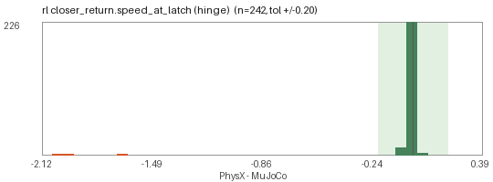
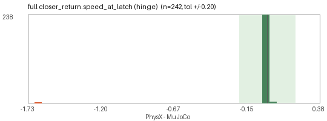
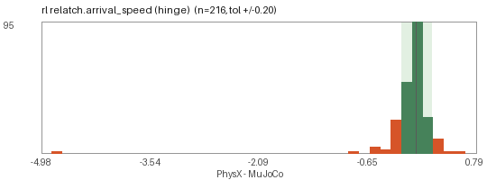
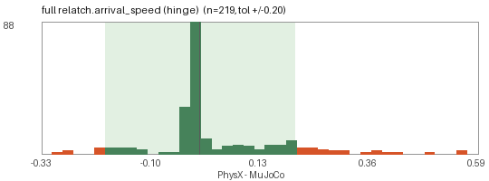

# Isaac parity gate

_Report generated 2026-09-05T14:24:14 by `scripts/isaaclab/parity_report.py` from `results/parity/`, repository commit `3b3acd3f2`. Dataset: 1000 doors, manifest version `0.1.0` generated 2026-09-05T10:59:30, reference run commit `399e957ce`._

### Which runs this page compares

| run | file | doors | engine | dt | protocol / metrics | generated |
|---|---|---|---|---|---|---|
| MuJoCo reference | `results/parity/mujoco.json` | 1000 | mujoco `3.12.0` | 0.002 | 1.0 / 1.1 | 2026-09-05T10:49:43 |
| PhysX `full` | `results/parity/isaac_full.json` | 1000 | isaac_sim `5.1.0.0`, isaac_lab `0.54.2`, python `3.11.15`, torch `2.7.0+cu128`, physx_dt `0.008333333333333333` | 0.008333333... | 1.0 / 1.1 | 2026-09-05T21:23:16 |
| PhysX `rl` | `results/parity/isaac_rl.json` | 1000 | isaac_sim `5.1.0.0`, isaac_lab `0.54.2`, python `3.11.15`, torch `2.7.0+cu128`, physx_dt `0.008333333333333333` | 0.008333333... | 1.0 / 1.1 | 2026-09-05T20:57:31 |

> **Not comparable, and not counted as agreement.**
> * `full`: **93 doors** entered the relatch phase at different angles in the two runs (it continues from operate, where a leaf that coasts into its stop rebounds in MuJoCo and not in PhysX), so its *timing* metrics (`arrival_speed`, `t_close`) measure two different experiments and are not graded. The phase's verdict metrics - `relatch_closed_angle` and `relatch_repush_angle`, both end states - are graded as usual.
> * `rl`: **80 doors** entered the relatch phase at different angles in the two runs (it continues from operate, where a leaf that coasts into its stop rebounds in MuJoCo and not in PhysX), so its *timing* metrics (`arrival_speed`, `t_close`) measure two different experiments and are not graded. The phase's verdict metrics - `relatch_closed_angle` and `relatch_repush_angle`, both end states - are graded as usual.


Every door runs **one behavioural protocol** in MuJoCo (the reference physics, CPU) and in Isaac Sim / PhysX on the GPU pod, on both USD kinds (`door.usda` full fidelity, `door_rl.usda` canonical 8-link). The two runs are compared phase by phase: both simulators must reach the same pass / fail verdict (else grade **C**), and when they agree the metrics must be within tolerance (else grade **B**); **A** is parity, **X** means the door could not be compared (spawn / structure error). A disagreement is tagged with a discrepancy class whose likely root cause comes from the analysis of the first 40-door probe. The per-door verdict is published in `qa.json` (`isaac_parity`) and as a badge in the viewer.

## Headline

| USD kind | compared | parity (A) | same verdicts (A + B) | disagree (C) | not comparable (X) | of which stale | untested |
|---|---|---|---|---|---|---|---|
| `full` | 1000 / 1000 | **905 / 1000** (90 % of compared) | 958 / 1000 (96 %) | 42 | 0 | 0 | 0 |
| `rl` | 1000 / 1000 | **872 / 1000** (87 % of compared) | 971 / 1000 (97 %) | 29 | 0 | 0 | 0 |

Door badge (`qa.json.isaac_parity.ok`; viewer chip *Isaac parity*): **952 ok** (grade A or B in every tested kind), **48 fail** (a status disagreement or not comparable), 0 untested.

## What the gate runs

| phase | what is compared | pass criterion (per simulator) |
|---|---|---|
| `structure` | P0 structure (joints / limits / gains / mass match model.json) | joint set, ranges (2e-3), stiffness / friction (1 %), spring target (1e-3), moving mass (20 % / 0.5 kg) |
| `pose0` | P1 pose0 (body, COM and joint-anchor frames at q0) | body origins, COMs, joint anchors within 5 mm; axes dot >= 0.999 |
| `settle` | P2 settle (1 s free, spring targets kept) | primary drift < 0.05 rad / 0.01 m, every other joint < 0.02 rad / 2 mm, no MuJoCo warnings, penetration > -12 mm |
| `hold` | P3 hold / free_opens (adaptive QA push on the door joint only) | has_holding: q < 2 deg / 15 mm under the adaptive push; else opens > 10 deg / 5 cm within 6 s |
| `operate_open` | P4 operate + open (operator, thumbturn / aux / dogs, then push) | q > min(20 deg, 0.5 max_open) / 5 cm after operator + push (chain: inside the slack window) |
| `release` | P5 release (latch bolt re-extends) | bolt < 6 mm after the operator is released |
| `relatch` | P6 relatch (close and re-push) | closed < 2 deg after 6 s closing drive, re-push < 2.5 deg |
| `closer_return` | P7 closer return from 60 deg | abs(q) < 6 deg after 12 s from 60 deg |
| `locked_holds` | P8 locked holds (operator worked + push) | q < 2 deg / 15 mm (+ chain slack) with operator worked + push |
| `limits` | P9 limits (every joint inside its range) | every limited joint inside lo - tol .. hi + tol (2 deg / 5 mm) |
| `sanity` | P10 sanity (finite, no explosion) | finite state, no velocity cap hit, no body displaced > 5 m, no MuJoCo warnings |

<details><summary>Metric tolerances (a delta passes when within either bound)</summary>

| metric | hinge (rad, s) | slide (m, s) | relative | where the bound comes from |
|---|---|---|---|---|
| `settle_drift` | 0.02 | 0.005 | - | the QA settle gate itself allows 0.05 rad / 0.01 m of drift in 1 s; the comparison bound is under half of that, so a door that would still sign off cannot disagree here |
| `settle_drift_primary` | 0.02 | 0.005 | - | as settle_drift |
| `settle_drift_operator` | 0.02 | 0.005 | - | as settle_drift |
| `settle_drift_latch` | 0.002 | 0.002 | - | 2 mm: a third of the 6 mm 'bolt has returned' threshold, so latch slop cannot be confused with a bolt that did not re-extend |
| `pen0_m` | 0.003 | 0.003 | - | 3 mm: PhysX's 5 mm contactOffset vs MuJoCo's margin-free contacts; the sign-off gate rejects anything past -12 mm |
| `hold_displacement` | 0.01 | 0.003 | - | 0.01 rad / 3 mm on a door that must stay shut: half the 2 deg / 15 mm 'held' threshold, plus the leaf's authored locked play where it has any. On a door that must swing open the quantity is q at the free-swing crossing and the q_at_1s bound applies instead |
| `t_free` | 0.25 | 0.25 | 30 % | 0.25 s / 30 %: two 30 Hz samples plus the 1 s minimum push; the crossing time of a leaf accelerating from rest is dominated by the first tenth of a rad |
| `q_at_1s` | 0.1 | 0.05 | 20 % | 0.1 rad / 5 cm, 20 %: a free leaf covers ~0.1 rad in one 30 Hz sample at its typical 3 rad/s, so this is sampling noise, not travel; the door's own locked play is added |
| `opened` | 0.1 | 0.05 | 20 % | 0.1 rad / 5 cm, 20 %: as q_at_1s. Waived when both runs coasted into the same joint stop - MuJoCo's soft limit (solreflimit 0.005) returns ~17 % of the impact velocity and PhysX's articulation limit is inelastic, so the end-of-phase angle is a rebound; q_primary_max is graded instead |
| `actuate_displacement` | 0.1 | 0.05 | 20 % | as opened |
| `t_open` | 0.3 | 0.3 | 30 % | 0.3 s / 30 %: the operator is worked from 0.6 s and the push starts at 1.2 s, so a 0.3 s spread is the width of the drive ramp, not a difference in whether the door opens |
| `t_open_bench` | 0.3 | 0.3 | 30 % | as t_open |
| `q_primary_max` | 0.1 | 0.05 | 20 % | 0.1 rad / 5 cm, 20 %: the peak the leaf reaches, which both engines must agree on even when they bounce off the stop differently |
| `t_unlatch` | 0.2 | 0.2 | - | 0.2 s: six 30 Hz samples of bolt travel |
| `operator_travel_reached` | 0.05 | 0.005 | 10 % | 10 % of the operator's own travel (the hardware table's travel, or the joint range when the MJCF authors a larger one) |
| `bolt_retract_max_frac` | 0.15 | 0.15 | - | 15 % of the throw: the latch is judged unlatched at 80 % of throw, so this cannot flip that verdict |
| `curve_rmse_primary` | 0.15 | 0.05 | - | 0.15 rad / 5 cm RMS over the operate phase: about the 0.1 rad per-sample bound sustained over the whole curve |
| `bolt_after_release_m` | 0.002 | 0.002 | - | 2 mm: a third of the 6 mm 'bolt returned' threshold |
| `t_bolt_return` | 0.2 | 0.2 | - | 0.2 s: six 30 Hz samples |
| `operator_after_release_frac` | 0.1 | 0.1 | - | 10 % of the operator travel, as operator_travel_reached |
| `relatch_closed_angle` | 0.0175 | 0.005 | - | 1 deg / 5 mm: half the 2 deg 'closed' threshold of the relatch check |
| `relatch_repush_angle` | 0.0175 | 0.005 | - | 1 deg / 5 mm: as relatch_closed_angle against the 2.5 deg re-push threshold |
| `t_close` | 0.5 | 0.5 | 30 % | 0.5 s / 30 %: the closing drive is a constant effort from rest. Not compared when the two runs entered the phase at different angles - relatch continues from operate, and a leaf that starts 0.4 rad further open must take longer |
| `arrival_speed` | 0.2 | 0.1 | 30 % | 0.2 rad/s / 0.1 m/s, 30 %: peak |v| over the 100 ms before the latch crossing (metrics 1.1). The 1.0 definition - |v| at the single sample nearest the crossing - was a sampling artefact and is never compared against 1.1 |
| `closer_final_angle` | 0.0349 | 0.01 | - | 2 deg / 1 cm: a third of the 6 deg 'closed by the closer' threshold |
| `closer_t_close` | 0.5 | 0.5 | 30 % | 0.5 s / 30 %: a 12 s phase; the closer's own sweep takes 2-6 s |
| `peak_closing_speed` | 0.2 | 0.1 | 30 % | 0.2 rad/s / 0.1 m/s, 30 %: the slam threshold of the damage model is 2-4 rad/s, so this cannot hide a slam |
| `speed_at_latch` | 0.2 | 0.1 | 30 % | as arrival_speed (same definition, same 100 ms window) |
| `curve_rmse_closer` | 0.1 | 0.05 | - | 0.1 rad / 5 cm RMS over the 12 s closer sweep |
| `locked_displacement` | 0.01 | 0.003 | - | 0.01 rad / 3 mm: half the 2 deg / 15 mm 'locked holds' threshold, plus the chain / guard slack where the lock has any |
| *(any other metric)* | 0.05 | 0.02 | 20 % | fallback for a metric with no bound of its own; every metric that decides a grade should have an entry above |
| `velocity_cap_hit_primary` | - | - | - | boolean: did the door joint leave the physical velocity range (15 rad/s / 6 m/s) in one run and not the other |
| `settle_drift_joint` | - | - | - | per joint, over the joints the USD actually has: 0.02 rad / 5 mm, the same bound as settle_drift |

</details>

**When a delta is *not* graded.** Four cases, each of which would otherwise report the comparison rather than the door. None of them loosens a bound: each one says the two numbers do not measure the same thing.

1. **The two records are not the same door** (`inputs_hash` differs): grade **X**, published as untested. The hash covers the joints, the adaptive push, the thresholds, the couplings, the schedule and the flags each runner was handed.
2. **The metric's definition changed** between the two runs (`metrics_version`, `protocol.METRIC_DEF_CHANGED_IN`): reported, not graded, until the older side is re-run. Metrics 1.1 redefined `arrival_speed` / `speed_at_latch` from *|v| at the 30 Hz sample nearest the crossing* - which reads the post-impact velocity and lands either side of a millisecond-long impact at random - to the peak |v| over the 100 ms of approach.
3. **Both runs coasted into the same joint stop**: the value at the end of the operate phase is then a rebound (MuJoCo's soft limit, `solreflimit` 5 ms, returns about 17 % of the impact velocity; PhysX's articulation limit is inelastic), so `opened` is waived and `q_primary_max` - the peak both leaves reach, and the quantity that says how far the door actually swung - is graded in its place.
4. **The phase was entered from a different state**: `relatch` continues from `operate`, so when that rebound leaves the two leaves at different angles its *timing* metrics compare two different experiments. Its verdict metrics (`relatch_closed_angle`, `relatch_repush_angle`) are end states and stay graded.

**The push the gate applies.** Both simulators drive the door joint with the sign-off QA's adaptive push: twice the static resistance at rest (gravity bias + Coulomb friction + spring preload) plus a base sized by the leaf itself - `0.5 m g W`, half the moment gravity would exert on the leaf if it lay horizontal, clamped to [2, 60] N*m for a hinge and [2, 80] N for a slide (`doorbench.qa.push_base`). A flat 60 N*m is what a person applies to a 20-100 kg door; on a 0.14-1.4 kg pet flap it is about 100x the mechanism's own scale, accelerates it at ~2000 rad/s^2 and drives it to 30-85 rad/s in MuJoCo and to a non-finite state in PhysX.

## Discrepancy classes

| class | full | rl | doors | what it means | likely root cause | fix direction | examples |
|---|---|---|---|---|---|---|---|
| `QUANT` | 54 | 113 | 103 | both simulators reach the same pass / fail verdicts but at least one metric is outside tolerance | soft MuJoCo contacts / limits (solref 0.005) vs rigid PhysX limits, constraint-based vs effort-based Coulomb friction, implicitfast vs implicit drives at high damping; solver dt | rerun at Isaac dt 1/240 (32/8 iterations) and MuJoCo dt 0.001; if the delta shrinks below tolerance tag SOLVER_SENSITIVITY, else triage by phase | `db0003_cold_storage`, `db0014_gate_swing`, `db0045_pet_door`, `db0051_swing_single` |
| `CONTACT_GEOMETRY` | 28 | 12 | 29 | the bolt retracted (or there is no bolt) yet the leaf did not move, or a latch that holds in MuJoCo does not engage in PhysX (convex hulls, strike lip, panel clearance) | H7: PhysX contacts with Env prims at 0-5 mm clearance (contactOffset 5 mm), convex decomposition of hooks / strikes. The global self-collision part is FIXED in the export: physxArticulation:enabledSelfCollisions is True and every pair MuJoCo suppresses (same weld body, weld parent/child, contact_excludes) is authored as PhysxFilteredPairsAPI, so a latch holding one moving link against another (swing pairs, lift pins, drop bolts) now touches in PhysX too | enable contact reporting; rerun with Env collision disabled, then without the hardware part, to bisect frame contact vs articulation; check the authored filtered pairs against validate_usd_static.py | `db0014_gate_swing`, `db0075_gate_swing`, `db0149_swing_double`, `db0176_baby_gate` |
| `EXPORT_WELD` | 19 | 21 | 18 | MuJoCo holds the leaf (weld / lock equality) but PhysX has nothing holding it, so the door opens under the push | H5 (FIXED in the export): weld-type lock equalities (mag_lock / delayed_egress / electric_bolt / interlock leaf -> world) used to be exported only as doorbench:couplings JSON. Both USD kinds now carry a breakable UsdPhysics.FixedJoint base -> leaf with physics:excludeFromArticulation, breakForce == breakTorque == holding_force_N and physics:jointEnabled (doorbench:env_release). A remaining occurrence means the joint is absent (stale assets) or PhysX did not parse the loop joint | regenerate the dataset; if PhysX rejects an excludeFromArticulation joint between two articulation links, fall back to --emulate-weld and report it | `db0023_sliding_single`, `db0026_swing_single`, `db0158_swing_double`, `db0216_swing_single` |
| `RL_CANON` | 0 | 7 | 7 | door.usda agrees with MuJoCo but door_rl.usda does not: a welded lock / operator / panel or an empty operator slot changes the behaviour | H4: panic doors with robot outside and no far-side trim get operator_joint None (exit device welded, latch never retracts); engaged locks with no canonical slot welded engaged; extra leaves omitted. Parts the operator retracts (revolute hooks, cremone shoot bolts, wheel-driven dogs) are welded RELEASED since the export fix, and every decision is recorded in doorbench:rl (welded / released_parts / released_holding / welded_engaged) | the RL expectation is derived from that ground truth in protocol.expected_outcomes (hold -> na when the only holding part is welded released, operate -> stays_closed when a lock part is welded engaged); a remaining RL_CANON is a documented structural limit of the 8-link articulation | `db0023_sliding_single`, `db0548_swing_single`, `db0647_sliding_single`, `db0709_gate_swing` |
| `VELOCITY_EXPLOSION` | 1 | 2 | 3 | a joint left the physical velocity range in one simulator (velocity cap hit, non-finite state) - the drift or displacement it reports is the debris, not the behaviour | rigid PhysX limits plus a heavy / stiff mechanism at 120 Hz, initial penetration, or an effort far above the mechanism's own scale | dt <= 1/240; check the initial penetration and the applied effort against the leaf's inertia (doorbench.qa.push_base) | `db0213_garage_sectional`, `db0649_sliding_bypass`, `db0927_accordion` |
| `EXPORT_COUPLING` | 0 | 2 | 2 | the operator turns but the bolt does not retract (or does not return) in PhysX, so the door stays latched | H1: the MJCF one-sided tendon (bolt_q >= scale * operator_q) is exported only as doorbench:couplings JSON / doorbench:latch_coupling; the runner must emulate it as a kinematic clamp each step (the soft target offset under-retracts by 40-60 %) | shared clamp function (write_joint_state_to_sim(max(latch_q, scale * op_q))) in the parity runner and DoorMechanismAction; read scale from doorbench:rl.latch_coupling / doorbench:latch_coupling_scale | `db0548_swing_single`, `db0792_swing_double` |

<details><summary><code>QUANT</code> - all 103 doors</summary>

`db0003_cold_storage` `db0014_gate_swing` `db0045_pet_door` `db0051_swing_single` `db0056_swing_single` `db0060_swing_single` `db0062_swing_single` `db0082_swing_single` `db0083_swing_single` `db0086_swing_single` `db0095_dutch` `db0111_swing_single` `db0114_swing_single` `db0124_vault` `db0130_automatic_sliding` `db0135_swing_single` `db0163_strip_curtain` `db0168_ship_watertight` `db0177_accordion` `db0182_swing_single` `db0203_automatic_sliding` `db0204_dutch` `db0215_accordion` `db0236_swing_single` `db0237_swing_single` `db0241_hatch_floor` `db0252_swing_single` `db0263_swing_single` `db0285_ship_watertight` `db0288_blast` `db0292_accordion` `db0304_swing_single` `db0311_swing_single` `db0317_swing_single` `db0323_automatic_sliding` `db0327_swing_single` `db0330_swing_single` `db0350_strip_curtain` `db0366_gate_swing` `db0381_accordion` `db0384_ship_watertight` `db0389_hatch_ceiling` `db0406_strip_curtain` `db0408_swing_single` `db0422_swing_single` `db0432_cold_storage` `db0474_automatic_sliding` `db0485_swing_single` `db0507_cold_storage` `db0508_swing_single` `db0514_automatic_sliding` `db0530_vault` `db0533_accordion` `db0537_pet_door` `db0561_swing_single` `db0571_swing_single` `db0582_swing_single` `db0599_swing_single` `db0610_swing_single` `db0611_automatic_sliding` `db0614_swing_double` `db0623_blast` `db0628_strip_curtain` `db0641_strip_curtain` `db0664_swing_single` `db0672_blast` `db0674_ship_watertight` `db0687_strip_curtain` `db0699_swing_single` `db0700_dutch` `db0719_swing_single` `db0736_swing_single` `db0745_swing_single` `db0764_automatic_sliding` `db0767_swing_single` `db0770_automatic_sliding` `db0772_blast` `db0789_swing_single` `db0803_swing_single` `db0812_swing_single` `db0814_swing_single` `db0836_swing_single` `db0837_swing_single` `db0842_swing_single` `db0850_swing_single` `db0851_gate_swing` `db0852_cold_storage` `db0868_swing_single` `db0876_swing_single` `db0877_gate_swing` `db0882_swing_single` `db0883_swing_single` `db0889_swing_single` `db0894_cold_storage` `db0898_ship_watertight` `db0906_dutch` `db0911_ship_watertight` `db0948_swing_single` `db0952_accordion` `db0955_swing_single` `db0960_blast` `db0984_swing_single` `db0990_automatic_sliding`

</details>

<details><summary><code>CONTACT_GEOMETRY</code> - all 29 doors</summary>

`db0014_gate_swing` `db0075_gate_swing` `db0149_swing_double` `db0176_baby_gate` `db0222_swing_double` `db0287_gate_swing` `db0332_baby_gate` `db0336_baby_gate` `db0454_swing_double` `db0483_baby_gate` `db0505_baby_gate` `db0540_gate_swing` `db0577_swing_double` `db0604_swing_double` `db0661_baby_gate` `db0675_baby_gate` `db0682_swing_double` `db0698_baby_gate` `db0709_gate_swing` `db0714_swing_double` `db0832_swing_double` `db0844_baby_gate` `db0853_baby_gate` `db0854_gate_swing` `db0877_gate_swing` `db0929_swing_double` `db0930_sliding_single` `db0944_swing_double` `db0963_swing_double`

</details>

<details><summary><code>EXPORT_WELD</code> - all 18 doors</summary>

`db0023_sliding_single` `db0026_swing_single` `db0158_swing_double` `db0216_swing_single` `db0316_swing_double` `db0334_swing_double` `db0413_swing_double` `db0448_sliding_single` `db0534_swing_double` `db0591_pivot` `db0597_sliding_single` `db0647_sliding_single` `db0702_swing_double` `db0733_swing_double` `db0792_swing_double` `db0893_sliding_single` `db0897_swing_single` `db0950_sliding_single`

</details>

<details><summary><code>RL_CANON</code> - all 7 doors</summary>

`db0023_sliding_single` `db0548_swing_single` `db0647_sliding_single` `db0709_gate_swing` `db0792_swing_double` `db0893_sliding_single` `db0950_sliding_single`

</details>

<details><summary><code>VELOCITY_EXPLOSION</code> - all 3 doors</summary>

`db0213_garage_sectional` `db0649_sliding_bypass` `db0927_accordion`

</details>

<details><summary><code>EXPORT_COUPLING</code> - all 2 doors</summary>

`db0548_swing_single` `db0792_swing_double`

</details>

## By family

| family | doors | compared | stale | ok | fail | full A / A+B | rl A / A+B | most frequent classes |
|---|---|---|---|---|---|---|---|---|
| accordion | 12 | 12 | 0 | 12 | 0 | 11 / 12 | 6 / 12 | VELOCITY_EXPLOSION x1 |
| automatic_sliding | 15 | 15 | 0 | 15 | 0 | 6 / 15 | 6 / 15 | - |
| automatic_swing | 10 | 10 | 0 | 10 | 0 | 10 / 10 | 10 / 10 | - |
| baby_gate | 10 | 10 | 0 | 0 | 10 | 0 / 0 | 10 / 10 | CONTACT_GEOMETRY x10 |
| bifold | 30 | 30 | 0 | 30 | 0 | 30 / 30 | 30 / 30 | - |
| blast | 6 | 6 | 0 | 6 | 0 | 6 / 6 | 1 / 6 | - |
| cold_storage | 15 | 15 | 0 | 15 | 0 | 10 / 15 | 10 / 15 | - |
| dutch | 12 | 12 | 0 | 12 | 0 | 8 / 12 | 8 / 12 | - |
| elevator | 8 | 8 | 0 | 8 | 0 | 8 / 8 | 8 / 8 | - |
| garage_sectional | 18 | 18 | 0 | 18 | 0 | 18 / 18 | 17 / 18 | VELOCITY_EXPLOSION x1 |
| garage_tiltup | 7 | 7 | 0 | 7 | 0 | 7 / 7 | 7 / 7 | - |
| gate_sliding | 10 | 10 | 0 | 10 | 0 | 10 / 10 | 10 / 10 | - |
| gate_swing | 40 | 40 | 0 | 33 | 7 | 34 / 34 | 35 / 39 | CONTACT_GEOMETRY x7, RL_CANON x1 |
| hatch_ceiling | 8 | 8 | 0 | 8 | 0 | 8 / 8 | 7 / 8 | - |
| hatch_floor | 10 | 10 | 0 | 10 | 0 | 10 / 10 | 9 / 10 | - |
| pet_door | 15 | 15 | 0 | 15 | 0 | 15 / 15 | 13 / 15 | - |
| pivot | 20 | 20 | 0 | 19 | 1 | 19 / 19 | 19 / 19 | EXPORT_WELD x1 |
| revolving | 15 | 15 | 0 | 15 | 0 | 15 / 15 | 15 / 15 | - |
| rollup | 15 | 15 | 0 | 15 | 0 | 15 / 15 | 15 / 15 | - |
| saloon | 12 | 12 | 0 | 12 | 0 | 12 / 12 | 12 / 12 | - |
| ship_watertight | 10 | 10 | 0 | 10 | 0 | 10 / 10 | 4 / 10 | - |
| sliding_bypass | 35 | 35 | 0 | 35 | 0 | 35 / 35 | 34 / 35 | VELOCITY_EXPLOSION x1 |
| sliding_single | 100 | 100 | 0 | 93 | 7 | 97 / 97 | 96 / 96 | EXPORT_WELD x6, RL_CANON x4, CONTACT_GEOMETRY x1 |
| stall | 15 | 15 | 0 | 15 | 0 | 15 / 15 | 15 / 15 | - |
| strip_curtain | 8 | 8 | 0 | 8 | 0 | 2 / 8 | 2 / 8 | - |
| swing_double | 76 | 76 | 0 | 57 | 19 | 57 / 57 | 56 / 57 | CONTACT_GEOMETRY x11, EXPORT_WELD x8, EXPORT_COUPLING x1 |
| swing_single | 440 | 440 | 0 | 436 | 4 | 409 / 437 | 391 / 436 | EXPORT_WELD x3, EXPORT_COUPLING x1, RL_CANON x1 |
| turnstile_fullheight | 10 | 10 | 0 | 10 | 0 | 10 / 10 | 10 / 10 | - |
| turnstile_tripod | 10 | 10 | 0 | 10 | 0 | 10 / 10 | 10 / 10 | - |
| vault | 8 | 8 | 0 | 8 | 0 | 8 / 8 | 6 / 8 | - |

## By hardware

### latch kind

| kind | compared | stale | ok | fail | full A / A+B | rl A / A+B | most frequent classes |
|---|---|---|---|---|---|---|---|
| deadlatch | 88 | 0 | 88 | 0 | 83 / 88 | 78 / 88 | - |
| dogs | 17 | 0 | 17 | 0 | 17 / 17 | 4 / 17 | - |
| electric_bolt | 11 | 0 | 8 | 3 | 8 / 8 | 11 / 11 | EXPORT_WELD x2, CONTACT_GEOMETRY x1 |
| gravity_bar | 30 | 0 | 30 | 0 | 30 / 30 | 28 / 30 | - |
| hook | 31 | 0 | 15 | 16 | 15 / 15 | 29 / 31 | CONTACT_GEOMETRY x16 |
| magnetic | 41 | 0 | 41 | 0 | 40 / 41 | 35 / 41 | VELOCITY_EXPLOSION x1 |
| mortise_latch | 74 | 0 | 73 | 1 | 70 / 74 | 66 / 73 | CONTACT_GEOMETRY x1, RL_CANON x1 |
| multi_bolt | 7 | 0 | 7 | 0 | 7 / 7 | 7 / 7 | - |
| none | 377 | 0 | 367 | 10 | 355 / 371 | 348 / 367 | EXPORT_WELD x10, RL_CANON x4, VELOCITY_EXPLOSION x2 |
| rim_latch | 42 | 0 | 41 | 1 | 42 / 42 | 38 / 41 | EXPORT_COUPLING x1, RL_CANON x1 |
| roller | 8 | 0 | 8 | 0 | 3 / 8 | 3 / 8 | - |
| slide_bolt | 30 | 0 | 30 | 0 | 30 / 30 | 28 / 30 | - |
| tubular_latch | 213 | 0 | 196 | 17 | 174 / 196 | 166 / 196 | CONTACT_GEOMETRY x11, EXPORT_WELD x6, EXPORT_COUPLING x1 |
| vertical_rods | 31 | 0 | 31 | 0 | 31 / 31 | 31 / 31 | - |

### lock kind

| kind | compared | stale | ok | fail | full A / A+B | rl A / A+B | most frequent classes |
|---|---|---|---|---|---|---|---|
| card_reader | 20 | 0 | 20 | 0 | 20 / 20 | 20 / 20 | - |
| chain | 4 | 0 | 4 | 0 | 4 / 4 | 4 / 4 | - |
| child_lock_cover | 8 | 0 | 8 | 0 | 8 / 8 | 8 / 8 | - |
| deadbolt_double | 6 | 0 | 5 | 1 | 4 / 6 | 3 / 5 | CONTACT_GEOMETRY x1, RL_CANON x1 |
| deadbolt_single | 32 | 0 | 26 | 6 | 24 / 26 | 23 / 26 | EXPORT_WELD x4, CONTACT_GEOMETRY x2, EXPORT_COUPLING x1 |
| delayed_egress | 16 | 0 | 16 | 0 | 16 / 16 | 16 / 16 | - |
| dogs | 17 | 0 | 17 | 0 | 17 / 17 | 4 / 17 | - |
| electric_strike | 23 | 0 | 23 | 0 | 19 / 23 | 20 / 23 | - |
| hook_lock | 28 | 0 | 24 | 4 | 28 / 28 | 24 / 24 | EXPORT_WELD x4, RL_CANON x4 |
| interlock | 8 | 0 | 8 | 0 | 8 / 8 | 8 / 8 | - |
| jam_stuck | 12 | 0 | 12 | 0 | 9 / 12 | 10 / 12 | - |
| keyed_cylinder | 26 | 0 | 24 | 2 | 24 / 24 | 25 / 26 | EXPORT_WELD x2 |
| keypad_code | 28 | 0 | 28 | 0 | 28 / 28 | 21 / 28 | - |
| mag_lock | 47 | 0 | 41 | 6 | 41 / 41 | 40 / 41 | EXPORT_WELD x6 |
| multipoint | 7 | 0 | 6 | 1 | 4 / 6 | 3 / 6 | EXPORT_WELD x1 |
| night_latch | 4 | 0 | 4 | 0 | 4 / 4 | 1 / 4 | - |
| none | 544 | 0 | 519 | 25 | 486 / 520 | 492 / 536 | CONTACT_GEOMETRY x24, VELOCITY_EXPLOSION x2, EXPORT_COUPLING x1 |
| padlock | 40 | 0 | 40 | 0 | 37 / 40 | 36 / 40 | - |
| privacy_button | 43 | 0 | 43 | 0 | 42 / 43 | 40 / 43 | - |
| slide_bolt | 54 | 0 | 54 | 0 | 54 / 54 | 46 / 54 | VELOCITY_EXPLOSION x1 |
| swing_bar_guard | 2 | 0 | 2 | 0 | 2 / 2 | 2 / 2 | - |
| thumbturn_only | 24 | 0 | 21 | 3 | 19 / 21 | 19 / 21 | CONTACT_GEOMETRY x2, EXPORT_WELD x1 |
| vault_wheel | 7 | 0 | 7 | 0 | 7 / 7 | 7 / 7 | - |

### closer kind

| kind | compared | stale | ok | fail | full A / A+B | rl A / A+B | most frequent classes |
|---|---|---|---|---|---|---|---|
| auto_operator_full | 4 | 0 | 4 | 0 | 4 / 4 | 4 / 4 | - |
| auto_operator_low_energy | 11 | 0 | 10 | 1 | 10 / 10 | 10 / 10 | EXPORT_WELD x1 |
| concealed_overhead | 21 | 0 | 19 | 2 | 19 / 19 | 19 / 19 | EXPORT_WELD x2 |
| electromagnetic_hold | 13 | 0 | 13 | 0 | 13 / 13 | 13 / 13 | - |
| floor_spring | 28 | 0 | 27 | 1 | 27 / 27 | 27 / 27 | EXPORT_WELD x1 |
| gas_strut | 8 | 0 | 8 | 0 | 8 / 8 | 6 / 8 | - |
| gate | 22 | 0 | 10 | 12 | 11 / 11 | 17 / 21 | CONTACT_GEOMETRY x12, RL_CANON x1 |
| none | 667 | 0 | 637 | 30 | 600 / 641 | 569 / 645 | CONTACT_GEOMETRY x17, EXPORT_WELD x13, RL_CANON x5 |
| pneumatic | 6 | 0 | 6 | 0 | 6 / 6 | 6 / 6 | - |
| spring_hinge | 37 | 0 | 37 | 0 | 29 / 37 | 27 / 37 | - |
| surface_overhead | 183 | 0 | 181 | 2 | 178 / 182 | 174 / 181 | EXPORT_WELD x1, EXPORT_COUPLING x1, RL_CANON x1 |

### operator kind

| kind | compared | stale | ok | fail | full A / A+B | rl A / A+B | most frequent classes |
|---|---|---|---|---|---|---|---|
| card_lever | 20 | 0 | 20 | 0 | 20 / 20 | 20 / 20 | - |
| cremone | 3 | 0 | 3 | 0 | 3 / 3 | 3 / 3 | - |
| flush_pull | 72 | 0 | 70 | 2 | 72 / 72 | 67 / 70 | EXPORT_WELD x2, RL_CANON x2, VELOCITY_EXPLOSION x1 |
| gate_latch_fork | 12 | 0 | 12 | 0 | 12 / 12 | 12 / 12 | - |
| handleset | 13 | 0 | 10 | 3 | 0 / 10 | 0 / 10 | CONTACT_GEOMETRY x2, EXPORT_WELD x1 |
| hasp | 9 | 0 | 9 | 0 | 8 / 9 | 9 / 9 | - |
| hook_lock_slider | 15 | 0 | 15 | 0 | 15 / 15 | 15 / 15 | - |
| keypad_deadbolt | 9 | 0 | 9 | 0 | 9 / 9 | 4 / 9 | - |
| keypad_lever | 19 | 0 | 19 | 0 | 19 / 19 | 17 / 19 | - |
| knob | 135 | 0 | 132 | 3 | 126 / 132 | 125 / 132 | CONTACT_GEOMETRY x3 |
| lever | 217 | 0 | 205 | 12 | 186 / 206 | 163 / 205 | CONTACT_GEOMETRY x7, EXPORT_WELD x5, RL_CANON x2 |
| lift_latch | 16 | 0 | 0 | 16 | 0 / 0 | 14 / 16 | CONTACT_GEOMETRY x16 |
| none | 102 | 0 | 101 | 1 | 86 / 101 | 85 / 102 | CONTACT_GEOMETRY x1 |
| paddle | 11 | 0 | 10 | 1 | 10 / 10 | 10 / 10 | EXPORT_WELD x1 |
| panic_crossbar | 6 | 0 | 6 | 0 | 6 / 6 | 4 / 6 | - |
| panic_touchbar | 73 | 0 | 72 | 1 | 73 / 73 | 71 / 72 | EXPORT_COUPLING x1, RL_CANON x1 |
| pull | 156 | 0 | 148 | 8 | 149 / 150 | 147 / 150 | EXPORT_WELD x8, RL_CANON x2, VELOCITY_EXPLOSION x1 |
| push_button_screen | 7 | 0 | 7 | 0 | 7 / 7 | 7 / 7 | - |
| push_plate | 24 | 0 | 23 | 1 | 23 / 23 | 23 / 23 | EXPORT_WELD x1 |
| ring_pull | 29 | 0 | 29 | 0 | 29 / 29 | 27 / 29 | - |
| slide_bolt_handle | 19 | 0 | 19 | 0 | 19 / 19 | 19 / 19 | - |
| t_handle | 10 | 0 | 10 | 0 | 10 / 10 | 9 / 10 | VELOCITY_EXPLOSION x1 |
| thumb_latch | 12 | 0 | 12 | 0 | 12 / 12 | 10 / 12 | - |
| wheel | 11 | 0 | 11 | 0 | 11 / 11 | 11 / 11 | - |

## By kinematics

| kinematics | compared | stale | ok | fail | full A / A+B | rl A / A+B | most frequent classes |
|---|---|---|---|---|---|---|---|
| hinge_horizontal | 48 | 0 | 48 | 0 | 42 / 48 | 38 / 48 | - |
| hinge_vertical | 716 | 0 | 675 | 41 | 639 / 677 | 613 / 691 | CONTACT_GEOMETRY x28, EXPORT_WELD x12, RL_CANON x3 |
| rotor | 35 | 0 | 35 | 0 | 35 / 35 | 35 / 35 | - |
| slide_horizontal | 168 | 0 | 161 | 7 | 156 / 165 | 154 / 164 | EXPORT_WELD x6, RL_CANON x4, VELOCITY_EXPLOSION x1 |
| slide_vertical | 33 | 0 | 33 | 0 | 33 / 33 | 32 / 33 | VELOCITY_EXPLOSION x1 |

## Metric deltas

Every graded metric, per USD kind and phase: how far apart the two simulators are, against the bound. `median |delta|` and `p95 |delta|` are over the doors where the metric exists in both runs; `outside tol` is how many of them decide a grade **B**. A metric whose deltas pile up inside the band is solver noise; one whose deltas are spread far wider is a behavioural difference the class table should already name.

| kind | phase | metric | unit | n | median \|delta\| | p95 \|delta\| | tol | outside tol | worst door |
|---|---|---|---|---|---|---|---|---|---|
| `full` | `hold` | `hold_displacement` | hinge | 799 | 0.0001581 | 0.7804 | 0.01 | 45 | `db0897_swing_single` (2.443) |
| `full` | `hold` | `q_at_1s` | hinge | 799 | 0.0001579 | 0.7804 | 0.1 | 45 | `db0897_swing_single` (2.443) |
| `rl` | `hold` | `hold_displacement` | hinge | 748 | 0.0001599 | 0.2038 | 0.01 | 37 | `db0216_swing_single` (2.443) |
| `rl` | `hold` | `q_at_1s` | hinge | 748 | 0.0001594 | 0.2038 | 0.1 | 37 | `db0216_swing_single` (2.443) |
| `rl` | `operate_open` | `opened` | hinge | 435 | 0.09538 | 1.271 | 0.1 | 34 | `db0674_ship_watertight` (-2.322) |
| `rl` | `operate_open` | `q_primary_max` | hinge | 435 | 0.007835 | 1.742 | 0.1 | 31 | `db0384_ship_watertight` (-2.368) |
| `rl` | `settle` | `settle_drift_joint` | hinge | 22 | 0.09745 | 0.229 | 0.02 | 22 | `db0124_vault` (0.2315) |
| `full` | `settle` | `settle_drift_joint` | hinge | 16 | 0.09755 | 0.09913 | 0.02 | 16 | `db0237_swing_single` (0.09913) |
| `rl` | `hold` | `hold_displacement` | slide | 183 | 2.207e-05 | 0.1786 | 0.05 | 13 | `db0950_sliding_single` (1.099) |
| `rl` | `hold` | `q_at_1s` | slide | 183 | 2.207e-05 | 0.1786 | 0.05 | 13 | `db0950_sliding_single` (1.099) |
| `full` | `hold` | `hold_displacement` | slide | 201 | 1.978e-05 | 0.1344 | 0.05 | 12 | `db0597_sliding_single` (0.9099) |
| `full` | `hold` | `q_at_1s` | slide | 201 | 1.978e-05 | 0.1344 | 0.05 | 12 | `db0597_sliding_single` (0.9099) |
| `rl` | `closer_return` | `closer_final_angle` | hinge | 263 | 3.367e-05 | 0.003536 | 0.03491 | 12 | `db0851_gate_swing` (-0.08867) |
| `full` | `operate_open` | `operator_travel_reached` | hinge | 451 | 0.0002368 | 0.0343 | 0.05 | 9 | `db0836_swing_single` (0.5349) |
| `rl` | `operate_open` | `operator_travel_reached` | hinge | 435 | 0.0002335 | 0.0343 | 0.05 | 9 | `db0836_swing_single` (0.5349) |
| `full` | `hold` | `secondary_drift` | slide | 49 | 3.126e-15 | 0.1423 | 0.02 | 9 | `db0474_automatic_sliding` (-0.1433) |
| `rl` | `hold` | `secondary_drift` | slide | 49 | 1.586e-17 | 0.1423 | 0.02 | 9 | `db0474_automatic_sliding` (-0.1433) |
| `full` | `closer_return` | `closer_final_angle` | hinge | 263 | 3.292e-05 | 0.0001138 | 0.03491 | 8 | `db0014_gate_swing` (-0.05859) |
| `rl` | `relatch` | `relatch_repush_angle` | hinge | 296 | 0.0001619 | 0.0002732 | 0.01745 | 7 | `db0709_gate_swing` (1.569) |
| `rl` | `release` | `operator_after_release_frac` | hinge | 297 | 6.411e-05 | 0.003442 | 0.1 | 5 | `db0852_cold_storage` (0.1726) |
| `full` | `locked_holds` | `locked_displacement` | hinge | 35 | 0.0001668 | 1.655 | 0.01 | 5 | `db0413_swing_double` (1.917) |
| `rl` | `locked_holds` | `locked_displacement` | hinge | 35 | 0.0001668 | 1.655 | 0.01 | 5 | `db0413_swing_double` (1.917) |
| `full` | `relatch` | `relatch_repush_angle` | hinge | 312 | 0.0001596 | 0.0002718 | 0.01745 | 4 | `db0317_swing_single` (0.02153) |
| `full` | `operate_open` | `opened` | hinge | 451 | 0.05539 | 0.8761 | 0.1 | 3 | `db0700_dutch` (0.8361) |
| `rl` | `closer_return` | `speed_at_latch` | hinge | 242 | 0.0144 | 0.03747 | 0.2 | 3 | `db0056_swing_single` (-2.027) |
| `full` | `locked_holds` | `operator_travel_reached` | hinge | 35 | 0.0003767 | 0.5076 | 0.05 | 3 | `db0114_swing_single` (0.5298) |
| `rl` | `locked_holds` | `operator_travel_reached` | hinge | 35 | 0.0003767 | 0.5076 | 0.05 | 3 | `db0114_swing_single` (0.5298) |
| `rl` | `hold` | `t_free` | hinge | 235 | 0.000667 | 0.1333 | 0.25 | 2 | `db0292_accordion` (0.2993) |
| `rl` | `operate_open` | `bolt_retract_max_frac` | hinge | 313 | 0.02689 | 0.05841 | 0.15 | 1 | `db0548_swing_single` (-1.036) |
| `full` | `hold` | `t_free` | hinge | 235 | 0.000667 | 0.03467 | 0.25 | 1 | `db0350_strip_curtain` (-0.2673) |
| `full` | `closer_return` | `speed_at_latch` | hinge | 242 | 0.007806 | 0.02185 | 0.2 | 1 | `db0327_swing_single` (-1.649) |
| `rl` | `relatch` | `arrival_speed` | hinge | 216 | 0.06661 | 0.3531 | 0.2 | 1 | `db0842_swing_single` (-4.765) |
| `rl` | `operate_open` | `opened` | slide | 24 | 7.602e-06 | 2.334e-05 | 0.05 | 1 | `db0213_garage_sectional` (-2.077) |
| `rl` | `operate_open` | `q_primary_max` | slide | 24 | 0.000505 | 0.008558 | 0.05 | 1 | `db0213_garage_sectional` (-2.079) |
| `full` | `settle` | `settle_drift` | slide | 201 | 3.97e-13 | 5.024e-06 | 0.005 | 0 | - |
| `full` | `hold` | `t_free` | slide | 150 | 0.000667 | 0.1333 | 0.25 | 0 | - |
| `rl` | `settle` | `settle_drift` | slide | 201 | 3.715e-14 | 4.598e-06 | 0.005 | 0 | - |
| `rl` | `hold` | `t_free` | slide | 150 | 0.000667 | 0.1 | 0.25 | 0 | - |
| `full` | `settle` | `settle_drift` | hinge | 799 | 2.165e-09 | 6.321e-05 | 0.02 | 0 | - |
| `full` | `operate_open` | `bolt_retract_max_frac` | hinge | 313 | 0.02689 | 0.05589 | 0.15 | 0 | - |
| `full` | `operate_open` | `q_primary_max` | hinge | 451 | 0.0052 | 0.02499 | 0.1 | 0 | - |
| `full` | `operate_open` | `t_open` | hinge | 449 | 0.000667 | 0.034 | 0.3 | 0 | - |
| `full` | `operate_open` | `t_open_bench` | hinge | 449 | 0.000667 | 0.034 | 0.3 | 0 | - |
| `full` | `operate_open` | `t_unlatch` | hinge | 313 | 0.001333 | 0.032 | 0.2 | 0 | - |
| `full` | `release` | `bolt_after_release_m` | hinge | 313 | 2.268e-05 | 3.697e-05 | 0.002 | 0 | - |
| `full` | `release` | `operator_after_release_frac` | hinge | 313 | 6.942e-05 | 0.003422 | 0.1 | 0 | - |
| `full` | `release` | `t_bolt_return` | hinge | 313 | 0.03267 | 0.1 | 0.2 | 0 | - |
| `full` | `relatch` | `bolt_max_during_close` | hinge | 312 | 0.003335 | 0.009216 | 0.05 | 0 | - |
| `full` | `relatch` | `bolt_min_during_close` | hinge | 312 | 0.0002565 | 0.001489 | 0.05 | 0 | - |
| `full` | `relatch` | `relatch_closed_angle` | hinge | 312 | 1.759e-05 | 0.0001928 | 0.01745 | 0 | - |
| `rl` | `settle` | `settle_drift` | hinge | 799 | 4.417e-10 | 6.321e-05 | 0.02 | 0 | - |
| `rl` | `operate_open` | `t_open` | hinge | 402 | 0.000667 | 0.032 | 0.3 | 0 | - |
| `rl` | `operate_open` | `t_open_bench` | hinge | 402 | 0.000667 | 0.03267 | 0.3 | 0 | - |
| `rl` | `operate_open` | `t_unlatch` | hinge | 312 | 0.001333 | 0.032 | 0.2 | 0 | - |
| `rl` | `release` | `bolt_after_release_m` | hinge | 297 | 2.333e-05 | 4.399e-05 | 0.002 | 0 | - |
| `rl` | `release` | `t_bolt_return` | hinge | 297 | 0.03267 | 0.1 | 0.2 | 0 | - |
| `rl` | `relatch` | `bolt_max_during_close` | hinge | 296 | 0.003509 | 0.009111 | 0.05 | 0 | - |
| `rl` | `relatch` | `bolt_min_during_close` | hinge | 296 | 0.0002645 | 0.001581 | 0.05 | 0 | - |
| `rl` | `relatch` | `relatch_closed_angle` | hinge | 296 | 1.759e-05 | 0.0002022 | 0.01745 | 0 | - |
| `full` | `hold` | `secondary_drift` | hinge | 109 | 5.224e-06 | 0.001413 | 0.05 | 0 | - |
| `rl` | `hold` | `secondary_drift` | hinge | 107 | 5.462e-06 | 0.001413 | 0.05 | 0 | - |
| `full` | `closer_return` | `closer_t_close` | hinge | 242 | 0.000667 | 0.03333 | 0.5 | 0 | - |
| `full` | `closer_return` | `peak_closing_speed` | hinge | 263 | 0.008059 | 0.02643 | 0.2 | 0 | - |
| `rl` | `closer_return` | `closer_t_close` | hinge | 242 | 0.001333 | 0.03333 | 0.5 | 0 | - |
| `rl` | `closer_return` | `peak_closing_speed` | hinge | 263 | 0.01556 | 0.03935 | 0.2 | 0 | - |
| `full` | `relatch` | `arrival_speed` | hinge | 219 | 0.02275 | 0.296 | 0.2 | 0 | - |
| `full` | `relatch` | `t_close` | hinge | 219 | 0.001333 | 0.09933 | 0.5 | 0 | - |
| `rl` | `relatch` | `t_close` | hinge | 216 | 0.032 | 0.1 | 0.5 | 0 | - |
| `full` | `locked_holds` | `locked_displacement` | slide | 5 | 1.51e-05 | 5.977e-05 | 0.003 | 0 | - |
| `full` | `locked_holds` | `operator_travel_reached` | slide | 5 | 0.0004613 | 0.001749 | 0.005 | 0 | - |
| `rl` | `locked_holds` | `locked_displacement` | slide | 5 | 0.0002488 | 0.0002612 | 0.003 | 0 | - |
| `rl` | `locked_holds` | `operator_travel_reached` | slide | 5 | 0.0004613 | 0.0005502 | 0.005 | 0 | - |
| `full` | `operate_open` | `opened` | slide | 24 | 7.602e-06 | 2.18e-05 | 0.05 | 0 | - |
| `full` | `operate_open` | `operator_travel_reached` | slide | 24 | 0.0003139 | 0.0003897 | 0.005 | 0 | - |
| `full` | `operate_open` | `q_primary_max` | slide | 24 | 0.000505 | 0.004124 | 0.05 | 0 | - |
| `full` | `operate_open` | `t_open` | slide | 24 | 0.000667 | 0.001333 | 0.3 | 0 | - |
| `full` | `operate_open` | `t_open_bench` | slide | 24 | 0.000667 | 0.001333 | 0.3 | 0 | - |
| `rl` | `operate_open` | `operator_travel_reached` | slide | 24 | 0.000314 | 0.0003915 | 0.005 | 0 | - |
| `rl` | `operate_open` | `t_open` | slide | 23 | 0.000667 | 0.032 | 0.3 | 0 | - |
| `rl` | `operate_open` | `t_open_bench` | slide | 23 | 0.000667 | 0.03333 | 0.3 | 0 | - |

<details><summary>Delta histograms (green = inside the tolerance band)</summary>













</details>

## Top offenders (20)

| door | family | grade full / rl | phase | MuJoCo | PhysX full | PhysX rl | classes | likely root cause |
|---|---|---|---|---|---|---|---|---|
| `db0334_swing_double` | swing_double | C / C | `hold` | hold_displacement=0.002866 | 1.658 (disagree) | 1.658 (disagree) | `EXPORT_WELD` | H5 (FIXED in the export): weld-type lock equalities (mag_lock / delayed_egress / electric_bolt / interlock leaf -> world) used to be exported only as doorbench... |
| `db0413_swing_double` | swing_double | C / C | `hold` | hold_displacement=0.002976 | 1.92 (disagree) | 1.92 (disagree) | `EXPORT_WELD` | H5 (FIXED in the export): weld-type lock equalities (mag_lock / delayed_egress / electric_bolt / interlock leaf -> world) used to be exported only as doorbench... |
| `db0534_swing_double` | swing_double | C / C | `hold` | hold_displacement=0.003278 | 1.571 (disagree) | 1.571 (disagree) | `EXPORT_WELD` | H5 (FIXED in the export): weld-type lock equalities (mag_lock / delayed_egress / electric_bolt / interlock leaf -> world) used to be exported only as doorbench... |
| `db0702_swing_double` | swing_double | C / C | `hold` | hold_displacement=0.003719 | 1.571 (disagree) | 1.571 (disagree) | `EXPORT_WELD` | H5 (FIXED in the export): weld-type lock equalities (mag_lock / delayed_egress / electric_bolt / interlock leaf -> world) used to be exported only as doorbench... |
| `db0733_swing_double` | swing_double | C / C | `hold` | hold_displacement=0.003324 | 1.571 (disagree) | 1.571 (disagree) | `EXPORT_WELD` | H5 (FIXED in the export): weld-type lock equalities (mag_lock / delayed_egress / electric_bolt / interlock leaf -> world) used to be exported only as doorbench... |
| `db0792_swing_double` | swing_double | C / C | `hold` | hold_displacement=0.003315 | 1.658 (disagree) | 1.658 (disagree) | `EXPORT_WELD`, `EXPORT_COUPLING`, `RL_CANON` | H5 (FIXED in the export): weld-type lock equalities (mag_lock / delayed_egress / electric_bolt / interlock leaf -> world) used to be exported only as doorbench... |
| `db0026_swing_single` | swing_single | C / C | `hold` | hold_displacement=1.194e-06 | 1.208 (disagree) | 1.206 (disagree) | `EXPORT_WELD` | H5 (FIXED in the export): weld-type lock equalities (mag_lock / delayed_egress / electric_bolt / interlock leaf -> world) used to be exported only as doorbench... |
| `db0149_swing_double` | swing_double | C / C | `hold` | hold_displacement=0.004243 | 1.92 (disagree) | 1.92 (disagree) | `CONTACT_GEOMETRY` | H7: PhysX contacts with Env prims at 0-5 mm clearance (contactOffset 5 mm), convex decomposition of hooks / strikes. The global self-collision part is FIXED in... |
| `db0158_swing_double` | swing_double | C / C | `hold` | hold_displacement=1.727e-06 | 1.571 (disagree) | 1.571 (disagree) | `EXPORT_WELD` | H5 (FIXED in the export): weld-type lock equalities (mag_lock / delayed_egress / electric_bolt / interlock leaf -> world) used to be exported only as doorbench... |
| `db0216_swing_single` | swing_single | C / C | `hold` | hold_displacement=4.645e-06 | 2.443 (disagree) | 2.443 (disagree) | `EXPORT_WELD` | H5 (FIXED in the export): weld-type lock equalities (mag_lock / delayed_egress / electric_bolt / interlock leaf -> world) used to be exported only as doorbench... |
| `db0222_swing_double` | swing_double | C / C | `hold` | hold_displacement=0.003401 | 1.571 (disagree) | 1.571 (disagree) | `CONTACT_GEOMETRY` | H7: PhysX contacts with Env prims at 0-5 mm clearance (contactOffset 5 mm), convex decomposition of hooks / strikes. The global self-collision part is FIXED in... |
| `db0316_swing_double` | swing_double | C / C | `hold` | hold_displacement=2.281e-06 | 1.571 (disagree) | 1.571 (disagree) | `EXPORT_WELD` | H5 (FIXED in the export): weld-type lock equalities (mag_lock / delayed_egress / electric_bolt / interlock leaf -> world) used to be exported only as doorbench... |
| `db0454_swing_double` | swing_double | C / C | `hold` | hold_displacement=0.003065 | 1.658 (disagree) | 1.658 (disagree) | `CONTACT_GEOMETRY` | H7: PhysX contacts with Env prims at 0-5 mm clearance (contactOffset 5 mm), convex decomposition of hooks / strikes. The global self-collision part is FIXED in... |
| `db0577_swing_double` | swing_double | C / C | `hold` | hold_displacement=0.00314 | 1.571 (disagree) | 1.571 (disagree) | `CONTACT_GEOMETRY` | H7: PhysX contacts with Env prims at 0-5 mm clearance (contactOffset 5 mm), convex decomposition of hooks / strikes. The global self-collision part is FIXED in... |
| `db0591_pivot` | pivot | C / C | `hold` | hold_displacement=5.598e-06 | 1.571 (disagree) | 1.571 (disagree) | `EXPORT_WELD` | H5 (FIXED in the export): weld-type lock equalities (mag_lock / delayed_egress / electric_bolt / interlock leaf -> world) used to be exported only as doorbench... |
| `db0604_swing_double` | swing_double | C / C | `hold` | hold_displacement=0.003248 | 1.92 (disagree) | 1.92 (disagree) | `CONTACT_GEOMETRY` | H7: PhysX contacts with Env prims at 0-5 mm clearance (contactOffset 5 mm), convex decomposition of hooks / strikes. The global self-collision part is FIXED in... |
| `db0682_swing_double` | swing_double | C / C | `hold` | hold_displacement=0.003026 | 1.571 (disagree) | 1.571 (disagree) | `CONTACT_GEOMETRY` | H7: PhysX contacts with Env prims at 0-5 mm clearance (contactOffset 5 mm), convex decomposition of hooks / strikes. The global self-collision part is FIXED in... |
| `db0714_swing_double` | swing_double | C / C | `hold` | hold_displacement=0.00318 | 1.571 (disagree) | 1.571 (disagree) | `CONTACT_GEOMETRY` | H7: PhysX contacts with Env prims at 0-5 mm clearance (contactOffset 5 mm), convex decomposition of hooks / strikes. The global self-collision part is FIXED in... |
| `db0832_swing_double` | swing_double | C / C | `hold` | hold_displacement=0.003402 | 1.92 (disagree) | 1.92 (disagree) | `CONTACT_GEOMETRY` | H7: PhysX contacts with Env prims at 0-5 mm clearance (contactOffset 5 mm), convex decomposition of hooks / strikes. The global self-collision part is FIXED in... |
| `db0897_swing_single` | swing_single | C / C | `hold` | hold_displacement=3.934e-06 | 2.443 (disagree) | 2.426 (disagree) | `EXPORT_WELD` | H5 (FIXED in the export): weld-type lock equalities (mag_lock / delayed_egress / electric_bolt / interlock leaf -> world) used to be exported only as doorbench... |

### `db0334_swing_double` - grade C (swing_double, tubular_latch latch, deadbolt_single lock engaged, none closer)

* `full` grade C: settle agree, hold **disagree**, operate_open na, release na, relatch na, closer_return na, locked_holds **disagree**
  * hold: engaged deadbolt_single holds in MuJoCo, not in PhysX (lock constraint not exported)
  * locked_holds: locked door moved 1.658 in PhysX vs 0.002867
* `rl` grade C: settle agree, hold **disagree**, operate_open na, release na, relatch na, closer_return na, locked_holds **disagree**
  * hold: engaged deadbolt_single holds in MuJoCo, not in PhysX (lock constraint not exported)
  * locked_holds: locked door moved 1.658 in PhysX vs 0.002867

### `db0413_swing_double` - grade C (swing_double, tubular_latch latch, deadbolt_single lock engaged, none closer)

* `full` grade C: settle agree, hold **disagree**, operate_open na, release na, relatch na, closer_return na, locked_holds **disagree**
  * hold: engaged deadbolt_single holds in MuJoCo, not in PhysX (lock constraint not exported)
  * locked_holds: locked door moved 1.92 in PhysX vs 0.002975
* `rl` grade C: settle agree, hold **disagree**, operate_open na, release na, relatch na, closer_return na, locked_holds **disagree**
  * hold: engaged deadbolt_single holds in MuJoCo, not in PhysX (lock constraint not exported)
  * locked_holds: locked door moved 1.92 in PhysX vs 0.002975

### `db0534_swing_double` - grade C (swing_double, tubular_latch latch, thumbturn_only lock engaged, none closer)

* `full` grade C: settle agree, hold **disagree**, operate_open na, release na, relatch na, closer_return na, locked_holds **disagree**
  * hold: engaged thumbturn_only holds in MuJoCo, not in PhysX (lock constraint not exported)
  * locked_holds: locked door moved 1.571 in PhysX vs 0.003277
* `rl` grade C: settle agree, hold **disagree**, operate_open na, release na, relatch na, closer_return na, locked_holds **disagree**
  * hold: engaged thumbturn_only holds in MuJoCo, not in PhysX (lock constraint not exported)
  * locked_holds: locked door moved 1.571 in PhysX vs 0.003277

### `db0702_swing_double` - grade C (swing_double, tubular_latch latch, multipoint lock engaged, none closer)

* `full` grade C: settle agree, hold **disagree**, operate_open na, release na, relatch na, closer_return na, locked_holds **disagree**
  * hold: engaged multipoint holds in MuJoCo, not in PhysX (lock constraint not exported)
  * locked_holds: locked door moved 1.571 in PhysX vs 0.003719
* `rl` grade C: settle agree, hold **disagree**, operate_open na, release na, relatch na, closer_return na, locked_holds **disagree**
  * hold: engaged multipoint holds in MuJoCo, not in PhysX (lock constraint not exported)
  * locked_holds: locked door moved 1.571 in PhysX vs 0.003719

### `db0733_swing_double` - grade C (swing_double, tubular_latch latch, deadbolt_single lock engaged, none closer)

* `full` grade C: settle agree, hold **disagree**, operate_open na, release na, relatch na, closer_return na, locked_holds **disagree**
  * hold: engaged deadbolt_single holds in MuJoCo, not in PhysX (lock constraint not exported)
  * locked_holds: locked door moved 1.571 in PhysX vs 0.003324
* `rl` grade C: settle agree, hold **disagree**, operate_open na, release na, relatch na, closer_return na, locked_holds **disagree**
  * hold: engaged deadbolt_single holds in MuJoCo, not in PhysX (lock constraint not exported)
  * locked_holds: locked door moved 1.571 in PhysX vs 0.003324

### `db0792_swing_double` - grade C (swing_double, tubular_latch latch, deadbolt_single lock engaged, none closer)

* `full` grade C: settle agree, hold **disagree**, operate_open agree, release na, relatch na, closer_return na, locked_holds na
  * hold: engaged deadbolt_single holds in MuJoCo, not in PhysX (lock constraint not exported)
* `rl` grade C: settle agree, hold **disagree**, operate_open **disagree**, release na, relatch na, closer_return na, locked_holds na
  * hold: engaged deadbolt_single holds in MuJoCo, not in PhysX (lock constraint not exported)
  * operate_open: operator moved (travel 0.96) but bolt retracted n/a of its throw; MuJoCo opened 1.454
  * operate_open: operate_open agrees in door.usda but not in door_rl.usda

### `db0026_swing_single` - grade C (swing_single, none latch, mag_lock lock engaged, none closer)

* `full` grade C: settle agree, hold **disagree**, operate_open na, release na, relatch na, closer_return na, locked_holds na
  * hold: mag_lock engaged: MuJoCo weld holds (1.194e-06), PhysX opened 1.208
* `rl` grade C: settle agree, hold **disagree**, operate_open na, release na, relatch na, closer_return na, locked_holds na
  * hold: mag_lock engaged: MuJoCo weld holds (1.194e-06), PhysX opened 1.206

### `db0149_swing_double` - grade C (swing_double, tubular_latch latch, none lock, none closer)

* `full` grade C: settle agree, hold **disagree**, operate_open quant, release na, relatch na, closer_return na, locked_holds na
  * hold: latch (tubular_latch) holds in MuJoCo (0.004243), PhysX opened 1.92: bolt / strike contact not engaging
* `rl` grade C: settle agree, hold **disagree**, operate_open quant, release na, relatch na, closer_return na, locked_holds na
  * hold: latch (tubular_latch) holds in MuJoCo (0.004243), PhysX opened 1.92: bolt / strike contact not engaging

### `db0158_swing_double` - grade C (swing_double, none latch, mag_lock lock engaged, auto_operator_low_energy closer)

* `full` grade C: settle agree, hold **disagree**, operate_open na, release na, relatch na, closer_return na, locked_holds na
  * hold: mag_lock engaged: MuJoCo weld holds (1.727e-06), PhysX opened 1.571
* `rl` grade C: settle agree, hold **disagree**, operate_open na, release na, relatch na, closer_return na, locked_holds na
  * hold: mag_lock engaged: MuJoCo weld holds (1.727e-06), PhysX opened 1.571

### `db0216_swing_single` - grade C (swing_single, none latch, mag_lock lock engaged, concealed_overhead closer)

* `full` grade C: settle agree, hold **disagree**, operate_open na, release na, relatch na, closer_return na, locked_holds na
  * hold: mag_lock engaged: MuJoCo weld holds (4.645e-06), PhysX opened 2.443
* `rl` grade C: settle agree, hold **disagree**, operate_open na, release na, relatch na, closer_return na, locked_holds na
  * hold: mag_lock engaged: MuJoCo weld holds (4.645e-06), PhysX opened 2.443

### `db0222_swing_double` - grade C (swing_double, tubular_latch latch, none lock, none closer)

* `full` grade C: settle agree, hold **disagree**, operate_open agree, release na, relatch na, closer_return na, locked_holds na
  * hold: latch (tubular_latch) holds in MuJoCo (0.003401), PhysX opened 1.571: bolt / strike contact not engaging
* `rl` grade C: settle agree, hold **disagree**, operate_open agree, release na, relatch na, closer_return na, locked_holds na
  * hold: latch (tubular_latch) holds in MuJoCo (0.003401), PhysX opened 1.571: bolt / strike contact not engaging

### `db0316_swing_double` - grade C (swing_double, none latch, mag_lock lock engaged, surface_overhead closer)

* `full` grade C: settle agree, hold **disagree**, operate_open na, release na, relatch na, closer_return na, locked_holds na
  * hold: mag_lock engaged: MuJoCo weld holds (2.281e-06), PhysX opened 1.571
* `rl` grade C: settle agree, hold **disagree**, operate_open na, release na, relatch na, closer_return na, locked_holds na
  * hold: mag_lock engaged: MuJoCo weld holds (2.281e-06), PhysX opened 1.571

### `db0454_swing_double` - grade C (swing_double, tubular_latch latch, none lock, none closer)

* `full` grade C: settle agree, hold **disagree**, operate_open agree, release na, relatch na, closer_return na, locked_holds na
  * hold: latch (tubular_latch) holds in MuJoCo (0.003065), PhysX opened 1.658: bolt / strike contact not engaging
* `rl` grade C: settle agree, hold **disagree**, operate_open agree, release na, relatch na, closer_return na, locked_holds na
  * hold: latch (tubular_latch) holds in MuJoCo (0.003065), PhysX opened 1.658: bolt / strike contact not engaging

### `db0577_swing_double` - grade C (swing_double, tubular_latch latch, none lock, none closer)

* `full` grade C: settle agree, hold **disagree**, operate_open agree, release na, relatch na, closer_return na, locked_holds na
  * hold: latch (tubular_latch) holds in MuJoCo (0.00314), PhysX opened 1.571: bolt / strike contact not engaging
* `rl` grade C: settle agree, hold **disagree**, operate_open agree, release na, relatch na, closer_return na, locked_holds na
  * hold: latch (tubular_latch) holds in MuJoCo (0.00314), PhysX opened 1.571: bolt / strike contact not engaging

### `db0591_pivot` - grade C (pivot, none latch, mag_lock lock engaged, floor_spring closer)

* `full` grade C: settle agree, hold **disagree**, operate_open na, release na, relatch na, closer_return na, locked_holds na
  * hold: mag_lock engaged: MuJoCo weld holds (5.598e-06), PhysX opened 1.571
* `rl` grade C: settle agree, hold **disagree**, operate_open na, release na, relatch na, closer_return na, locked_holds na
  * hold: mag_lock engaged: MuJoCo weld holds (5.598e-06), PhysX opened 1.571

### `db0604_swing_double` - grade C (swing_double, tubular_latch latch, none lock, none closer)

* `full` grade C: settle agree, hold **disagree**, operate_open agree, release na, relatch na, closer_return na, locked_holds na
  * hold: latch (tubular_latch) holds in MuJoCo (0.003248), PhysX opened 1.92: bolt / strike contact not engaging
* `rl` grade C: settle agree, hold **disagree**, operate_open agree, release na, relatch na, closer_return na, locked_holds na
  * hold: latch (tubular_latch) holds in MuJoCo (0.003248), PhysX opened 1.92: bolt / strike contact not engaging

### `db0682_swing_double` - grade C (swing_double, tubular_latch latch, deadbolt_single lock, none closer)

* `full` grade C: settle agree, hold **disagree**, operate_open agree, release na, relatch na, closer_return na, locked_holds na
  * hold: latch (tubular_latch) holds in MuJoCo (0.003026), PhysX opened 1.571: bolt / strike contact not engaging
* `rl` grade C: settle agree, hold **disagree**, operate_open agree, release na, relatch na, closer_return na, locked_holds na
  * hold: latch (tubular_latch) holds in MuJoCo (0.003026), PhysX opened 1.571: bolt / strike contact not engaging

### `db0714_swing_double` - grade C (swing_double, tubular_latch latch, thumbturn_only lock, none closer)

* `full` grade C: settle agree, hold **disagree**, operate_open agree, release na, relatch na, closer_return na, locked_holds na
  * hold: latch (tubular_latch) holds in MuJoCo (0.00318), PhysX opened 1.571: bolt / strike contact not engaging
* `rl` grade C: settle agree, hold **disagree**, operate_open agree, release na, relatch na, closer_return na, locked_holds na
  * hold: latch (tubular_latch) holds in MuJoCo (0.00318), PhysX opened 1.571: bolt / strike contact not engaging

### `db0832_swing_double` - grade C (swing_double, tubular_latch latch, none lock, none closer)

* `full` grade C: settle agree, hold **disagree**, operate_open agree, release na, relatch na, closer_return na, locked_holds na
  * hold: latch (tubular_latch) holds in MuJoCo (0.003402), PhysX opened 1.92: bolt / strike contact not engaging
* `rl` grade C: settle agree, hold **disagree**, operate_open agree, release na, relatch na, closer_return na, locked_holds na
  * hold: latch (tubular_latch) holds in MuJoCo (0.003402), PhysX opened 1.92: bolt / strike contact not engaging

### `db0897_swing_single` - grade C (swing_single, none latch, mag_lock lock engaged, concealed_overhead closer)

* `full` grade C: settle agree, hold **disagree**, operate_open na, release na, relatch na, closer_return na, locked_holds na
  * hold: mag_lock engaged: MuJoCo weld holds (3.934e-06), PhysX opened 2.443
* `rl` grade C: settle agree, hold **disagree**, operate_open na, release na, relatch na, closer_return na, locked_holds na
  * hold: mag_lock engaged: MuJoCo weld holds (3.934e-06), PhysX opened 2.426

## Known not-comparable categories

* **Env-release locks** (mag lock, delayed egress, card reader, electric strike, interlock): MuJoCo holds them with a `<weld>`; the USD carries the PhysX counterpart since the export fix - a breakable `FixedJoint` base -> leaf with `physics:excludeFromArticulation` and `breakForce` = the holding force - so both simulators must *hold*. A door that *opens* here in PhysX means the joint is missing or was not parsed (class `EXPORT_WELD`).
* **Panic doors with the robot outside and no far-side trim**: `operator_joint` is None, the exit device is welded in `door_rl.usda`; both simulators must *hold*.
* **Welded releases in `door_rl.usda`**: parts the operator retracts (hooks, cremone bolts, wheel-driven dogs) are welded RELEASED and the door must open; an engaged lock with no canonical slot and no operator coupling (thumbturns, aux bolts, extra dogs) is welded ENGAGED and the RL expectation for `operate_open` flips to 'stays closed'. The split is ground truth from `doorbench:rl["welded"]`, not a guess; a `full` / `rl` disagreement there is `RL_CANON`.
* **Free-swing families** (saloon, bifold, accordion, bypass, pet door, strip curtain, revolving, turnstiles): no qa.py behavioural check exists, so their MuJoCo reference is itself unvalidated; their push phase is informational.
* **Closer-arm loop closures** (`connect` equalities) are not exported: the pinion / elbow joints swing freely in `door.usda` and are excluded from the limit check.

## Reproduce

```bash
# 1. run the shared protocol (doorbench/parity/protocol.py) in MuJoCo on the CPU and in Isaac Sim on the GPU pod:
#    -> results/parity/mujoco.json, results/parity/isaac_full.json, results/parity/isaac_rl.json
#    (optional sensitivity reruns: results/parity/isaac_<kind>_<variant>.json, e.g. isaac_full_dt240.json)
# 2. join, classify, render this page + summary.json (no simulator needed)
PYTHONPATH=$PWD python scripts/isaaclab/parity_report.py            # --results DIR --top N --no-plots
# 3. publish per door: qa.json isaac_parity + manifest badge (idempotent; --check for CI)
PYTHONPATH=$PWD python scripts/merge_isaac_results.py
# legacy: render from the 40-door probe instead of protocol results
PYTHONPATH=$PWD python scripts/isaaclab/probe_to_parity.py && PYTHONPATH=$PWD python scripts/isaaclab/parity_report.py --results results/parity/probe
```
