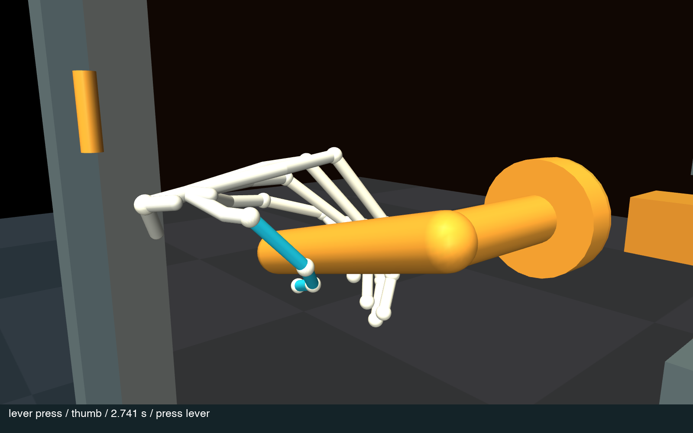
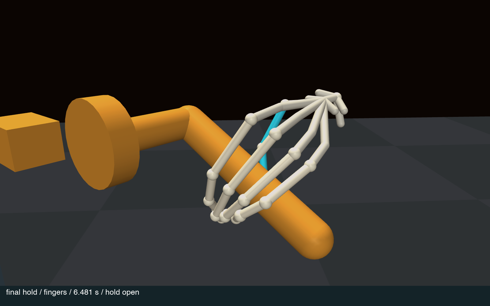

# One-door physical hand reference

An articulated stick figure forms an open hand, places it around a lever,
closes **four fingers on one side and the thumb underneath on the other**,
presses the lever, pulls the passive door open and holds it.

**This is a synthetic opening-and-hold prototype.** The saved simulator states
and contacts are reproducible evidence of this engineered motion. They are not
captured human ground truth or a validated biomechanical model.

[Watch the enlarged phone video](https://github.com/adamraudonis/DoorBench/releases/download/opposed-grasp-20260907/doorbench-opposed-grasp-phone.mp4)
· [Local viewer](http://127.0.0.1:5184)
· [Recorded checks](review/physical-human/prototype-checks.json)
· [Visual review](review/physical-human/visual-review.json)

| Thumb side — cyan thumb underneath | Finger side — four fingers together |
|---|---|
|  |  |

These enlarged views show the actual native skeleton. The thicker contact
envelopes are hidden to expose the joints; their surface contact remains active.
The video includes real-time and half-speed passes, a whole-body inset, and an
axial projection of all five digits.

## Recorded result

Native MuJoCo **3.12.0**, CPU, **September 7, 2026, 03:44:34–03:44:42 UTC**.
All three cases use the same controller and rig revision.

| Case | Maximum door opening |
|---|---:|
| Physical hand | **43.72°** |
| Hand contact disabled | **0.00°** |
| Latch mechanically blocked | **0.36°** of strike clearance |

| Grasp check at every 1 ms working step | Press | Pull | Hold |
|---|---:|---:|---:|
| All four fingers together; thumb below and opposite | **100%** | **100%** | **100%** |
| All four loaded fingers opposed to a loaded thumb | **100%** | **99.88%** | **100%** |

There are three isolated 1 ms pull steps without all four qualifying finger
contacts. The thumb stays loaded throughout. Contact must act on the usable
lever grip: a palm, thumb metacarpal, stem, or rose contact cannot qualify.
Each finger must oppose a thumb contact by at least **120°** around the lever,
with at least **0.05 N** of normal force.

All **10 physics/grasp checks** and **nine regression tests** pass. Maximum
hand/environment penetration is **0.465 mm**, skeleton self-penetration
**0.054 mm**, foot drift **1.82 mm**, and summed hand contact **27.45 N**.
No non-hand body force moves the door, and there are no simulator warnings.
The contact sum includes friction components and is not net pull force.

The largest achieved wrist bend is **31.75°**. During pressing, pulling and
holding, peak wrist angular speed is **1.89 rad/s**, and the largest measured
arm-segment linear speed is **0.429 m/s**. The audit rejects joint-limit excess,
excessive wrist/thumb bending, fast digit motion and abrupt arm motion.
These thresholds are engineering checks, not population-wide anatomical or
human-style certification. Full angle ranges and provenance hashes are in the
[record](review/physical-human/prototype-checks.json).

## What was missing, and how this version works

**The earlier v2 recording is rejected.** Its door opened and its joint checks
passed, but the thumb never contacted the lever. Those checks did not establish
a valid grasp. The exact rejected state is now a regression fixture. Separate
fixtures reject a crossed middle finger and an abrupt arm reorientation.

The replacement combines three parts:

1. **A visually informed approach.** Full-screen inspection of
   [Nazar Matveichev's door-opening footage](https://www.pexels.com/video/person-opening-and-closing-the-door-2108274/)
   showed a preformed open hand, an opposing thumb beneath the lever, and a grip
   retained through the press and pull. This guided the approach and inspection
   criteria; no 3D motion or force was inferred from the video.
2. **A contact-aware physical controller.** The wrist follows the *observed*
   handle pose and floating body. Arm IK is regularized against its previous
   solution, while bounded finger and arm motor torques load the passive handle.
   Reference-velocity feedforward removes artificial braking from the servos.
   A compliant 10 ms pad-contact response reduces contact chatter without hiding
   penetration. Door and lever positions are never prescribed during the run.
3. **Reward-based finger refinement.** A cross-entropy policy search evaluated
   **64 complete native rollouts**, optimizing eight small finger MCP equilibrium
   offsets. The reward favors all five opposing contacts throughout each working
   phase and penalizes side violations and failed physics checks. The selected
   offsets interpolate smoothly with observed door opening. This is bounded
   sample-based policy optimization, not PPO or a learned full-body motion model.
   [Policy](../scripts/physical_human/grip_policy.json) ·
   [Search record](review/physical-human/grip-search.json).

The policy was selected before the final arm-continuity and pad-compliance
corrections. The final combined controller was then run and verified separately;
its metrics are the table above, not the earlier search score.

[WristMimic](https://wongyun-yu.github.io/wristmimic/) offers a relevant research
direction: separate body/wrist guidance from learning the finger interaction.
[ParaHome](https://jlogkim.github.io/parahome/) and
[GRAB](https://github.com/otaheri/GRAB) illustrate the value of measured body,
hand and object interaction data for a future human-motion reference. Their
code, datasets and policies were **not** used in this demonstration.

## Anatomy and scope

- Custom **0.81 × 2.07 m, 19 kg** spring-latch lever door, separate from the
  catalogue-wide baseline. Standing opening and hold only.
- MyoHand-derived geometry, axes and limits: five metacarpals, distinct finger
  proportions, two thumb-base axes, **20 digit DoF per hand**, two wrist axes
  and separate forearm rotation.
- **21 landmarks per hand** in the COCO-WholeBody order used by Sapiens. No
  Sapiens inference or human motion capture.
- Floating pelvis and floor contact; no foot anchors, hand weld, door actuator,
  mocap body, external root force or mechanism-pose writes.
- Approximate masses and bounded joint servos. Compliant collision envelopes
  contact the environment; thin bone capsules enforce skeleton separation.
  Skin deformation, pressure between adjacent fingers, muscles and calibrated
  human inertias are not modeled.
- 48 native touch sensors. Grasp acceptance uses qualifying native contact
  pairs, rather than raw touch sensors that may include self-contact.

The hand parameters come from
[MyoHub/myo_sim](https://github.com/MyoHub/myo_sim) at
`eb327acbae0fad12279495040607f5235d962328`.
[Source, modifications and Apache-2.0 license](../scripts/physical_human/anatomy/README.md).

The enlarged review covers approach, closure, press, pull, hold and automatically
selected difficult frames. This establishes a much stronger grasp inspection
than the rejected thumbnail review. Human naturalness remains a visual judgment;
release, traversal, other doors, robustness to perturbations and retargeting
are outside this recording's validation.

## Reproduce

```sh
python -m pip install -e '.[reference]'
python scripts/physical_human/prototype.py --out out/physical-human/normal
python scripts/physical_human/prototype.py --out out/physical-human/no-touch --no-touch
python scripts/physical_human/prototype.py --out out/physical-human/blocked --latch-blocked
python -m pytest tests/test_physical_human_prototype.py -q
```

The checked-in finger policy is loaded automatically. No GPU is required.
`--anchors` is an explicitly labeled debugging option and is off in this run.
Loading the XML alone does not run the controller.

To experiment with the contact reward on the current controller:

```sh
python scripts/physical_human/search_grip.py \
  --out out/grip-search --seed 701 --generations 4 --population 16 --workers 4
```

This writes candidates and scores without replacing the checked-in policy.
The current controller includes the later fixes, so a fresh search is a new
experiment; replaying the saved policy reproduces the reported demonstration.

Generate enlarged inspection images and the phone video:

```sh
python scripts/physical_human/review.py out/physical-human/normal
python scripts/physical_human/phone_video.py out/physical-human/normal \
  --out out/physical-human/doorbench-opposed-grasp-phone.mp4
```

Pillow, imageio and imageio-ffmpeg are required. The video exporter verifies the
scene and trajectory hashes, refuses failed four-finger/opposing-thumb runs,
and writes H.264/yuv420p with faststart, a poster and a SHA-256 receipt.
The visual-review script also renders rejected experiments for diagnosis and
never automatically approves appearance.

Install viewer dependencies, package and serve the evidence:

```sh
cd viewer
bun install
cd ..
python scripts/physical_human/export.py out/physical-human/normal \
  --web out/physical-human-demo --three viewer/node_modules/three
python -m http.server 5184 --bind 127.0.0.1 --directory out/physical-human-demo
```

The export requires matching successful causal checks. The viewer provides
separate enlarged thumb/finger cameras, whole-body view, contact envelopes,
contact points, actual angles, per-digit forces and slow motion. It interpolates
saved native states and does not simulate physics in the browser.

`trajectory.npz` contains 50 Hz timestamps, qpos, qvel, motor targets/forces,
touch sensors and `hand_keypoints[frame, left/right, 21, world_XYZ_metres]`.
The audit runs at **1 kHz**; narrow force peaks or contact gaps may fall between
50 Hz replay rows. The report includes full-rate extrema, phase contact coverage,
source hashes and exact run times.
