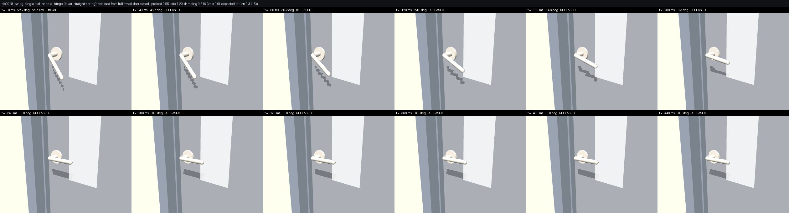

# Physics model

Every number in `spec.json → physics` is derived from first principles plus published catalogue data and carries
its formula and source.  This page summarises the models.

## Mass and inertia

`m_leaf = ρ_area(t) · (W·H − A_glass) + ρ_glass · t_glass · A_glass + Σ hardware`

`ρ_area(t)` comes from a **slab construction** (`materials.SLABS`): two skins + core (+ stile/rail frame) or a
monolithic material.  Constructions are calibrated against manufacturer door-weight tables
(Knape & Vogt, VT Industries, Steel Door Institute): e.g. a 3'0"×6'8" hollow-core interior door ≈ 12–14 kg,
a 3'0"×7'0" 18-gauge hollow-metal door ≈ 47 kg, a 12 mm frameless tempered glass door ≈ 60 kg, a vault door ≈ 1 t.
Hardware masses (lever sets 1–2 kg, exit devices 5–8 kg, closers 3–4 kg, hinges 0.2–0.6 kg each) are added.
Inertia tensors are computed analytically per geom (boxes, cylinders, capsules, spheres; trimesh for meshes) and
combined with the parallel-axis theorem; MJCF/URDF/USD carry explicit inertials.

## Hinge friction

Coulomb torque about the hinge line from a bearing-load model:

`τ_f = μ · (m·g·r_thrust + 2·F_h·r_pin) · k_condition + τ_seal`,  `F_h = m·g·(W/2) / L_hinge_span`

with `μ` per bearing type (ball-bearing 0.04 … rusty pin 0.55), pin/thrust radii per hinge model, and a condition
multiplier (new 1.0 … rusty 6.0). Doors flagged *swollen* or *sagging* add a stiction term.  Rolling friction for
sliding doors: `F = μ_roll · m · g · k_condition` (sealed bearings 0.012 … dirty track 0.12 … wood-on-wood 0.30).
Aerodynamic damping is linearised at 1 rad/s.

## Closers (EN 1154)

Power size is chosen from leaf mass and width (EN 1154 Table 1) unless the closer model fixes it.  The spring is
`τ(θ) = τ₀ + k·θ` with `τ₀ = 1.15 × closing moment (0–4°)` and `τ(90°) = 0.85 × max opening moment`.  Hydraulic
damping is asymmetric (closing sweep ≈ 40–120 N·m·s/rad, opening 4–15) with backcheck beyond ~70°; MJCF/USD carry
the symmetric opening value natively and the environment applies the asymmetric law in a passive-force callback.
Spring hinges, floor springs, pneumatic screen closers, gate springs, gas struts and torsion-spring counterbalances
have their own models.

Cam-lift cold-room doors with an overhead arm closer use a passive vertically sliding shoe in a frame-mounted
guide, with 2 mm travel allowance beyond the specified cam rise. The shoe follows the forearm through the point
connection; it adds no spring and preserves the hinge's gravitational return work. The full-tier linkage gate
checks endpoint separation below 1 mm while prescribing the rise coupling. This corrects the previously incompatible
fixed planar shoe; the closer torque itself remains the joint-level approximation described above. No manufacturer's
installation or full-mechanism torque calibration is claimed for this generic slotted-shoe assembly.

## Latches and locks

* Spring latches (BHMA A156.2): 12.7 mm (Grade 3) or 19 mm (Grade 1 deadlatch) throw, 3.5–8 N spring preload;
  the bolt is a capsule that rides over a beveled strike lip and drops into a pocket in the jamb + stud.
* Operators: levers (ANSI/BHMA A156.2 return springs, ≤ 22 N at the grip), knobs (45–60° travel), paddles, exit
  devices (UL 305: 16 mm pad travel, 18–45 N preload, ≤ 67 N to unlatch), thumb latches, wheels, dogs, slide bolts,
  hooks, lift pins, keypads (12 physical keys, 1.5 mm travel).  What each one does when you let go is
  [its own section](#operator-return-what-the-handle-does-when-you-let-go).
* Deadbolts (A156.5, 25.4 mm throw) driven by thumbturns; keyed-only sides are fixed.
* Locked operators keep a small backlash range so the robot feels the "jiggle" of a locked handle.
* Maglocks are welds with a holding-force breakaway (600/1200 lbf), electric strikes/bolts and interlocks are
  released by the environment (REX button, badge, call button, timers).
* Armature (reflected inertia of internal mechanisms) is added to mechanism joints so the coupled constraints are
  well-conditioned in MuJoCo.

## Operator return: what the handle does when you let go

Every operator in `hardware.py` carries a `return_kind`, because "the handle springs back" is a property of the
hardware and not of every handle:

| `return_kind` | what happens on release | operators |
| --- | --- | --- |
| `spring` | a return spring brings it to its rest stop | 35 models: every lever, knob, paddle, exit-device pad and crossbar, thumb piece, patio thumb latch, garage T-handle, screen push button, baby-gate and pool-gate lift latches, cold-storage handle, mail flap |
| `gravity` | no spring; its own weight brings it back | `gate_latch_fork`, `barn_privacy_hook` (the teardrop), `pull_ring`, `hatch_ring` |
| `detent` | **stays where it is put**, held by friction | `wheel_vault`, `wheel_ship_hatch`, `dog_lever`, `cremone_bolt`, `slide_bolt_barrel`, `slide_bolt_heavy`, `cane_bolt_drop`, `stall_slide_latch`, `hasp_padlock` |
| `none` | no moving part (pulls, push plates, bare push faces) | 13 models |

The `detent` list is the catalogue's own reasoning, not a simulation convenience:

* **Handwheels** (`wheel_vault` 5 N·m, `wheel_ship_hatch` 2 N·m) — the wheel drives boltwork through a self-locking
  linkage; a wheel that sprang back would re-throw its own bolts.
* **Dog levers** (`dog_lever`, 1.5 N·m) — a dog is a wedge cam on a stiff spindle, knocked over by hand or mallet and
  left dogged or undogged.
* **Cremone knobs** (`cremone_bolt`, 0.4 N·m) — the knob turns rods in their guides; the shoot bolts hold the door and
  nothing pulls the knob back.
* **Slide bolts, cane bolts, stall latches, hasps** (0.3–4 N) — a barrel bolt stays shot or stays drawn; that is what
  makes a stall latch's occupied indicator work.

Deadbolt **thumbturns** are `role="lock"` joints rather than operators and behave the same way: friction only, no
spring.

### Deriving the numbers

The catalogue fixes the spring (`spring_torque_preload`, `spring_rate`); `build.tune_operator_returns` derives the
rest once the geometry exists, and records everything in `spec.json["physics"]["operator"]` with units — per model
and then per joint under `joints`:

* **Damping** `b = 2·ζ·√(k·I)` with **ζ = 1** (critical) and `I` the joint's real inertia (armature plus the handle's
  own inertia about the spindle).  The previous flat `damping = 0.02 N·m·s/rad` was ζ ≈ 0.14 on a lever and ζ ≈ 0.055
  on an exit-device pad, so every release rang against the rest stop.  Gravity-returned parts use ζ = 0.6 against an
  equivalent rate `|τ_g|/travel` — a ring on a staple has no spring cassette to damp it, only its pin and the air.
* **Preload vs the handle's own weight.**  A lever rotates about the door normal, so its own weight pulls it *down*,
  i.e. in the actuating direction, with a moment of 0.15–0.36 N·m for a lever set and 1.35 N·m for a 2.5 kg cold
  storage handle.  A spring that cannot lift that leaves the handle hanging off horizontal for ever — which A156.2's
  return test fails, and which the cold storage handle did (4.25° short).  The preload is therefore raised to
  `1.35 × τ_gravity + 2 × friction` wherever the catalogue value is below it, and the override is recorded per joint
  as `preload_raised`.
* **Friction** is the spindle bearing (0.02 N·m + 0.02 per kg), capped at 25 % of the restoring torque at rest so
  Coulomb friction can never park the handle short of its stop.  A gravity-returned part gets 15 % of the *weakest*
  weight moment between the release point and rest — a lifted fork's moment nearly vanishes at full lift, and a flat
  friction there sticks it in the air.
* **Armature.**  Operator joints carry a 0.01 kg·m² floor (the reflected inertia of a lock spindle and its spring
  cassette).  A ring on a staple, a fork on a plain pin and a teardrop on a screw have none of that, so `gravity`
  operators get 1e-4 kg·m² instead; at the old floor a teardrop took 2.2 s to fall.
* **Expected return time** comes from `physics.operator_return_time`, a 1-D integration of the release with the exact
  weight-moment curve; QA measures the real one in MuJoCo.

* **Over centre.**  An unsprung part lifted far enough goes over centre: past that angle its own weight carries it on,
  and a ring pull left standing vertical balances against its stop for ever.  A real ring on a staple simply flops the
  other way, which a one-sided joint range cannot represent, so the travel of a `gravity` operator stops just short of
  its over-centre angle (8 ring pulls: 90° → 79.8°) and it always falls back.

Measured over the 1000 doors (607 operator joints — 565 spring, 28 gravity, 14 detent — each tried with the door shut
and again with the leaf held open): levers and knobs come home in **0.23–0.32 s** median (whole spring population
0.024–0.442 s, median 0.236 s), exit-device pads in 0.06–0.08 s (a UL 305 device does snap), paddles 0.10 s, screen
push buttons 0.024 s, gravity parts 0.27–0.54 s (median 0.36 s).

`scripts/operator_return_film.py` renders these: `docs/media/operator_return_lever.jpg` (and `_open` with the leaf
held open) is a straight-tubular lever let go at 52°, home at 0.24 s with no rebound.
`operator_return_cold_storage_before.jpg` / `_after.jpg` is the handle that used to settle 4.0° off horizontal;
`operator_return_ring_before.jpg` / `_after.jpg` is the floor-hatch ring that used to stand upright for ever.

### The gate

`qa.checks["operator_returns"]` drives every `spring`/`gravity` operator to full travel with a kinematic hand,
releases it, and requires it back inside the tolerance (1 % of travel for a spring, 5 % for a gravity part) within
0.6 s (2 s gravity), with no residual offset at the end and at most one clack out of the band.  It runs twice: with
the door shut, and with the leaf pulled open by a hand-sized effort so the bolt is clear of its strike and only the
return spring is left.  `checks["operator_holds"]` requires every `detent` operator to still be at ≥ 80 % of where
the hand left it.  Both feed `signed_off`.

Where a leaf will not open under a hand-sized effort (a locked door), the leaf-open half is recorded as `skipped`
rather than failed — the case does not exist for that door.  A ring pull on the **underside of a ceiling hatch**
settles hanging down rather than flush in its recess; the gate measures where the weight moment actually vanishes in
the pose under test instead of assuming the drawn rest.

## Isaac Sim / PhysX

The MJCF is the reference simulation. `docs/ISAAC_LAB.md` ("MuJoCo → PhysX parameter mapping") derives every USD
quantity from the same joint parameters: drive gains per degree, `frictionloss` as static = dynamic Coulomb effort on
the joint's `angular` / `linear` axis (legacy load-dependent coefficient 0), armature, the 100 rad/s link velocity cap
(deg/s in the schema), position servos folded into the drive, and the gravity closing torque `−m·g·c₁` that stands in
for a rising hinge's screw coupling in the canonical RL articulation.

## Running clearance

Real doors do not touch their frames: a leaf runs 3-5 mm clear at the jambs and head, 6-20 mm over the floor, and a
revolving canopy or a full-height turnstile rotor runs 10-20 mm clear top and bottom.  Parts authored EXACTLY
touching (0.000 m) are free in MuJoCo at margin 0 - no penetration, no force - but PhysX generates and resolves
contacts inside its contact offset (the USD export sets `physxCollision:contactOffset` 5 mm), so a zero-gap part
jams, drifts or explodes in Isaac Sim while the reference passes.  Two constants and two solved gaps keep the
dataset off that boundary:

| where | design value | source |
| --- | --- | --- |
| leaf edge to jamb / head / stop line | `geometry.common.GAP` = 3 mm | standard door reveal |
| leaf face to frame's swing-side face | `geometry.common.LEAF_FACE_INSET` = 7 mm | the hinge knuckle radius: the pin lands ON the frame face, so the reveal arris stays inside the pin's clearance circle and the leaf can swing past 90 deg |
| pivoted leaf heel (toilet partitions, centre-pivot doors) | `geometry.common.pivot_heel_gap(P, t)` | solves `P - hypot(P - gap, t/2) >= 3 mm` for the heel corner's swept circle |
| bifold / accordion pivot panel heel | `folding.fold_jamb_gap(t)` | the same solve at `FOLD_PIVOT_IN`; the spec generator sizes the opening from it |
| full-height turnstile rotor column | `geometry.other.ROTOR_RUN_CLEAR` = 15 mm | roof and floor running clearance |
| revolving rotor to canopy ceiling | `geometry.other.REVOLVING_RUN_CLEAR` = 15 mm | wing-top brush seal gap |
| roll-up curtain bottom | `geometry.other.ROLLUP_ASTRAGAL` = 12 mm | the rubber astragal seats on the floor, the steel bar does not |
| bypass leaf to jamb, closed and fully open | `GAP` + `BYPASS_END_STOP` = 20 mm at the stroke end | the track end stop, not the jamb, ends the stroke |

The `running_clearance` gate (`doorbench/clearance.py`, published as `qa.json → checks.running_clearance` and
reported by `scripts/clearance_report.py`) enforces this: for every door it sweeps each leaf joint and measures, with
`mj_geomDistance`, the smallest gap every MOVING collider ever reaches to every STATIC one.  A pair fails below
3 mm (6 mm over the floor, `meta["running_clearance_min"]` where a model asks for more - 10 mm on a rotor).
Contacts that exist by design are allow-listed from the geometry itself, not by tolerance: seals, hinges/bearings,
latches and locks, closers, mechanisms and sensors by semantic; stops, bumpers, thresholds, keepers, strikes,
rollers, glides and guides by name; running gear inside its own track; and, per model,
`meta["running_clearance_allow"] = [[geom_a, geom_b, reason]]`.  Visual-only trim is out of scope - it is not a
collider in either engine, and its overlap is the interpenetration gate's business.

## Compliance checks

For each hinged door the simulated opening force at the handle is compared with ADA 2010 §404.2.9 (5 lbf interior),
IBC §1010.1.3 (30 lbf to set in motion / 15 lbf to full open for fire & exterior doors) and §1010.1.10 (panic
hardware ≤ 15 lbf), plus ADA handle height (34–48 in) and clear width (32 in).

## Damage thresholds

Per material (dent / puncture force), glazing (breakage), operator (yield torque), latch (shear), hinge (tear-out) and
slam velocity; the benchmark labeller compares contact and constraint forces against them each step.
