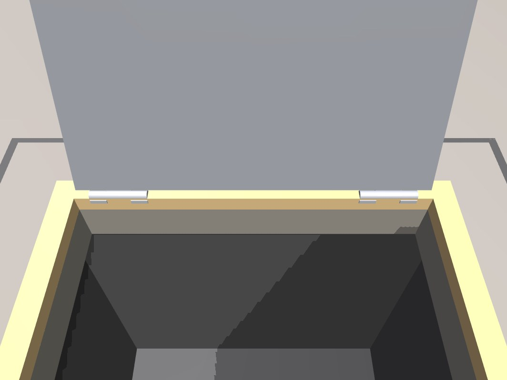
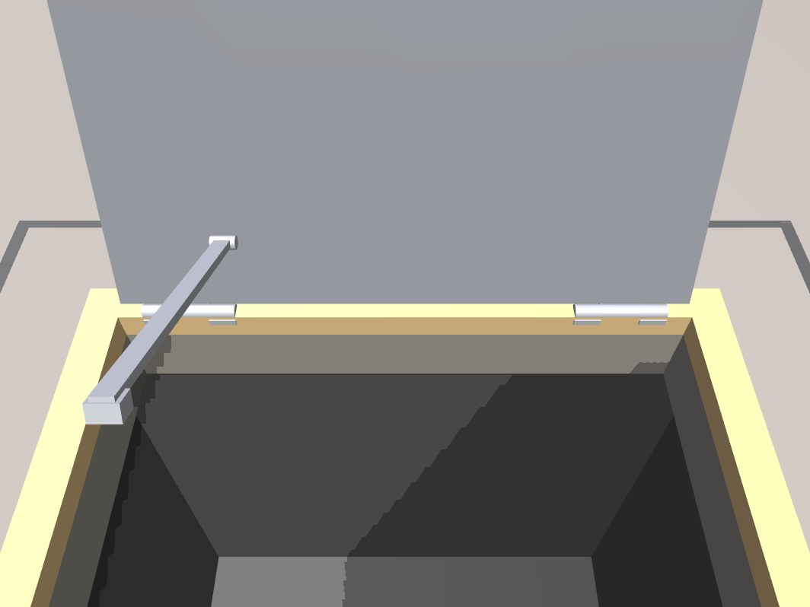
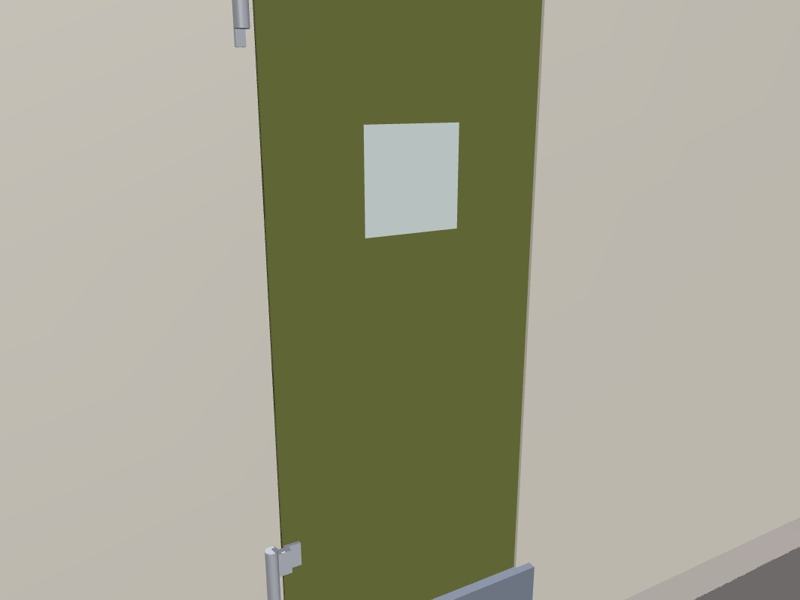
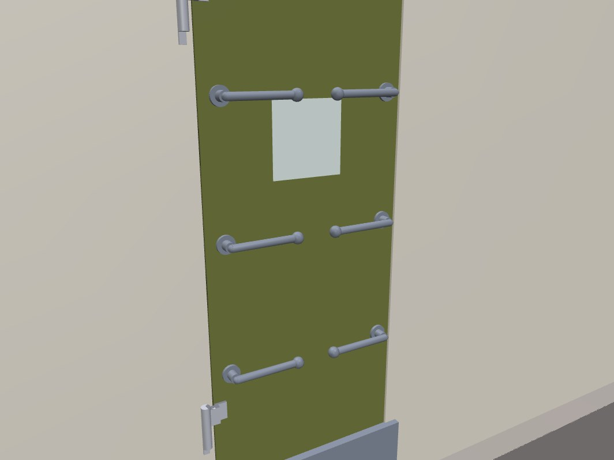

# The spec is a contract

Every door in DoorBench carries a spec that promises hardware by name - an operator on both faces, a
latch with six dogs, a closer, an opening stop of a named kind, three hinges, a louvre vent - and a
model that is supposed to contain that hardware.  Until now nothing checked that the two agreed.

The visual review (`docs/VISION_REVIEW.md`) found the consequences by eye, and the deterministic
re-check confirmed them over all 1000 doors: **470 broken promises on 418 doors**, every one of which
passed every other gate, because no other gate ever read the spec.

`doorbench/qa.py` `checks["spec_realized"]` (implemented in `doorbench/spec_realized.py`) is the gate
for it, and it is inside `signed_off`.

## What the gate checks

It walks the spec's declared hardware and requires geometry with the matching semantic and name for
each, in the right place, with the right multiplicity:

| rule | what it asserts |
|---|---|
| `operator_missing` | a declared operator has geometry carrying the `operator` semantic - not drawn as `lock` or `decor`, where the benchmark's grip sites, the viewer's handle camera and the review's close-up all miss it |
| `operator_faces` | `operator.sides == "both"` means the set really is on both faces of the leaf, measured against the leaf's own mid-plane (read off its slab, so it holds for a leaf authored rotated or offset) |
| `latch_multiplicity` | `dogs_6`, `multi_bolt_8`, `kinematics.dogs`, `kinematics.bolts` - the builder makes exactly that many dog / bolt stations |
| `closer_missing` | a declared closer is drawn (or is a spring hinge, and the hinge is) |
| `stop_missing` | the named opening stop has the geometry that realizes it |
| `stop_wrong_kind` | ... and it is the KIND the spec names: a wall bumper is on a wall, a floor riser on the floor |
| `hinge_count` | `hinge.count` hinge stations are drawn |
| `extra_missing` | every entry of `spec["extras"]` has geometry |

## Exceptions

Anything deliberately not drawn is in an explicit table in `doorbench/spec_realized.py`, **with its
reason**, and is counted into `metrics["spec_realized_exceptions"]` rather than silently skipped:

* `NO_OPERATOR_MODELS` - `none`, `elevator_none`: there is nothing to draw and nothing to grip.
* `CLOSER_IN_ANOTHER_PART` - spring hinges and gate springs: the closer *is* the hinge.
* `STOP_EXCEPTIONS` - `none`, `track_end` (a sliding leaf is stopped by the end of its own rail, which
  is modelled over the full travel), `hinge_pin` (a set-screw collar inside the knuckle, not visible
  hardware), `overhead_90` / `overhead_105` / `overhead_110_hold` (a concealed overhead stop lives
  inside the top rail and the soffit), `wedge_jammed`.
* `HINGE_NOT_STATIONED` / `HINGE_NOT_STATIONED_FAMILIES` - hinge models and families whose leaves do
  not hang on numbered butt-hinge stations (pivots, rotor bearings, piano hinges, flap pins, bi-fold
  panels, strip curtains).
* A door may carry `model.meta["spec_realized_allow"]` entries, each of which must carry a written
  justification: `["<rule>", "<declared item>", "reason"]`.

## Enforced now, and what is still open

`ENFORCED_RULES` are zero over all 1000 doors and `checks["spec_realized"]` fails the moment one comes
back.  `REPORTED_RULES` are the same walk applied to declarations whose realization has not been built
yet: they are counted into `metrics["spec_realized_open"]` on every door, so the size of the remaining
work is a number in the dataset rather than a thing nobody measured.

| rule | before | after |
|---|---:|---:|
| `stop_wrong_kind` (enforced) | 130 | **0** |
| `extra_missing` (enforced) | 114 | **0** |
| `operator_faces` (enforced) | 106 | **0** |
| `stop_missing` (enforced) | 81 | **0** |
| `operator_missing` (enforced) | 27 | **0** |
| `latch_multiplicity` (enforced) | 12 | **0** |
| `closer_missing`, `hinge_count` (enforced) | 0 | **0** |
| **enforced total** | **470 on 418 doors** | **0** |
| `lock_missing` (reported) | 127 | 127 |
| `latch_missing` (reported) | 56 | 56 |

The two reported rules are the same class - a declaration with nothing behind it - and are the next
tranche of the same work:

* **`lock_missing`, 127 doors.**  22 privacy buttons, 21 maglocks on sliding / roll-up / turnstile
  leaves, 15 slide bolts, 11 padlocks, 11 electric strikes, 9 key cylinders, 8 hook locks (whose bolt
  *is* the latch geometry), 8 child-lock covers, 6 electric bolts, 5 card readers, and 11 `jam_stuck`
  doors which correctly have no lock hardware at all.
* **`latch_missing`, 56 doors.**  17 watertight and vault doors whose dogs and bolts carry the `lock`
  semantic rather than `latch`, 14 magnetic catches with nothing drawn at all, 8 elevator interlocks,
  and 17 other bolts drawn under another semantic or not drawn.

## What was drawn, and what was renamed

**Drawn.**  A folding prop arm with its curb socket and retaining clip (hatches); a hook-and-eye
holdback on a deck stanchion, with the pad-eye on the leaf (watertight doors); the kick-down holder,
serving both the `hold_open_kickdown` extra and the `kick_down_holder` stop; a threshold saddle; a
rail-mounted soft-close damper with its trigger blade; the push/pull signs on revolving wings (the
revolving builder never called `add_extras`); the card reader on a turnstile's own cabinet or barrier
(a turnstile has no wall to put one on); the warning placard on vault and blast doors; the far-face
half of every two-sided operator set - dog levers and lever bolts through the leaf, garage and shutter
lift handles, recessed flush pulls where a barn or pocket leaf runs past a wall, the outside pull on a
toilet-stall door, the inside release on a cold-room slider; the knob on a keypad-deadbolt set (the
`keypad_deadbolt` kind drew no trim at all); the lifting tab on a hasp; a lever handle and a ring pull
in the sliding builder.

**Renamed, and why.**  Where the spec named something that cannot be built, the spec was corrected
rather than the geometry faked:

* `wall_bumper` / `wall_180` / `corridor_wall_120` -> `floor_bumper` on 189 doors.  A wall bumper only
  reaches a leaf that folds back flat against its own wall, and every hinged door in this dataset is
  capped at 135-140 deg by its casing (`spec.make_specs`), so all three named a wall the leaf never
  reaches.  The angle each door stops at is unchanged; only the name of the stop changes, to the one
  `common.add_bumper_stop` builds - and that function now *raises at build time* if the declared kind
  and the mount it can actually reach disagree, so the mismatch cannot come back silently.
* `door_stop_wall` was removed from `taxonomy.EXTRAS` for the same reason; the 21 doors that declared
  it now declare `door_stop_floor`, which is the stop those doors really take and which is drawn.
* One-sided hardware is no longer declared on both faces.  The operator catalogue's own `both_sides`
  field says whether the set is two-sided; a chain-link fork latch, a barrel bolt, a garage T-handle,
  a MagnaLatch, a baby-gate latch, a ring pull and a handwheel are not, and `spec.make_specs` narrows
  the declaration to the face the hardware is on.
* Extras the leaf cannot carry are not declared: a louvre vent on an already-louvred leaf, a vent or a
  kick plate in the bottom third of a leaf a pet flap already occupies, a knocker on a face crossed by
  its own bracing.  The builders used to skip these silently.
* `dogs_6` on every watertight door became `dogs_4` / `dogs_6` / `dogs_8` to match the dogs built, and
  the lever-bolt vault and blast doors got a sampled bolt count with one lever per bolt and a
  `multi_bolt_N` latch model that names it.

## Pictures

A floor hatch captioned `stop=prop_arm`, at its opening limit - the mechanism close-up, before and after.
Before, the lid stands at 110 deg held by nothing at all; after, the folding prop arm hangs on its knuckle
ready to drop into the socket on the curb:

A watertight door whose spec says the operator is on both faces, in the far-face hardware close-up.
Before, a blank plate; after, the far-side dog handles on the same shafts as the near ones:

