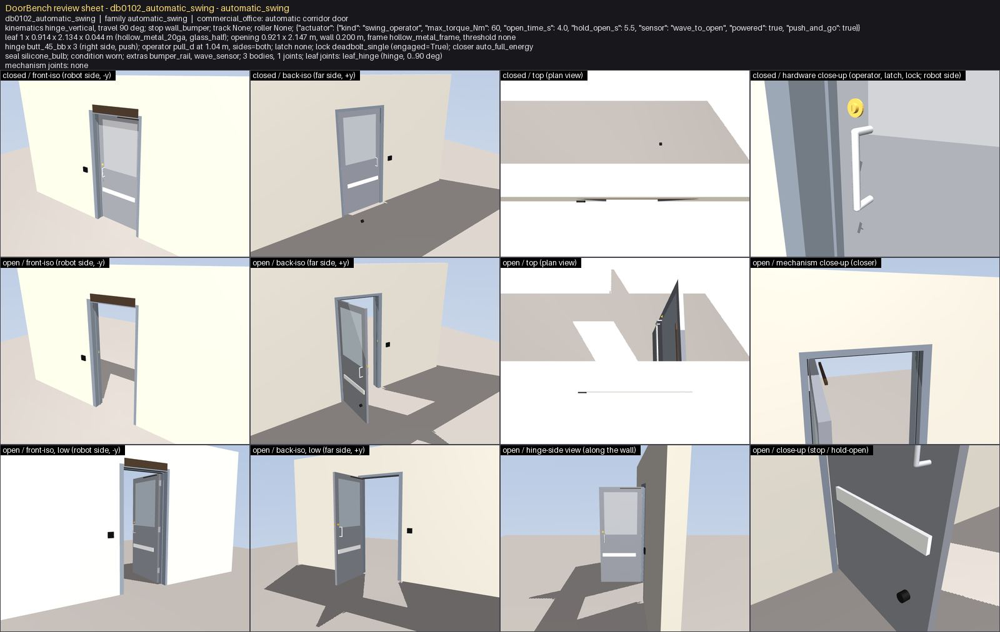
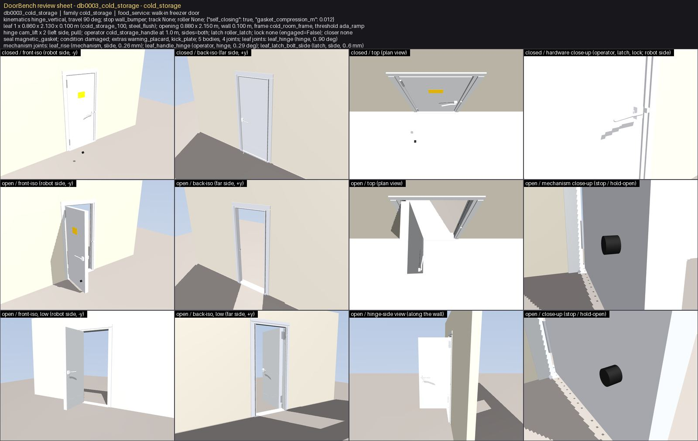

# Visual common-sense review (task G8)


## How to run it

```bash
# 1. render the sheets and write the prompts, no API call (inspect docs/review/vision/<door>.jpg + <door>.prompt.json)
PYTHONPATH=$PWD python scripts/vision_review.py --dry-run --per-family 4 --doors db0079_sliding_single,db0024_swing_single

# 2. live review with the Claude API (ANTHROPIC_API_KEY in the environment); resumable: doors with a verdict on disk are skipped
export ANTHROPIC_API_KEY=sk-ant-...
PYTHONPATH=$PWD python scripts/vision_review.py --max-cost-usd 60                 # all 1000 doors, claude-opus-5
PYTHONPATH=$PWD python scripts/vision_review.py --model claude-sonnet-5 --batch    # cheaper: Sonnet 5 through the Message Batches API (50 %)
PYTHONPATH=$PWD python scripts/vision_review.py --families sliding_single --force  # re-review one family after a geometry change

# 3. rebuild docs/VISION_REVIEW.md from the verdicts on disk (no rendering, no API)
PYTHONPATH=$PWD python scripts/vision_review.py --from-verdicts
```

The pre-run cost estimate is printed (and enforced by `--max-cost-usd`) before the first request: it counts the sheet
pixels (about one token per 750 px), the prompt text, one cached system prompt, and a 1500-token output budget per door
(adaptive thinking + the JSON verdict); measured usage is written into every verdict and summed at the end.

### Expected cost

| model | doors | input tokens | output tokens (budget) | USD | USD / door | batch API |
|---|---|---|---|---|---|---|
| claude-opus-5 | 5 | 20,914 | 7,500 | 0.26 | 0.0525 | no |

## Summary

39 doors reviewed (10 families); reviewer(s): claude-code-agent; model(s): claude-fable-5-1 (Claude Code agent, sheets viewed directly).

**34 / 39 ok**, 5 with blocker or major findings; findings: **2 blocker**, 3 major, 6 minor.

### Findings by category and family

| category | accordion | automatic_sliding | automatic_swing | baby_gate | bifold | blast | cold_storage | dutch | elevator | garage_sectional | total |
|---|---|---|---|---|---|---|---|---|---|---|---|
| floating_part |  |  | 1 |  |  |  | 1 |  |  | 2 | 4 |
| interpenetration |  |  |  | 1 |  |  |  |  |  |  | 1 |
| missing_hardware |  |  | 2 |  |  | 3 |  |  |  |  | 5 |
| wrong_scale |  |  |  |  |  |  | 1 |  |  |  | 1 |
| **doors reviewed** | 4 | 4 | 4 | 4 | 4 | 4 | 4 | 4 | 4 | 3 | 39 |
| **doors ok** | 4 | 4 | 3 | 4 | 4 | 1 | 3 | 4 | 4 | 3 | 34 |

### Triage

| class | blocker | major | minor |
|---|---|---|---|
| geometry bug to fix | 2 | 3 | 5 |
| rendering artefact | 0 | 0 | 1 |

## What the deterministic gates would not have caught

Doors with blocker / major findings and what `qa.json` says about them (signed_off = force QA + mass + clearance + formats; attachment = the G7 gate when present in this build):

| door | family | worst | signed_off | clearance | attachment | failed checks | vision findings |
|---|---|---|---|---|---|---|---|
| db0003_cold_storage | cold_storage | blocker | True | True | n/a | - | floating_part (blocker): wall bumper stop |
| db0102_automatic_swing | automatic_swing | blocker | True | True | n/a | - | floating_part (blocker): wall bumper stop |
| db0288_blast | blast | major | True | True | n/a | - | missing_hardware (major): dogs (latch dogs_6) |
| db0772_blast | blast | major | True | True | n/a | - | missing_hardware (major): dogs (latch dogs_6) |
| db0960_blast | blast | major | True | True | n/a | - | missing_hardware (major): dogs (latch dogs_6) |

5 / 5 of these doors are signed off and 5 / 5 pass the clearance gate: none of the visual findings below is an interpenetration or a force-QA failure. They are things that only a look at the picture (or the attachment gate, for floating parts) can catch: parts hanging in the air, rails ending before the travel does, hardware counts, wrong faces.

## Blocker and major findings by family

### automatic_swing (1 of 4 reviewed doors)

#### db0102_automatic_swing

_Full-energy operator door with pull, engaged deadbolt and bumper rail; the wall bumper stop is a rubber cylinder hanging in the air 0.8 m from the wall where the leaf face ends at 90 deg - there is no wall there to mount it on._



- **blocker** `floating_part` wall bumper stop: Black rubber cylinder at 0.35 m height, 0.8 m out from the wall on the far side, touching nothing (visible as a dot in the closed plan view and in mid-air in the stop close-up). A wall bumper needs a perpendicular wall; here it should be a floor dome stop or nothing. _[closed / top; closed / back-iso; open / close-up (stop / hold-open)]_ - **geometry bug to fix** (agent:attachment (G7, same defect as db0024)): geometry/hinged.py build_swing_single 'wall bumper stop geometry': the bumper is placed at the leaf's face at max opening regardless of whether a wall exists there; use a floor dome (z=0, on the floor) or add the return wall

### blast (3 of 4 reviewed doors)

#### db0288_blast

_Shelter blast door on two heavy vault hinges with dog levers; the spec's latch is dogs_6 but only two dogs (dog_0, dog_1) exist on the leaf, one at 0.9 m and one at 1.6 m._


- **major** `missing_hardware` dogs (latch dogs_6): The latch model dogs_6 promises six dogs; two dog levers / wedges are drawn (and only dog_0_hinge / dog_1_hinge exist as joints). A 2 m blast door dogged at two points on the latch edge only looks unfinished next to the marine doors that carry six. _[closed / front-iso; closed / back-iso; header joint list]_ - **geometry bug to fix** (agent:operators (G9c dogs) / build_vault in geometry/hinged.py): systematic for every blast door with latch dogs_6 (db0288, db0772, db0960 in this sample): either build 6 dogs around the perimeter or give blast doors a dogs_2 latch model so the spec matches the geometry

#### db0772_blast

_Blast door with dog levers on both faces; only two of the six dogs the latch model names are present._


- **major** `missing_hardware` dogs (latch dogs_6): Two dogs drawn (dog_0, dog_1) although the latch model is dogs_6. _[closed / front-iso; open / front-iso]_ - **geometry bug to fix** (agent:operators (G9c) / build_vault): same as db0288

#### db0960_blast

_Riveted blast door with a straight lever and two dogs; six dogs are specified._


- **major** `missing_hardware` dogs (latch dogs_6): Two dogs drawn although the latch model is dogs_6. _[closed / front-iso; open / back-iso]_ - **geometry bug to fix** (agent:operators (G9c) / build_vault): same as db0288

### cold_storage (1 of 4 reviewed doors)

#### db0003_cold_storage

_Walk-in freezer door on cam-lift hinges with a bent-bar handle and roller latch; the wall bumper stop is a rubber cylinder hanging in mid-air 0.75 m in front of the wall at 0.35 m height (two dark dots on the floor area in the closed views)._



- **blocker** `floating_part` wall bumper stop: The bumper is placed where the leaf face ends at 90 deg, in open space on the robot side; there is no wall behind it, so it floats. Same defect as db0024 / db0102. _[closed / front-iso; closed / top; open / mechanism close-up (stop / hold-open)]_ - **geometry bug to fix** (agent:attachment (G7)): geometry/hinged.py wall bumper stop placement; cold_storage uses build_swing_single
- **minor** `wrong_scale` cold storage handle: The Kason-type latch handle is a thin bent bar on the leaf edge with no latch body / strike, hard to see even in the close-up (known from the hardware review, not fixed there). _[closed / hardware close-up]_ - **geometry bug to fix** (agent:locks (G3 leftover: cold-storage latch body)): cosmetic

## Minor findings

| door | category | part | description | where | triage |
|---|---|---|---|---|---|
| db0003_cold_storage | wrong_scale | cold storage handle | The Kason-type latch handle is a thin bent bar on the leaf edge with no latch body / strike, hard to see even in the close-up (known from the hardware review, not fixed there). | closed / hardware close-up | geometry bug to fix cosmetic |
| db0011_automatic_swing | missing_hardware | overhead stop (stop overhead_105) | The spec names an overhead stop but no stop arm / channel is drawn on the head or leaf top; only the joint limit stops the leaf. Concealed overhead stops exist, so cosmetic. | open / mechanism close-up (closer); open / top | geometry bug to fix systematic for every overhead_90 / overhead_105 / kick_down_holder / hook_holdback door; low priority |
| db0175_garage_sectional | floating_part | garage opener motor head + rail end | The belt-drive rail runs from the header ~3 m back into the garage and ends in a motor box that is not attached to anything (no ceiling or hanger straps in the scene). The trolley arm to the top section is connected. | closed / back-iso; closed / top | geometry bug to fix cosmetic: add two hanger straps up to a small ceiling slab above the rail, or omit the motor head when no ceiling exists |
| db0479_automatic_swing | missing_hardware | overhead stop (stop overhead_90) | No overhead stop arm drawn although the spec names one; cosmetic (systematic for overhead_* stops). | open / mechanism close-up (closer) | geometry bug to fix systematic |
| db0574_garage_sectional | floating_part | garage opener motor head + rail end | Opener rail and motor box hang in the air behind the header (no ceiling in the scene). | closed / back-iso; closed / top | geometry bug to fix cosmetic |
| db0661_baby_gate | interpenetration | leaf hinge edge / pressure-frame post | The hinge edge of the open leaf shows a jagged interleaved seam against the frame post over its full height, the pattern coplanar faces produce; faces are coincident rather than clearly interpenetrating. | open / mechanism close-up (top hinge / pivot); open / close-up | rendering artefact z-fighting of coincident faces; the clearance gate (2 mm) passes this door, so the overlap is at most cosmetic |

## All reviewed doors

| door | family | ok | blocker | major | minor | sheet |
|---|---|---|---|---|---|---|
| db0003_cold_storage | cold_storage | no | 1 |  | 1 | [sheet](review/vision/db0003_cold_storage.jpg) |
| db0011_automatic_swing | automatic_swing | yes |  |  | 1 | [sheet](review/vision/db0011_automatic_swing.jpg) |
| db0077_bifold | bifold | yes |  |  |  | [sheet](review/vision/db0077_bifold.jpg) |
| db0078_bifold | bifold | yes |  |  |  | [sheet](review/vision/db0078_bifold.jpg) |
| db0095_dutch | dutch | yes |  |  |  | [sheet](review/vision/db0095_dutch.jpg) |
| db0102_automatic_swing | automatic_swing | no | 1 |  |  | [sheet](review/vision/db0102_automatic_swing.jpg) |
| db0175_garage_sectional | garage_sectional | yes |  |  | 1 | [sheet](review/vision/db0175_garage_sectional.jpg) |
| db0177_accordion | accordion | yes |  |  |  | [sheet](review/vision/db0177_accordion.jpg) |
| db0198_garage_sectional | garage_sectional | yes |  |  |  | [sheet](review/vision/db0198_garage_sectional.jpg) |
| db0225_automatic_swing | automatic_swing | yes |  |  |  | [sheet](review/vision/db0225_automatic_swing.jpg) |
| db0249_accordion | accordion | yes |  |  |  | [sheet](review/vision/db0249_accordion.jpg) |
| db0283_automatic_sliding | automatic_sliding | yes |  |  |  | [sheet](review/vision/db0283_automatic_sliding.jpg) |
| db0288_blast | blast | no |  | 1 |  | [sheet](review/vision/db0288_blast.jpg) |
| db0292_accordion | accordion | yes |  |  |  | [sheet](review/vision/db0292_accordion.jpg) |
| db0333_dutch | dutch | yes |  |  |  | [sheet](review/vision/db0333_dutch.jpg) |
| db0343_bifold | bifold | yes |  |  |  | [sheet](review/vision/db0343_bifold.jpg) |
| db0352_blast | blast | yes |  |  |  | [sheet](review/vision/db0352_blast.jpg) |
| db0391_dutch | dutch | yes |  |  |  | [sheet](review/vision/db0391_dutch.jpg) |
| db0409_cold_storage | cold_storage | yes |  |  |  | [sheet](review/vision/db0409_cold_storage.jpg) |
| db0460_dutch | dutch | yes |  |  |  | [sheet](review/vision/db0460_dutch.jpg) |
| db0473_accordion | accordion | yes |  |  |  | [sheet](review/vision/db0473_accordion.jpg) |
| db0479_automatic_swing | automatic_swing | yes |  |  | 1 | [sheet](review/vision/db0479_automatic_swing.jpg) |
| db0505_baby_gate | baby_gate | yes |  |  |  | [sheet](review/vision/db0505_baby_gate.jpg) |
| db0507_cold_storage | cold_storage | yes |  |  |  | [sheet](review/vision/db0507_cold_storage.jpg) |
| db0514_automatic_sliding | automatic_sliding | yes |  |  |  | [sheet](review/vision/db0514_automatic_sliding.jpg) |
| db0515_elevator | elevator | yes |  |  |  | [sheet](review/vision/db0515_elevator.jpg) |
| db0574_garage_sectional | garage_sectional | yes |  |  | 1 | [sheet](review/vision/db0574_garage_sectional.jpg) |
| db0661_baby_gate | baby_gate | yes |  |  | 1 | [sheet](review/vision/db0661_baby_gate.jpg) |
| db0673_cold_storage | cold_storage | yes |  |  |  | [sheet](review/vision/db0673_cold_storage.jpg) |
| db0698_baby_gate | baby_gate | yes |  |  |  | [sheet](review/vision/db0698_baby_gate.jpg) |
| db0772_blast | blast | no |  | 1 |  | [sheet](review/vision/db0772_blast.jpg) |
| db0801_automatic_sliding | automatic_sliding | yes |  |  |  | [sheet](review/vision/db0801_automatic_sliding.jpg) |
| db0811_elevator | elevator | yes |  |  |  | [sheet](review/vision/db0811_elevator.jpg) |
| db0853_baby_gate | baby_gate | yes |  |  |  | [sheet](review/vision/db0853_baby_gate.jpg) |
| db0860_elevator | elevator | yes |  |  |  | [sheet](review/vision/db0860_elevator.jpg) |
| db0863_automatic_sliding | automatic_sliding | yes |  |  |  | [sheet](review/vision/db0863_automatic_sliding.jpg) |
| db0933_bifold | bifold | yes |  |  |  | [sheet](review/vision/db0933_bifold.jpg) |
| db0960_blast | blast | no |  | 1 |  | [sheet](review/vision/db0960_blast.jpg) |
| db0962_elevator | elevator | yes |  |  |  | [sheet](review/vision/db0962_elevator.jpg) |
