# Vision review

Deterministic gates measure; they cannot see. Every gate in `doorbench/qa.py` exists because a
person looked at a picture and said "that is obviously wrong" - a door stop floating in mid-air,
a closer arm ending in space, a barn rail too short for its own door. This is the systematic
version of that step: photograph every door from every angle that matters, caption the picture
with what the specification says should be there, and ask a vision model the question a person
would ask.

---

## How to run it

```bash
# 1. dry run - renders every sheet and writes the exact prompt per door; no API key needed
python scripts/vision_review.py --sample 120 --dry-run

# 2. live, one request per door, with a hard spend guard (aborts before the first call if the
#    estimate exceeds the cap)
ANTHROPIC_API_KEY=sk-... python scripts/vision_review.py --sample 120 --max-cost-usd 20

# 3. the whole dataset through the Batches API - half price, results within 24 h
ANTHROPIC_API_KEY=sk-... python scripts/vision_review.py --batch --max-cost-usd 60

# 4. rebuild this report from the verdicts already on disk (no rendering, no API)
python scripts/vision_review.py --from-verdicts
```

Selection: `--doors a,b,c`, `--families swing_single,rollup`, `--limit N`, `--sample N` (seeded by
`--seed`, stratified so every family appears), `--force` to re-review doors that already have a
verdict.  Everything else resumes: a door with a verdict on disk is skipped.

Cost controls: `--model` (default `claude-opus-5`), `--effort`, `--no-thinking`, `--batch`,
`--max-cost-usd`, `--est-output-tokens`, `--price-in` / `--price-out` if the published prices move.
The estimate is computed from the actual rendered sheets - their real pixel dimensions and their real
prompt text - not from a nominal size, and it is printed before anything is sent.

### Estimated cost for the whole dataset

| path | model | input tokens | output tokens (est) | estimated USD |
|---|---|---|---|---|
| single request per door | claude-opus-5 | 2,705,901 | 1,400,000 | **$49.56** |
| Batches API (50 %) | claude-opus-5 | 2,705,901 | 1,400,000 | **$24.78** |

Computed from the pixel dimensions and prompt text of the sheets actually rendered, at the
prices cached in `doorbench/review/api.py` (Opus 5, $5 / $25 per MTok). The rubric is sent as a
cached system block, so after the first door it is re-read at a tenth of the input price.

> **The API path has never been run.** There is no `ANTHROPIC_API_KEY` on the machine this was
> written on. Everything in `doorbench/review/api.py` - the request body, the retry ladder, the
> Batches round trip, the cost estimate, the verdict parsing - is implemented and unit-tested
> against a mocked client in `tests/test_vision_review.py`, and none of it has touched the live
> API. Treat the first live run as a smoke test: start with `--limit 3`.

---

## Sample and method

* **122 doors reviewed**, covering 30 families (seeded sample of 120 (seed 20260905)).
* **25 clean**, 97 with at least one finding, 142 findings in total.
* Sheet: 12 panels - the door closed, at 50 % of its travel and fully open, from three
  viewpoints each (near/robot side, far side, hinge- or track-side), plus a hardware close-up
  on each face and a mechanism close-up at full open. One camera per column, so the three rows
  are the same shot at three points in the travel.
* Poses are kinematic: joint equalities and tendon couplings are resolved exactly as the
  clearance gate resolves them, and closed loops are solved numerically, with the residual
  printed on the sheet.
* Reviewer(s): claude-code-agent.
* **Calibration.** Two doors were forced into the sample: `db0079_sliding_single`, whose barn
  rail was too short for its own travel, and `db0024_swing_single`, whose door stop floated in
  mid-air. Both defects have since been fixed, and a rubric that still reported them would be
  crying wolf. Both now read clean **of the reported defect**: db0079 keeps 120 mm of rail
  beyond its outermost hanger at every point of the travel (the tightest margin in the whole
  dataset is 120 mm, measured over all 72 track doors), and db0024's stop now stands on the
  floor on a base plate. Each still carries one *different* finding, both listed below.
* Each finding class was **first seen on a sheet by eye, then re-checked deterministically over
  all 1000 doors**, so the per-door verdicts name the doors that actually carry the defect
  rather than the four that happened to be sampled. The false positives that check killed are
  in the triage section - they are the rate at which this method cries wolf.

### Findings by severity

| severity | count |
|---|---|
| blocker | 24 |
| major | 106 |
| minor | 12 |

### Findings by category

| category | count | what it means |
|---|---|---|
| floating_part | 2 | a part hangs in space with nothing holding it - no bracket, no mount, no contact with the thing it is supposed to be bolted to |
| runner_off_guide | 4 | a roller, hanger, wheel, carrier, bolt or pin is not in / on the guide that is supposed to carry it, in at least one of the three poses |
| missing_hardware | 66 | the caption says a part is there and it is not visible anywhere on the sheet (a named latch with no bolt, an operator on 'both' sides present on only one, a stated hinge count larger than the number of hinges you can see) |
| wrong_scale | 41 | a part is grossly the wrong size for what it is - a knob the size of a dinner plate, hinges longer than the leaf, a handle wider than the door |
| wrong_placement | 6 | hardware on the wrong face, on the hinge side instead of the latch side, upside down, mirrored, or at an impossible height |
| mechanism_cannot_work | 19 | the mechanism as drawn cannot do its job - a closer arm not connected to its shoe, a latch bolt with no keeper or strike, a handle that drives nothing, a dog with no cleat |
| other_obviously_wrong | 4 | anything else a person would point at and call obviously wrong |

### Findings by category and family

| family | doors | floating_part | runner_off_guide | missing_hardware | wrong_scale | wrong_placement | mechanism_cannot_work | other_obviously_wrong | total |
|---|---|---|---|---|---|---|---|---|---|
| elevator | 4 |  |  | 4 | 3 |  | 4 |  | 11 |
| turnstile_fullheight | 4 |  |  | 4 | 4 |  | 3 |  | 11 |
| turnstile_tripod | 4 |  |  | 4 | 4 |  | 2 |  | 10 |
| revolving | 4 |  |  | 4 | 4 | 1 |  |  | 9 |
| swing_double | 4 |  |  |  | 4 |  | 4 |  | 8 |
| blast | 4 |  |  | 7 |  |  |  |  | 7 |
| garage_sectional | 4 | 2 |  | 1 |  |  |  | 4 | 7 |
| rollup | 4 |  | 4 | 3 |  |  |  |  | 7 |
| ship_watertight | 4 |  |  | 7 |  |  |  |  | 7 |
| gate_sliding | 4 |  |  | 4 |  |  | 1 |  | 5 |
| saloon | 4 |  |  | 1 | 4 |  |  |  | 5 |
| sliding_single | 5 |  |  | 5 |  |  |  |  | 5 |
| vault | 4 |  |  | 5 |  |  |  |  | 5 |
| accordion | 4 |  |  |  | 4 |  |  |  | 4 |
| automatic_swing | 4 |  |  |  |  |  | 4 |  | 4 |
| baby_gate | 4 |  |  | 4 |  |  |  |  | 4 |
| bifold | 4 |  |  |  | 4 |  |  |  | 4 |
| garage_tiltup | 4 |  |  | 4 |  |  |  |  | 4 |
| sliding_bypass | 4 |  |  |  | 4 |  |  |  | 4 |
| stall | 4 |  |  | 4 |  |  |  |  | 4 |
| strip_curtain | 4 |  |  |  | 4 |  |  |  | 4 |
| swing_single | 5 |  |  | 1 |  | 3 |  |  | 4 |
| automatic_sliding | 4 |  |  |  | 2 |  |  |  | 2 |
| gate_swing | 4 |  |  | 1 |  | 1 |  |  | 2 |
| hatch_floor | 4 |  |  | 2 |  |  |  |  | 2 |
| cold_storage | 4 |  |  |  |  | 1 |  |  | 1 |
| hatch_ceiling | 4 |  |  | 1 |  |  |  |  | 1 |
| pet_door | 4 |  |  |  |  |  | 1 |  | 1 |
| **all** | 122 | **2** | **4** | **66** | **41** | **6** | **19** | **4** | **142** |

Families with no findings at all: dutch, pivot.

---

## What the deterministic gates would not have caught

97 of 122 reviewed doors carry at least one finding; **97 of those 97 pass every deterministic gate in `qa.json`** (clearance, running_clearance, attachment, no_jam, sliding_track_support, linkage_feasibility, mass, settle, hold, free_opens, actuate_opens, latch_returns, relatch, closer_returns, locked_holds, operator_returns, operator_holds, keypad_code_works, all_latches_release, rod_points_hold, USD validation, Isaac parity).

| door | family | worst | n | categories | qa.json checks failing |
|---|---|---|---|---|---|
| `db0004_bifold` | bifold | major | 1 | wrong_scale | **all gates pass** |
| `db0005_garage_tiltup` | garage_tiltup | major | 1 | missing_hardware | **all gates pass** |
| `db0011_automatic_swing` | automatic_swing | blocker | 1 | mechanism_cannot_work | **all gates pass** |
| `db0024_swing_single` | swing_single | minor | 1 | wrong_placement | **all gates pass** |
| `db0037_strip_curtain` | strip_curtain | major | 1 | wrong_scale | **all gates pass** |
| `db0053_elevator` | elevator | blocker | 3 | mechanism_cannot_work, missing_hardware, wrong_scale | **all gates pass** |
| `db0064_gate_sliding` | gate_sliding | minor | 1 | missing_hardware | **all gates pass** |
| `db0079_sliding_single` | sliding_single | major | 1 | missing_hardware | **all gates pass** |
| `db0089_automatic_swing` | automatic_swing | blocker | 1 | mechanism_cannot_work | **all gates pass** |
| `db0092_sliding_bypass` | sliding_bypass | major | 1 | wrong_scale | **all gates pass** |
| `db0104_garage_tiltup` | garage_tiltup | major | 1 | missing_hardware | **all gates pass** |
| `db0112_swing_double` | swing_double | major | 2 | mechanism_cannot_work, wrong_scale | **all gates pass** |
| `db0122_swing_single` | swing_single | minor | 1 | wrong_placement | **all gates pass** |
| `db0136_automatic_swing` | automatic_swing | blocker | 1 | mechanism_cannot_work | **all gates pass** |
| `db0138_automatic_swing` | automatic_swing | blocker | 1 | mechanism_cannot_work | **all gates pass** |
| `db0146_gate_sliding` | gate_sliding | blocker | 2 | mechanism_cannot_work, missing_hardware | **all gates pass** |
| `db0148_garage_sectional` | garage_sectional | blocker | 1 | other_obviously_wrong | **all gates pass** |
| `db0158_swing_double` | swing_double | blocker | 3 | mechanism_cannot_work, wrong_scale | **all gates pass** |
| `db0163_strip_curtain` | strip_curtain | major | 1 | wrong_scale | **all gates pass** |
| `db0168_ship_watertight` | ship_watertight | major | 2 | missing_hardware | **all gates pass** |
| `db0175_garage_sectional` | garage_sectional | blocker | 2 | floating_part, other_obviously_wrong | **all gates pass** |
| `db0176_baby_gate` | baby_gate | major | 1 | missing_hardware | **all gates pass** |
| `db0177_accordion` | accordion | major | 1 | wrong_scale | **all gates pass** |
| `db0179_vault` | vault | major | 1 | missing_hardware | **all gates pass** |
| `db0187_turnstile_fullheight` | turnstile_fullheight | blocker | 3 | mechanism_cannot_work, missing_hardware, wrong_scale | **all gates pass** |
| `db0190_turnstile_fullheight` | turnstile_fullheight | blocker | 3 | mechanism_cannot_work, missing_hardware, wrong_scale | **all gates pass** |
| `db0196_rollup` | rollup | blocker | 2 | missing_hardware, runner_off_guide | **all gates pass** |
| `db0250_revolving` | revolving | major | 2 | missing_hardware, wrong_scale | **all gates pass** |
| `db0260_revolving` | revolving | major | 2 | missing_hardware, wrong_scale | **all gates pass** |
| `db0284_garage_tiltup` | garage_tiltup | major | 1 | missing_hardware | **all gates pass** |
| `db0285_ship_watertight` | ship_watertight | major | 2 | missing_hardware | **all gates pass** |
| `db0288_blast` | blast | major | 2 | missing_hardware | **all gates pass** |
| `db0291_stall` | stall | major | 1 | missing_hardware | **all gates pass** |
| `db0292_accordion` | accordion | major | 1 | wrong_scale | **all gates pass** |
| `db0309_gate_sliding` | gate_sliding | major | 1 | missing_hardware | **all gates pass** |
| `db0336_baby_gate` | baby_gate | major | 1 | missing_hardware | **all gates pass** |
| `db0341_swing_double` | swing_double | major | 1 | wrong_scale | **all gates pass** |
| `db0352_blast` | blast | major | 1 | missing_hardware | **all gates pass** |
| `db0395_swing_double` | swing_double | major | 2 | mechanism_cannot_work, wrong_scale | **all gates pass** |
| `db0420_stall` | stall | major | 1 | missing_hardware | **all gates pass** |
| `db0426_vault` | vault | major | 1 | missing_hardware | **all gates pass** |
| `db0435_rollup` | rollup | blocker | 2 | missing_hardware, runner_off_guide | **all gates pass** |
| `db0440_turnstile_fullheight` | turnstile_fullheight | blocker | 3 | mechanism_cannot_work, missing_hardware, wrong_scale | **all gates pass** |
| `db0474_automatic_sliding` | automatic_sliding | major | 1 | wrong_scale | **all gates pass** |
| `db0483_baby_gate` | baby_gate | major | 1 | missing_hardware | **all gates pass** |
| `db0516_turnstile_tripod` | turnstile_tripod | blocker | 3 | mechanism_cannot_work, missing_hardware, wrong_scale | **all gates pass** |
| `db0524_bifold` | bifold | major | 1 | wrong_scale | **all gates pass** |
| `db0530_vault` | vault | major | 2 | missing_hardware | **all gates pass** |
| `db0535_strip_curtain` | strip_curtain | major | 1 | wrong_scale | **all gates pass** |
| `db0546_stall` | stall | major | 1 | missing_hardware | **all gates pass** |
| `db0559_hatch_floor` | hatch_floor | major | 1 | missing_hardware | **all gates pass** |
| `db0573_stall` | stall | major | 1 | missing_hardware | **all gates pass** |
| `db0574_garage_sectional` | garage_sectional | blocker | 2 | floating_part, other_obviously_wrong | **all gates pass** |
| `db0585_cold_storage` | cold_storage | minor | 1 | wrong_placement | **all gates pass** |
| `db0586_sliding_bypass` | sliding_bypass | major | 1 | wrong_scale | **all gates pass** |
| `db0600_ship_watertight` | ship_watertight | major | 1 | missing_hardware | **all gates pass** |
| `db0607_elevator` | elevator | blocker | 2 | mechanism_cannot_work, missing_hardware | **all gates pass** |
| `db0621_sliding_bypass` | sliding_bypass | major | 1 | wrong_scale | **all gates pass** |
| `db0641_strip_curtain` | strip_curtain | major | 1 | wrong_scale | **all gates pass** |
| `db0651_garage_tiltup` | garage_tiltup | major | 1 | missing_hardware | **all gates pass** |
| `db0708_sliding_single` | sliding_single | major | 2 | missing_hardware | **all gates pass** |
| `db0716_saloon` | saloon | major | 2 | missing_hardware, wrong_scale | **all gates pass** |
| `db0720_sliding_bypass` | sliding_bypass | major | 1 | wrong_scale | **all gates pass** |
| `db0738_saloon` | saloon | major | 1 | wrong_scale | **all gates pass** |
| `db0748_vault` | vault | major | 1 | missing_hardware | **all gates pass** |
| `db0765_gate_sliding` | gate_sliding | minor | 1 | missing_hardware | **all gates pass** |
| `db0770_automatic_sliding` | automatic_sliding | major | 1 | wrong_scale | **all gates pass** |
| `db0772_blast` | blast | major | 2 | missing_hardware | **all gates pass** |
| `db0774_bifold` | bifold | major | 1 | wrong_scale | **all gates pass** |
| `db0777_revolving` | revolving | major | 2 | missing_hardware, wrong_scale | **all gates pass** |
| `db0804_sliding_single` | sliding_single | major | 1 | missing_hardware | **all gates pass** |
| `db0811_elevator` | elevator | blocker | 3 | mechanism_cannot_work, missing_hardware, wrong_scale | **all gates pass** |
| `db0830_accordion` | accordion | major | 1 | wrong_scale | **all gates pass** |
| `db0836_swing_single` | swing_single | minor | 1 | wrong_placement | **all gates pass** |
| `db0839_garage_sectional` | garage_sectional | blocker | 2 | missing_hardware, other_obviously_wrong | **all gates pass** |
| `db0844_baby_gate` | baby_gate | major | 1 | missing_hardware | **all gates pass** |
| `db0854_gate_swing` | gate_swing | major | 1 | missing_hardware | **all gates pass** |
| `db0867_sliding_single` | sliding_single | major | 1 | missing_hardware | **all gates pass** |
| `db0870_turnstile_tripod` | turnstile_tripod | major | 2 | missing_hardware, wrong_scale | **all gates pass** |
| `db0873_rollup` | rollup | blocker | 1 | runner_off_guide | **all gates pass** |
| `db0892_pet_door` | pet_door | blocker | 1 | mechanism_cannot_work | **all gates pass** |
| `db0899_saloon` | saloon | major | 1 | wrong_scale | **all gates pass** |
| `db0911_ship_watertight` | ship_watertight | major | 2 | missing_hardware | **all gates pass** |
| `db0926_gate_swing` | gate_swing | minor | 1 | wrong_placement | **all gates pass** |
| `db0927_accordion` | accordion | major | 1 | wrong_scale | **all gates pass** |
| `db0932_revolving` | revolving | major | 3 | missing_hardware, wrong_placement, wrong_scale | **all gates pass** |
| `db0933_bifold` | bifold | major | 1 | wrong_scale | **all gates pass** |
| `db0960_blast` | blast | major | 2 | missing_hardware | **all gates pass** |
| `db0962_elevator` | elevator | blocker | 3 | mechanism_cannot_work, missing_hardware, wrong_scale | **all gates pass** |
| `db0976_hatch_floor` | hatch_floor | major | 1 | missing_hardware | **all gates pass** |
| `db0983_rollup` | rollup | blocker | 2 | missing_hardware, runner_off_guide | **all gates pass** |
| `db0987_hatch_ceiling` | hatch_ceiling | major | 1 | missing_hardware | **all gates pass** |
| `db0991_saloon` | saloon | major | 1 | wrong_scale | **all gates pass** |
| `db0994_turnstile_tripod` | turnstile_tripod | blocker | 3 | mechanism_cannot_work, missing_hardware, wrong_scale | **all gates pass** |
| `db0995_turnstile_fullheight` | turnstile_fullheight | major | 2 | missing_hardware, wrong_scale | **all gates pass** |
| `db0998_turnstile_tripod` | turnstile_tripod | major | 2 | missing_hardware, wrong_scale | **all gates pass** |
| `db0999_swing_single` | swing_single | major | 1 | missing_hardware | **all gates pass** |

---

## Blockers and major findings

#### `db0011_automatic_swing` (automatic_swing)

_automatic_swing / automatic office lobby glass door: mechanism_cannot_work_

* **BLOCKER / mechanism_cannot_work** - automatic operator arm and shoe: The operator header is on the frame but the arm and its shoe are geoms of the leaf: they are rigid with the door. Closed, the shoe stops 35 mm short of the header; at full open the arm has swung with the leaf and points into open space half a metre from the header it is supposed to drive. The arm connects nothing. (seen in panels 7, 9, 12) _(confidence 0.90)_

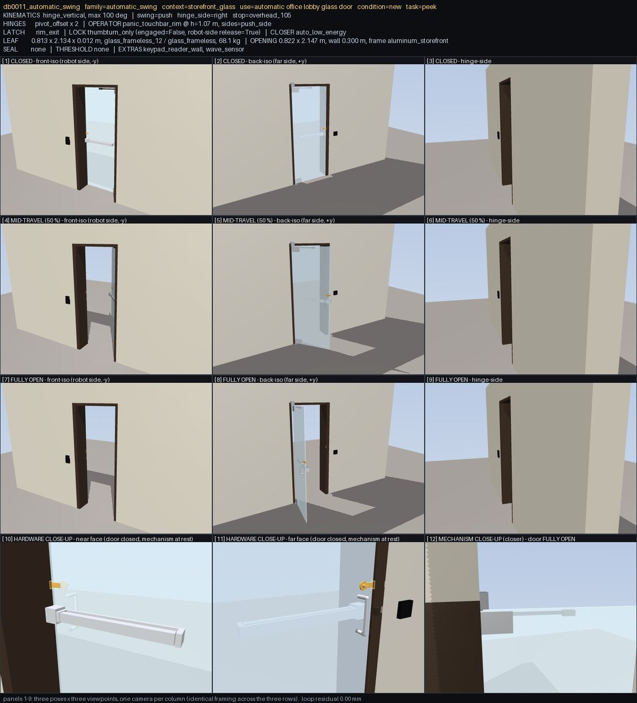

#### `db0053_elevator` (elevator)

_elevator / residential tower elevator: mechanism_cannot_work; missing_hardware; wrong_scale_

* **BLOCKER / mechanism_cannot_work** - primary joint leaf_a_slide: The task is 'unlock_open_traverse', which requires the door to move, but the primary joint's whole range is 2.00 mm. A MuJoCo joint range is static: releasing the interlock cannot widen it, so the door can never open. The three pose panels are identical. (seen in panels 1, 4, 7) _(confidence 0.90)_
* **MAJOR / wrong_scale** - leaf mass: The caption states 2 leaves of 0.535 x 2.100 x 0.030 m in elevator_landing and a total of 33.4 kg. The stated area density is 29.7 kg/m2, so those leaves weigh 67 kg between them: the slab mass has been computed for one leaf and then split across all 2. Every leaf is 2x too light. (seen in caption; the leaves in panels 1 and 2) _(confidence 0.90)_

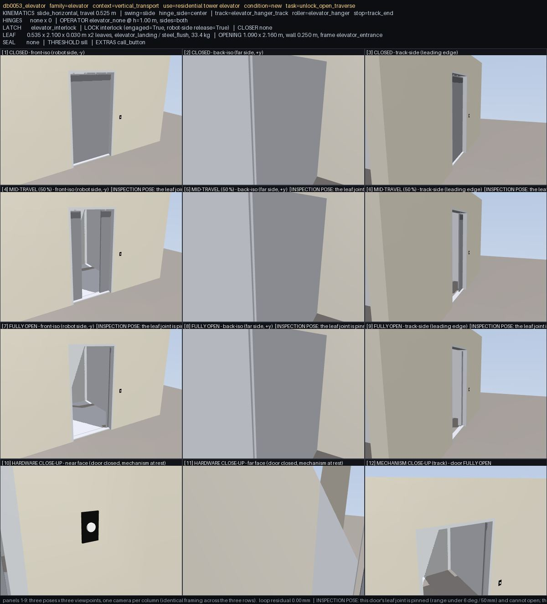

#### `db0089_automatic_swing` (automatic_swing)

_automatic_swing / automatic data center door: mechanism_cannot_work_

* **BLOCKER / mechanism_cannot_work** - automatic operator arm and shoe: The operator header is on the frame but the arm and its shoe are geoms of the leaf: they are rigid with the door. Closed, the shoe stops 35 mm short of the header; at full open the arm has swung with the leaf and points into open space half a metre from the header it is supposed to drive. The arm connects nothing. (seen in panels 7, 9, 12) _(confidence 0.90)_

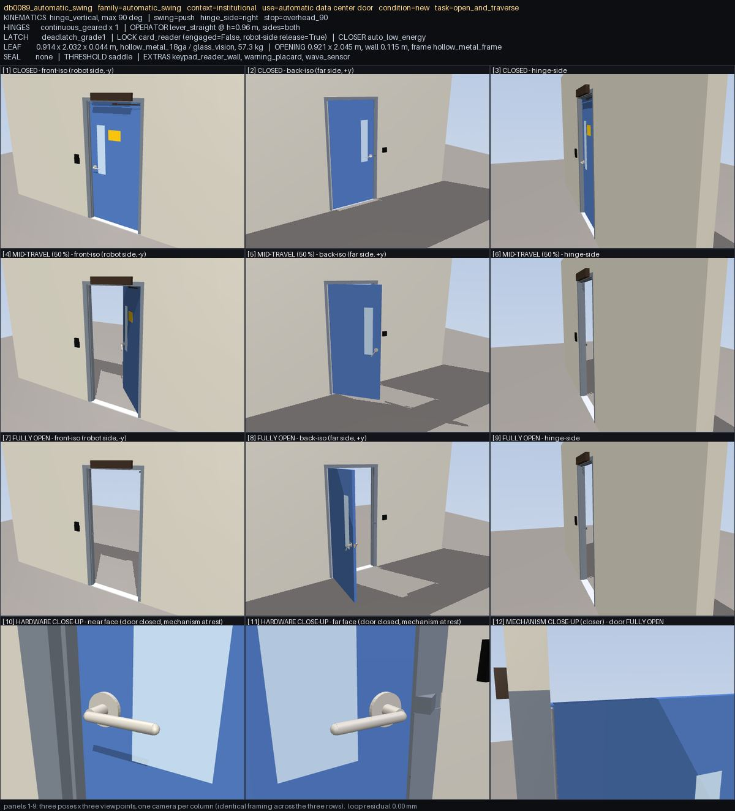

#### `db0136_automatic_swing` (automatic_swing)

_automatic_swing / automatic break room door: mechanism_cannot_work_

* **BLOCKER / mechanism_cannot_work** - automatic operator arm and shoe: The operator header is on the frame but the arm and its shoe are geoms of the leaf: they are rigid with the door. Closed, the shoe stops 35 mm short of the header; at full open the arm has swung with the leaf and points into open space half a metre from the header it is supposed to drive. The arm connects nothing. (seen in panels 7, 9, 12) _(confidence 0.90)_

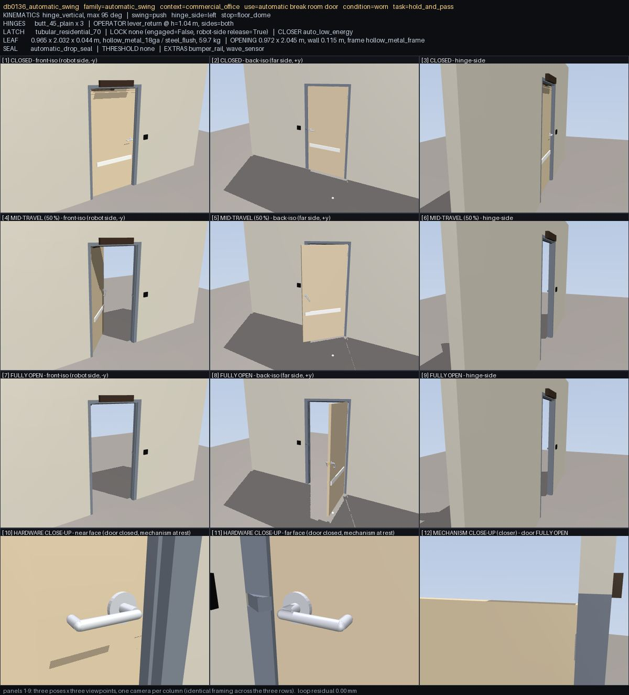

#### `db0138_automatic_swing` (automatic_swing)

_automatic_swing / automatic patient room door: mechanism_cannot_work_

* **BLOCKER / mechanism_cannot_work** - automatic operator arm and shoe: The operator header is on the frame but the arm and its shoe are geoms of the leaf: they are rigid with the door. Closed, the shoe stops 35 mm short of the header; at full open the arm has swung with the leaf and points into open space half a metre from the header it is supposed to drive. The arm connects nothing. (seen in panels 7, 9, 12) _(confidence 0.90)_

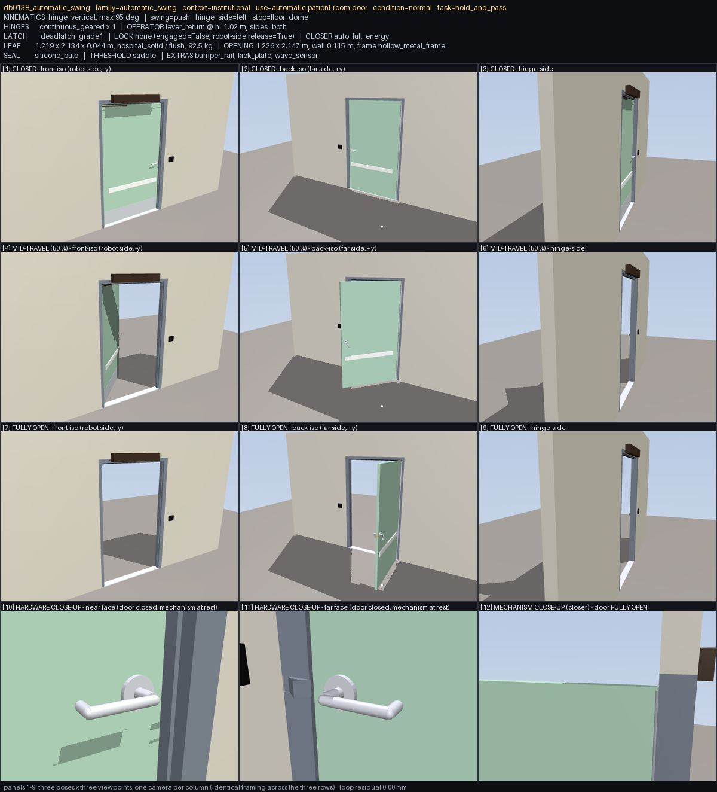

#### `db0146_gate_sliding` (gate_sliding)

_gate_sliding / warehouse yard sliding gate: mechanism_cannot_work; missing_hardware_

* **BLOCKER / mechanism_cannot_work** - primary joint leaf_slide: The task is 'unlock_open_traverse', which requires the door to move, but the primary joint's whole range is 2.00 mm. A MuJoCo joint range is static: releasing the electric_bolt cannot widen it, so the door can never open. The three pose panels are identical. (seen in panels 1, 4, 7) _(confidence 0.90)_
* **MAJOR / missing_hardware** - pull_d on the far face: The caption says the pull_d is on both sides. Only one face carries it: the other hardware close-up shows a blank leaf. A robot approaching from that side has nothing to take hold of. (seen in panels 10 and 11 compared) _(confidence 0.85)_

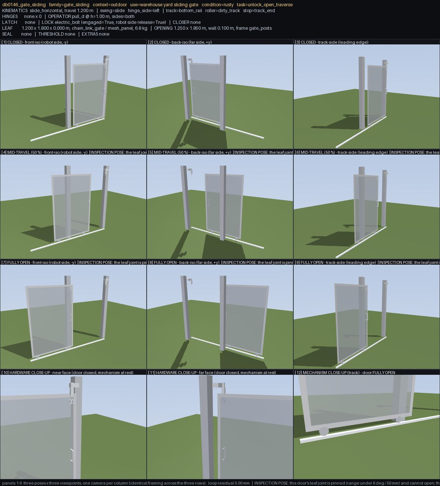

#### `db0148_garage_sectional` (garage_sectional)

_garage_sectional / detached garage door: other_obviously_wrong_

* **BLOCKER / other_obviously_wrong** - wall above the opening: There is no wall between the top of the door opening and the header: a 2.52 m tall hole the full width of the opening, open to the sky. The hole exists so the leaf can slide up inside the wall plane without interpenetrating it. (seen in panels 1, 2, 4, 5, 7, 8) _(confidence 0.95)_

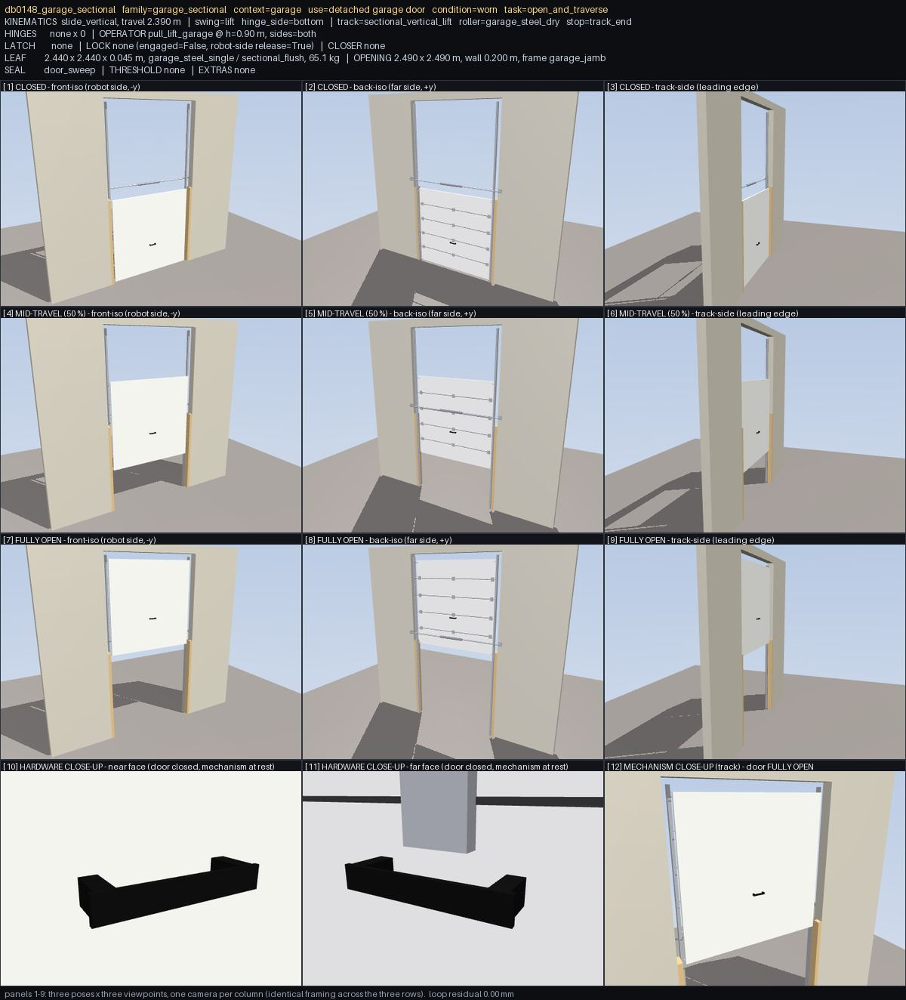

#### `db0158_swing_double` (swing_double)

_swing_double / mall corridor smoke doors: mechanism_cannot_work; wrong_scale_

* **BLOCKER / mechanism_cannot_work** - automatic operator arm and shoe: The operator header is on the frame but the arm and its shoe are geoms of the leaf: they are rigid with the door. Closed, the shoe stops 35 mm short of the header; at full open the arm has swung with the leaf and points into open space half a metre from the header it is supposed to drive. The arm connects nothing. (seen in panels 7, 9, 12) _(confidence 0.90)_
* **MAJOR / wrong_scale** - leaf mass: The caption states 2 leaves of 1.067 x 2.134 x 0.044 m in hospital_solid and a total of 90.3 kg. The stated area density is 33.1 kg/m2, so those leaves weigh 151 kg between them: the slab mass has been computed for one leaf and then split across all 2. Every leaf is 2x too light. (seen in caption; the leaves in panels 1 and 2) _(confidence 0.90)_
* **MAJOR / mechanism_cannot_work** - double-egress leaf pair: The caption calls this a double-egress pair, which by definition has one leaf swinging each way. Both leaves are hinged on the same axis sign with the same range, so both swing the same way: it is an ordinary pair. (seen in panels 4, 5, 7, 8) _(confidence 0.80)_

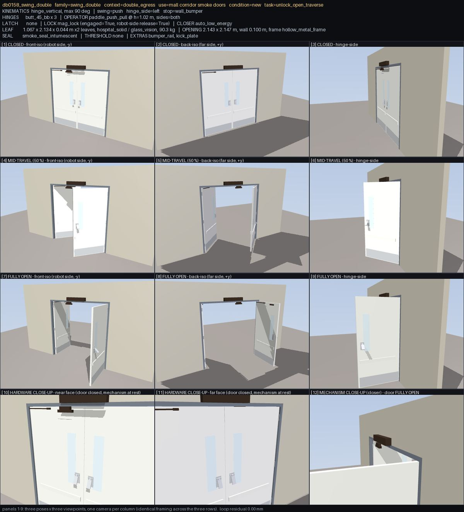

#### `db0175_garage_sectional` (garage_sectional)

_garage_sectional / townhouse garage door: floating_part; other_obviously_wrong_

* **BLOCKER / other_obviously_wrong** - wall above the opening: There is no wall between the top of the door opening and the header: a 2.21 m tall hole the full width of the opening, open to the sky. The hole exists so the leaf can slide up inside the wall plane without interpenetrating it. (seen in panels 1, 2, 4, 5, 7, 8) _(confidence 0.95)_
* **MAJOR / floating_part** - garage opener unit: The opener motor hangs 3 m out from the wall on the end of an unsupported rail, in a scene with no ceiling to hang it from and no drop straps: a black box in mid-air. (seen in panels 1, 3, 6, 9) _(confidence 0.80)_

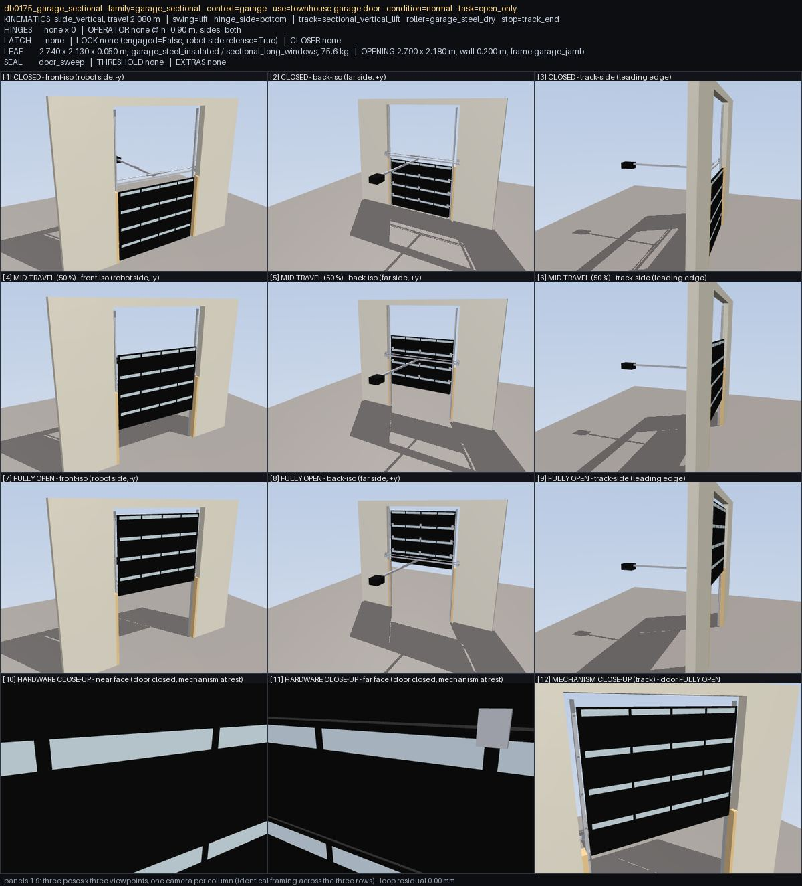

#### `db0187_turnstile_fullheight` (turnstile_fullheight)

_turnstile_fullheight / factory gate turnstile: mechanism_cannot_work; missing_hardware; wrong_scale_

* **BLOCKER / mechanism_cannot_work** - primary joint rotor_hinge: The task is 'traverse_open', which requires the door to move, but the primary joint's whole range is 5.73 deg. A MuJoCo joint range is static: releasing the mag_lock cannot widen it, so the door can never open. The three pose panels are identical. (seen in panels 1, 4, 7) _(confidence 0.90)_
* **MAJOR / wrong_scale** - leaf mass: The caption states 3 leaves of 0.650 x 2.100 x 0.038 m in turnstile_arm and a total of 16.8 kg. The stated area density is 300.2 kg/m2, so those leaves weigh 1229 kg between them: the slab mass has been computed for one leaf and then split across all 3. Every leaf is 3x too light. (seen in caption; the leaves in panels 1 and 2) _(confidence 0.90)_
* **MAJOR / missing_hardware** - keypad_reader_wall: The caption lists keypad_reader_wall among the extras, and no geometry for it exists anywhere on the door - not hidden, absent. (physics.py still charges hardware mass for several of these, so the door carries weight for parts that are not there.) (seen in panels 1, 2, 10, 11) _(confidence 0.90)_

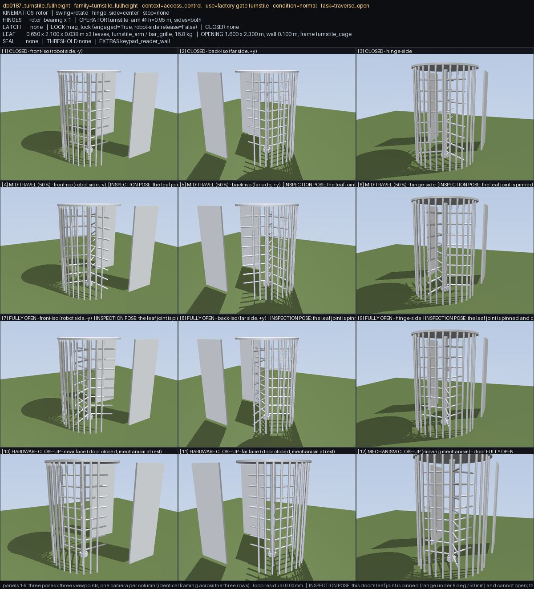

#### `db0190_turnstile_fullheight` (turnstile_fullheight)

_turnstile_fullheight / parking garage pedestrian turnstile: mechanism_cannot_work; missing_hardware; wrong_scale_

* **BLOCKER / mechanism_cannot_work** - primary joint rotor_hinge: The task is 'push_through', which requires the door to move, but the primary joint's whole range is 5.73 deg. A MuJoCo joint range is static: releasing the mag_lock cannot widen it, so the door can never open. The three pose panels are identical. (seen in panels 1, 4, 7) _(confidence 0.90)_
* **MAJOR / wrong_scale** - leaf mass: The caption states 3 leaves of 0.650 x 2.100 x 0.038 m in turnstile_arm and a total of 16.8 kg. The stated area density is 300.2 kg/m2, so those leaves weigh 1229 kg between them: the slab mass has been computed for one leaf and then split across all 3. Every leaf is 3x too light. (seen in caption; the leaves in panels 1 and 2) _(confidence 0.90)_
* **MAJOR / missing_hardware** - keypad_reader_wall: The caption lists keypad_reader_wall among the extras, and no geometry for it exists anywhere on the door - not hidden, absent. (physics.py still charges hardware mass for several of these, so the door carries weight for parts that are not there.) (seen in panels 1, 2, 10, 11) _(confidence 0.90)_

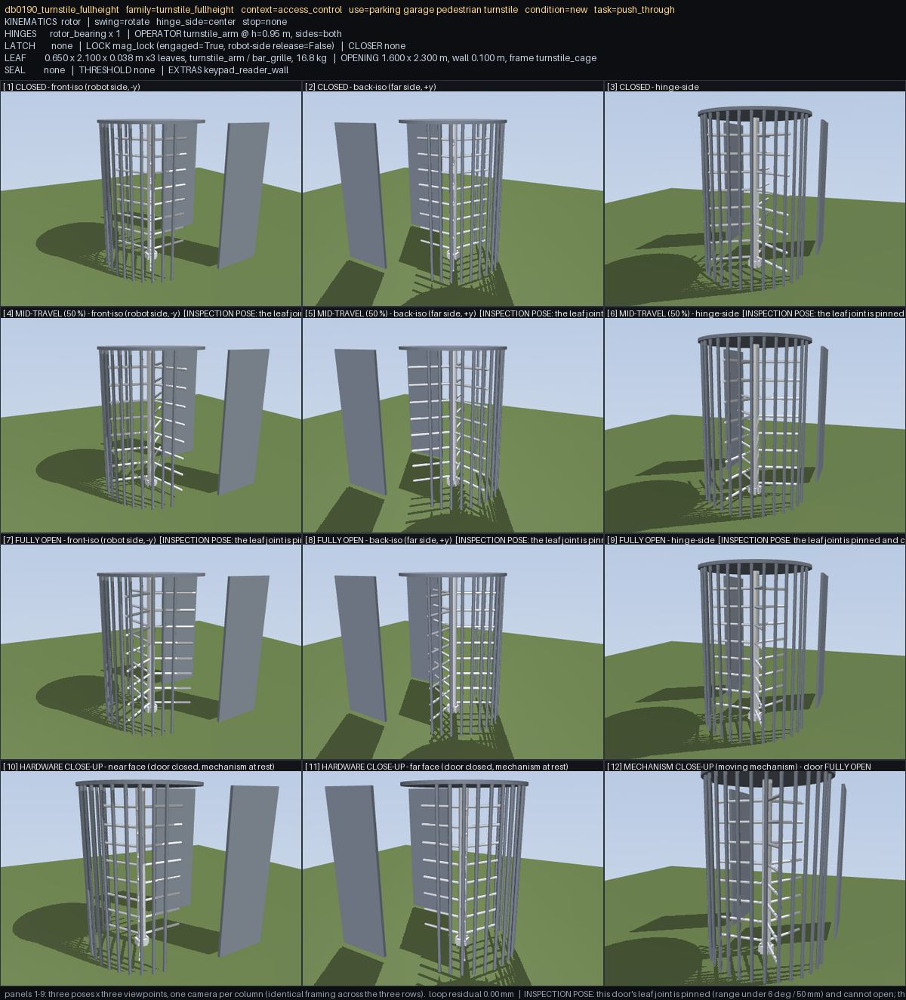

#### `db0196_rollup` (rollup)

_rollup / parking garage grille: missing_hardware; runner_off_guide_

* **BLOCKER / runner_off_guide** - roll-up curtain and its coiling guides: The curtain does not coil: it rises as one rigid slab and at full open sits entirely above its side guides and above the drum hood, with its top edge past the top of the wall and nothing on either side holding it. Measured: guides end at the opening head, the curtain at full open spans from there to 2.1-3.6 m above them. (seen in panels 7, 8, 9, 12) _(confidence 0.95)_
* **MAJOR / missing_hardware** - pull_ring on the far face: The caption says the pull_ring is on both sides. Only one face carries it: the other hardware close-up shows a blank leaf. A robot approaching from that side has nothing to take hold of. (seen in panels 10 and 11 compared) _(confidence 0.85)_

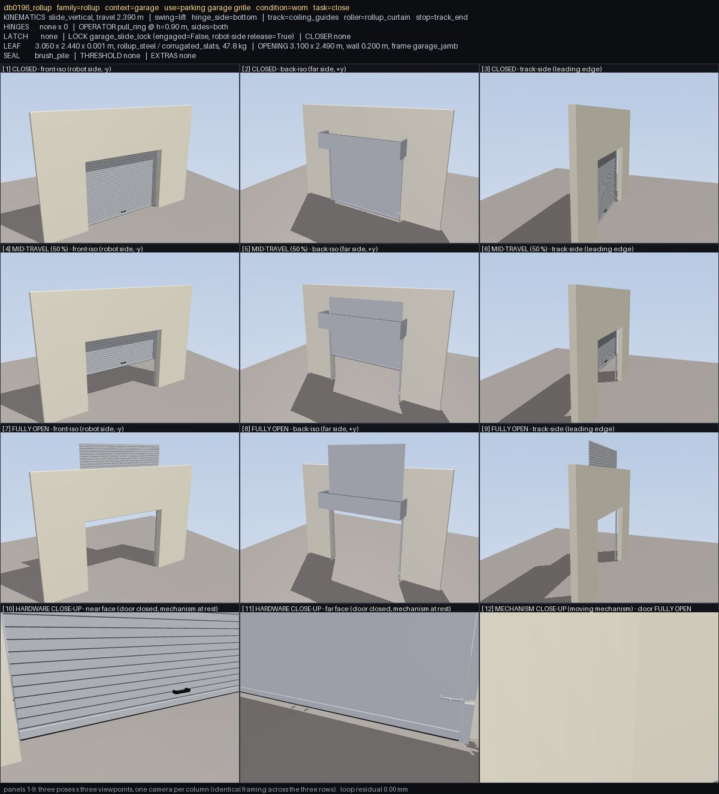

#### `db0435_rollup` (rollup)

_rollup / self-storage unit roll-up door: missing_hardware; runner_off_guide_

* **BLOCKER / runner_off_guide** - roll-up curtain and its coiling guides: The curtain does not coil: it rises as one rigid slab and at full open sits entirely above its side guides and above the drum hood, with its top edge past the top of the wall and nothing on either side holding it. Measured: guides end at the opening head, the curtain at full open spans from there to 2.1-3.6 m above them. (seen in panels 7, 8, 9, 12) _(confidence 0.95)_
* **MAJOR / missing_hardware** - pull_d on the far face: The caption says the pull_d is on both sides. Only one face carries it: the other hardware close-up shows a blank leaf. A robot approaching from that side has nothing to take hold of. (seen in panels 10 and 11 compared) _(confidence 0.85)_

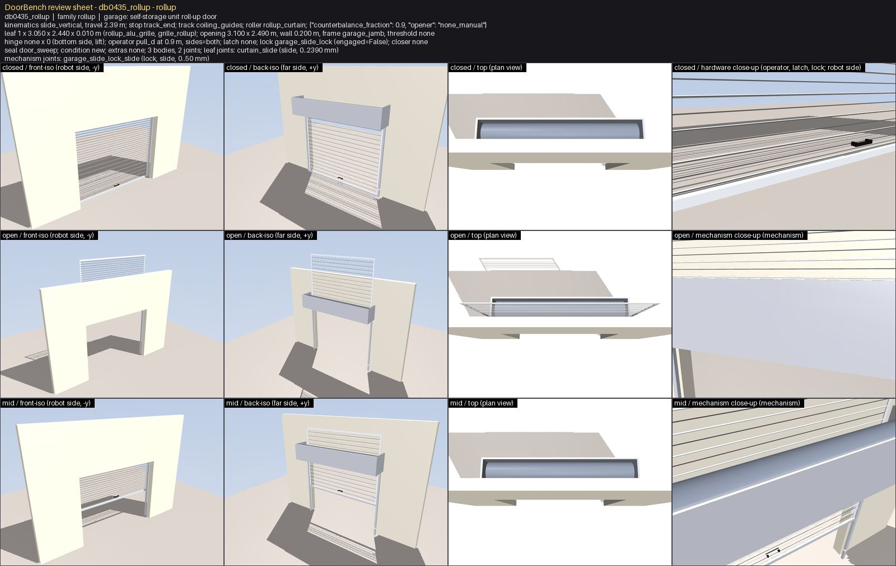

#### `db0440_turnstile_fullheight` (turnstile_fullheight)

_turnstile_fullheight / stadium full-height turnstile: mechanism_cannot_work; missing_hardware; wrong_scale_

* **BLOCKER / mechanism_cannot_work** - primary joint rotor_hinge: The task is 'push_through', which requires the door to move, but the primary joint's whole range is 5.73 deg. A MuJoCo joint range is static: releasing the mag_lock cannot widen it, so the door can never open. The three pose panels are identical. (seen in panels 1, 4, 7) _(confidence 0.90)_
* **MAJOR / wrong_scale** - leaf mass: The caption states 3 leaves of 0.750 x 2.100 x 0.038 m in turnstile_arm and a total of 17.9 kg. The stated area density is 300.2 kg/m2, so those leaves weigh 1418 kg between them: the slab mass has been computed for one leaf and then split across all 3. Every leaf is 3x too light. (seen in caption; the leaves in panels 1 and 2) _(confidence 0.90)_
* **MAJOR / missing_hardware** - keypad_reader_wall: The caption lists keypad_reader_wall among the extras, and no geometry for it exists anywhere on the door - not hidden, absent. (physics.py still charges hardware mass for several of these, so the door carries weight for parts that are not there.) (seen in panels 1, 2, 10, 11) _(confidence 0.90)_

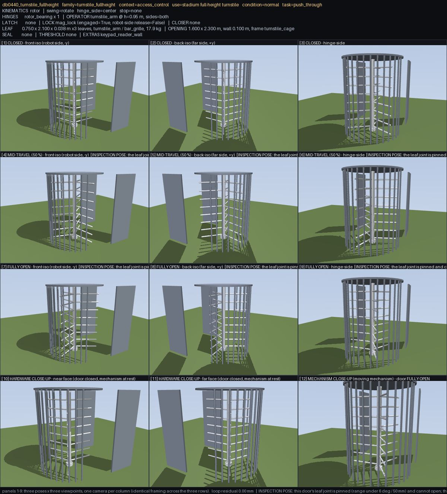

#### `db0516_turnstile_tripod` (turnstile_tripod)

_turnstile_tripod / subway tripod turnstile: mechanism_cannot_work; missing_hardware; wrong_scale_

* **BLOCKER / mechanism_cannot_work** - primary joint rotor_hinge: The task is 'push_through', which requires the door to move, but the primary joint's whole range is 5.73 deg. A MuJoCo joint range is static: releasing the mag_lock cannot widen it, so the door can never open. The three pose panels are identical. (seen in panels 1, 4, 7) _(confidence 0.90)_
* **MAJOR / wrong_scale** - leaf mass: The caption states 3 leaves of 0.500 x 1.000 x 0.038 m in turnstile_arm and a total of 10.7 kg. The stated area density is 300.2 kg/m2, so those leaves weigh 450 kg between them: the slab mass has been computed for one leaf and then split across all 3. Every leaf is 3x too light. (seen in caption; the leaves in panels 1 and 2) _(confidence 0.90)_
* **MAJOR / missing_hardware** - keypad_reader_wall: The caption lists keypad_reader_wall among the extras, and no geometry for it exists anywhere on the door - not hidden, absent. (physics.py still charges hardware mass for several of these, so the door carries weight for parts that are not there.) (seen in panels 1, 2, 10, 11) _(confidence 0.90)_


#### `db0574_garage_sectional` (garage_sectional)

_garage_sectional / residential double garage door: floating_part; other_obviously_wrong_

* **BLOCKER / other_obviously_wrong** - wall above the opening: There is no wall between the top of the door opening and the header: a 2.21 m tall hole the full width of the opening, open to the sky. The hole exists so the leaf can slide up inside the wall plane without interpenetrating it. (seen in panels 1, 2, 4, 5, 7, 8) _(confidence 0.95)_
* **MAJOR / floating_part** - garage opener unit: The opener motor hangs 3 m out from the wall on the end of an unsupported rail, in a scene with no ceiling to hang it from and no drop straps: a black box in mid-air. (seen in panels 1, 3, 6, 9) _(confidence 0.80)_

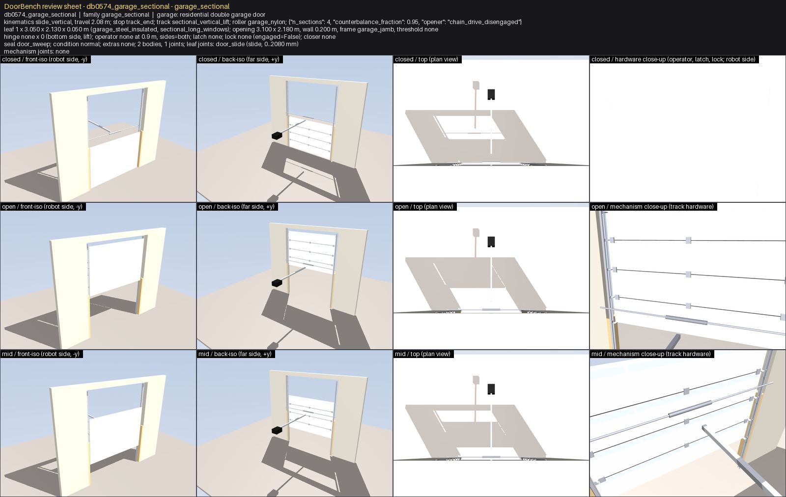

#### `db0607_elevator` (elevator)

_elevator / office elevator landing doors: mechanism_cannot_work; missing_hardware_

* **BLOCKER / mechanism_cannot_work** - primary joint leaf_slide: The task is 'unlock_open_traverse', which requires the door to move, but the primary joint's whole range is 2.00 mm. A MuJoCo joint range is static: releasing the interlock cannot widen it, so the door can never open. The three pose panels are identical. (seen in panels 1, 4, 7) _(confidence 0.90)_

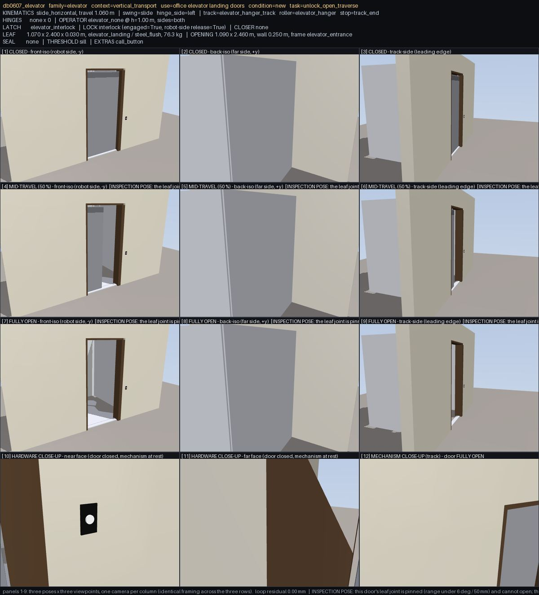

#### `db0811_elevator` (elevator)

_elevator / office elevator landing doors: mechanism_cannot_work; missing_hardware; wrong_scale_

* **BLOCKER / mechanism_cannot_work** - primary joint leaf_a_slide: The task is 'unlock_open_traverse', which requires the door to move, but the primary joint's whole range is 2.00 mm. A MuJoCo joint range is static: releasing the interlock cannot widen it, so the door can never open. The three pose panels are identical. (seen in panels 1, 4, 7) _(confidence 0.90)_
* **MAJOR / wrong_scale** - leaf mass: The caption states 2 leaves of 0.450 x 2.400 x 0.030 m in elevator_landing and a total of 32.1 kg. The stated area density is 29.7 kg/m2, so those leaves weigh 64 kg between them: the slab mass has been computed for one leaf and then split across all 2. Every leaf is 2x too light. (seen in caption; the leaves in panels 1 and 2) _(confidence 0.90)_

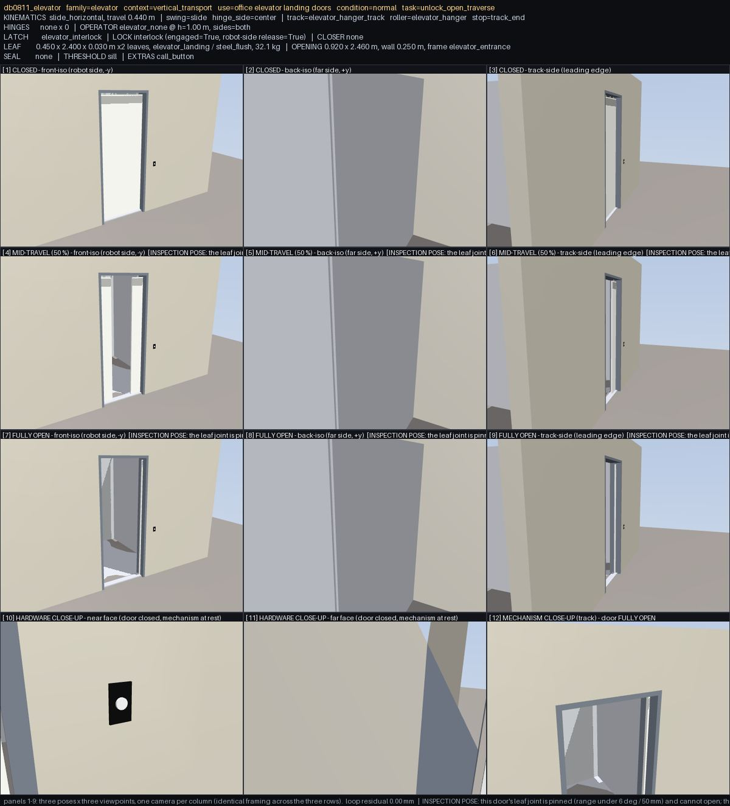

#### `db0839_garage_sectional` (garage_sectional)

_garage_sectional / detached garage door: missing_hardware; other_obviously_wrong_

* **BLOCKER / other_obviously_wrong** - wall above the opening: There is no wall between the top of the door opening and the header: a 2.21 m tall hole the full width of the opening, open to the sky. The hole exists so the leaf can slide up inside the wall plane without interpenetrating it. (seen in panels 1, 2, 4, 5, 7, 8) _(confidence 0.95)_
* **MAJOR / missing_hardware** - pull_t_handle_garage on the far face: The caption says the pull_t_handle_garage is on both sides. Only one face carries it: the other hardware close-up shows a blank leaf. A robot approaching from that side has nothing to take hold of. (seen in panels 10 and 11 compared) _(confidence 0.85)_

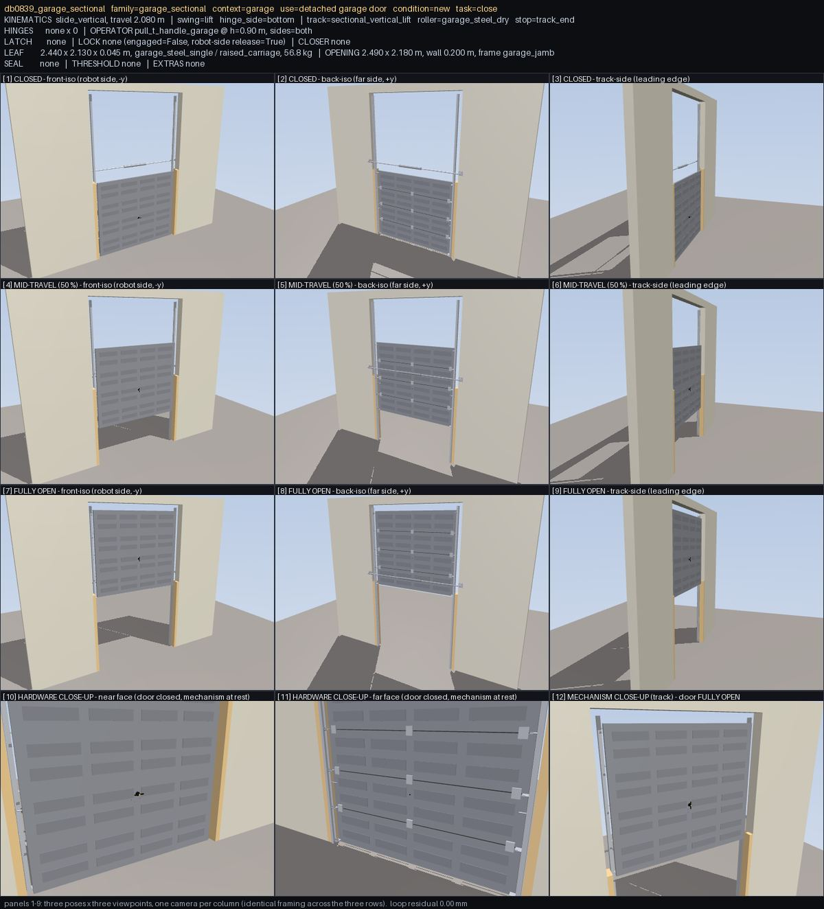

#### `db0873_rollup` (rollup)

_rollup / parking garage grille: runner_off_guide_

* **BLOCKER / runner_off_guide** - roll-up curtain and its coiling guides: The curtain does not coil: it rises as one rigid slab and at full open sits entirely above its side guides and above the drum hood, with its top edge past the top of the wall and nothing on either side holding it. Measured: guides end at the opening head, the curtain at full open spans from there to 2.1-3.6 m above them. (seen in panels 7, 8, 9, 12) _(confidence 0.95)_

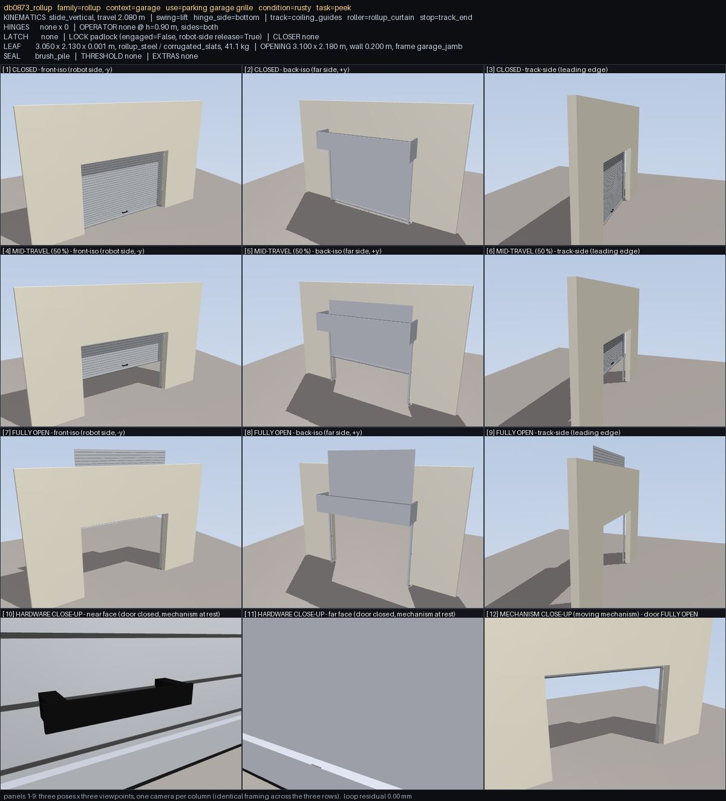

#### `db0892_pet_door` (pet_door)

_pet_door / small dog pet door in wall: mechanism_cannot_work_

* **BLOCKER / mechanism_cannot_work** - primary joint flap_hinge: The task is 'push_through', which requires the door to move, but the primary joint's whole range is 0.11 deg. A MuJoCo joint range is static: releasing the slide_bolt cannot widen it, so the door can never open. The three pose panels are identical. (seen in panels 1, 4, 7) _(confidence 0.90)_

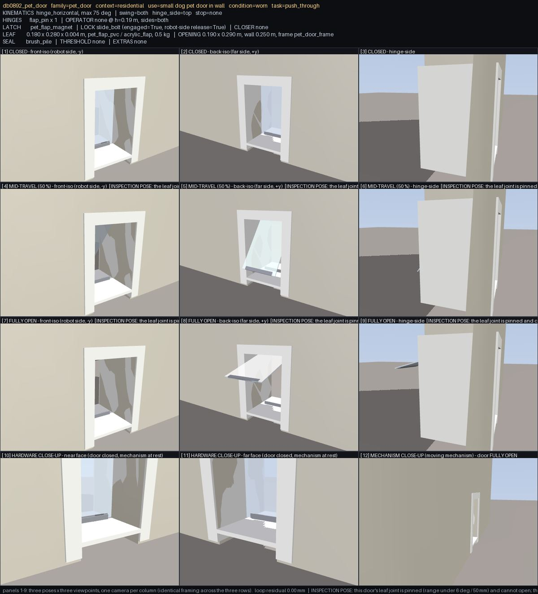

#### `db0962_elevator` (elevator)

_elevator / freight elevator doors: mechanism_cannot_work; missing_hardware; wrong_scale_

* **BLOCKER / mechanism_cannot_work** - primary joint leaf_a_slide: The task is 'unlock_open_traverse', which requires the door to move, but the primary joint's whole range is 2.00 mm. A MuJoCo joint range is static: releasing the interlock cannot widen it, so the door can never open. The three pose panels are identical. (seen in panels 1, 4, 7) _(confidence 0.90)_
* **MAJOR / wrong_scale** - leaf mass: The caption states 2 leaves of 0.600 x 2.100 x 0.030 m in elevator_landing and a total of 37.4 kg. The stated area density is 29.7 kg/m2, so those leaves weigh 75 kg between them: the slab mass has been computed for one leaf and then split across all 2. Every leaf is 2x too light. (seen in caption; the leaves in panels 1 and 2) _(confidence 0.90)_

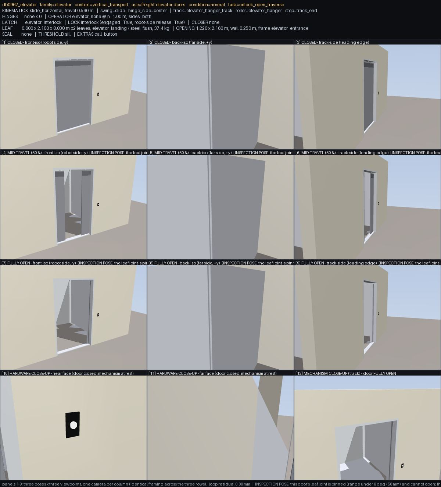

#### `db0983_rollup` (rollup)

_rollup / warehouse coiling door: missing_hardware; runner_off_guide_

* **BLOCKER / runner_off_guide** - roll-up curtain and its coiling guides: The curtain does not coil: it rises as one rigid slab and at full open sits entirely above its side guides and above the drum hood, with its top edge past the top of the wall and nothing on either side holding it. Measured: guides end at the opening head, the curtain at full open spans from there to 2.1-3.6 m above them. (seen in panels 7, 8, 9, 12) _(confidence 0.95)_
* **MAJOR / missing_hardware** - pull_ring on the far face: The caption says the pull_ring is on both sides. Only one face carries it: the other hardware close-up shows a blank leaf. A robot approaching from that side has nothing to take hold of. (seen in panels 10 and 11 compared) _(confidence 0.85)_

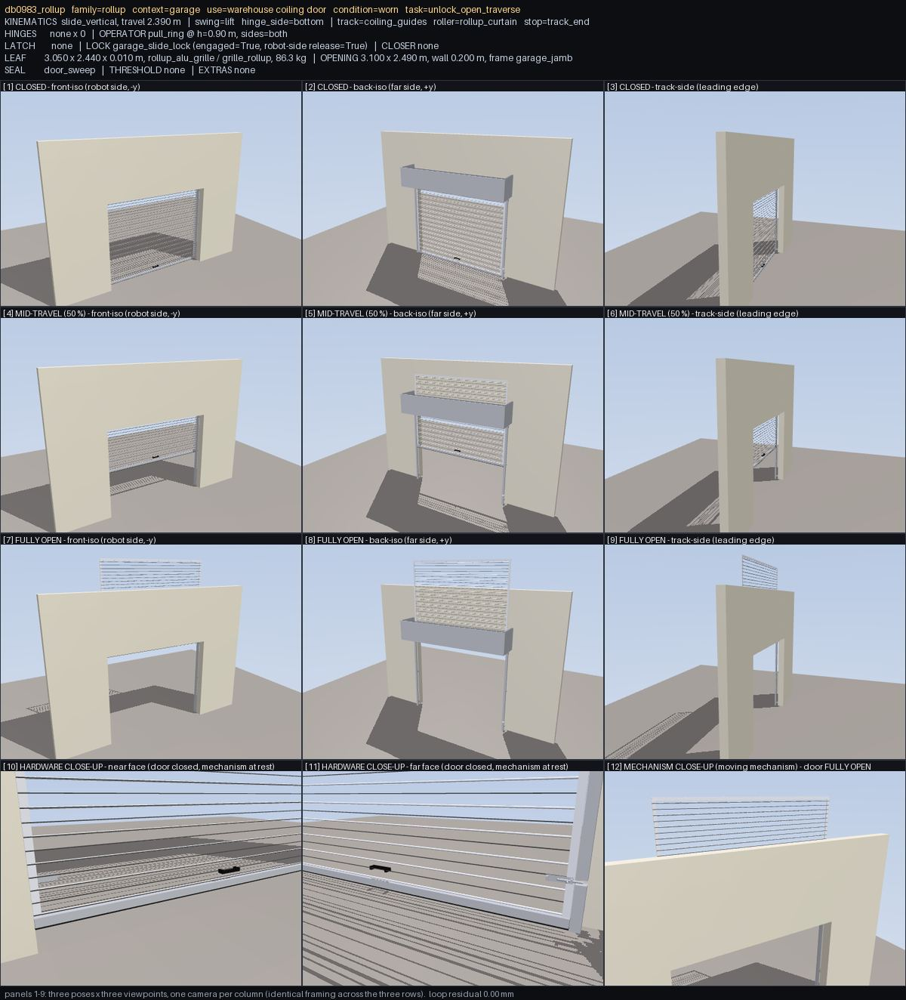

#### `db0994_turnstile_tripod` (turnstile_tripod)

_turnstile_tripod / gym entrance turnstile: mechanism_cannot_work; missing_hardware; wrong_scale_

* **BLOCKER / mechanism_cannot_work** - primary joint rotor_hinge: The task is 'push_through', which requires the door to move, but the primary joint's whole range is 5.73 deg. A MuJoCo joint range is static: releasing the mag_lock cannot widen it, so the door can never open. The three pose panels are identical. (seen in panels 1, 4, 7) _(confidence 0.90)_
* **MAJOR / wrong_scale** - leaf mass: The caption states 3 leaves of 0.500 x 1.000 x 0.038 m in turnstile_arm and a total of 10.7 kg. The stated area density is 300.2 kg/m2, so those leaves weigh 450 kg between them: the slab mass has been computed for one leaf and then split across all 3. Every leaf is 3x too light. (seen in caption; the leaves in panels 1 and 2) _(confidence 0.90)_
* **MAJOR / missing_hardware** - keypad_reader_wall: The caption lists keypad_reader_wall among the extras, and no geometry for it exists anywhere on the door - not hidden, absent. (physics.py still charges hardware mass for several of these, so the door carries weight for parts that are not there.) (seen in panels 1, 2, 10, 11) _(confidence 0.90)_

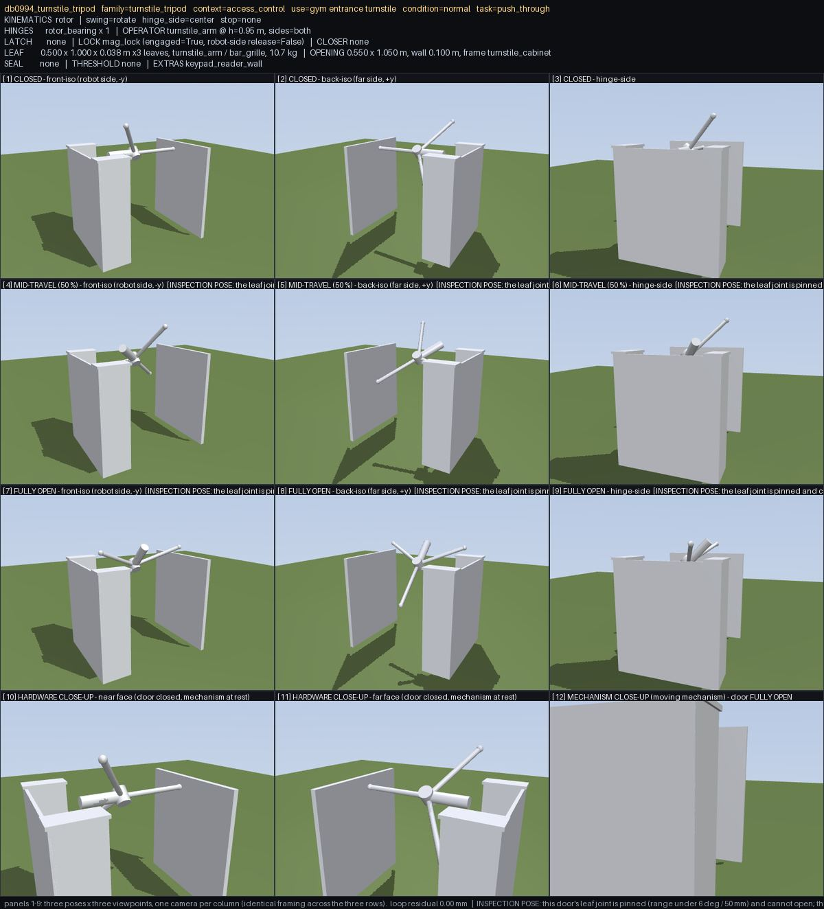

#### `db0004_bifold` (bifold)

_bifold / bedroom closet bifold: wrong_scale_

* **MAJOR / wrong_scale** - leaf mass: The caption states 2 leaves of 0.762 x 2.400 x 0.035 m in louver_wood and a total of 14.3 kg. The stated area density is 7.7 kg/m2, so those leaves weigh 28 kg between them: the slab mass has been computed for one leaf and then split across all 2. Every leaf is 2x too light. (seen in caption; the leaves in panels 1 and 2) _(confidence 0.90)_

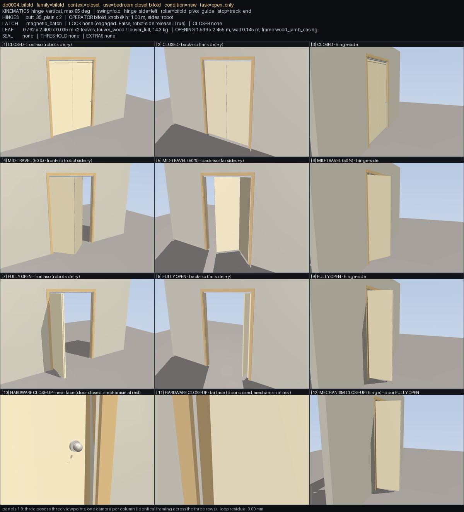

#### `db0005_garage_tiltup` (garage_tiltup)

_garage_tiltup / 1960s tilt-up garage door: missing_hardware_

* **MAJOR / missing_hardware** - pull_lift_garage on the far face: The caption says the pull_lift_garage is on both sides. Only one face carries it: the other hardware close-up shows a blank leaf. A robot approaching from that side has nothing to take hold of. (seen in panels 10 and 11 compared) _(confidence 0.85)_

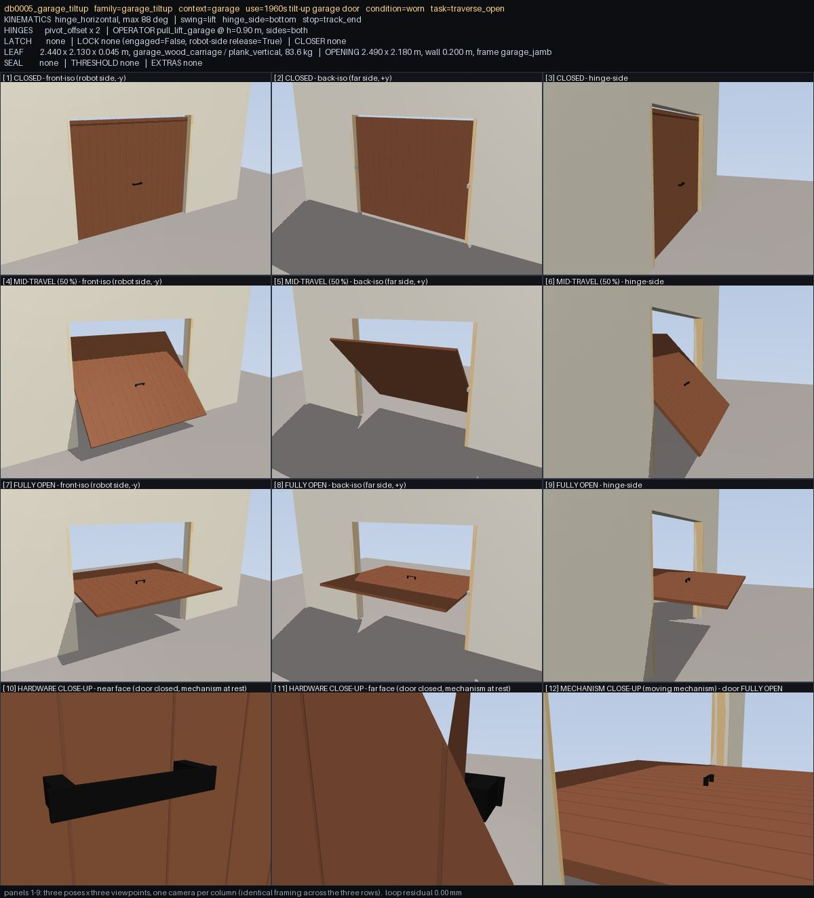

#### `db0037_strip_curtain` (strip_curtain)

_strip_curtain / loading bay PVC strips: wrong_scale_

* **MAJOR / wrong_scale** - leaf mass: The caption states 5 leaves of 0.300 x 2.380 x 0.002 m in strip_curtain and a total of 2.9 kg. The stated area density is 2.5 kg/m2, so those leaves weigh 9 kg between them: the slab mass has been computed for one leaf and then split across all 5. Every leaf is 5x too light. (seen in caption; the leaves in panels 1 and 2) _(confidence 0.90)_

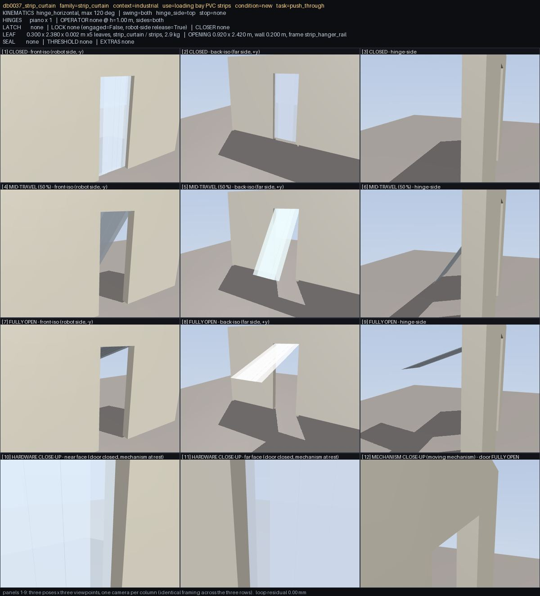

#### `db0079_sliding_single` (sliding_single)

_sliding_single / barn door to office: missing_hardware_

* **MAJOR / missing_hardware** - pull_barn_iron on the far face: The caption says the pull_barn_iron is on both sides. Only one face carries it: the other hardware close-up shows a blank leaf. A robot approaching from that side has nothing to take hold of. (seen in panels 10 and 11 compared) _(confidence 0.85)_

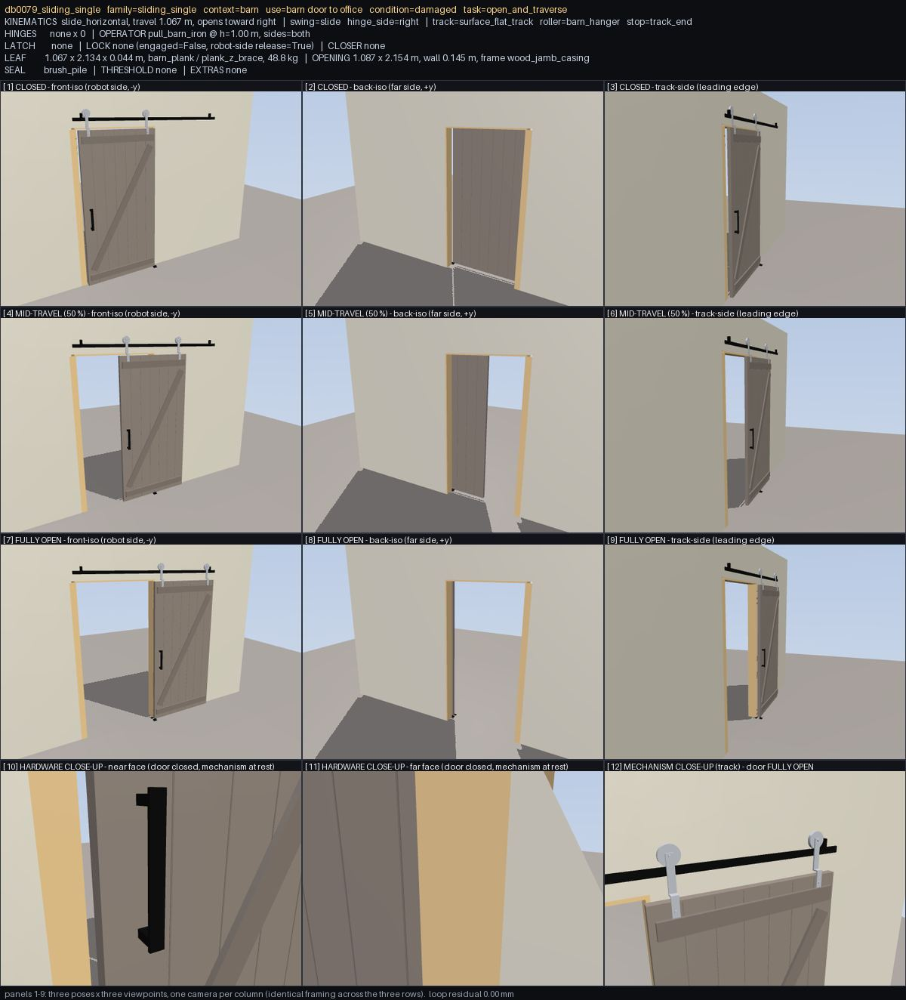

#### `db0092_sliding_bypass` (sliding_bypass)

_sliding_bypass / shoji closet (oshiire): wrong_scale_

* **MAJOR / wrong_scale** - leaf mass: The caption states 2 leaves of 0.610 x 2.032 x 0.035 m in hollow_core and a total of 9.0 kg. The stated area density is 7.2 kg/m2, so those leaves weigh 18 kg between them: the slab mass has been computed for one leaf and then split across all 2. Every leaf is 2x too light. (seen in caption; the leaves in panels 1 and 2) _(confidence 0.90)_

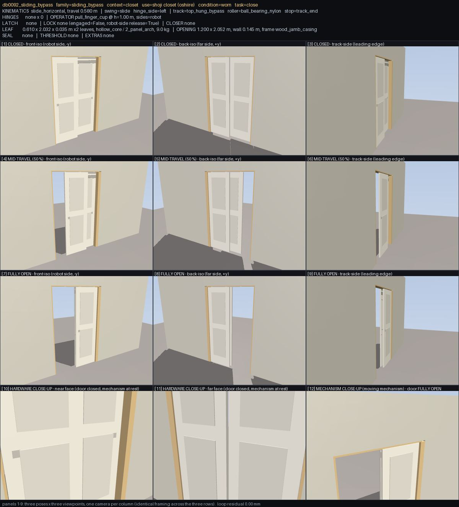

#### `db0104_garage_tiltup` (garage_tiltup)

_garage_tiltup / carport tilt-up door: missing_hardware_

* **MAJOR / missing_hardware** - pull_t_handle_garage on the far face: The caption says the pull_t_handle_garage is on both sides. Only one face carries it: the other hardware close-up shows a blank leaf. A robot approaching from that side has nothing to take hold of. (seen in panels 10 and 11 compared) _(confidence 0.85)_

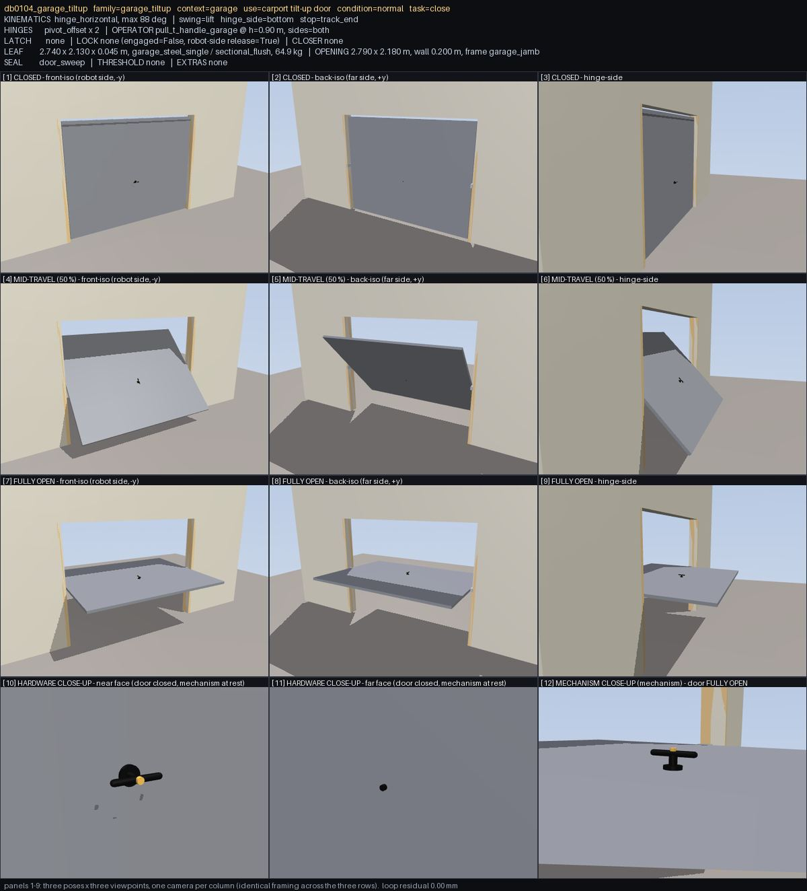

#### `db0112_swing_double` (swing_double)

_swing_double / airport concourse double egress: mechanism_cannot_work; wrong_scale_

* **MAJOR / wrong_scale** - leaf mass: The caption states 2 leaves of 0.914 x 2.134 x 0.044 m in hollow_metal_18ga and a total of 62.9 kg. The stated area density is 24.2 kg/m2, so those leaves weigh 95 kg between them: the slab mass has been computed for one leaf and then split across all 2. Every leaf is 2x too light. (seen in caption; the leaves in panels 1 and 2) _(confidence 0.90)_
* **MAJOR / mechanism_cannot_work** - double-egress leaf pair: The caption calls this a double-egress pair, which by definition has one leaf swinging each way. Both leaves are hinged on the same axis sign with the same range, so both swing the same way: it is an ordinary pair. (seen in panels 4, 5, 7, 8) _(confidence 0.80)_

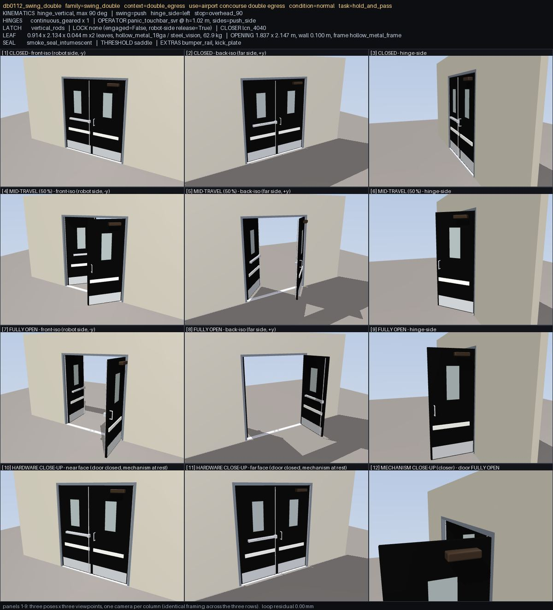

#### `db0163_strip_curtain` (strip_curtain)

_strip_curtain / warehouse dock strip door: wrong_scale_

* **MAJOR / wrong_scale** - leaf mass: The caption states 9 leaves of 0.200 x 2.080 x 0.002 m in strip_curtain and a total of 2.1 kg. The stated area density is 2.5 kg/m2, so those leaves weigh 9 kg between them: the slab mass has been computed for one leaf and then split across all 9. Every leaf is 9x too light. (seen in caption; the leaves in panels 1 and 2) _(confidence 0.90)_

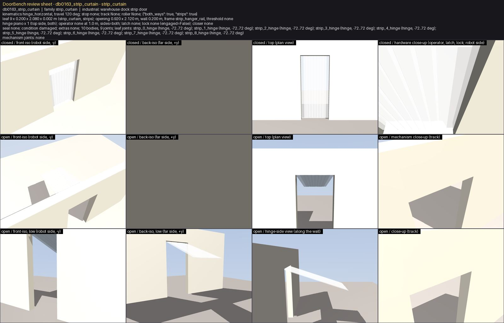

#### `db0168_ship_watertight` (ship_watertight)

_ship_watertight / engine room WT door: missing_hardware_

* **MAJOR / missing_hardware** - hook-and-eye holdback: The caption says stop=hook_holdback, and no hook-and-eye holdback is modelled: at full open the leaf is held by nothing. (seen in panels 7, 9) _(confidence 0.85)_
* **MAJOR / missing_hardware** - dog_lever on the far face: The caption says the dog_lever is on both sides. Only one face carries it: the other hardware close-up shows a blank leaf. A robot approaching from that side has nothing to take hold of. (seen in panels 10 and 11 compared) _(confidence 0.85)_

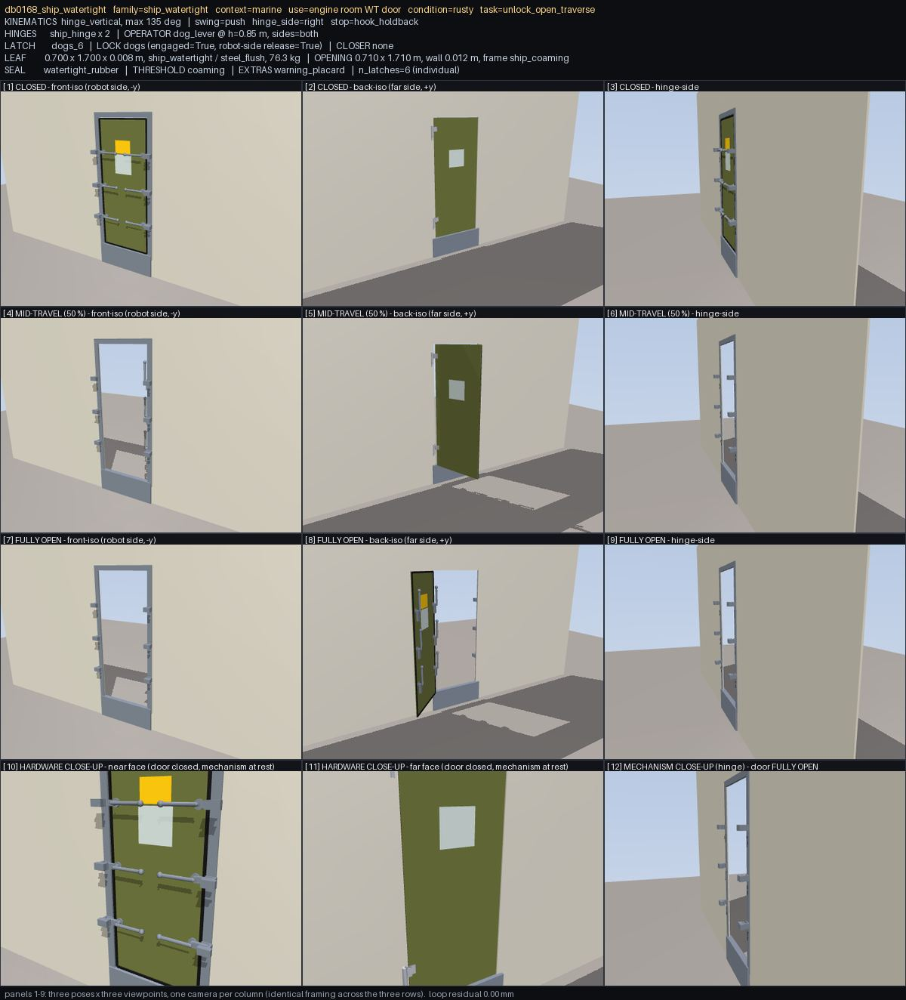

#### `db0176_baby_gate` (baby_gate)

_baby_gate / kitchen doorway baby gate: missing_hardware_

* **MAJOR / missing_hardware** - baby_gate_latch on the far face: The caption says the baby_gate_latch is on both sides. Only one face carries it: the other hardware close-up shows a blank leaf. A robot approaching from that side has nothing to take hold of. (seen in panels 10 and 11 compared) _(confidence 0.85)_

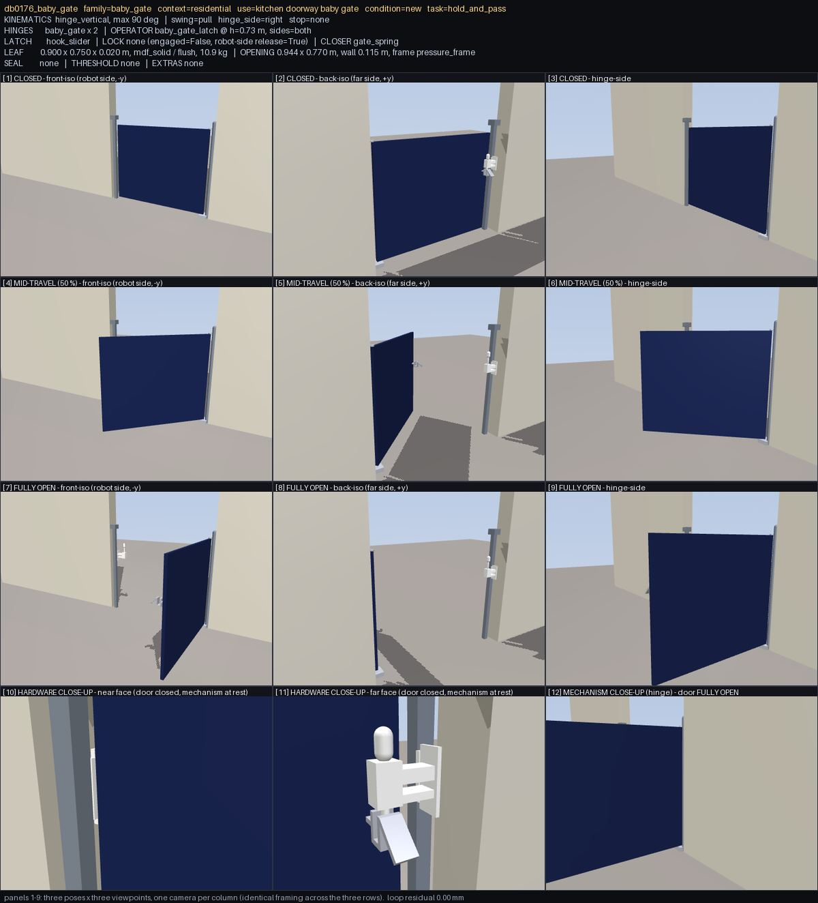

#### `db0177_accordion` (accordion)

_accordion / laundry nook accordion: wrong_scale_

* **MAJOR / wrong_scale** - leaf mass: The caption states 8 leaves of 0.114 x 2.400 x 0.018 m in mdf_solid and a total of 11.6 kg. The stated area density is 13.5 kg/m2, so those leaves weigh 30 kg between them: the slab mass has been computed for one leaf and then split across all 8. Every leaf is 8x too light. (seen in caption; the leaves in panels 1 and 2) _(confidence 0.90)_

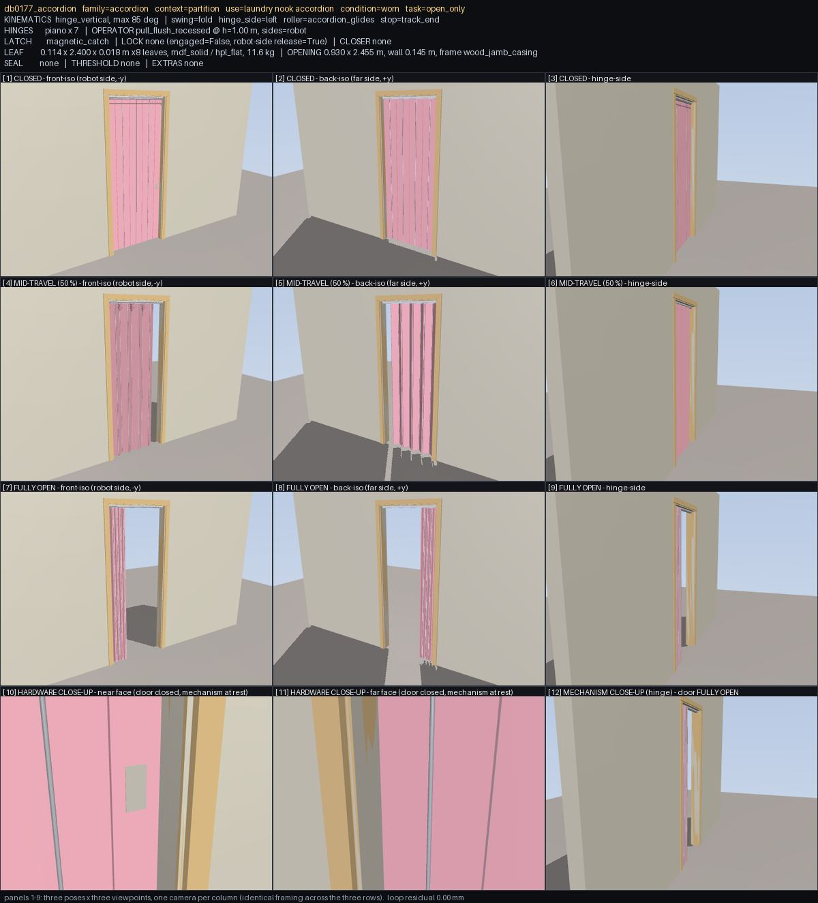

#### `db0179_vault` (vault)

_vault / safe room door: missing_hardware_

* **MAJOR / missing_hardware** - warning_placard: The caption lists warning_placard among the extras, and no geometry for it exists anywhere on the door - not hidden, absent. (physics.py still charges hardware mass for several of these, so the door carries weight for parts that are not there.) (seen in panels 1, 2, 10, 11) _(confidence 0.90)_

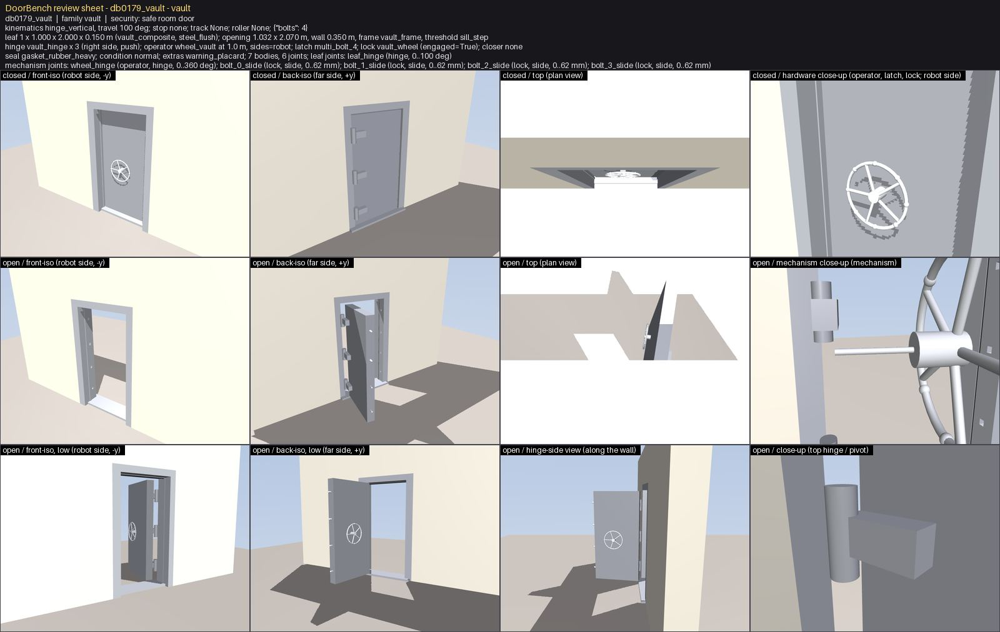

#### `db0250_revolving` (revolving)

_revolving / airport revolving door: missing_hardware; wrong_scale_

* **MAJOR / wrong_scale** - leaf mass: The caption states 4 leaves of 1.770 x 2.400 x 0.010 m in revolving_wing and a total of 109.9 kg. The stated area density is 25.0 kg/m2, so those leaves weigh 425 kg between them: the slab mass has been computed for one leaf and then split across all 4. Every leaf is 4x too light. (seen in caption; the leaves in panels 1 and 2) _(confidence 0.90)_
* **MAJOR / missing_hardware** - push_pull_sign: The caption lists push_pull_sign among the extras, and no geometry for it exists anywhere on the door - not hidden, absent. (physics.py still charges hardware mass for several of these, so the door carries weight for parts that are not there.) (seen in panels 1, 2, 10, 11) _(confidence 0.90)_

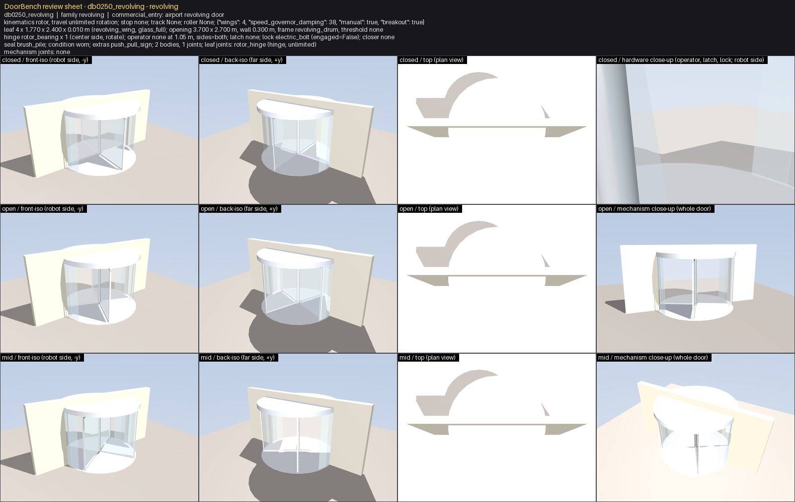

#### `db0260_revolving` (revolving)

_revolving / hospital lobby revolving door: missing_hardware; wrong_scale_

* **MAJOR / wrong_scale** - leaf mass: The caption states 4 leaves of 0.870 x 2.134 x 0.010 m in revolving_wing and a total of 49.5 kg. The stated area density is 25.0 kg/m2, so those leaves weigh 186 kg between them: the slab mass has been computed for one leaf and then split across all 4. Every leaf is 4x too light. (seen in caption; the leaves in panels 1 and 2) _(confidence 0.90)_
* **MAJOR / missing_hardware** - push_pull_sign: The caption lists push_pull_sign among the extras, and no geometry for it exists anywhere on the door - not hidden, absent. (physics.py still charges hardware mass for several of these, so the door carries weight for parts that are not there.) (seen in panels 1, 2, 10, 11) _(confidence 0.90)_

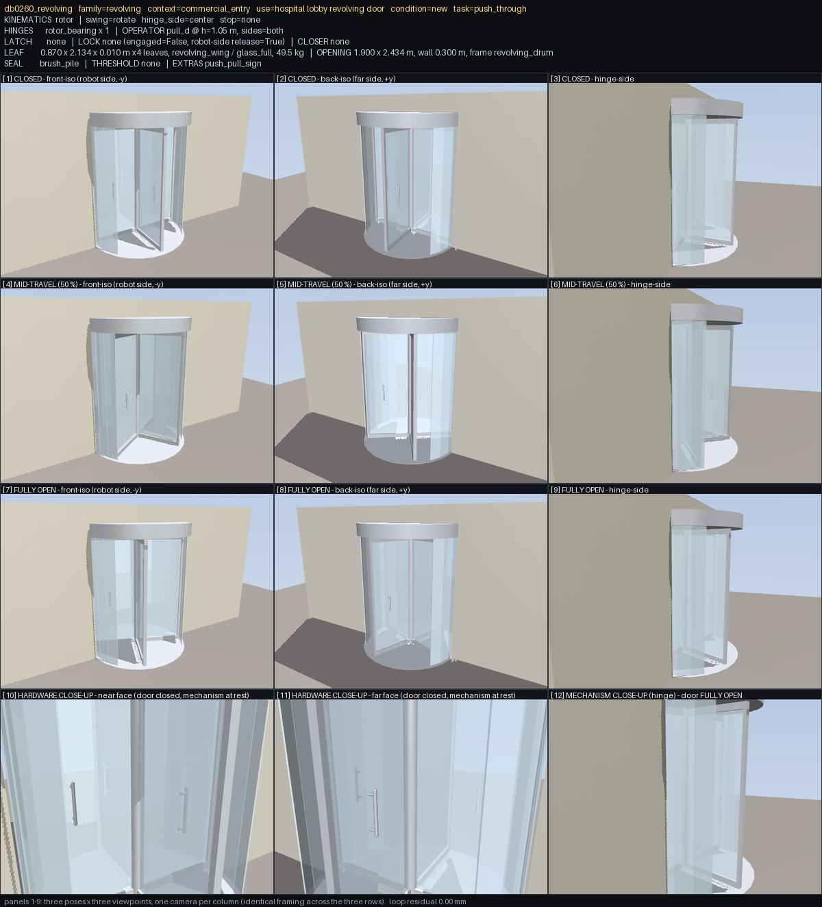

#### `db0284_garage_tiltup` (garage_tiltup)

_garage_tiltup / 1960s tilt-up garage door: missing_hardware_

* **MAJOR / missing_hardware** - pull_t_handle_garage on the far face: The caption says the pull_t_handle_garage is on both sides. Only one face carries it: the other hardware close-up shows a blank leaf. A robot approaching from that side has nothing to take hold of. (seen in panels 10 and 11 compared) _(confidence 0.85)_

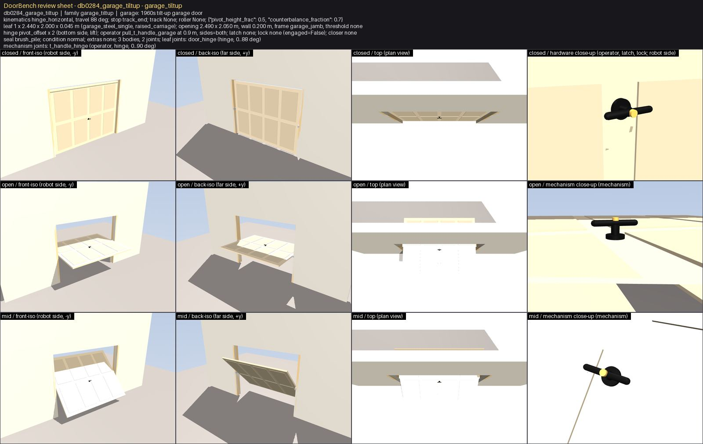

#### `db0285_ship_watertight` (ship_watertight)

_ship_watertight / submarine bulkhead hatch: missing_hardware_

* **MAJOR / missing_hardware** - hook-and-eye holdback: The caption says stop=hook_holdback, and no hook-and-eye holdback is modelled: at full open the leaf is held by nothing. (seen in panels 7, 9) _(confidence 0.85)_
* **MAJOR / missing_hardware** - dog_lever on the far face: The caption says the dog_lever is on both sides. Only one face carries it: the other hardware close-up shows a blank leaf. A robot approaching from that side has nothing to take hold of. (seen in panels 10 and 11 compared) _(confidence 0.85)_

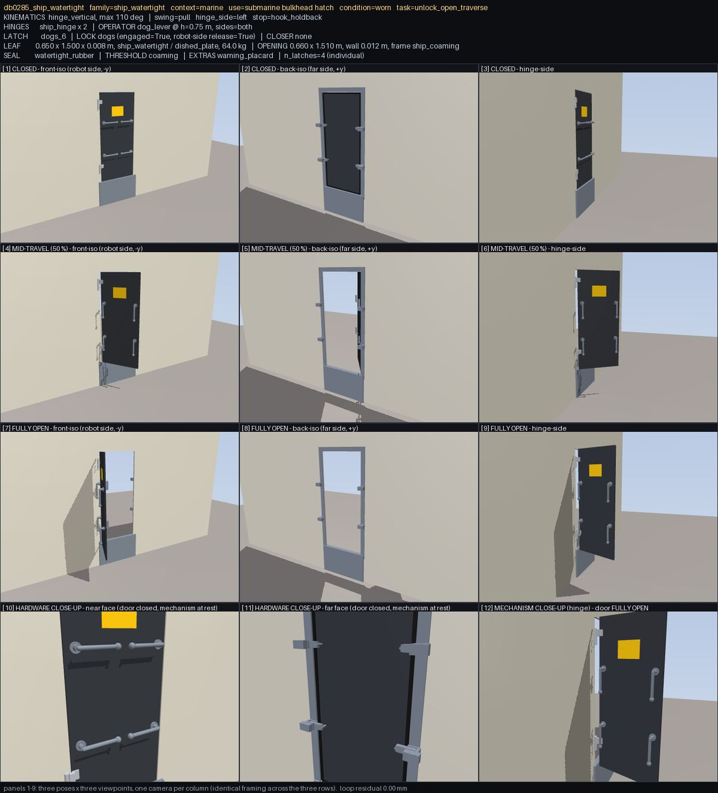

#### `db0288_blast` (blast)

_blast / shelter blast door: missing_hardware_

* **MAJOR / missing_hardware** - warning_placard: The caption lists warning_placard among the extras, and no geometry for it exists anywhere on the door - not hidden, absent. (physics.py still charges hardware mass for several of these, so the door carries weight for parts that are not there.) (seen in panels 1, 2, 10, 11) _(confidence 0.90)_
* **MAJOR / missing_hardware** - dog_lever on the far face: The caption says the dog_lever is on both sides. Only one face carries it: the other hardware close-up shows a blank leaf. A robot approaching from that side has nothing to take hold of. (seen in panels 10 and 11 compared) _(confidence 0.85)_

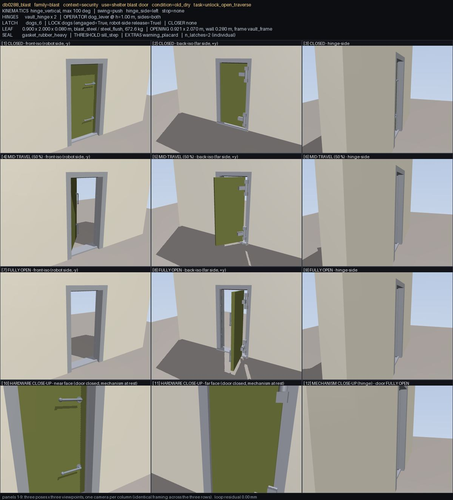

#### `db0291_stall` (stall)

_stall / locker room changing stall: missing_hardware_

* **MAJOR / missing_hardware** - stall_slide_latch on the far face: The caption says the stall_slide_latch is on both sides. Only one face carries it: the other hardware close-up shows a blank leaf. A robot approaching from that side has nothing to take hold of. (seen in panels 10 and 11 compared) _(confidence 0.85)_

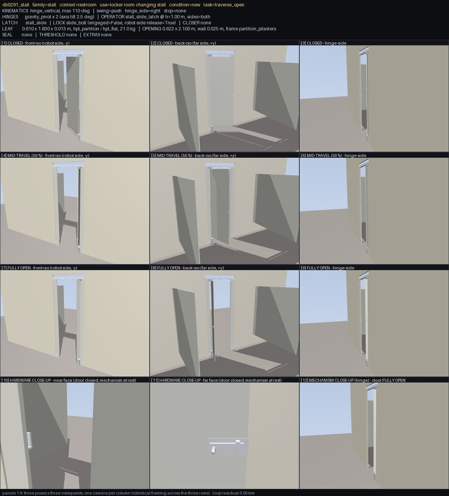

#### `db0292_accordion` (accordion)

_accordion / accordion closet door: wrong_scale_

* **MAJOR / wrong_scale** - leaf mass: The caption states 6 leaves of 0.305 x 2.400 x 0.012 m in upvc_panel and a total of 15.0 kg. The stated area density is 12.6 kg/m2, so those leaves weigh 56 kg between them: the slab mass has been computed for one leaf and then split across all 6. Every leaf is 6x too light. (seen in caption; the leaves in panels 1 and 2) _(confidence 0.90)_

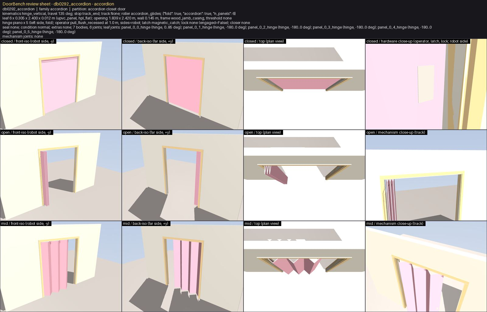

#### `db0309_gate_sliding` (gate_sliding)

_gate_sliding / cantilever driveway gate (manual): missing_hardware_

* **MAJOR / missing_hardware** - pull_d on the far face: The caption says the pull_d is on both sides. Only one face carries it: the other hardware close-up shows a blank leaf. A robot approaching from that side has nothing to take hold of. (seen in panels 10 and 11 compared) _(confidence 0.85)_

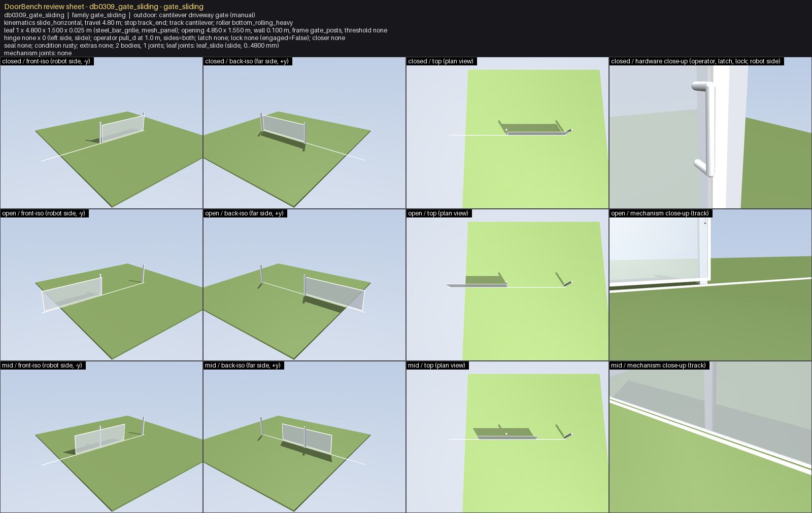

#### `db0336_baby_gate` (baby_gate)

_baby_gate / pet gate in hallway: missing_hardware_

* **MAJOR / missing_hardware** - baby_gate_latch on the far face: The caption says the baby_gate_latch is on both sides. Only one face carries it: the other hardware close-up shows a blank leaf. A robot approaching from that side has nothing to take hold of. (seen in panels 10 and 11 compared) _(confidence 0.85)_

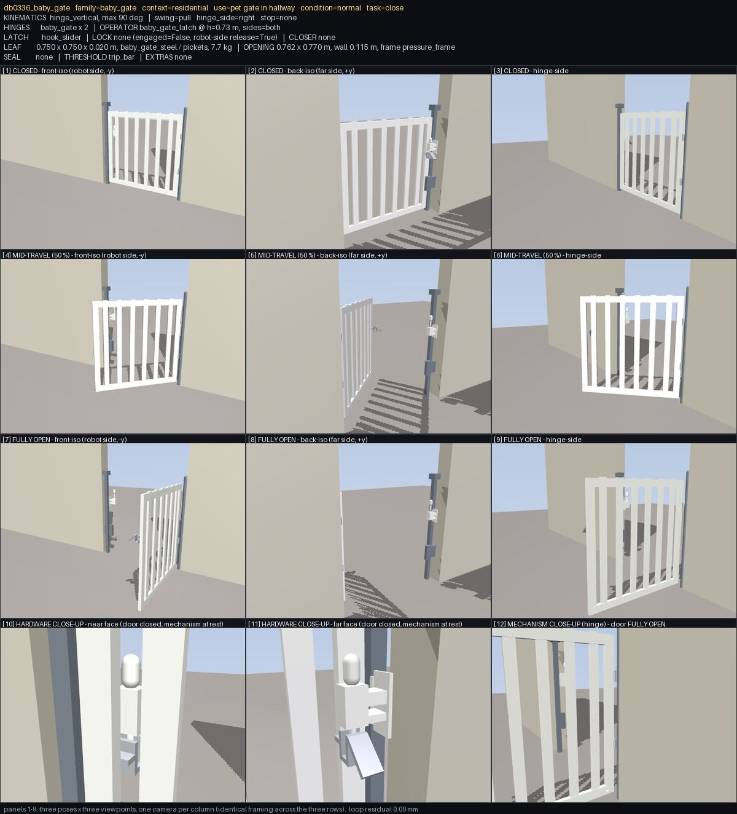

#### `db0341_swing_double` (swing_double)

_swing_double / dining room french doors: wrong_scale_

* **MAJOR / wrong_scale** - leaf mass: The caption states 2 leaves of 0.762 x 2.032 x 0.044 m in solid_wood_mahogany and a total of 35.5 kg. The stated area density is 26.0 kg/m2, so those leaves weigh 80 kg between them: the slab mass has been computed for one leaf and then split across all 2. Every leaf is 2x too light. (seen in caption; the leaves in panels 1 and 2) _(confidence 0.90)_

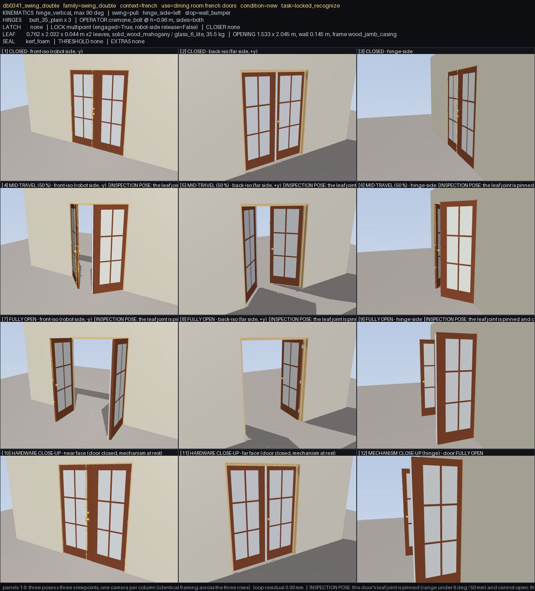

#### `db0352_blast` (blast)

_blast / test cell blast door: missing_hardware_

* **MAJOR / missing_hardware** - warning_placard: The caption lists warning_placard among the extras, and no geometry for it exists anywhere on the door - not hidden, absent. (physics.py still charges hardware mass for several of these, so the door carries weight for parts that are not there.) (seen in panels 1, 2, 10, 11) _(confidence 0.90)_

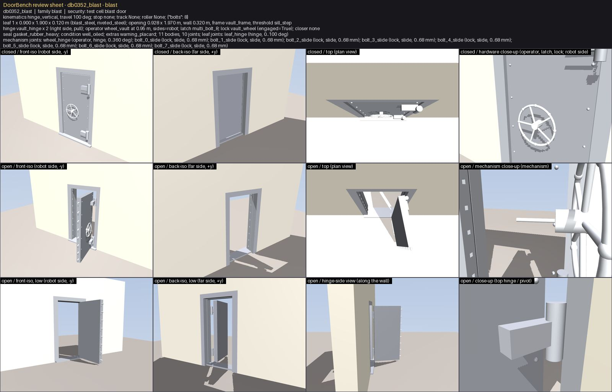

#### `db0395_swing_double` (swing_double)

_swing_double / barn double doors: mechanism_cannot_work; wrong_scale_

* **MAJOR / mechanism_cannot_work** - inactive leaf joint leaf_b_hinge: The pair's second leaf is welded shut (hinge range 0.06 deg) although the spec gives the door no latch and no lock at all - there is nothing to undo. Only one leaf of the pair can ever move. (seen in panels 4, 7) _(confidence 0.85)_
* **MAJOR / wrong_scale** - leaf mass: The caption states 2 leaves of 1.200 x 2.400 x 0.044 m in barn_plank and a total of 64.5 kg. The stated area density is 21.1 kg/m2, so those leaves weigh 122 kg between them: the slab mass has been computed for one leaf and then split across all 2. Every leaf is 2x too light. (seen in caption; the leaves in panels 1 and 2) _(confidence 0.90)_

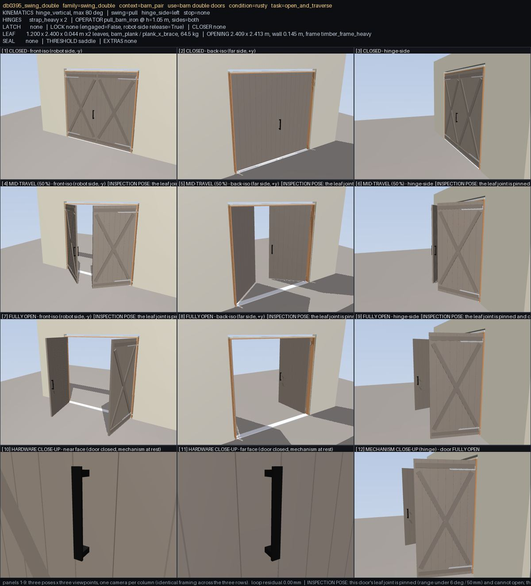

#### `db0420_stall` (stall)

_stall / public restroom stall door: missing_hardware_

* **MAJOR / missing_hardware** - stall_slide_latch on the far face: The caption says the stall_slide_latch is on both sides. Only one face carries it: the other hardware close-up shows a blank leaf. A robot approaching from that side has nothing to take hold of. (seen in panels 10 and 11 compared) _(confidence 0.85)_

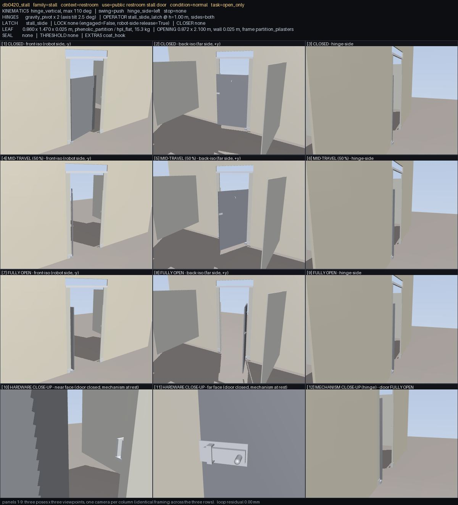

#### `db0426_vault` (vault)

_vault / bank vault door: missing_hardware_

* **MAJOR / missing_hardware** - warning_placard: The caption lists warning_placard among the extras, and no geometry for it exists anywhere on the door - not hidden, absent. (physics.py still charges hardware mass for several of these, so the door carries weight for parts that are not there.) (seen in panels 1, 2, 10, 11) _(confidence 0.90)_

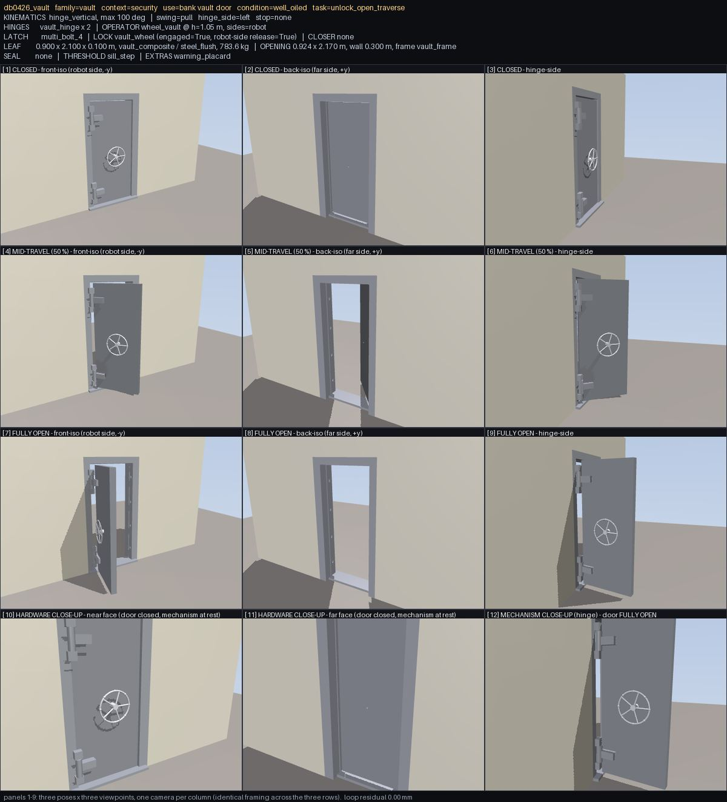

#### `db0474_automatic_sliding` (automatic_sliding)

_automatic_sliding / supermarket automatic door: wrong_scale_

* **MAJOR / wrong_scale** - leaf mass: The caption states 2 leaves of 1.200 x 2.134 x 0.045 m in storefront_alu and a total of 88.4 kg. The stated area density is 112.5 kg/m2, so those leaves weigh 576 kg between them: the slab mass has been computed for one leaf and then split across all 2. Every leaf is 2x too light. (seen in caption; the leaves in panels 1 and 2) _(confidence 0.90)_

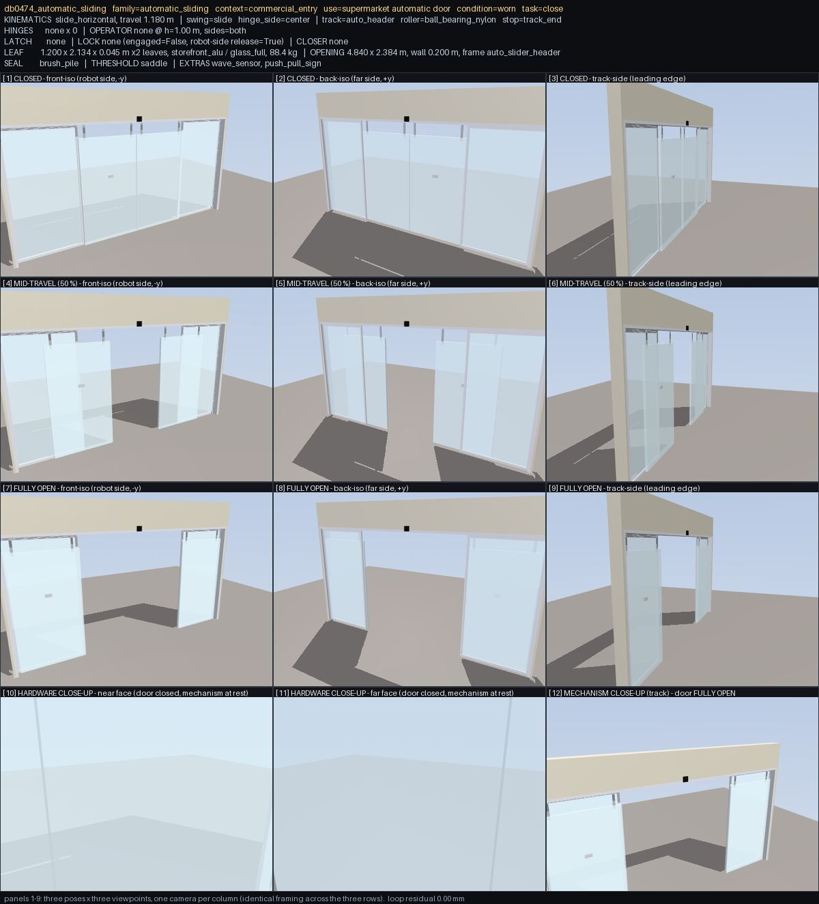

#### `db0483_baby_gate` (baby_gate)

_baby_gate / kitchen doorway baby gate: missing_hardware_

* **MAJOR / missing_hardware** - baby_gate_latch on the far face: The caption says the baby_gate_latch is on both sides. Only one face carries it: the other hardware close-up shows a blank leaf. A robot approaching from that side has nothing to take hold of. (seen in panels 10 and 11 compared) _(confidence 0.85)_

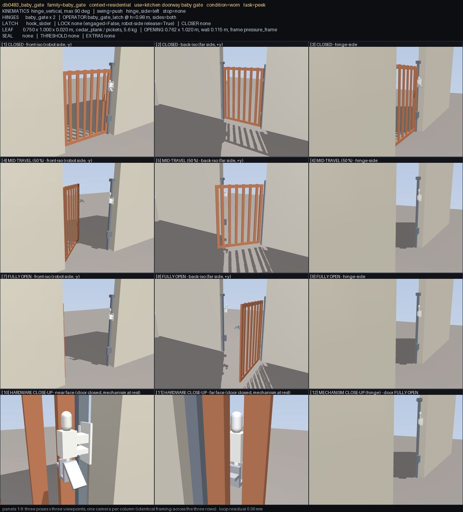

#### `db0524_bifold` (bifold)

_bifold / bedroom closet bifold: wrong_scale_

* **MAJOR / wrong_scale** - leaf mass: The caption states 2 leaves of 0.381 x 2.032 x 0.006 m in mirror_bypass and a total of 11.8 kg. The stated area density is 15.0 kg/m2, so those leaves weigh 23 kg between them: the slab mass has been computed for one leaf and then split across all 2. Every leaf is 2x too light. (seen in caption; the leaves in panels 1 and 2) _(confidence 0.90)_

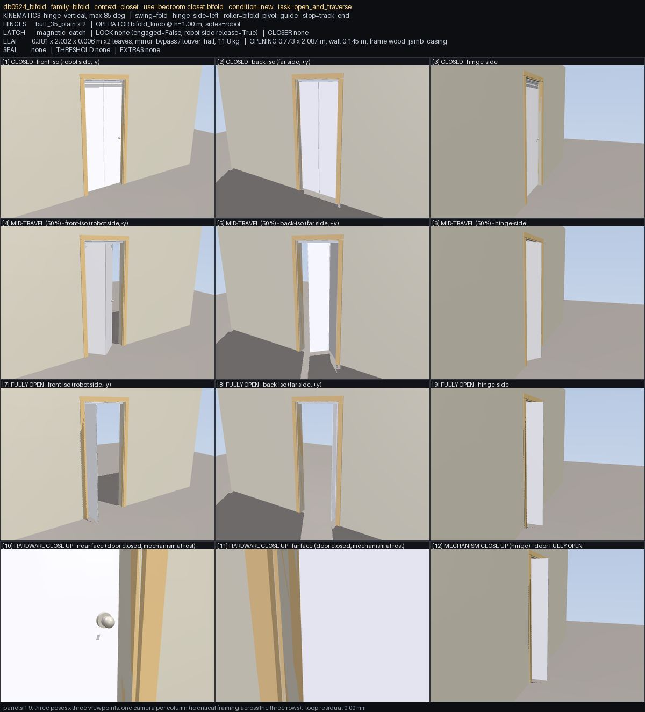

#### `db0530_vault` (vault)

_vault / bank vault door: missing_hardware_

* **MAJOR / missing_hardware** - warning_placard: The caption lists warning_placard among the extras, and no geometry for it exists anywhere on the door - not hidden, absent. (physics.py still charges hardware mass for several of these, so the door carries weight for parts that are not there.) (seen in panels 1, 2, 10, 11) _(confidence 0.90)_
* **MAJOR / missing_hardware** - dog_lever on the far face: The caption says the dog_lever is on both sides. Only one face carries it: the other hardware close-up shows a blank leaf. A robot approaching from that side has nothing to take hold of. (seen in panels 10 and 11 compared) _(confidence 0.85)_

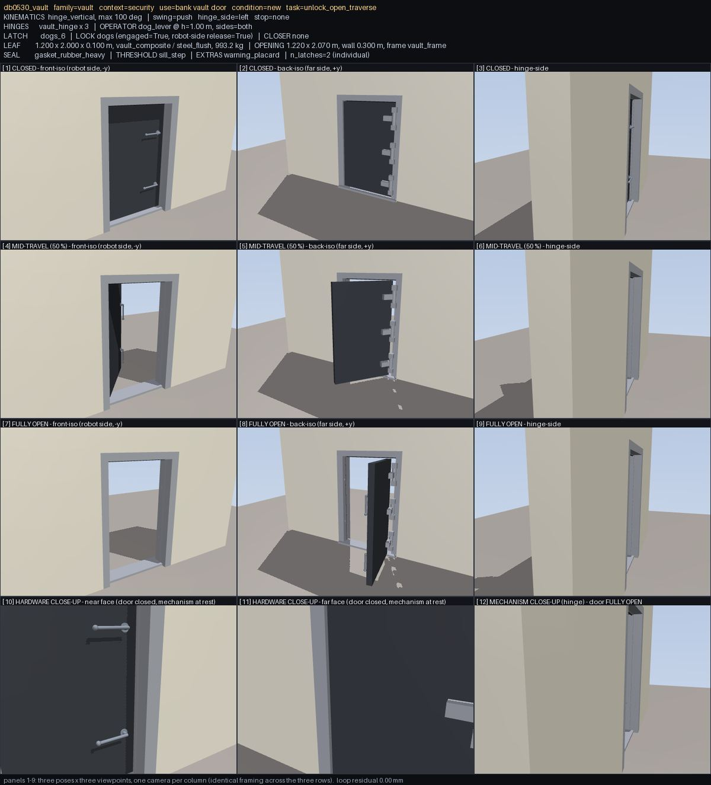

#### `db0535_strip_curtain` (strip_curtain)

_strip_curtain / food processing strip curtain: wrong_scale_

* **MAJOR / wrong_scale** - leaf mass: The caption states 9 leaves of 0.300 x 2.980 x 0.002 m in strip_curtain and a total of 3.3 kg. The stated area density is 2.5 kg/m2, so those leaves weigh 20 kg between them: the slab mass has been computed for one leaf and then split across all 9. Every leaf is 9x too light. (seen in caption; the leaves in panels 1 and 2) _(confidence 0.90)_

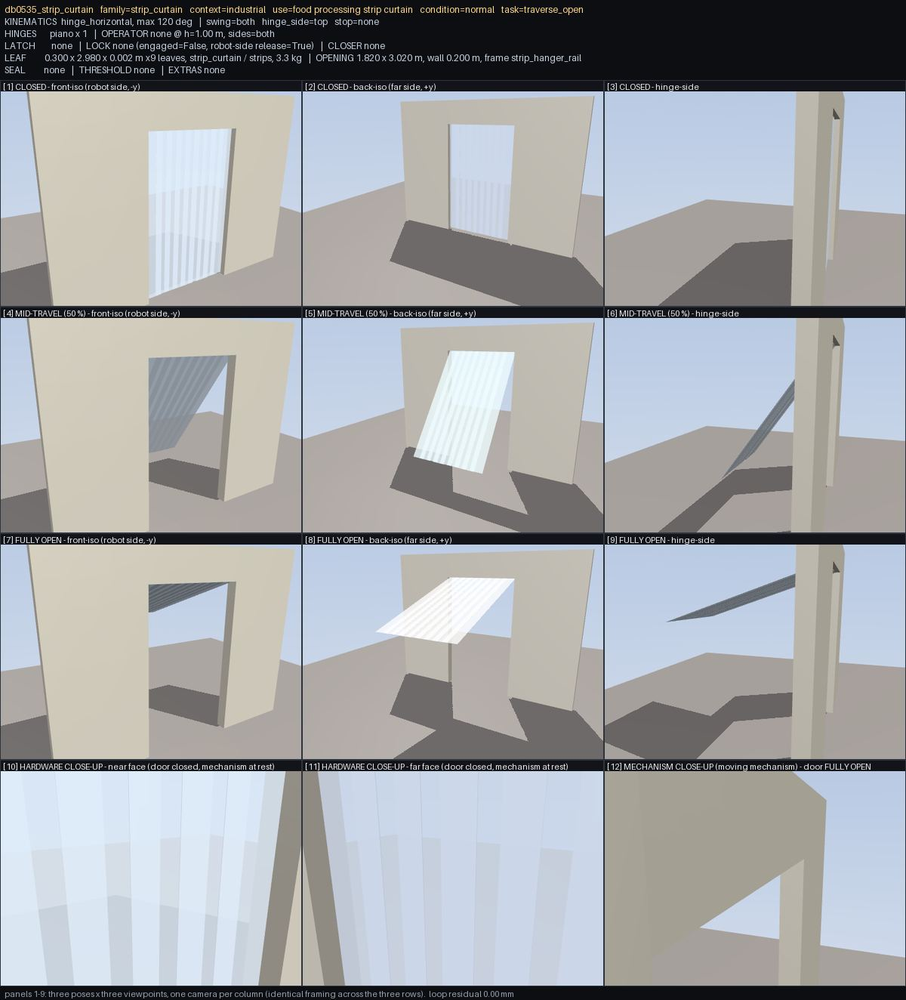

#### `db0546_stall` (stall)

_stall / locker room changing stall: missing_hardware_

* **MAJOR / missing_hardware** - stall_slide_latch on the far face: The caption says the stall_slide_latch is on both sides. Only one face carries it: the other hardware close-up shows a blank leaf. A robot approaching from that side has nothing to take hold of. (seen in panels 10 and 11 compared) _(confidence 0.85)_

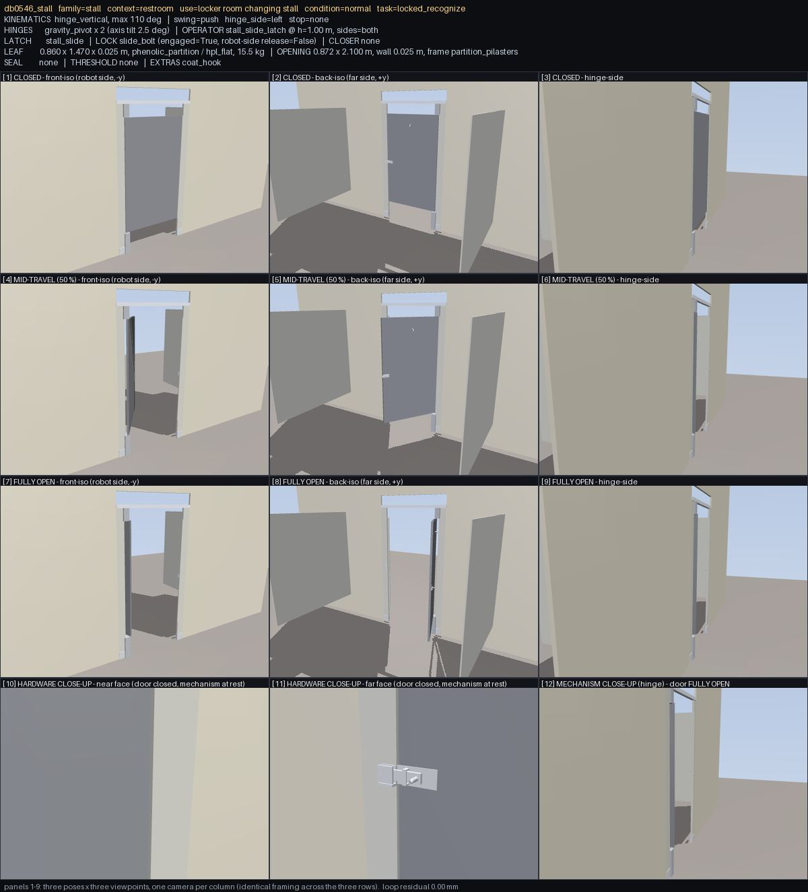

#### `db0559_hatch_floor` (hatch_floor)

_hatch_floor / utility floor hatch: missing_hardware_

* **MAJOR / missing_hardware** - prop arm: The caption says stop=prop_arm, and no prop arm is modelled: at full open the leaf is held by nothing. (seen in panels 7, 9) _(confidence 0.85)_

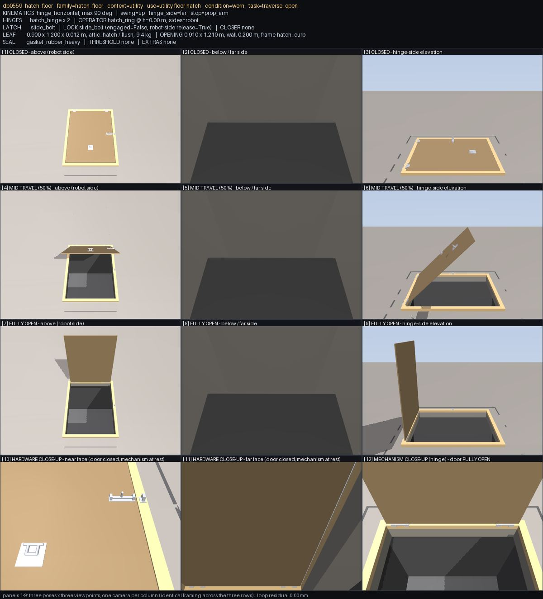

#### `db0573_stall` (stall)

_stall / public restroom stall door: missing_hardware_

* **MAJOR / missing_hardware** - stall_slide_latch on the far face: The caption says the stall_slide_latch is on both sides. Only one face carries it: the other hardware close-up shows a blank leaf. A robot approaching from that side has nothing to take hold of. (seen in panels 10 and 11 compared) _(confidence 0.85)_

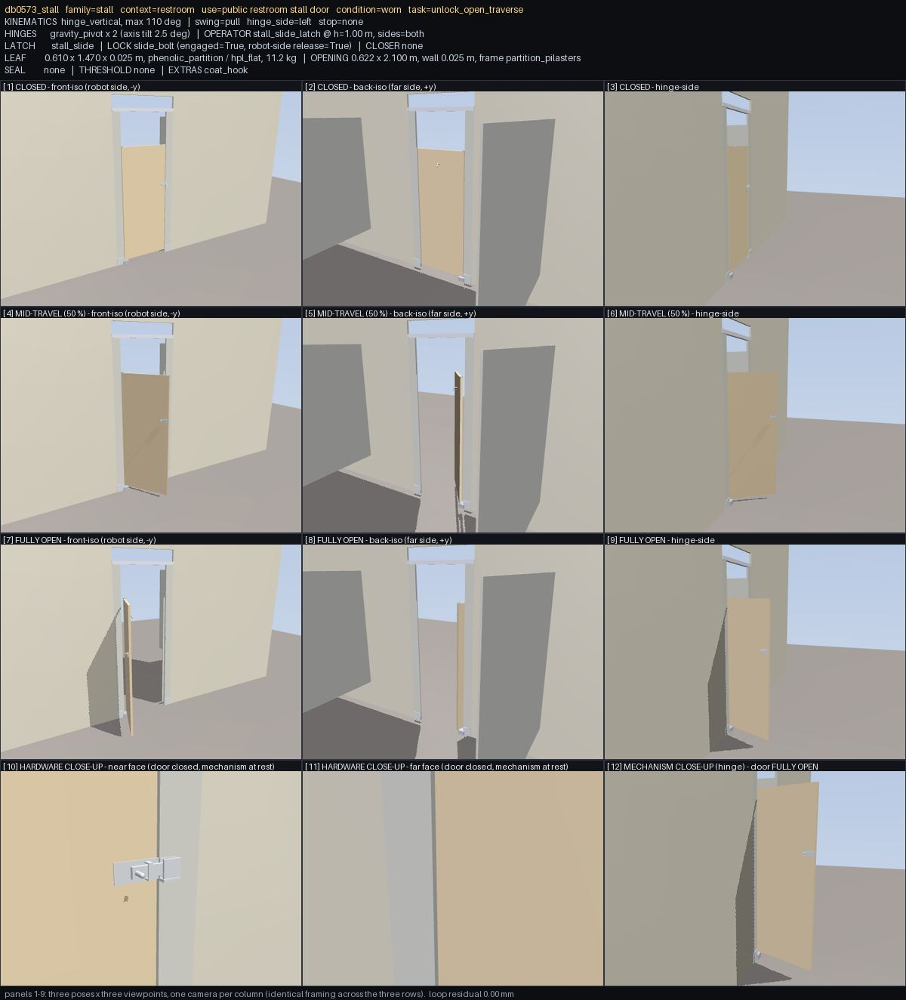

#### `db0586_sliding_bypass` (sliding_bypass)

_sliding_bypass / hallway linen closet doors: wrong_scale_

* **MAJOR / wrong_scale** - leaf mass: The caption states 2 leaves of 0.762 x 2.032 x 0.006 m in mirror_bypass and a total of 23.4 kg. The stated area density is 15.0 kg/m2, so those leaves weigh 46 kg between them: the slab mass has been computed for one leaf and then split across all 2. Every leaf is 2x too light. (seen in caption; the leaves in panels 1 and 2) _(confidence 0.90)_

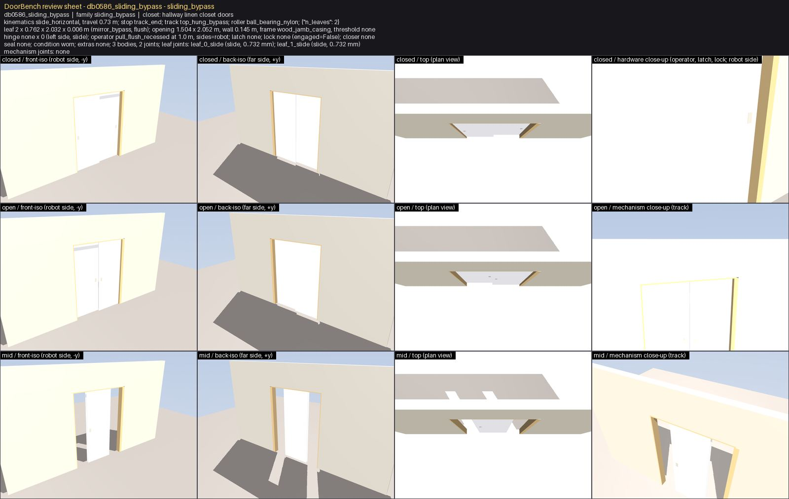

#### `db0600_ship_watertight` (ship_watertight)

_ship_watertight / engine room WT door: missing_hardware_

* **MAJOR / missing_hardware** - hook-and-eye holdback: The caption says stop=hook_holdback, and no hook-and-eye holdback is modelled: at full open the leaf is held by nothing. (seen in panels 7, 9) _(confidence 0.85)_

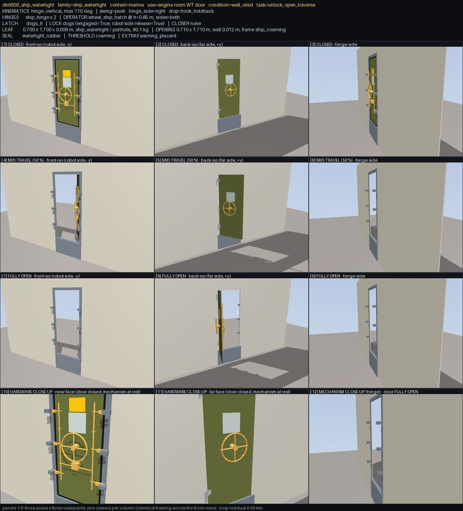

#### `db0621_sliding_bypass` (sliding_bypass)

_sliding_bypass / shoji closet (oshiire): wrong_scale_

* **MAJOR / wrong_scale** - leaf mass: The caption states 2 leaves of 0.610 x 2.032 x 0.035 m in louver_wood and a total of 9.6 kg. The stated area density is 7.7 kg/m2, so those leaves weigh 19 kg between them: the slab mass has been computed for one leaf and then split across all 2. Every leaf is 2x too light. (seen in caption; the leaves in panels 1 and 2) _(confidence 0.90)_

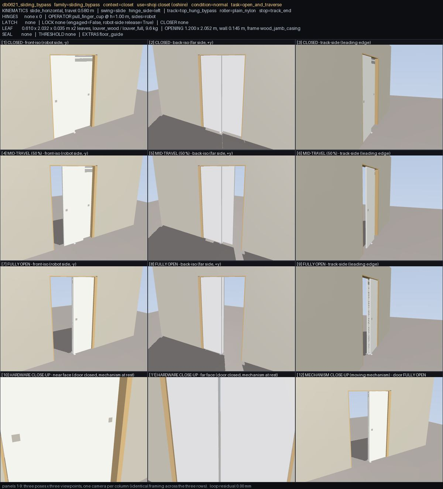

#### `db0641_strip_curtain` (strip_curtain)

_strip_curtain / walk-in cooler strip curtain: wrong_scale_

* **MAJOR / wrong_scale** - leaf mass: The caption states 6 leaves of 0.400 x 2.380 x 0.002 m in strip_curtain and a total of 3.5 kg. The stated area density is 2.5 kg/m2, so those leaves weigh 14 kg between them: the slab mass has been computed for one leaf and then split across all 6. Every leaf is 6x too light. (seen in caption; the leaves in panels 1 and 2) _(confidence 0.90)_

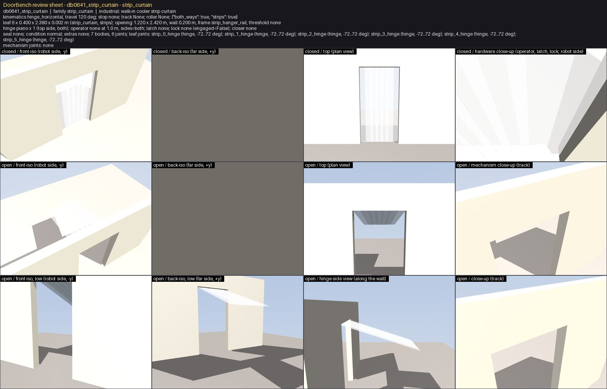

#### `db0651_garage_tiltup` (garage_tiltup)

_garage_tiltup / carport tilt-up door: missing_hardware_

* **MAJOR / missing_hardware** - pull_lift_garage on the far face: The caption says the pull_lift_garage is on both sides. Only one face carries it: the other hardware close-up shows a blank leaf. A robot approaching from that side has nothing to take hold of. (seen in panels 10 and 11 compared) _(confidence 0.85)_

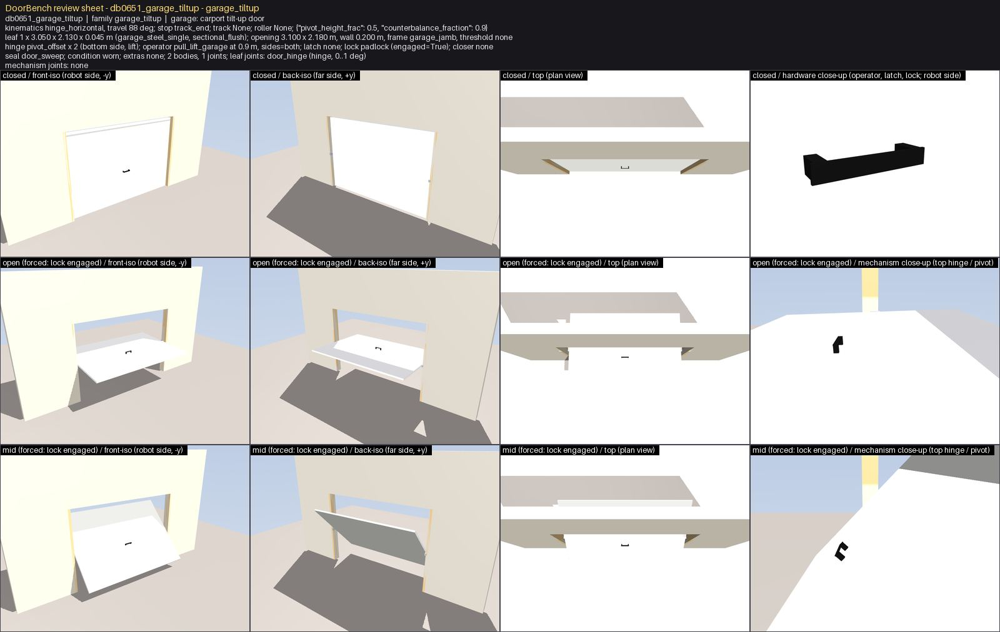

#### `db0708_sliding_single` (sliding_single)

_sliding_single / sunroom slider: missing_hardware_

* **MAJOR / missing_hardware** - threshold_saddle: The caption lists threshold_saddle among the extras, and no geometry for it exists anywhere on the door - not hidden, absent. (physics.py still charges hardware mass for several of these, so the door carries weight for parts that are not there.) (seen in panels 1, 2, 10, 11) _(confidence 0.90)_
* **MAJOR / missing_hardware** - pull_flush_recessed on the far face: The caption says the pull_flush_recessed is on both sides. Only one face carries it: the other hardware close-up shows a blank leaf. A robot approaching from that side has nothing to take hold of. (seen in panels 10 and 11 compared) _(confidence 0.85)_

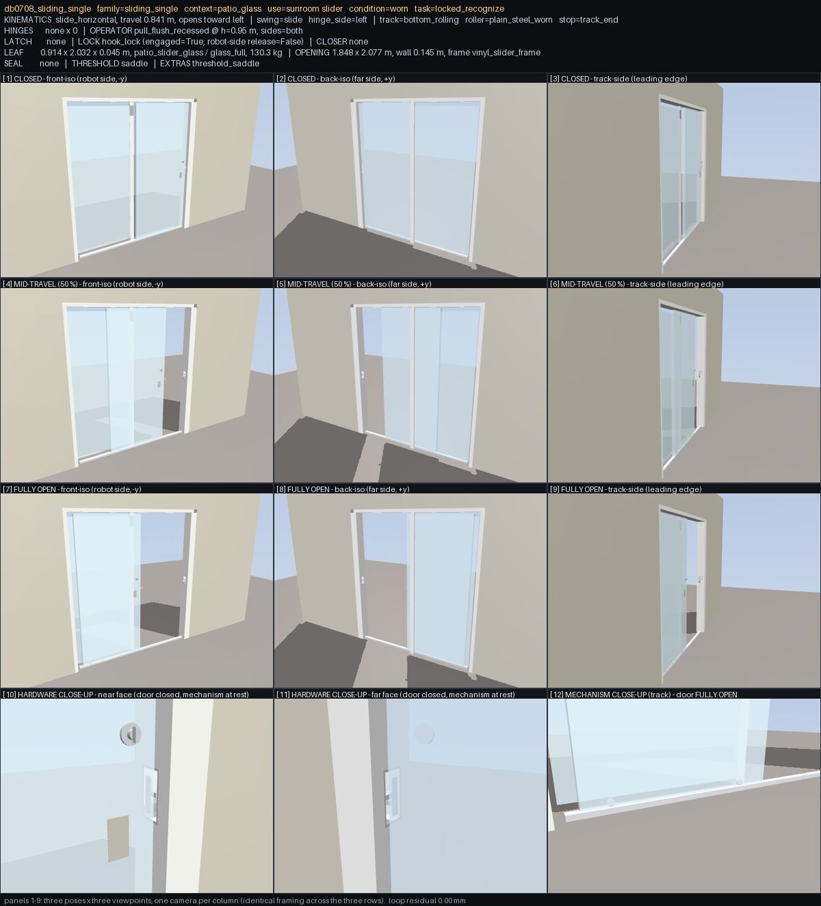

#### `db0716_saloon` (saloon)

_saloon / cafe kitchen pass doors: missing_hardware; wrong_scale_

* **MAJOR / wrong_scale** - leaf mass: The caption states 2 leaves of 0.500 x 1.300 x 0.044 m in louver_wood and a total of 8.2 kg. The stated area density is 9.7 kg/m2, so those leaves weigh 13 kg between them: the slab mass has been computed for one leaf and then split across all 2. Every leaf is 2x too light. (seen in caption; the leaves in panels 1 and 2) _(confidence 0.90)_
* **MAJOR / missing_hardware** - kick_plate: The caption lists kick_plate among the extras, and no geometry for it exists anywhere on the door - not hidden, absent. (physics.py still charges hardware mass for several of these, so the door carries weight for parts that are not there.) (seen in panels 1, 2, 10, 11) _(confidence 0.90)_

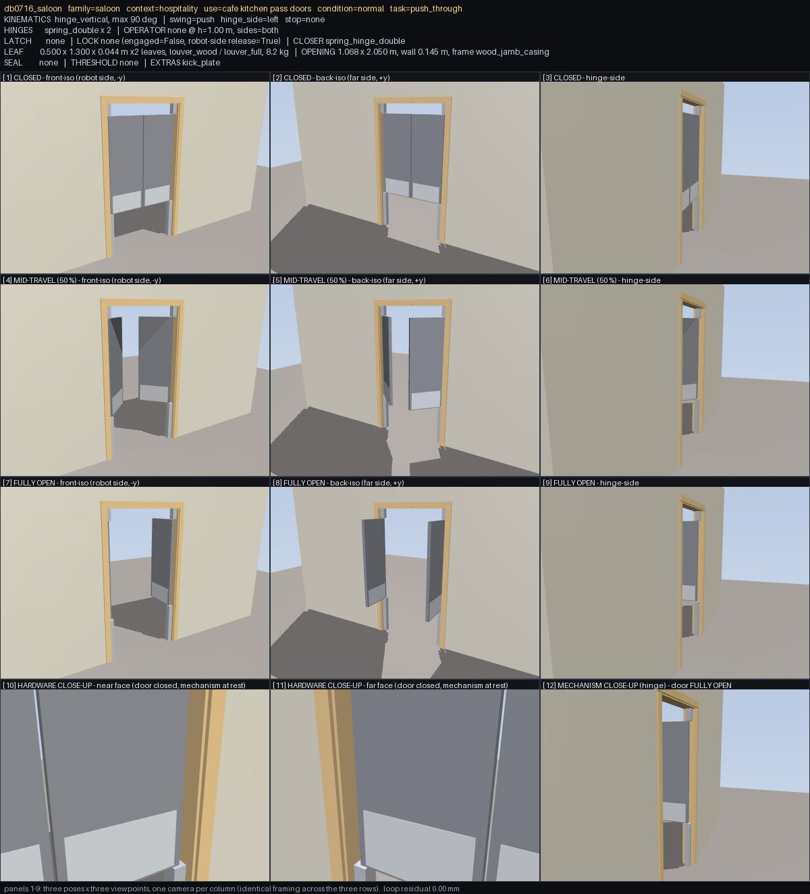

#### `db0720_sliding_bypass` (sliding_bypass)

_sliding_bypass / bedroom closet bypass doors: wrong_scale_

* **MAJOR / wrong_scale** - leaf mass: The caption states 2 leaves of 0.762 x 2.032 x 0.035 m in mdf_solid and a total of 40.7 kg. The stated area density is 26.3 kg/m2, so those leaves weigh 81 kg between them: the slab mass has been computed for one leaf and then split across all 2. Every leaf is 2x too light. (seen in caption; the leaves in panels 1 and 2) _(confidence 0.90)_

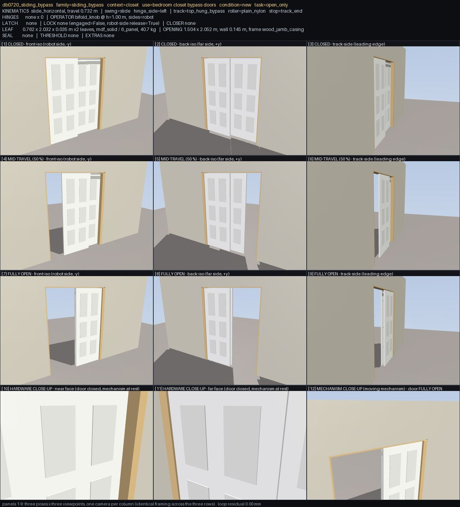

#### `db0738_saloon` (saloon)

_saloon / hospital utility double-acting door: wrong_scale_

* **MAJOR / wrong_scale** - leaf mass: The caption states 2 leaves of 0.450 x 1.100 x 0.035 m in solid_wood_pine and a total of 7.5 kg. The stated area density is 14.0 kg/m2, so those leaves weigh 14 kg between them: the slab mass has been computed for one leaf and then split across all 2. Every leaf is 2x too light. (seen in caption; the leaves in panels 1 and 2) _(confidence 0.90)_

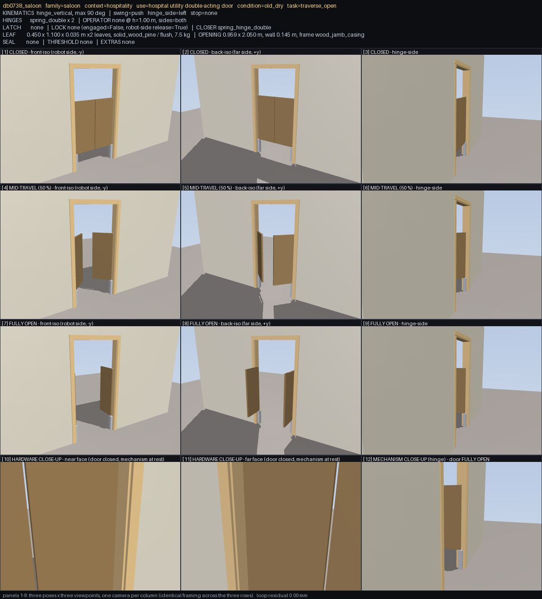

#### `db0748_vault` (vault)

_vault / gun vault door: missing_hardware_

* **MAJOR / missing_hardware** - warning_placard: The caption lists warning_placard among the extras, and no geometry for it exists anywhere on the door - not hidden, absent. (physics.py still charges hardware mass for several of these, so the door carries weight for parts that are not there.) (seen in panels 1, 2, 10, 11) _(confidence 0.90)_

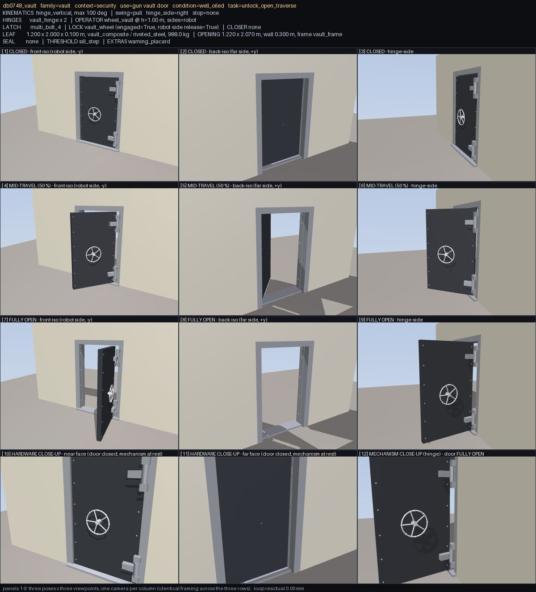

#### `db0770_automatic_sliding` (automatic_sliding)

_automatic_sliding / pharmacy entrance: wrong_scale_

* **MAJOR / wrong_scale** - leaf mass: The caption states 2 leaves of 1.000 x 2.134 x 0.012 m in glass_frameless_12 and a total of 38.5 kg. The stated area density is 30.0 kg/m2, so those leaves weigh 128 kg between them: the slab mass has been computed for one leaf and then split across all 2. Every leaf is 2x too light. (seen in caption; the leaves in panels 1 and 2) _(confidence 0.90)_

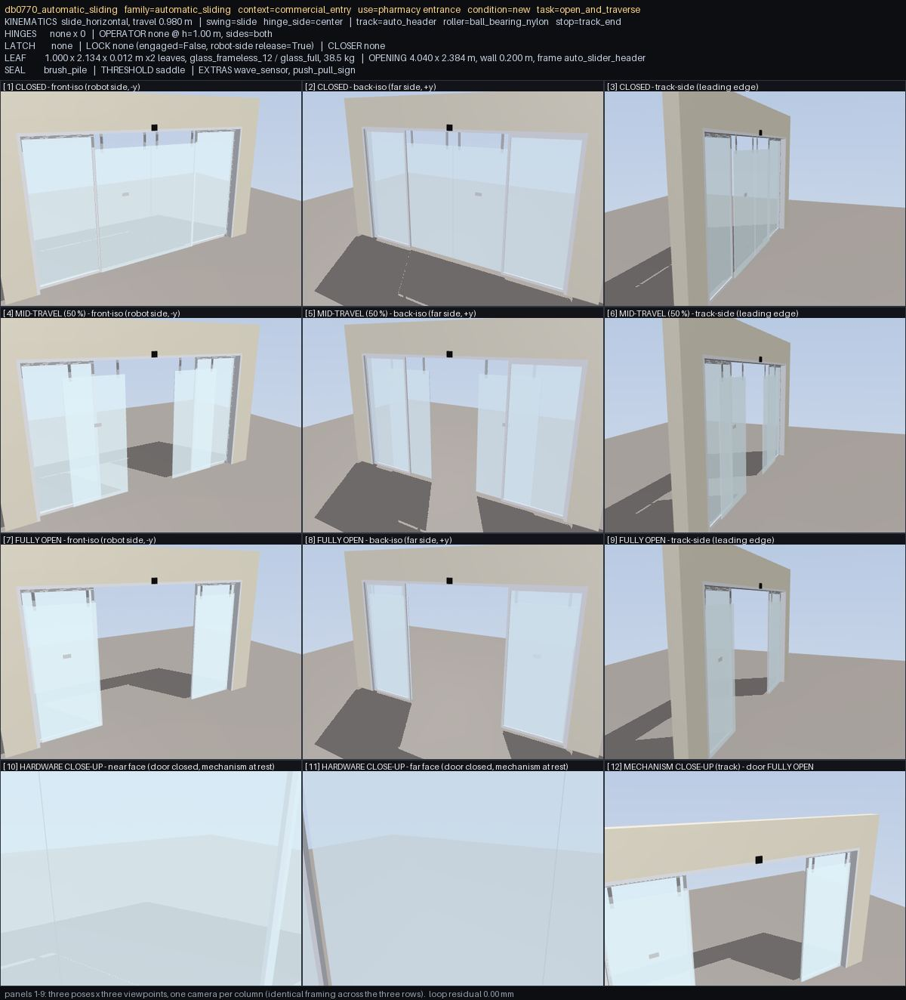

#### `db0772_blast` (blast)

_blast / test cell blast door: missing_hardware_

* **MAJOR / missing_hardware** - warning_placard: The caption lists warning_placard among the extras, and no geometry for it exists anywhere on the door - not hidden, absent. (physics.py still charges hardware mass for several of these, so the door carries weight for parts that are not there.) (seen in panels 1, 2, 10, 11) _(confidence 0.90)_
* **MAJOR / missing_hardware** - dog_lever on the far face: The caption says the dog_lever is on both sides. Only one face carries it: the other hardware close-up shows a blank leaf. A robot approaching from that side has nothing to take hold of. (seen in panels 10 and 11 compared) _(confidence 0.85)_

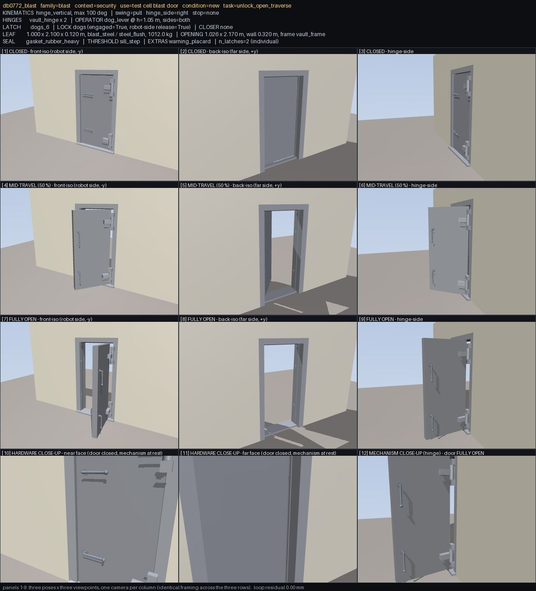

#### `db0774_bifold` (bifold)

_bifold / pantry bifold: wrong_scale_

* **MAJOR / wrong_scale** - leaf mass: The caption states 2 leaves of 0.305 x 2.032 x 0.035 m in louver_wood and a total of 5.0 kg. The stated area density is 7.7 kg/m2, so those leaves weigh 10 kg between them: the slab mass has been computed for one leaf and then split across all 2. Every leaf is 2x too light. (seen in caption; the leaves in panels 1 and 2) _(confidence 0.90)_

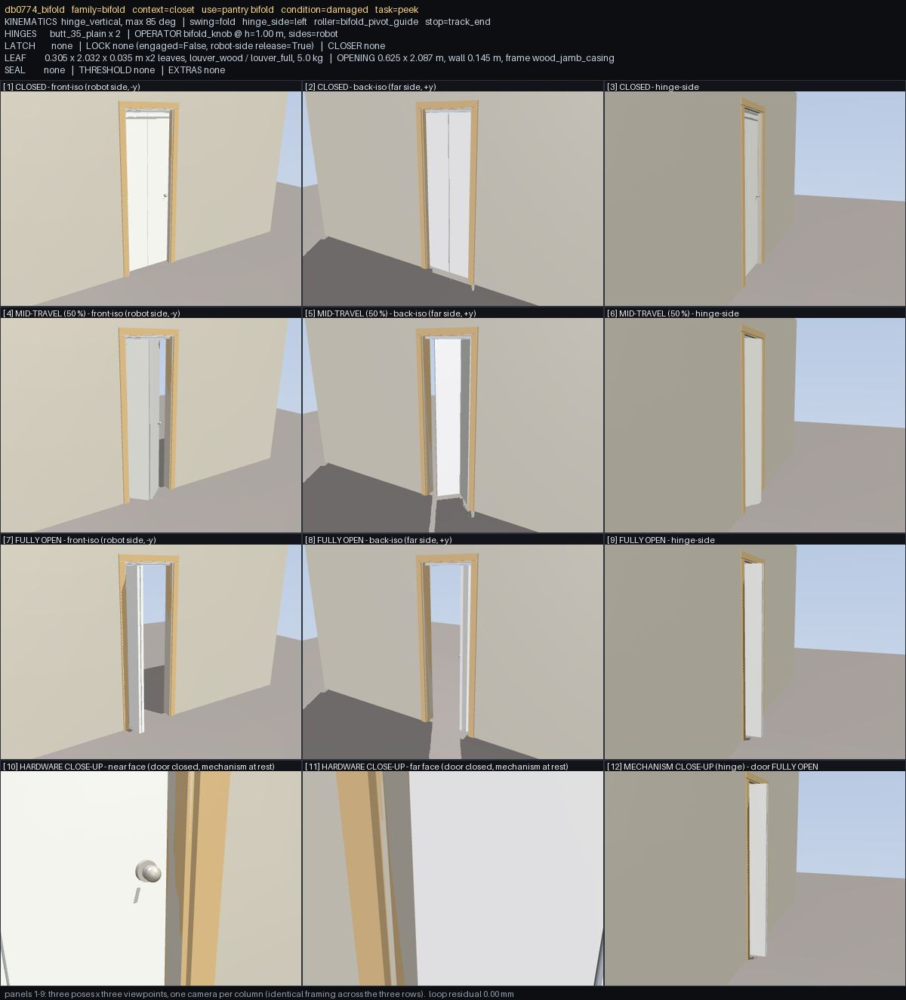

#### `db0777_revolving` (revolving)

_revolving / hospital lobby revolving door: missing_hardware; wrong_scale_

* **MAJOR / wrong_scale** - leaf mass: The caption states 3 leaves of 1.470 x 2.700 x 0.010 m in revolving_wing and a total of 102.3 kg. The stated area density is 25.0 kg/m2, so those leaves weigh 298 kg between them: the slab mass has been computed for one leaf and then split across all 3. Every leaf is 3x too light. (seen in caption; the leaves in panels 1 and 2) _(confidence 0.90)_
* **MAJOR / missing_hardware** - push_pull_sign: The caption lists push_pull_sign among the extras, and no geometry for it exists anywhere on the door - not hidden, absent. (physics.py still charges hardware mass for several of these, so the door carries weight for parts that are not there.) (seen in panels 1, 2, 10, 11) _(confidence 0.90)_

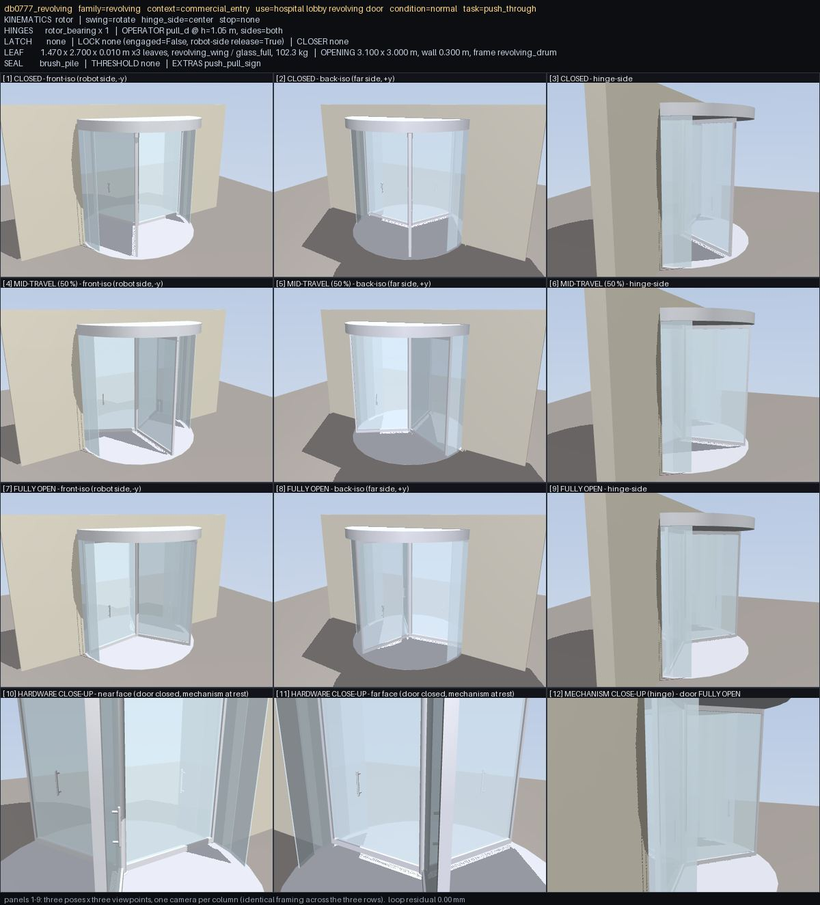

#### `db0804_sliding_single` (sliding_single)

_sliding_single / balcony slider: missing_hardware_

* **MAJOR / missing_hardware** - threshold_saddle: The caption lists threshold_saddle among the extras, and no geometry for it exists anywhere on the door - not hidden, absent. (physics.py still charges hardware mass for several of these, so the door carries weight for parts that are not there.) (seen in panels 1, 2, 10, 11) _(confidence 0.90)_

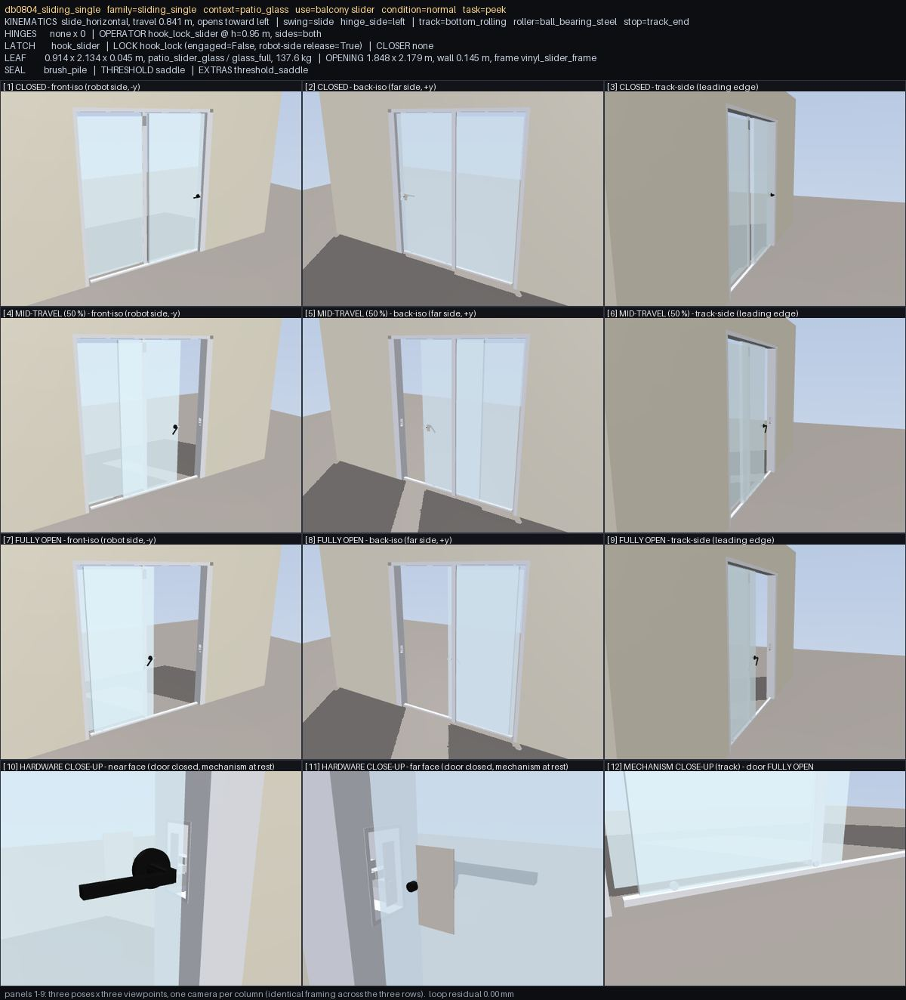

#### `db0830_accordion` (accordion)

_accordion / office partition accordion: wrong_scale_

* **MAJOR / wrong_scale** - leaf mass: The caption states 6 leaves of 0.152 x 2.032 x 0.012 m in upvc_panel and a total of 9.6 kg. The stated area density is 12.6 kg/m2, so those leaves weigh 23 kg between them: the slab mass has been computed for one leaf and then split across all 6. Every leaf is 6x too light. (seen in caption; the leaves in panels 1 and 2) _(confidence 0.90)_

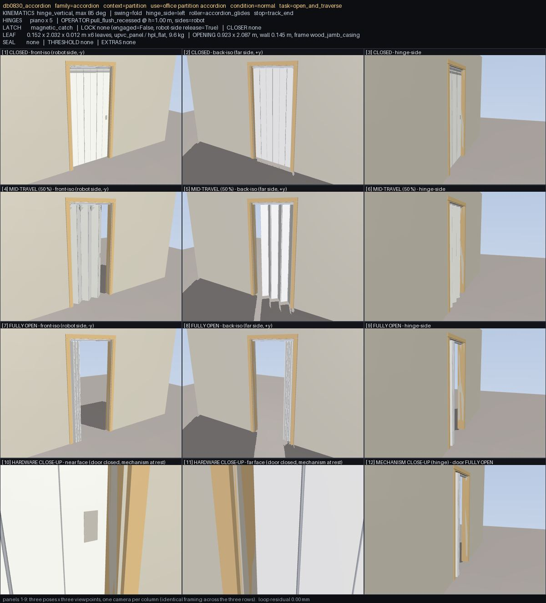

#### `db0844_baby_gate` (baby_gate)

_baby_gate / kitchen doorway baby gate: missing_hardware_

* **MAJOR / missing_hardware** - baby_gate_latch on the far face: The caption says the baby_gate_latch is on both sides. Only one face carries it: the other hardware close-up shows a blank leaf. A robot approaching from that side has nothing to take hold of. (seen in panels 10 and 11 compared) _(confidence 0.85)_

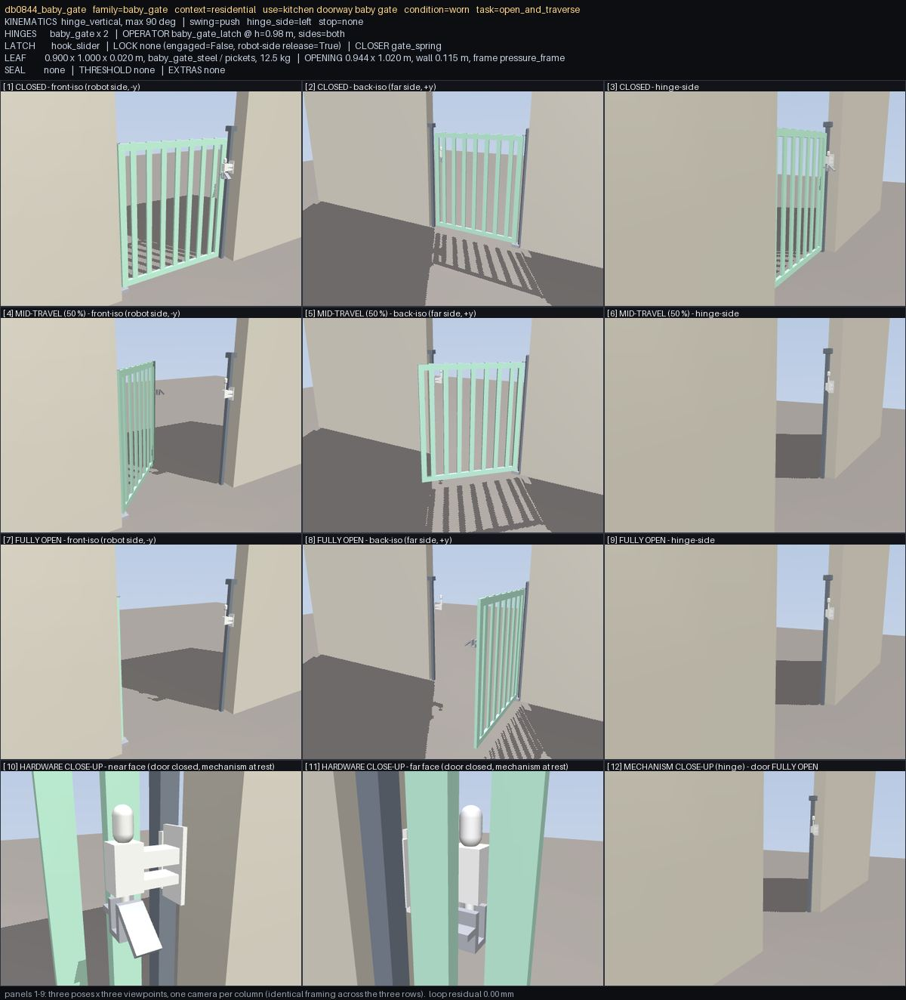

#### `db0854_gate_swing` (gate_swing)

_gate_swing / pool safety gate (self-closing, self-latching): missing_hardware_

* **MAJOR / missing_hardware** - gate_latch_magnetic on the far face: The caption says the gate_latch_magnetic is on both sides. Only one face carries it: the other hardware close-up shows a blank leaf. A robot approaching from that side has nothing to take hold of. (seen in panels 10 and 11 compared) _(confidence 0.85)_

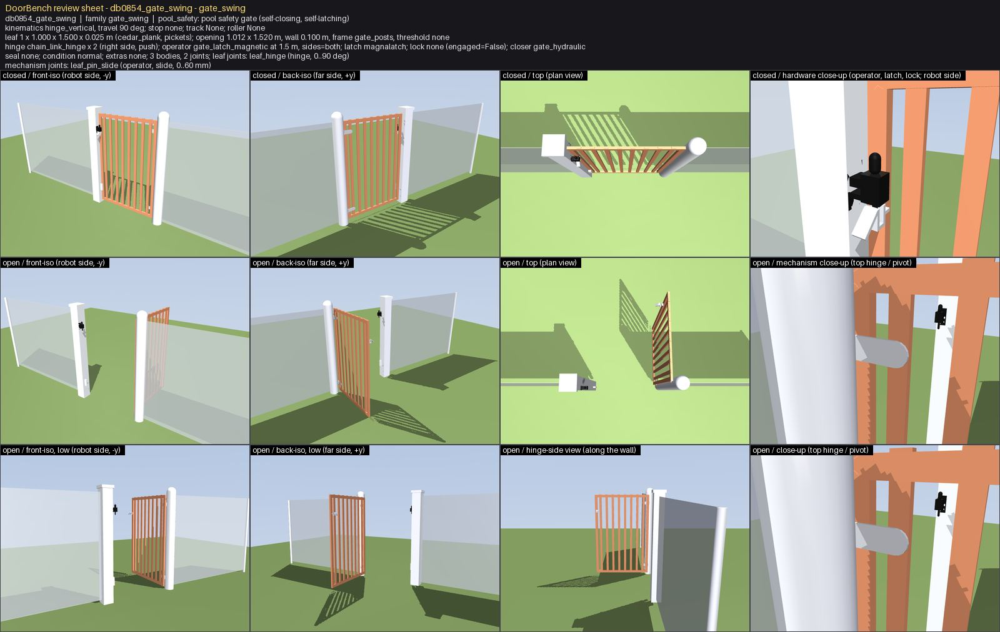

#### `db0867_sliding_single` (sliding_single)

_sliding_single / warehouse sliding door: missing_hardware_

* **MAJOR / missing_hardware** - pull_barn_iron on the far face: The caption says the pull_barn_iron is on both sides. Only one face carries it: the other hardware close-up shows a blank leaf. A robot approaching from that side has nothing to take hold of. (seen in panels 10 and 11 compared) _(confidence 0.85)_

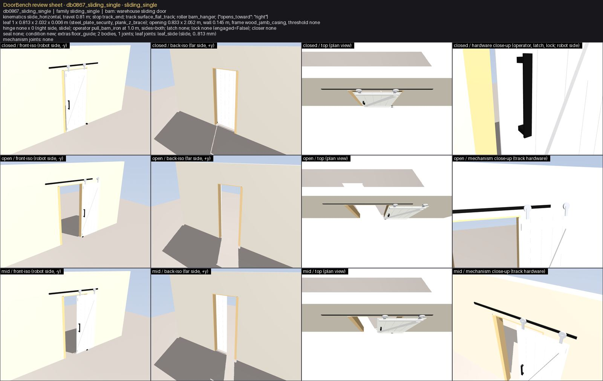

#### `db0870_turnstile_tripod` (turnstile_tripod)

_turnstile_tripod / office lobby tripod turnstile: missing_hardware; wrong_scale_

* **MAJOR / wrong_scale** - leaf mass: The caption states 3 leaves of 0.500 x 1.000 x 0.038 m in turnstile_arm and a total of 7.5 kg. The stated area density is 300.2 kg/m2, so those leaves weigh 450 kg between them: the slab mass has been computed for one leaf and then split across all 3. Every leaf is 3x too light. (seen in caption; the leaves in panels 1 and 2) _(confidence 0.90)_
* **MAJOR / missing_hardware** - keypad_reader_wall: The caption lists keypad_reader_wall among the extras, and no geometry for it exists anywhere on the door - not hidden, absent. (physics.py still charges hardware mass for several of these, so the door carries weight for parts that are not there.) (seen in panels 1, 2, 10, 11) _(confidence 0.90)_

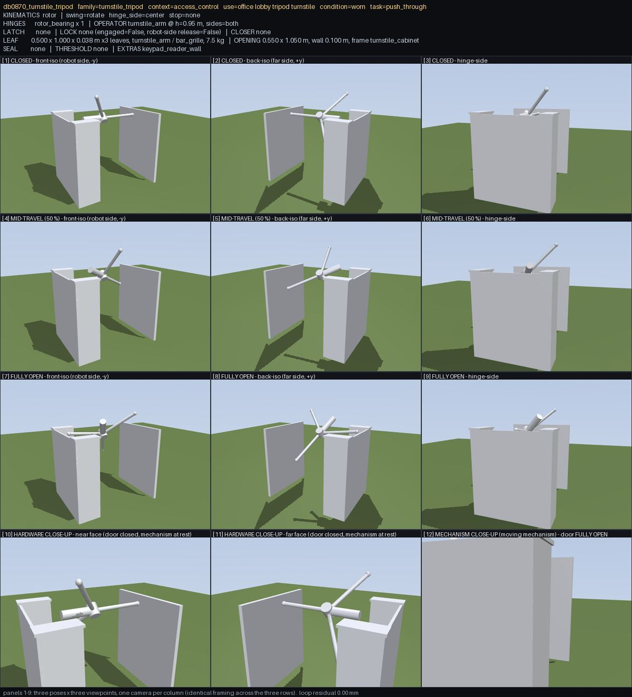

#### `db0899_saloon` (saloon)

_saloon / supermarket stockroom doors: wrong_scale_

* **MAJOR / wrong_scale** - leaf mass: The caption states 2 leaves of 0.600 x 2.030 x 0.044 m in solid_wood_pine and a total of 22.4 kg. The stated area density is 17.6 kg/m2, so those leaves weigh 43 kg between them: the slab mass has been computed for one leaf and then split across all 2. Every leaf is 2x too light. (seen in caption; the leaves in panels 1 and 2) _(confidence 0.90)_

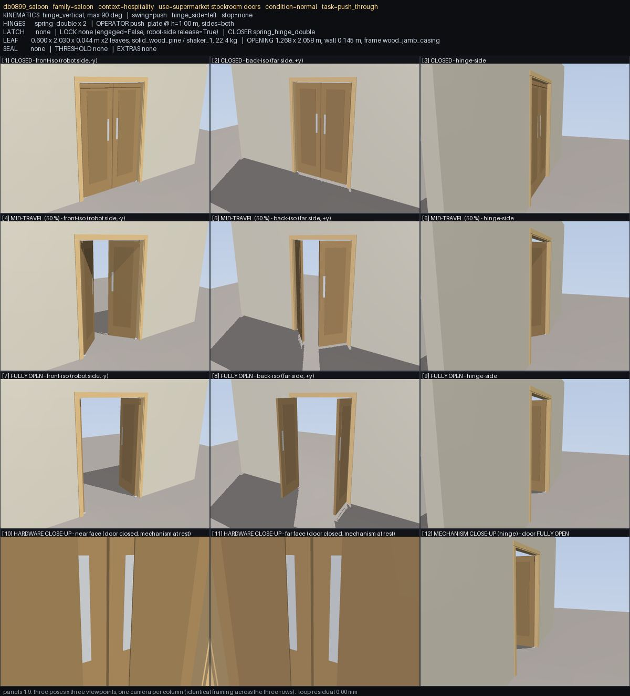

#### `db0911_ship_watertight` (ship_watertight)

_ship_watertight / ship bulkhead watertight door: missing_hardware_

* **MAJOR / missing_hardware** - hook-and-eye holdback: The caption says stop=hook_holdback, and no hook-and-eye holdback is modelled: at full open the leaf is held by nothing. (seen in panels 7, 9) _(confidence 0.85)_
* **MAJOR / missing_hardware** - dog_lever on the far face: The caption says the dog_lever is on both sides. Only one face carries it: the other hardware close-up shows a blank leaf. A robot approaching from that side has nothing to take hold of. (seen in panels 10 and 11 compared) _(confidence 0.85)_

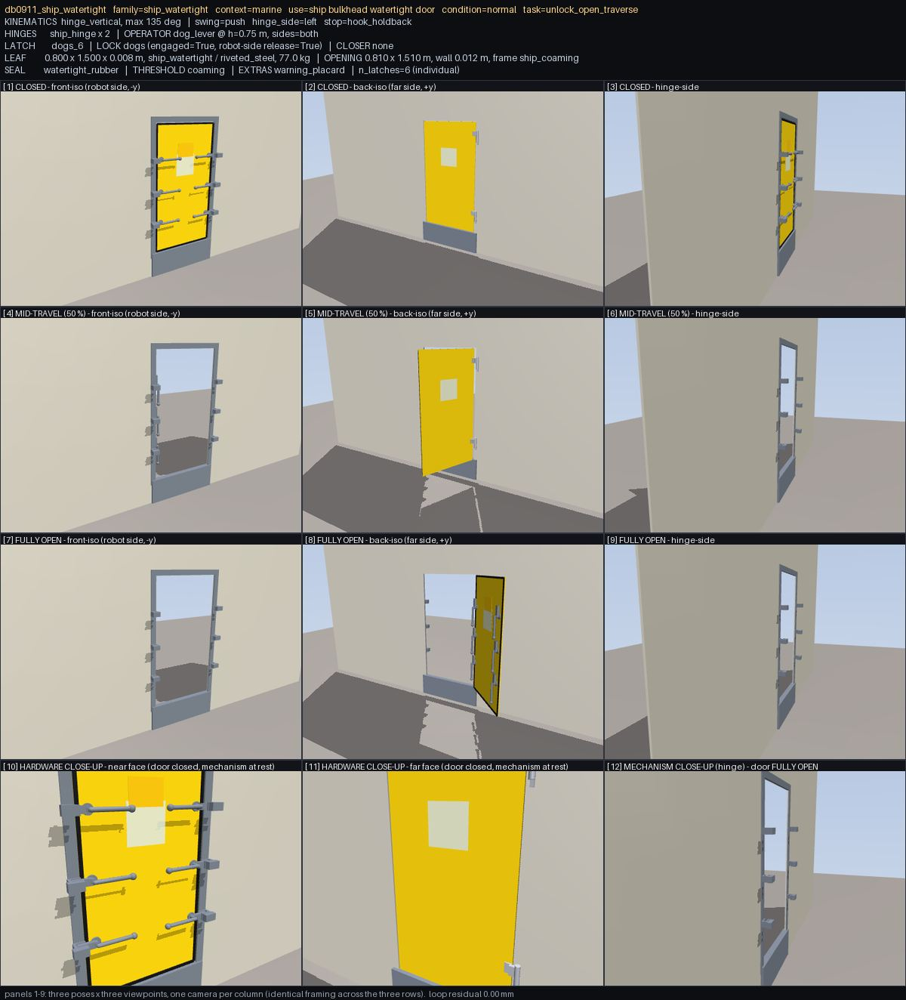

#### `db0927_accordion` (accordion)

_accordion / room divider accordion: wrong_scale_

* **MAJOR / wrong_scale** - leaf mass: The caption states 10 leaves of 0.122 x 2.400 x 0.012 m in upvc_panel and a total of 14.1 kg. The stated area density is 12.6 kg/m2, so those leaves weigh 37 kg between them: the slab mass has been computed for one leaf and then split across all 10. Every leaf is 10x too light. (seen in caption; the leaves in panels 1 and 2) _(confidence 0.90)_

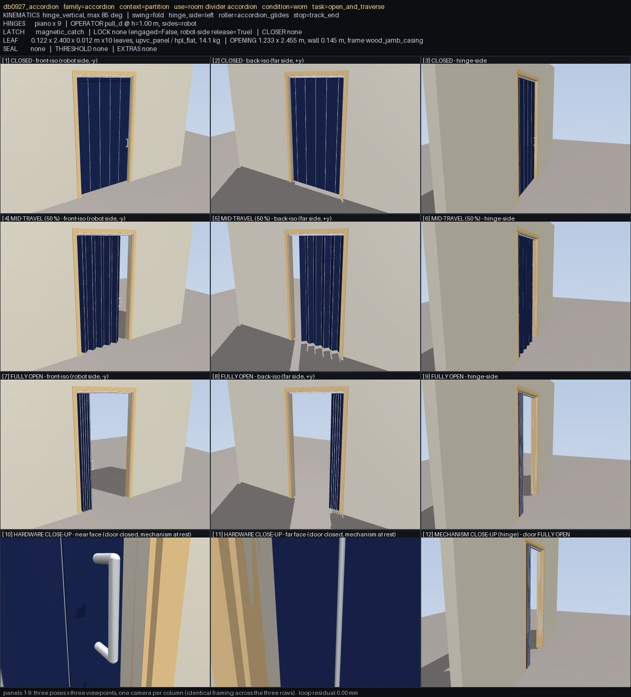

#### `db0932_revolving` (revolving)

_revolving / hospital lobby revolving door: missing_hardware; wrong_placement; wrong_scale_

* **MAJOR / wrong_scale** - leaf mass: The caption states 4 leaves of 0.870 x 2.700 x 0.010 m in revolving_wing and a total of 61.7 kg. The stated area density is 25.0 kg/m2, so those leaves weigh 235 kg between them: the slab mass has been computed for one leaf and then split across all 4. Every leaf is 4x too light. (seen in caption; the leaves in panels 1 and 2) _(confidence 0.90)_
* **MAJOR / missing_hardware** - push_pull_sign: The caption lists push_pull_sign among the extras, and no geometry for it exists anywhere on the door - not hidden, absent. (physics.py still charges hardware mass for several of these, so the door carries weight for parts that are not there.) (seen in panels 1, 2, 10, 11) _(confidence 0.90)_

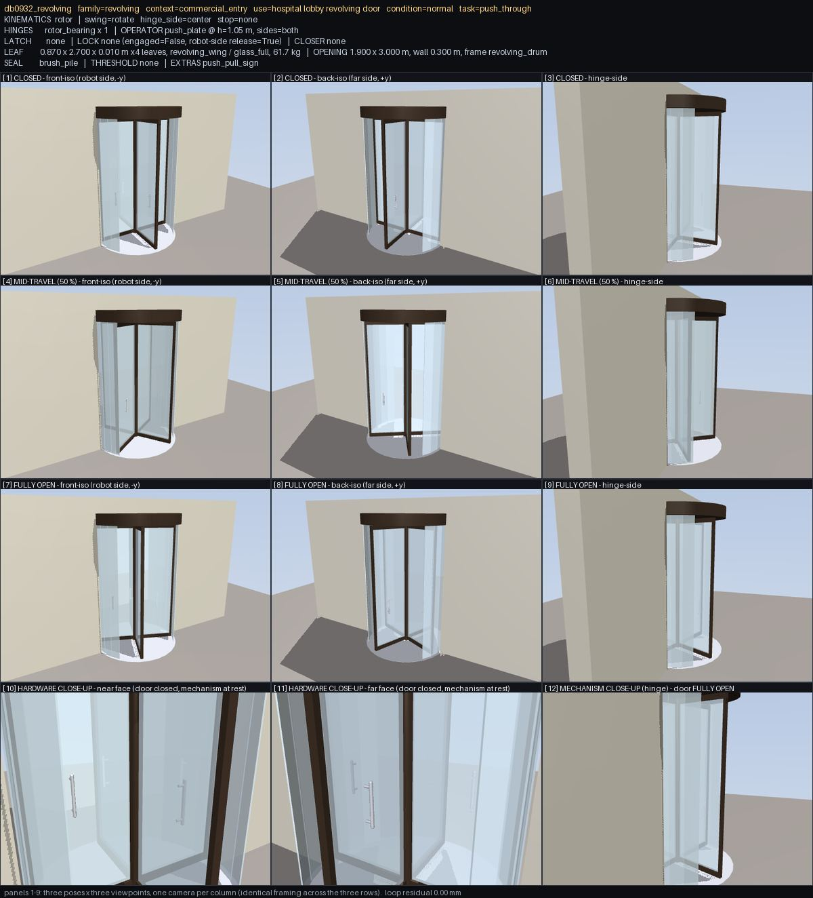

#### `db0933_bifold` (bifold)

_bifold / laundry closet bifold: wrong_scale_

* **MAJOR / wrong_scale** - leaf mass: The caption states 4 leaves of 0.305 x 2.400 x 0.035 m in hollow_core and a total of 5.5 kg. The stated area density is 7.2 kg/m2, so those leaves weigh 21 kg between them: the slab mass has been computed for one leaf and then split across all 4. Every leaf is 4x too light. (seen in caption; the leaves in panels 1 and 2) _(confidence 0.90)_

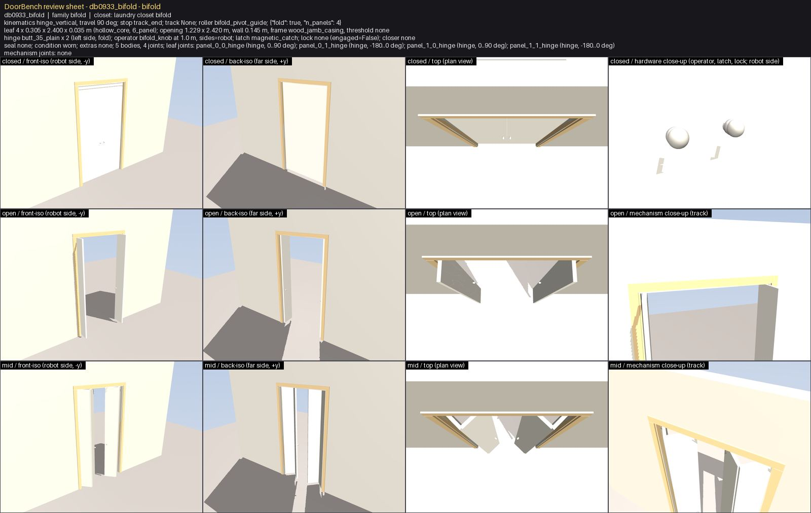

#### `db0960_blast` (blast)

_blast / shelter blast door: missing_hardware_

* **MAJOR / missing_hardware** - warning_placard: The caption lists warning_placard among the extras, and no geometry for it exists anywhere on the door - not hidden, absent. (physics.py still charges hardware mass for several of these, so the door carries weight for parts that are not there.) (seen in panels 1, 2, 10, 11) _(confidence 0.90)_
* **MAJOR / missing_hardware** - lever_straight on the far face: The caption says the lever_straight is on both sides. Only one face carries it: the other hardware close-up shows a blank leaf. A robot approaching from that side has nothing to take hold of. (seen in panels 10 and 11 compared) _(confidence 0.85)_

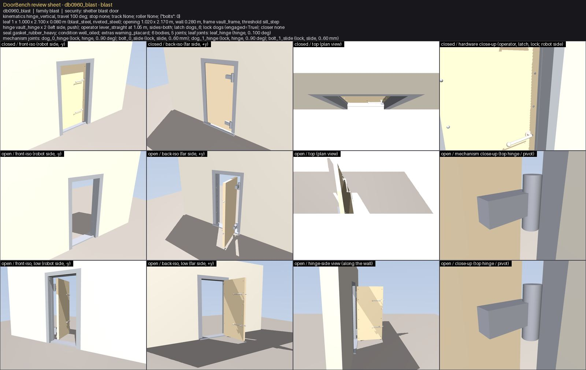

#### `db0976_hatch_floor` (hatch_floor)

_hatch_floor / ship deck hatch: missing_hardware_

* **MAJOR / missing_hardware** - prop arm: The caption says stop=prop_arm, and no prop arm is modelled: at full open the leaf is held by nothing. (seen in panels 7, 9) _(confidence 0.85)_

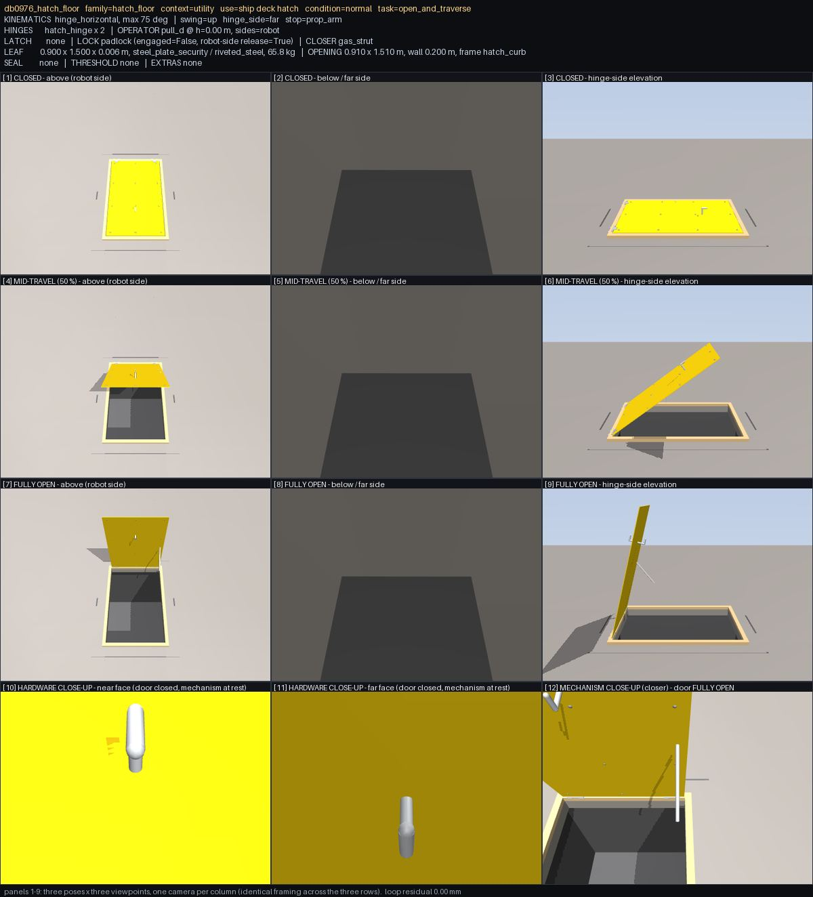

#### `db0987_hatch_ceiling` (hatch_ceiling)

_hatch_ceiling / roof scuttle hatch: missing_hardware_

* **MAJOR / missing_hardware** - prop arm: The caption says stop=prop_arm, and no prop arm is modelled: at full open the leaf is held by nothing. (seen in panels 7, 9) _(confidence 0.85)_

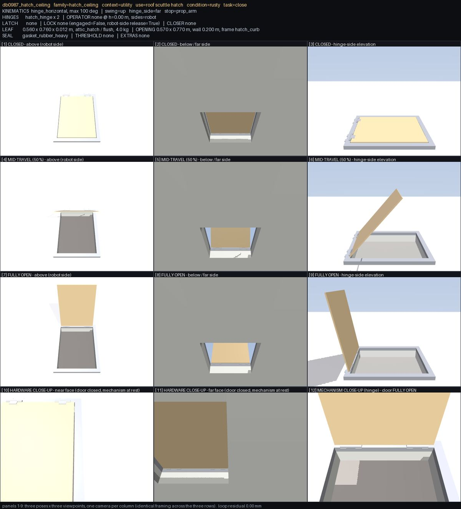

#### `db0991_saloon` (saloon)

_saloon / cafe kitchen pass doors: wrong_scale_

* **MAJOR / wrong_scale** - leaf mass: The caption states 2 leaves of 0.600 x 1.100 x 0.035 m in solid_wood_pine and a total of 9.8 kg. The stated area density is 14.0 kg/m2, so those leaves weigh 18 kg between them: the slab mass has been computed for one leaf and then split across all 2. Every leaf is 2x too light. (seen in caption; the leaves in panels 1 and 2) _(confidence 0.90)_

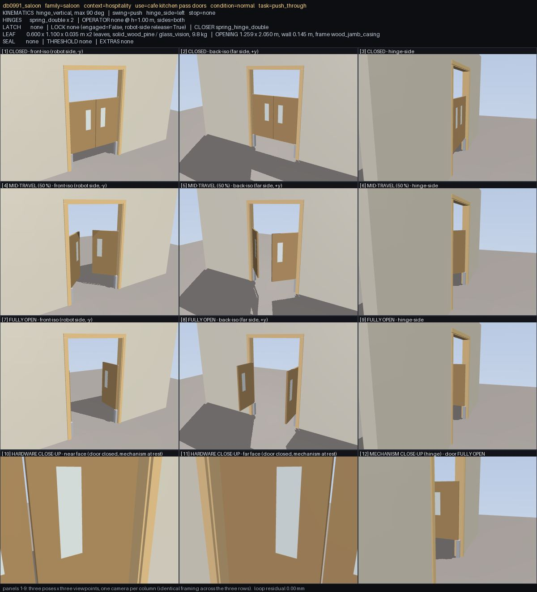

#### `db0995_turnstile_fullheight` (turnstile_fullheight)

_turnstile_fullheight / metro station turnstile: missing_hardware; wrong_scale_

* **MAJOR / wrong_scale** - leaf mass: The caption states 3 leaves of 0.650 x 2.100 x 0.038 m in turnstile_arm and a total of 13.6 kg. The stated area density is 300.2 kg/m2, so those leaves weigh 1229 kg between them: the slab mass has been computed for one leaf and then split across all 3. Every leaf is 3x too light. (seen in caption; the leaves in panels 1 and 2) _(confidence 0.90)_
* **MAJOR / missing_hardware** - keypad_reader_wall: The caption lists keypad_reader_wall among the extras, and no geometry for it exists anywhere on the door - not hidden, absent. (physics.py still charges hardware mass for several of these, so the door carries weight for parts that are not there.) (seen in panels 1, 2, 10, 11) _(confidence 0.90)_

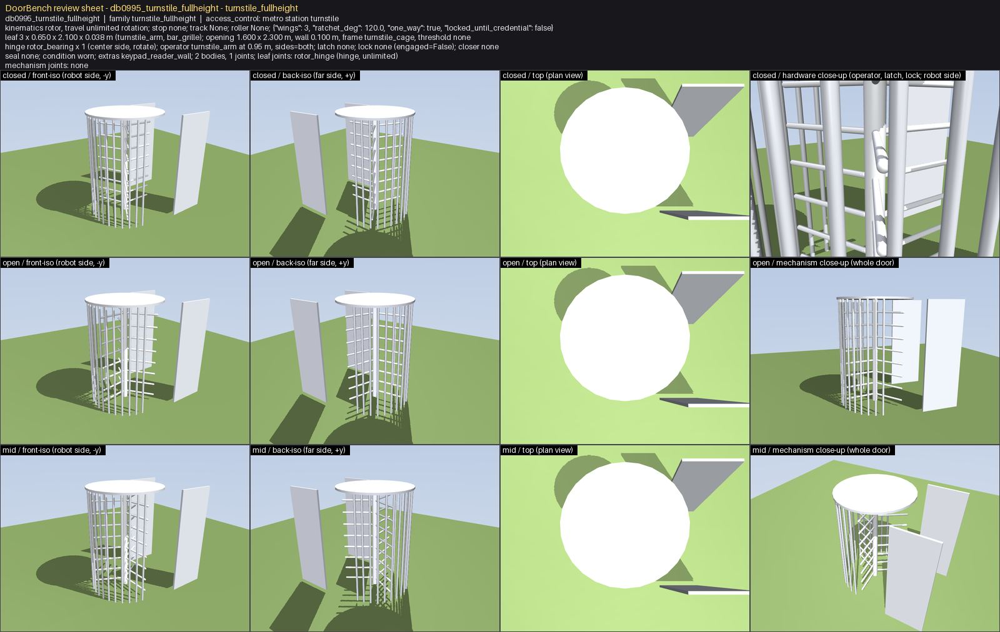

#### `db0998_turnstile_tripod` (turnstile_tripod)

_turnstile_tripod / amusement park turnstile: missing_hardware; wrong_scale_

* **MAJOR / wrong_scale** - leaf mass: The caption states 3 leaves of 0.500 x 1.000 x 0.038 m in turnstile_arm and a total of 7.5 kg. The stated area density is 300.2 kg/m2, so those leaves weigh 450 kg between them: the slab mass has been computed for one leaf and then split across all 3. Every leaf is 3x too light. (seen in caption; the leaves in panels 1 and 2) _(confidence 0.90)_
* **MAJOR / missing_hardware** - keypad_reader_wall: The caption lists keypad_reader_wall among the extras, and no geometry for it exists anywhere on the door - not hidden, absent. (physics.py still charges hardware mass for several of these, so the door carries weight for parts that are not there.) (seen in panels 1, 2, 10, 11) _(confidence 0.90)_


#### `db0999_swing_single` (swing_single)

_swing_single / corridor door: missing_hardware_

* **MAJOR / missing_hardware** - door_stop_wall: The caption lists door_stop_wall among the extras, and no geometry for it exists anywhere on the door - not hidden, absent. (physics.py still charges hardware mass for several of these, so the door carries weight for parts that are not there.) (seen in panels 1, 2, 10, 11) _(confidence 0.90)_

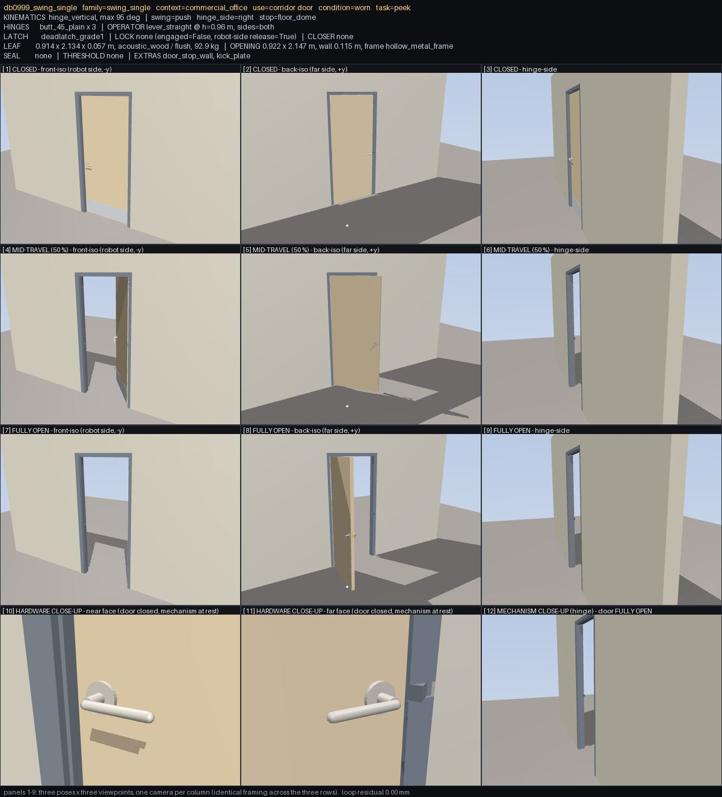

---

## Triage

Every class below started the same way: a panel on a review sheet looked wrong. The second column is
what happened next - the deterministic re-check that was run over all 1000 doors to decide whether the
eye was right, and what the check said. A class is only reported once it survived that step, and the
per-door verdicts use the check's membership so the report names the actual doors rather than the four
that happened to be sampled.

### (a) Real geometry / model defects

| # | What the sheet showed | Confirmed by | Scope | Severity |
|---|---|---|---|---|
| 1 | A roll-up curtain hanging in the air above the top of the wall at "fully open", with clear sky between it and the building | side guides end at the opening head; the curtain at full open spans 2.1-3.6 m above them, and above the drum hood | **15 / 15 rollup** | blocker |
| 2 | A 2.5 m hole in the wall directly above a sectional garage door, open to the sky | `wall_header` sits at the top of the wall (z 5.01-5.23 m) instead of on the opening head (2.49 m); the hole exists so the lifted leaf does not interpenetrate the wall | **18 / 18 garage_sectional** | blocker |
| 3 | An automatic swing operator's arm pointing into open space with the door open, connected to nothing | `auto_operator_arm` / `_shoe` are geoms of the **leaf** body (`common.py:1698`, comment: "arm to the leaf (visual)"); 35 mm short of the header even shut, half a metre away at full open | **15 doors** (10 automatic_swing, 3 swing_single, 2 swing_double) | blocker |
| 4 | Closed, mid-travel and fully open panels identical on a door whose task is "open and traverse" | the primary joint's whole range is 2 mm (elevator) or ±2.9° (turnstile); MuJoCo ranges are static, so releasing the interlock/mag-lock cannot widen them | **24 benchmark-eligible doors** (8 elevator, 13 turnstile, 1 gate_sliding, 1 swing_single, 1 garage_sectional) + 28 swing pairs with the inactive leaf welded shut, 4 of them with no bolt in the spec at all | blocker |
| 5 | A caption reading "4 leaves … 5.5 kg" over four full-height doors | `physics.leaf_mass` is documented as "mass of **one leaf**" and the pipeline uses it as the whole door's mass, splitting it across all leaves. Implied area density = stated area density / leaf count, exactly, on every multi-leaf door | **219 doors** (76 swing_double, 35 sliding_bypass, 30 bifold, 15 revolving, 12 accordion, 20 turnstile, 9 saloon, 9 automatic_sliding, 8 strip_curtain, 5 elevator) - a 4-wing revolving door weighs 110 kg instead of 440 | major (physics-wide) |
| 6 | A caption listing extras that are nowhere on the door | 5 extras are implemented nowhere (`louver_vent`, `door_stop_wall`, `hold_open_kickdown`, `weather_drip_cap`, `soft_close_damper`); 4 family builders never call `add_extras` at all (revolving, turnstile, vault, blast) | **156 declared extras across 153 doors**; `physics.py` still charges hardware mass for several of them | major |
| 7 | A hatch standing 90° open with nothing holding it, on a door whose caption says `stop=prop_arm` | the named stop part has no geometry | **35 doors** (9 prop_arm, 10 hook_holdback, 13 wall_180, 3 kick_down_holder) | major |
| 8 | A blank leaf in the far-face close-up next to a caption saying the pull is on both sides | operator-semantic geoms all on one face | **129 doors**, concentrated in the families whose builders do not use `operator_faces()` (sliding_single, gate_swing, stall, baby_gate, rollup, garage, ship_watertight) | major |
| 9 | Two dog levers on a door captioned `dogs_6` | moving dog/bolt joints counted against the model name | **12 doors** (10 build 4 where the name says 6, 2 build 8) | major |
| 10 | Both leaves of a "double egress" pair swinging the same way | both leaf hinges share an axis sign and range | **10 / 10 double_egress** | major |
| 11 | A black box hanging 3 m out in the air beside a garage door | `opener_unit` is cantilevered off a 2.9 m unsupported rail in a scene with no ceiling and no drop straps | **7 garage_sectional** | major |
| 12 | A floor-mounted stop on a door captioned `stop=wall_bumper` | `door_stop_base` / `_post` / `_bumper` on the floor; no wall-mounted bumper anywhere | **149 doors** | minor |
| 13 | A tubular pull bar on a revolving wing captioned `operator push_plate` | the revolving builder draws `wing_N_bar` regardless of the sampled operator | **3 doors** | minor |

### (b) Rendering artefacts - fixed in the review tool, not in the dataset

Five of these cost a full investigation each before turning out to be the renderer, so they are worth
naming. All five are fixed in `doorbench/review/sheet.py`; the sheets in this report are the fixed ones.

* **Reflective material mirroring the skybox.** Five opaque steel garage sections read as an empty
  opening above the bottom panel, because their material's reflectance showed sky. `mat_reflectance = 0`.
* **28 doors painted black at 4 % reflectance** rendered as featureless silhouettes - no split line on
  a dutch door, no panel detail, no hardware. Headlight ambient 0.10 -> 0.40.
* **Clear glazing was invisible.** A patio slider open by 0.84 m looked exactly like a shut one, and
  an empty doorway looked exactly like a glazed one. The review render now tints anything under
  alpha 0.55 up to it.
* **The camera fitted the bounding sphere**, so a hinge stile (0.03 x 0.05 x 1.9 m) was framed as a
  whole-door shot and the "close-ups" were not close. Both axes are now fitted by projecting the box
  onto the camera's own axes.
* **"Fully open" was not open on a bypass closet.** Driving every leaf joint to its limit opens a
  swing pair and a bi-parting slider, but a bypass's two leaves run on opposite tracks: driving both
  swaps them and the doorway stays blocked. `open_drive()` now measures both candidate poses and
  takes whichever leaves less of the doorway covered.

Two framing limitations remain and are documented rather than fixed: the far-side column is a blank
wall for elevator landing doors (the camera is behind the car's back wall) and a dark void for floor
hatches (it is under the floor), and the near-edge-on "edge" column is low-value for pet doors, where
the "wall" is a 44 mm door leaf.

### (c) False positives - the eye was wrong, the door was right

Recording these matters as much as the findings: they are the rate at which this method cries wolf,
and each one was killed by a measurement rather than by argument.

| What I thought I saw | What it actually was |
|---|---|
| A bifold with `louver_full` rendered as a flat blank slab | 23 louver slats per panel exist; they are the same colour as the slab and vanish at 400 px |
| A barn-door rail too short (the original db0079 complaint), on db0867 | every barn track keeps **≥120 mm** of rail beyond the outermost roller at every point of the travel, dataset-wide - the original defect is fixed |
| A sliding gate that moves only half its stated travel | perspective; all 175 slide doors move ≥85 % of the stated travel, measured per leaf body |
| A "centre pivot" door rotating about its edge | the pivot is inset 0.14-0.33 of the leaf width, which is what a centre-hung pivot door actually is |
| A dutch door drawn as one slab, and its handle straddling the split | two independently hinged bodies; the handle is at 0.90-0.97 m, the join bolt at 1.03-1.19 m |
| A vault door with its boltwork on the hinge side | mirroring in the far-side view; no hinged door in the dataset has a latch bolt within 25 % of the leaf width of its hinge axis |
| A strip curtain covering half its opening | the strips cover 98-99 % of the opening width |
| An accordion that barely folds | the panel centres close from 0.80 m to 0.20 m of span |
| A white plate hanging loose off a gate latch | `leaf_cup_ramp`, the lead-in ramp on the catch cup, at its designed 42° |
| An elevator leaf that does not slide | it slides 1.06 m; the grey behind the opening is the car's back wall |

### What was fixed here, and what was not

**Fixed in this branch** (the review tool, `doorbench/review/`): the five rendering defects above, each
of which was making a correct door look wrong or a wrong one look right. No dataset geometry was
changed: every remaining finding is either dataset-wide (the mass formula touches 219 doors and every
physics number derived from them) or needs a real mechanism where there is now a decoration, and
neither is a change to make without the owner's call on the physics it moves.

### Handoff

Grouped by the file the fix lands in. Each item is stated so it can be picked up without this report.

**`doorbench/physics.py` - `leaf_mass()` (line 19)**
1. `slab_mass` and `glass_mass` are computed for one leaf and never multiplied by `spec["leaf"]["count"]`,
   while `build.py` reconciles the whole model's moving mass to `total_kg`. 219 doors are 2-8x too
   light; a 4-wing revolving door is 110 kg instead of 440. The `mass` gate cannot catch it because it
   compares the model against the same wrong number. **The fix is one multiplication, but it moves
   opening forces, hold thresholds, closer sizing, roller friction, damage thresholds and the
   benchmark's expected transit time on 219 doors** - expect `free_opens`, `hold`, `no_jam` and
   `closer_returns` to need re-tuning, and re-run the Isaac parity gate afterwards. The turnstile
   special cases in the same function (`slab_mass = 3 * ...`, "per wing incl. share of rotor column")
   also need reviewing against the count.

**`doorbench/geometry/common.py` - `add_closer()` (line ~1694)**
2. The `auto_operator_low_energy` / `auto_operator_full` branch draws `auto_operator_arm` and
   `auto_operator_arm_shoe` as geoms of the leaf, with the comment "arm to the leaf (visual)". Make it
   the linkage the surface-closer branch 30 lines below already builds, with the roles swapped: a
   two-bar arm whose pinion body hangs from the static `auto_operator_header` and whose forearm closes
   a `connect` equality onto a shoe on the leaf. 15 doors. Check `viewer/src/kinematics.ts` - its
   two-bar analytic IK keys on the closer arm's body names, and an arm rooted in the world rather than
   on the leaf is a case it has not seen.

**`doorbench/geometry/common.py` - `add_extras()` (line 1807)**
3. Five extras in `taxonomy.EXTRAS` are implemented nowhere: `louver_vent` (26 doors), `door_stop_wall`
   (21), `hold_open_kickdown` (11), `weather_drip_cap` (11), `soft_close_damper` (6). `physics.py`
   already charges 0.9 / 0.3 / 0.3 kg of hardware mass for three of them, so the doors carry weight for
   parts that do not exist. All are leaf- or wall-mounted and small; the only care needed is the
   running-clearance gate, since a face-mounted part at the bottom or top of a leaf sweeps past the
   casing.
4. `add_extras()` is called from exactly two places (`hinged.py:702`, `other.py:488`). `build_revolving`,
   `build_turnstile`, `build_vertical` and `build_horizontal` never call it, so `push_pull_sign` (15
   revolving), `keypad_reader_wall` (20 turnstiles) and `warning_placard` (14 vault/blast) are silently
   dropped. Each builder needs the call with its own u/v/x0/z0/W/Hh/t/Wo/Ho.
5. `threshold_saddle` is not handled at all; 22 sliding_single doors declare it and get nothing.

**`doorbench/geometry/other.py` - `build_vertical()` (line 806, 815)**
6. `garage_sectional` sizes the wall hole to `Ho + Hh + 0.08` - the door's whole lift envelope - so the
   wall above the opening is missing and the header ends up as a 220 mm strip at the top of a 5.2 m
   wall. 18 doors, each with a 2.0-2.5 m hole open to the sky. The hole is there because the leaf
   slides up *inside the wall plane*; closing the wall means either giving the lifted leaf a y offset
   (it stacks inboard, as a real sectional door does) or modelling the sections curving into a
   horizontal ceiling track.
7. `rollup` (15 doors): the curtain rises as a rigid slab past the end of its coiling guides and past
   the top of the wall - at full open, 2.1-3.6 m of curtain with no guide either side and nothing
   holding it. Either coil it onto the drum (a curtain whose visible length shortens with travel) or
   extend the guides and the hood to the full lift and accept the tall stack.
8. `opener_unit` (7 doors) hangs on the end of a 2.9 m unsupported rail. Either add the two ceiling
   drop straps a real opener hangs from (and a ceiling to hang them on), or stop drawing the motor and
   keep only the header angle and the rail stub.

**`doorbench/spec.py` / `doorbench/qa.py` - tasks that cannot be performed**
9. 24 benchmark-eligible doors carry a task requiring the door to move on a primary joint whose static
   MuJoCo range makes movement impossible (8 elevator landing doors at 2 mm, 13 turnstiles at ±2.9°,
   plus 3 others). A releasable lock must not be modelled as a joint range: give the leaf its real
   range and hold it with the lock's own constraint (an equality or a bolt geom) that the release can
   undo. Until then those 24 doors are unpassable benchmark entries whose only QA is `hold` /
   `locked_holds`, which pass *because* the door cannot move. The same applies to the 28 swing pairs
   whose inactive leaf is welded at 0.06° - 4 of which have no latch and no lock in the spec at all.
10. A cheap gate that would have caught all of it: for every door whose task is in the "must move" set,
    assert that the primary joint's range exceeds 6° / 50 mm.

**`doorbench/geometry/hinged.py` - operators**
11. `operator_faces()` returns both faces for `sides == "both"`, and 129 doors draw the operator on one
    face anyway, because the sliding / gate / stall / baby-gate / rollup / garage / ship builders do not
    use it. A robot approaching those doors from the far side finds nothing to hold.
12. 32 doors have an operator model but no geom carrying the `operator` semantic (9 `knob_keypad_deadbolt`,
    9 `hasp_padlock`, 4 `pull_ring`, 2 `cold_storage_handle`, plus 8 `elevator_none` which are correct).
    The parts are drawn, but as `latch` / `lock` / `decor`, so the benchmark's grip sites, the viewer's
    handle camera and this review's hardware close-up all miss them.

**`doorbench/geometry/other.py` - `build_revolving` / double-egress**
13. All 10 `double_egress` pairs have both leaves on the same hinge axis sign with the same range, so
    both swing the same way. A double-egress pair swings one leaf each way; that is what the
    configuration is for.
14. 12 `dogs_6` / `multi_bolt_N` doors build 4 or 8 dogs rather than the number in the model name.

**Appearance (probably `doorbench/appearance/`)**
15. 28 doors are painted `black` at rgba 0.04 - darker than any real door paint (5-10 % reflectance)
    and dark enough that no panel detail, split line or hardware is visible under any lighting. They
    are effectively un-inspectable, by eye or by a vision model.

---

## Minor findings

| door | family | category | part | description | where |
|---|---|---|---|---|---|
| `db0024_swing_single` | swing_single | wrong_placement | door stop | The caption says stop=wall_bumper. What is drawn is a floor-mounted stop - a base plate on the floor, a post and a bumper 77 mm up - not a bumper on the wall at handle height. | panels 1, 3 |
| `db0053_elevator` | elevator | missing_hardware | elevator_none | The caption names operator elevator_none, and no geom on the door carries the 'operator' semantic - the part is drawn (as latch/lock/decor) but nothing the benchmark or the viewer reads as the operator. | panels 10, 11 |
| `db0064_gate_sliding` | gate_sliding | missing_hardware | hasp_padlock | The caption names operator hasp_padlock, and no geom on the door carries the 'operator' semantic - the part is drawn (as latch/lock/decor) but nothing the benchmark or the viewer reads as the operator. | panels 10, 11 |
| `db0122_swing_single` | swing_single | wrong_placement | door stop | The caption says stop=wall_bumper. What is drawn is a floor-mounted stop - a base plate on the floor, a post and a bumper 77 mm up - not a bumper on the wall at handle height. | panels 1, 3 |
| `db0585_cold_storage` | cold_storage | wrong_placement | door stop | The caption says stop=wall_bumper. What is drawn is a floor-mounted stop - a base plate on the floor, a post and a bumper 77 mm up - not a bumper on the wall at handle height. | panels 1, 3 |
| `db0607_elevator` | elevator | missing_hardware | elevator_none | The caption names operator elevator_none, and no geom on the door carries the 'operator' semantic - the part is drawn (as latch/lock/decor) but nothing the benchmark or the viewer reads as the operator. | panels 10, 11 |
| `db0765_gate_sliding` | gate_sliding | missing_hardware | hasp_padlock | The caption names operator hasp_padlock, and no geom on the door carries the 'operator' semantic - the part is drawn (as latch/lock/decor) but nothing the benchmark or the viewer reads as the operator. | panels 10, 11 |
| `db0811_elevator` | elevator | missing_hardware | elevator_none | The caption names operator elevator_none, and no geom on the door carries the 'operator' semantic - the part is drawn (as latch/lock/decor) but nothing the benchmark or the viewer reads as the operator. | panels 10, 11 |
| `db0836_swing_single` | swing_single | wrong_placement | door stop | The caption says stop=wall_bumper. What is drawn is a floor-mounted stop - a base plate on the floor, a post and a bumper 77 mm up - not a bumper on the wall at handle height. | panels 1, 3 |
| `db0926_gate_swing` | gate_swing | wrong_placement | door stop | The caption says stop=wall_bumper. What is drawn is a floor-mounted stop - a base plate on the floor, a post and a bumper 77 mm up - not a bumper on the wall at handle height. | panels 1, 3 |
| `db0932_revolving` | revolving | wrong_placement | wing operator | The caption names operator push_plate; each wing carries a tubular pull bar instead - the revolving builder draws a bar regardless of the operator the spec sampled. | panels 10, 11 |
| `db0962_elevator` | elevator | missing_hardware | elevator_none | The caption names operator elevator_none, and no geom on the door carries the 'operator' semantic - the part is drawn (as latch/lock/decor) but nothing the benchmark or the viewer reads as the operator. | panels 10, 11 |
