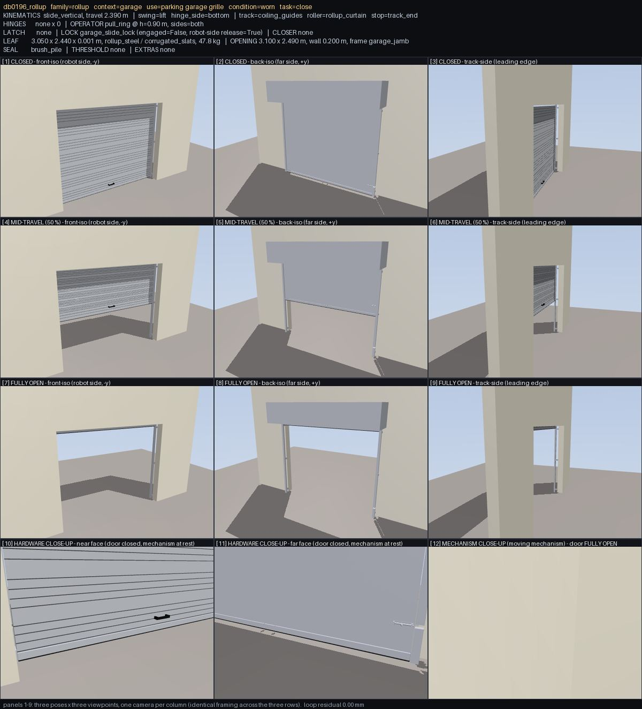
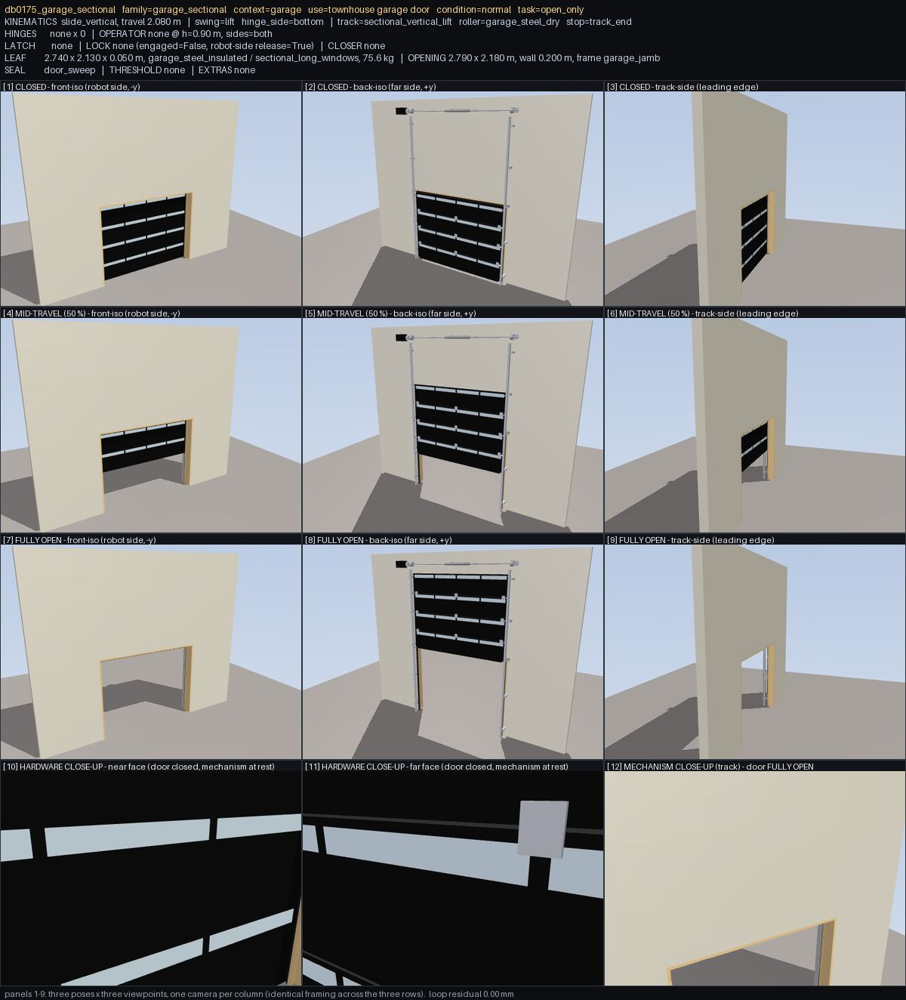

# Overhead doors: the curtain coils, the wall closes, the opener is bolted to something

Vision-review findings 1, 2 and 11 (`docs/VISION_REVIEW.md`), the three overhead-door classes where the
mechanism was an approximation that looks obviously wrong to a person - and where every deterministic gate
was green on every one of the 33 doors.

| # | what the sheet showed | scope | now |
|---|---|---|---|
| 1 | a roll-up curtain hanging in the air above the top of the wall at "fully open", sky between it and the building | 15 / 15 `rollup` | the curtain coils: its exposed length shrinks by the distance travelled and the surplus closes up into the hood |
| 2 | a 2.0-2.5 m hole in the wall directly above a sectional garage door, open to the sky | 18 / 18 `garage_sectional` | the door runs up the inside face of the wall; the wall's opening is the door's opening |
| 11 | a black box hanging 3 m out in the air beside a garage door | 7 `garage_sectional` | a jackshaft opener bolted to the wall beside the shaft, 0.25 m of reach |

---

## 1. The roll-up curtain coils

A coiling door's curtain is inextensible. When the bottom bar has risen by `s`, exactly `s` of curtain has wound
onto the barrel, and what is left hanging runs from the bar up to the head, where it enters the coil: the exposed
curtain is **shorter by `s`**. A rigid slab cannot do that. It carries its whole length past the head, out of the
top of its guides and into the sky - which is what all 15 of these doors did, 2.1-3.6 m of curtain with no guide
either side of it and nothing holding it.

The curtain is now a chain of **K courses** of `Hh/K` each (K = 4-8, ~0.35 m a course; the dataset builds 6, 7 or
8). Course *k* hangs under course *k-1* and slides **down** relative to it by `s/K`, coupled to the lift by a
joint equality, so its height above the floor is `s(1 - k/K)`: the bottom edge follows the bar, the courses close
up on each other, and the length that has gone into the coil is inside the hood. At full open the whole curtain is
a single course thick, tucked under the barrel, and the opening is clear.

Two consequences worth stating plainly, because they are approximations and not the real barrel:

* **The courses overlap as they close up.** They are one sheet of steel 0.8-10 mm thick winding onto itself; the
  overlap is the wind. Contacts between them are excluded and the pairs are on the model's `clearance_allow`
  list with that reason, exactly as the strip curtain's overlapping PVC is.
* **The counterbalance holds the curtain that is still hanging**, not all of it: the lift carries
  `sum_k m_k (1 - k/K) = (K+1)/2K` of the curtain's weight (0.56-0.58 here). A real coiling door's hanging weight
  falls from all of it to none of it as the barrel takes it; the uniform-collapse kinematics make it the constant
  average of that, which is what the spring is sized against.

## 2. The sectional garage door's wall

The old builder cut the wall away over the door's whole lift envelope - `Ho + Hh + 0.08` - because the leaf
travelled **inside the wall plane** and would otherwise have driven straight through the header. The wall header
ended up as a 0.22 m strip at the top of a 5.2 m wall and every one of the 18 doors had 2.0-2.5 m of open sky
directly above it.

These doors declare `"track": "sectional_vertical_lift"`, and that is now what they are: the leaf runs up the
**inside face** of the wall on C-channel tracks bolted back to it every 0.8 m, and the wall closes over the
opening. What that took:

* the wall is cut to the rough opening (`Wo + 2 x 0.04` by `Ho + 0.04`) and a jamb lining brings it back to the
  declared opening, so the hole in the wall **is** the door's opening;
* stop moulding and a jamb weatherstrip on the inside face of both jambs, and a header weatherstrip at the head:
  the door closes onto them and the 25-40 mm gap around the leaf is covered;
* the door's standoff from the wall is set by whatever sticks furthest out of its weather face (an exterior lift
  handle, a T-handle rose) rather than by the slab, because on a vertical-lift door every piece of hardware on
  the leaf passes the head on every open;
* torsion shaft, spring and cable drums move to the **top** of the lift, on end bearing plates bolted to the wall,
  which is where a vertical-lift door's counterbalance is.

A standard-lift door - the one that curves back into horizontal ceiling tracks - was tried first and abandoned for
a reason worth recording: MuJoCo's joint equality is a quartic in the driver, and the section angles of a
line-arc-line track are not. Fitting them (least squares, 121 samples, exactness forced at the closed pose) leaves
**10-15 deg of angle error and 48-92 mm of pin error** on every layout in the dataset - the panel chain visibly
breaks and the rollers leave the curve. The kinematic sweeps every gate here is built on cannot pose a
contact-driven chain either. Vertical lift is what this family's own spec declares and what MuJoCo can model
exactly, so that is what it now is; the sections stay coplanar because on a vertical-lift track they really do.

## 3. The opener

`opener_unit` used to hang on the end of a 2.9 m rail cantilevered from a header angle into a scene with no
ceiling and no drop straps - 3 m out in the air. A vertical-lift door takes a **jackshaft** (wall-mount) opener on
the end of the torsion shaft: wall plate, motor, drive sprocket and chain, nothing more than 0.25 m off the wall
it is bolted to. `tests/test_enclosure_gates.py` measures that reach.

---

## The gates

`doorbench/enclosure_qa.py`, both inside `signed_off`:

**`checks["guided_travel"]`** - sweeps the primary joint over its whole NOMINAL travel (33 samples) - the same
rule `doorbench/sliding_track_qa.py` applies to a horizontal rail, so an engaged lock that narrows the MJCF range
to 3 mm cannot shrink what is checked - with joint equalities resolved, so coupled parts (a curtain's courses)
follow, and requires every geom of the declared moving assembly -
34 to 381 of them per door - to stay inside a declared guide envelope, and never to reach out through the wall
plane. The envelope cannot be invented: each zone names the static guide/track geoms that **back** it, and the
zone's lateral faces and its top and bottom must coincide with the extent of that real hardware to within 30 mm.
Declaring a bigger envelope means drawing a bigger guide. Declared by the two vertical-lift families (33 doors);
horizontal sliders are covered by `checks["sliding_track_support"]`, which this gate deliberately does not
duplicate.

**`checks["wall_opening"]`** - rasterises the wall plane at 20 mm, finds every cell that no static geometry closes
(jamb lining, stop moulding and coaming count: they are what a person sees plugging the hole), and requires all of
it to lie inside the **declared** opening plus the frame's own rough-opening margin (0.15 m). Run against the
pre-fix dataset it fails exactly the 18 sectional doors, over-size 2.08-2.52 m. Across the fixed dataset, 912
doors have a wall plane and the largest legitimate over-size is 0.113 m (a sliding door's rough opening), so the
tolerance sits an order of magnitude below the defect and 30 % above the widest real frame.

Two families leave an opening that is deliberately not the leaf's, and say so in `meta["wall_opening"]` with the
reason (`WALL_OPENING_EXEMPT`): a **baby gate** divides a full-height passage, and a **toilet partition** stands in
a full-height entrance with the statutory gap over its door and a headrail closing the top. A declaration from any
other family is ignored, and `tests/test_enclosure_gates.py` proves it is.

## What the gates cannot see, and one thing they missed

The gates above are kinematic. The header stop moulding on the sectional door started life as a rigid part, and a
rigid one cleared every clearance sweep - the exterior lift handle sweeping it is on the clearance allow list,
because a vinyl header seal is a compliant part - and still **stopped the door dead at 64 % of its travel** in
simulation, on its own handle (measured, 400 N: 1.53 m of 2.39 m). The header weatherstrip is therefore drawn but
not simulated as a collider, and `test_every_vertical_lift_door_reaches_the_end_of_its_travel` now drives every
one of these doors to the end of its travel under a lift force, with its lock parts released, so a part that
silently jams the door cannot come back.

## Numbers

1000/1000 signed off. clearance 1000/1000, running_clearance 1000/1000, attachment 1000/1000, USD static
1000/1000, parity 1000/1000 doors pass every applicable phase (no new failing doors; 8 roll-ups join the
informational soft-limit-overshoot list at 12-24 mm, against a pre-existing worst of 220 mm elsewhere), 1643 tests
pass.
