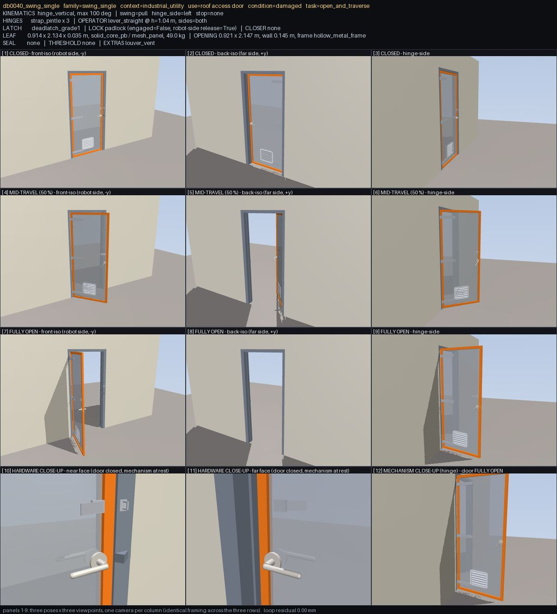
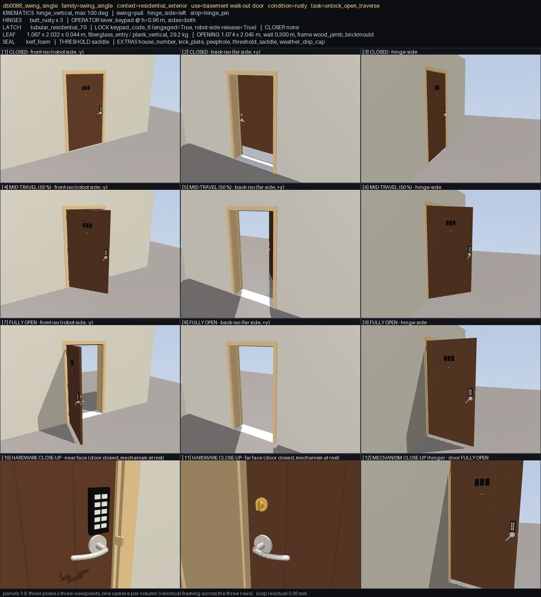
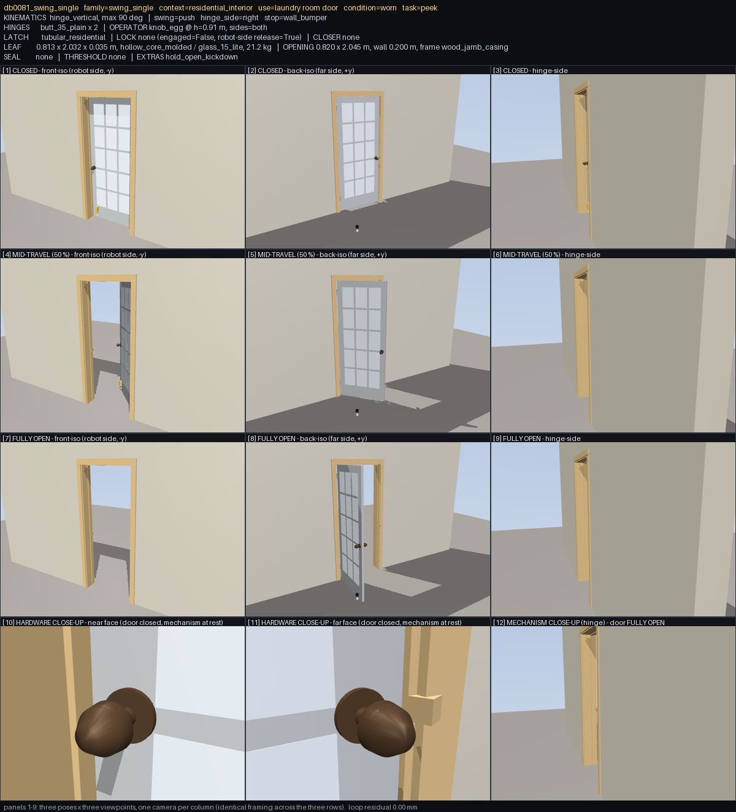

## Triage

Every class below started the same way: a panel on a review sheet looked wrong. The second column is
what happened next - the deterministic re-check that was run over all 1000 doors to decide whether the
eye was right, and what the check said. A class is only reported once it survived that step, and the
per-door verdicts use the check's membership so the report names the actual doors rather than the four
that happened to be sampled.

### (a) Real geometry / model defects

| # | What the sheet showed | Confirmed by | Scope | Severity |
|---|---|---|---|---|
| 1 | A roll-up curtain hanging in the air above the top of the wall at "fully open", with clear sky between it and the building | side guides end at the opening head; the curtain at full open spans 2.1-3.6 m above them, and above the drum hood | **15 / 15 rollup** | blocker |
| 2 | A 2.5 m hole in the wall directly above a sectional garage door, open to the sky | `wall_header` sits at the top of the wall (z 5.01-5.23 m) instead of on the opening head (2.49 m); the hole exists so the lifted leaf does not interpenetrate the wall | **18 / 18 garage_sectional** | blocker |
| 3 | An automatic swing operator's arm pointing into open space with the door open, connected to nothing | `auto_operator_arm` / `_shoe` are geoms of the **leaf** body (`common.py:1698`, comment: "arm to the leaf (visual)"); 35 mm short of the header even shut, half a metre away at full open | **15 doors** (10 automatic_swing, 3 swing_single, 2 swing_double) | blocker |
| 4 | Closed, mid-travel and fully open panels identical on a door whose task is "open and traverse" | the primary joint's whole range is 2 mm (elevator) or ±2.9° (turnstile); MuJoCo ranges are static, so releasing the interlock/mag-lock cannot widen them | **24 benchmark-eligible doors** (8 elevator, 13 turnstile, 1 gate_sliding, 1 swing_single, 1 garage_sectional) + 28 swing pairs with the inactive leaf welded shut, 4 of them with no bolt in the spec at all | blocker |
| 5 | A caption reading "4 leaves … 5.5 kg" over four full-height doors | `physics.leaf_mass` is documented as "mass of **one leaf**" and the pipeline uses it as the whole door's mass, splitting it across all leaves. Implied area density = stated area density / leaf count, exactly, on every multi-leaf door | **219 doors** (76 swing_double, 35 sliding_bypass, 30 bifold, 15 revolving, 12 accordion, 20 turnstile, 9 saloon, 9 automatic_sliding, 8 strip_curtain, 5 elevator) - a 4-wing revolving door weighs 110 kg instead of 440 | major (physics-wide) |
| 6 | A caption listing extras that are nowhere on the door | 5 extras were implemented nowhere (`louver_vent`, `door_stop_wall`, `hold_open_kickdown`, `weather_drip_cap`, `soft_close_damper`); 4 family builders never call `add_extras` at all (revolving, turnstile, vault, blast) | **156 declared extras across 153 doors**; `physics.py` still charges hardware mass for several of them. **47 of them fixed here** (see below); 109 remain | major |
| 7 | A hatch standing 90° open with nothing holding it, on a door whose caption says `stop=prop_arm` | the named stop part has no geometry | **35 doors** (9 prop_arm, 10 hook_holdback, 13 wall_180, 3 kick_down_holder) | major |
| 8 | A blank leaf in the far-face close-up next to a caption saying the pull is on both sides | operator-semantic geoms all on one face | **129 doors**, concentrated in the families whose builders do not use `operator_faces()` (sliding_single, gate_swing, stall, baby_gate, rollup, garage, ship_watertight) | major |
| 9 | Two dog levers on a door captioned `dogs_6` | moving dog/bolt joints counted against the model name | **12 doors** (10 build 4 where the name says 6, 2 build 8) | major |
| 10 | Both leaves of a "double egress" pair swinging the same way | both leaf hinges share an axis sign and range | **10 / 10 double_egress** | major |
| 11 | A black box hanging 3 m out in the air beside a garage door | `opener_unit` is cantilevered off a 2.9 m unsupported rail in a scene with no ceiling and no drop straps | **7 garage_sectional** | major |
| 12 | A floor-mounted stop on a door captioned `stop=wall_bumper` | `door_stop_base` / `_post` / `_bumper` on the floor; no wall-mounted bumper anywhere | **149 doors** | minor |
| 13 | A tubular pull bar on a revolving wing captioned `operator push_plate` | the revolving builder draws `wing_N_bar` regardless of the sampled operator | **3 doors** | minor |

### (b) Rendering artefacts - fixed in the review tool, not in the dataset

Five of these cost a full investigation each before turning out to be the renderer, so they are worth
naming. All five are fixed in `doorbench/review/sheet.py`; the sheets in this report are the fixed ones.

* **Reflective material mirroring the skybox.** Five opaque steel garage sections read as an empty
  opening above the bottom panel, because their material's reflectance showed sky. `mat_reflectance = 0`.
* **28 doors painted black at 4 % reflectance** rendered as featureless silhouettes - no split line on
  a dutch door, no panel detail, no hardware. Headlight ambient 0.10 -> 0.40.
* **Clear glazing was invisible.** A patio slider open by 0.84 m looked exactly like a shut one, and
  an empty doorway looked exactly like a glazed one. The review render now tints anything under
  alpha 0.55 up to it.
* **The camera fitted the bounding sphere**, so a hinge stile (0.03 x 0.05 x 1.9 m) was framed as a
  whole-door shot and the "close-ups" were not close. Both axes are now fitted by projecting the box
  onto the camera's own axes.
* **"Fully open" was not open on a bypass closet.** Driving every leaf joint to its limit opens a
  swing pair and a bi-parting slider, but a bypass's two leaves run on opposite tracks: driving both
  swaps them and the doorway stays blocked. `open_drive()` now measures both candidate poses and
  takes whichever leaves less of the doorway covered.

Two framing limitations remain and are documented rather than fixed: the far-side column is a blank
wall for elevator landing doors (the camera is behind the car's back wall) and a dark void for floor
hatches (it is under the floor), and the near-edge-on "edge" column is low-value for pet doors, where
the "wall" is a 44 mm door leaf.

### (c) False positives - the eye was wrong, the door was right

Recording these matters as much as the findings: they are the rate at which this method cries wolf,
and each one was killed by a measurement rather than by argument.

| What I thought I saw | What it actually was |
|---|---|
| A bifold with `louver_full` rendered as a flat blank slab | 23 louver slats per panel exist; they are the same colour as the slab and vanish at 400 px |
| A barn-door rail too short (the original db0079 complaint), on db0867 | every barn track keeps **≥120 mm** of rail beyond the outermost roller at every point of the travel, dataset-wide - the original defect is fixed |
| A sliding gate that moves only half its stated travel | perspective; all 175 slide doors move ≥85 % of the stated travel, measured per leaf body |
| A "centre pivot" door rotating about its edge | the pivot is inset 0.14-0.33 of the leaf width, which is what a centre-hung pivot door actually is |
| A dutch door drawn as one slab, and its handle straddling the split | two independently hinged bodies; the handle is at 0.90-0.97 m, the join bolt at 1.03-1.19 m |
| A vault door with its boltwork on the hinge side | mirroring in the far-side view; no hinged door in the dataset has a latch bolt within 25 % of the leaf width of its hinge axis |
| A strip curtain covering half its opening | the strips cover 98-99 % of the opening width |
| An accordion that barely folds | the panel centres close from 0.80 m to 0.20 m of span |
| A white plate hanging loose off a gate latch | `leaf_cup_ramp`, the lead-in ramp on the catch cup, at its designed 42° |
| An elevator leaf that does not slide | it slides 1.06 m; the grey behind the opening is the car's back wall |

### What was fixed here, and what was not

**Fixed in the review tool** (`doorbench/review/sheet.py`): the five rendering defects above, each of
which was making a correct door look wrong or a wrong one look right.

**Fixed in the dataset** (`doorbench/geometry/common.py`, `add_extras`): three of the five extras that
no builder had ever drawn - `louver_vent` (25 doors), `weather_drip_cap` (11), `hold_open_kickdown`
(11). Each is in `taxonomy.EXTRAS`, each is sampled into specs, and each is charged 0.9 / 0.3 / 0.3 kg
of hardware mass in `physics.py`, so 46 doors were carrying weight for parts that did not exist.
Placement follows the conventions that already pass every gate: the vent is a framed grille with six
sloped slats in the lower third of the leaf, 2 mm proud of both faces like a kick plate; the drip cap
goes on the *frame head*, not the leaf, because a drip cap on a swinging leaf sweeps the head casing,
and it is braced back to the wall with `brace_to_structure` exactly as the EXIT sign is; the kick-down
holder sits on the leaf's **latch** stile, which is the part that leaves the frame first as the door
opens, so a face-mounted holder there sweeps nothing. One door (`db0823_swing_single`) also carries a
pet flap, which wants the same bottom third of the leaf; it fails clearance if both are drawn, so the
vent is skipped there - the same guard `kick_plate` already uses.

Proved by regeneration: **1000/1000 signed off, clearance 1000/1000, running_clearance 1000/1000,
attachment 1000/1000, 1627 tests pass**, and `tests/test_vision_review.py` now asserts that a door
declaring one of the three extras actually draws it.

**Not fixed**: everything else. Each remaining finding is either dataset-wide (the mass formula moves
219 doors and every physics number derived from them) or needs a real mechanism where there is now a
decoration; neither is a change to make without the owner's call on the physics it moves.

### Handoff

Grouped by the file the fix lands in. Each item is stated so it can be picked up without this report.

**`doorbench/physics.py` - `leaf_mass()` (line 19)**
1. `slab_mass` and `glass_mass` are computed for one leaf and never multiplied by `spec["leaf"]["count"]`,
   while `build.py` reconciles the whole model's moving mass to `total_kg`. 219 doors are 2-8x too
   light; a 4-wing revolving door is 110 kg instead of 440. The `mass` gate cannot catch it because it
   compares the model against the same wrong number. **The fix is one multiplication, but it moves
   opening forces, hold thresholds, closer sizing, roller friction, damage thresholds and the
   benchmark's expected transit time on 219 doors** - expect `free_opens`, `hold`, `no_jam` and
   `closer_returns` to need re-tuning, and re-run the Isaac parity gate afterwards. The turnstile
   special cases in the same function (`slab_mass = 3 * ...`, "per wing incl. share of rotor column")
   also need reviewing against the count.

**`doorbench/geometry/common.py` - `add_closer()` (line ~1694)**
2. The `auto_operator_low_energy` / `auto_operator_full` branch draws `auto_operator_arm` and
   `auto_operator_arm_shoe` as geoms of the leaf, with the comment "arm to the leaf (visual)". Make it
   the linkage the surface-closer branch 30 lines below already builds, with the roles swapped: a
   two-bar arm whose pinion body hangs from the static `auto_operator_header` and whose forearm closes
   a `connect` equality onto a shoe on the leaf. 15 doors. Check `viewer/src/kinematics.ts` - its
   two-bar analytic IK keys on the closer arm's body names, and an arm rooted in the world rather than
   on the leaf is a case it has not seen.

**`doorbench/geometry/common.py` - `add_extras()` (line 1807)**
3. Two of the five unimplemented extras are still unimplemented (the other three were fixed here):
   `door_stop_wall` (21 doors) and `soft_close_damper` (6). Both were left because a wrongly placed one
   is worse than none: a wall stop has to be put where the leaf's latch stile actually reaches at max
   open (mirror the `floor_stop_dome` sweep calculation, and note it only makes sense on doors that
   open close to 180 deg), and a soft-close damper needs the track's own geometry, which `add_extras`
   does not have - it belongs in `sliding_tracks.add_tracks` beside the end stops.
4. `add_extras()` is called from exactly two places (`hinged.py:702`, `other.py:488`). `build_revolving`,
   `build_turnstile`, `build_vertical` and `build_horizontal` never call it, so `push_pull_sign` (15
   revolving), `keypad_reader_wall` (20 turnstiles) and `warning_placard` (14 vault/blast) are silently
   dropped. Each builder needs the call with its own u/v/x0/z0/W/Hh/t/Wo/Ho.
5. `threshold_saddle` is not handled at all; 22 sliding_single doors declare it and get nothing.

**`doorbench/geometry/other.py` - `build_vertical()` (line 806, 815)**
6. `garage_sectional` sizes the wall hole to `Ho + Hh + 0.08` - the door's whole lift envelope - so the
   wall above the opening is missing and the header ends up as a 220 mm strip at the top of a 5.2 m
   wall. 18 doors, each with a 2.0-2.5 m hole open to the sky. The hole is there because the leaf
   slides up *inside the wall plane*; closing the wall means either giving the lifted leaf a y offset
   (it stacks inboard, as a real sectional door does) or modelling the sections curving into a
   horizontal ceiling track.
7. `rollup` (15 doors): the curtain rises as a rigid slab past the end of its coiling guides and past
   the top of the wall - at full open, 2.1-3.6 m of curtain with no guide either side and nothing
   holding it. Either coil it onto the drum (a curtain whose visible length shortens with travel) or
   extend the guides and the hood to the full lift and accept the tall stack.
8. `opener_unit` (7 doors) hangs on the end of a 2.9 m unsupported rail. Either add the two ceiling
   drop straps a real opener hangs from (and a ceiling to hang them on), or stop drawing the motor and
   keep only the header angle and the rail stub.

**`doorbench/spec.py` / `doorbench/qa.py` - tasks that cannot be performed**
9. 24 benchmark-eligible doors carry a task requiring the door to move on a primary joint whose static
   MuJoCo range makes movement impossible (8 elevator landing doors at 2 mm, 13 turnstiles at ±2.9°,
   plus 3 others). A releasable lock must not be modelled as a joint range: give the leaf its real
   range and hold it with the lock's own constraint (an equality or a bolt geom) that the release can
   undo. Until then those 24 doors are unpassable benchmark entries whose only QA is `hold` /
   `locked_holds`, which pass *because* the door cannot move. The same applies to the 28 swing pairs
   whose inactive leaf is welded at 0.06° - 4 of which have no latch and no lock in the spec at all.
10. A cheap gate that would have caught all of it: for every door whose task is in the "must move" set,
    assert that the primary joint's range exceeds 6° / 50 mm.

**`doorbench/geometry/hinged.py` - operators**
11. `operator_faces()` returns both faces for `sides == "both"`, and 129 doors draw the operator on one
    face anyway, because the sliding / gate / stall / baby-gate / rollup / garage / ship builders do not
    use it. A robot approaching those doors from the far side finds nothing to hold.
12. 32 doors have an operator model but no geom carrying the `operator` semantic (9 `knob_keypad_deadbolt`,
    9 `hasp_padlock`, 4 `pull_ring`, 2 `cold_storage_handle`, plus 8 `elevator_none` which are correct).
    The parts are drawn, but as `latch` / `lock` / `decor`, so the benchmark's grip sites, the viewer's
    handle camera and this review's hardware close-up all miss them.

**`doorbench/geometry/other.py` - `build_revolving` / double-egress**
13. All 10 `double_egress` pairs have both leaves on the same hinge axis sign with the same range, so
    both swing the same way. A double-egress pair swings one leaf each way; that is what the
    configuration is for.
14. 12 `dogs_6` / `multi_bolt_N` doors build 4 or 8 dogs rather than the number in the model name.

**Appearance (probably `doorbench/appearance/`)**
15. 28 doors are painted `black` at rgba 0.04 - darker than any real door paint (5-10 % reflectance)
    and dark enough that no panel detail, split line or hardware is visible under any lighting. They
    are effectively un-inspectable, by eye or by a vision model.
